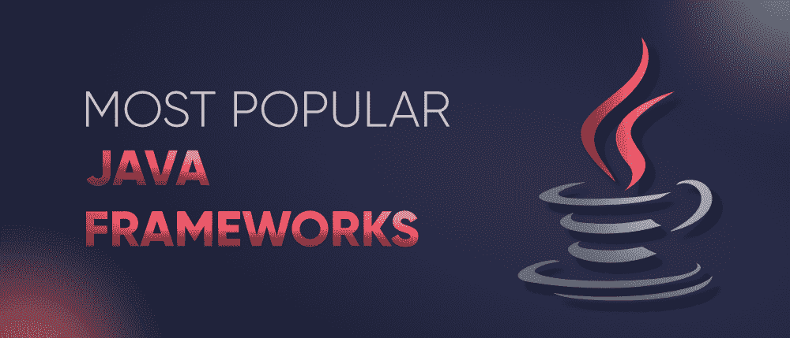

# 10 个你必须尝试的最流行的 Java 框架

> 原文:[https://www . geesforgeks . org/10-最流行-Java-框架-你必须尝试/](https://www.geeksforgeeks.org/10-most-popular-java-frameworks-that-you-must-try/)

在当今技术驱动的世界，我们都可以看到技术进步出现的频率，以及随之而来的旧工具和技术变得过时和缺乏竞争力。但每一项技术的情况都不一样，因为 **JAVA 是为数不多的几项在科技世界中占据强势地位超过 20 年的技术之一！**

根据各种标准报告，Java 仍然是最受欢迎和需求最大的编程语言之一。Java 如此受欢迎的主要原因之一是它有着广泛的应用，如*安卓开发、网络应用、桌面应用、科学应用、*等。简而言之，如果你期待着用 Java 建立职业生涯，那么你可以毫不犹豫地继续前进。然而，你需要知道的是，要创建一个有价值的 Java 项目，你需要知道如何使用 Java 框架。

**什么是 Java 框架？**–Java Framework 是一种工具，它为您提供了预写的 Java 代码，可以在创建应用程序时重复使用–它节省了您的大量时间，因为在这些框架中，您不需要为单个任务编写多次代码。此外，您不需要担心其他问题，如安全问题、建立数据库连接等。简而言之，在 Java 框架的帮助下，不需要在创建项目时从头开始编码。有许多流行的 Java 框架可供您考虑。

在本文中，我们根据各种关键因素和统计数据，为 2021 年汇编了几个最受欢迎和需求最大的 Java 框架的列表。所以，我们现在就开始吧:

### 1.春天

Spring 是一个轻量级、开源且非常流行的 Java 框架，开发人员使用它来方便高效地创建企业级 web 应用程序。您需要知道，这个模块化框架可以用于开发项目的任何层，除了这里的松散耦合模块，依赖关系由框架本身管理，而不是依赖于代码中的库。Spring 为您提供了一个轻量级容器，它可以在不使用应用程序或 web 服务器的情况下被触发。此外，Spring 与 XML 配置兼容，并且能够建立 JDBC 连接。网飞、亚马逊、微软等多家知名公司。将 Spring 用于各自的平台。

下面列出了 Spring 的一些突出特性:

*   *依赖注入*
*   *支持向后兼容*
*   *支持–XML 和基于注释的配置*
*   YAML 支撑
*   *更好的文档和活跃的社区*

### 2.冬眠

Hibernate 是一个 ORM(对象-关系映射)Java 框架，它方便地将面向对象模型映射到关系数据库。简而言之，它使 Java 和关系数据库管理系统之间的通信更好。Hibernate 可以很容易地与各种流行的数据库连接，如 Oracle、MySQL 和其他数据库。此外，还有许多丰富的工具，如 Hibernate 控制台、映射编辑器等。让 Java 开发人员的工作变得简单一点。Hibernate 允许您用最少的代码完成复杂的数据操作。此外，该框架是完全开源的，由戴尔、甲骨文、IBM 等多家知名公司使用。针对各自的平台使用 Hibernate。

下面列出了 Hibernate 的一些突出特性:

*   *休眠查询语言(HQL)*
*   *易于定制和配置*
*   *支持持久性 API*
*   *轻量化&高性能*
*   *更好的可扩展性*

### 3.支杆

Apache Struts 是一个开源的模型-视图-控制器(MVC)框架，主要用于创建企业级的 Java web 应用程序。到目前为止，Struts 有它的版本——Struts 1 和 Struts 2，其中后者由于扩展的功能而被更多的开发人员使用。它基本上是为了继承和扩展 Java Servlet 应用编程接口的属性和特性，使开发人员更容易。Struts 的一个重要特性是它也可以方便地与其他框架集成。各种知名公司，如印孚瑟斯、埃森哲等。在他们的技术栈中使用 Struts 框架。

下面列出了 Struts 的一些突出特性:

*   *可配置的 MVC 组件*
*   *基于 POJO 的动作*
*   *缩短开发时间&努力*
*   *支持创意主题和模板*
*   *更好的文档&社区支持*

### 4.Java 服务器面孔(JSF)

由甲骨文开发和维护的 Java Server Faces (JSF)是另一个基于组件的 MVC 网络框架，它具有可重用的用户界面组件，为基于服务器的应用程序创建丰富的用户界面。在这个稳定的框架中，实际上有各种客户端技术的封装，如 HTML、CSS 和 JavaScript。在拖放式用户界面组件的帮助下，开发人员可以高效地处理前端部分，进行大量编码。此外，Java Server Faces 还允许后端代码和用户界面之间的集成更加流畅和方便。在他们的技术堆栈中使用 Java 服务器面孔(JSF)的一些著名公司是——Insoft、GameDuell 等。

JSF 的一些突出特点如下:

*   *基于组件的 UI 框架*
*   *跨框架兼容性*
*   *优秀的工具和库支持*
*   *内置 AJAX 支持*
*   *模板化&豆注释*

### 5.Grails

这个列表中另一个流行的 Java 框架是 Grails。Grails 是一个基于 MVC(模型-视图-控制器)设计模式的开源 Java 框架。尽管如此，Grails 实际上是用 Groovy 语言编写的——它可以无缝地在 Java 平台上运行，并且与 Java 的语法完全兼容。您需要知道，Grails 正被用于开发大量可通过网络访问的电子商务网站。此外，Grails 相对来说更容易学习，容易编写文档，强烈推荐给初学者。领英、绿码等各种知名公司。将 Grails 用于各自的平台。

下面列出了 Grails 的一些突出特性:

*   *平缓学习曲线*
*   *无缝 Java 集成*
*   *支持各种定制插件*
*   *对 RESTful APIs 的内置支持*
*   *编译成 JVM 字节码*

### 6.谷歌网络工具包(GWT)

谷歌网络工具包，GWT 是一个由谷歌创建的开源 Java 框架。这个框架的一个重要特点是它将 Java 代码转换成了 JavaScript 代码。除了 Java 到 JavaScript 编译器，GWT 框架的其他主要组件还有 GWT 开发模式、JRE 仿真库和 GWT 网络用户界面类库。除此之外，谷歌网络工具包非常容易使用，并提供了一些丰富的功能，如浏览器历史管理、单元测试集成、GWT 应用程序中的谷歌应用程序接口支持等。谷歌的各种知名产品，包括 AdSense 和 AdWords，都非常依赖这个 GWT 框架。

GWT 的一些突出特点如下:

*   *动态可重用 UI 组件*
*   *跨浏览器兼容性*
*   *全功能 Java 调试支持*
*   *对开发者高度友好*
*   *简单 RPC 机制*

### 7.我坚持

说到 Vaadin，它基本上是一个用于开发网络应用程序的开源平台，由 Java 网络框架以及一组网络组件、应用程序启动器和工具组成。Vaadin 允许以完全自动化的方式进行客户端-服务器通信。作为一名开发人员，如果您正在寻找一个框架，可以让您更专注于应用程序规范和核心开发，并且用户界面部分可以由框架本身有效地处理，那么瓦丁将是您的正确选择。在他们的技术堆栈中使用瓦丁的一些受欢迎的公司是——罗克韦尔自动化、摩根大通、戴尔等。

瓦丁的一些突出特点如下:

*   *具有更好文档的轻量级框架*
*   *Web 组件集成*
*   *带注释的内置 JavaBeans 验证*
*   *内置弹簧框架支架*
*   *数据绑定*

### 8.小门

由 Jonathan Locke 创建的 Apache Wicket 是另一个被 Java 开发人员广泛使用的基于组件的 Java web 框架。Wicket 主要以其 POJO 模型而闻名，即每个组件都是普通的旧 Java 对象。这些组件包括按钮、表单、链接、页面、图像、行为等。使用 Wicket 时，不需要学习配置文件。除此之外，Wicket 拥有所有真实的 Java 对象，并且非常安全。如果您已经熟悉 JSP，那么学习 Wicket 会更容易。与此同时，该框架正被德勤、doubleSlash 等多家热门公司使用。

下面列出了 Wicket 的一些突出特性:

*   *轻量级快速框架*
*   *基于 POJO 的动作*
*   *零 XML 配置文件*
*   *可配置的 MVC 组件*
*   *主题和模板支持*

### 9.叶片

接下来是另一个流行的 Java 框架，Blade！它是一个基于模型-视图-控制器(MVC)架构的轻量级 Java 框架，被广泛用于开发网络应用程序。您需要知道，这里的源代码最少不到 500kb。Blade 的一个关键特性是跨站点请求伪造(CSRF)和跨站点脚本(XSS)。除了主模板之外，该框架还允许您为所有需求创建模板。在他们的技术堆栈中使用 Blade 的一些受欢迎的公司是 Stormcatch APIs、幽灵和其他一些公司。

刀片式服务器的一些突出特点如下:

*   *轻量化模块化框架*
*   *嵌入式 Jetty 服务器*
*   *支持插件扩展*
*   *支持 REST 风格路由接口*
*   *平缓学习曲线*

### 10.玩

最后但同样重要的是，还有另一个流行的 Java 框架，Play。它是一个轻量级开源框架，用于使用 Java 创建网络应用程序，并遵循模型-视图-控制器(MVC)架构模式。Play 支持约定优于配置的方法。该框架非常灵活，并且由于异步处理，更容易创建高性能的应用程序。虽然 Play 是在 Scala 中创建的，但它也与其他编程语言兼容，这些语言被编译成像 Java 这样的 JVM 字节码。与此同时，该框架正在被三星、领英等各种受欢迎的公司以及他们技术堆栈中的许多其他公司使用。

《玩乐》的一些突出特点如下:

*   *集成单元测试*
*   *模块化架构*
*   *原生 Scala 支持*
*   *高性能应用*
*   *热代码重装*

因此，根据您的项目需求和偏好，这些是您可以在 2021 年考虑的一些最受欢迎的 Java 框架。这些框架一定会让你的 Java 开发变得更加容易！！