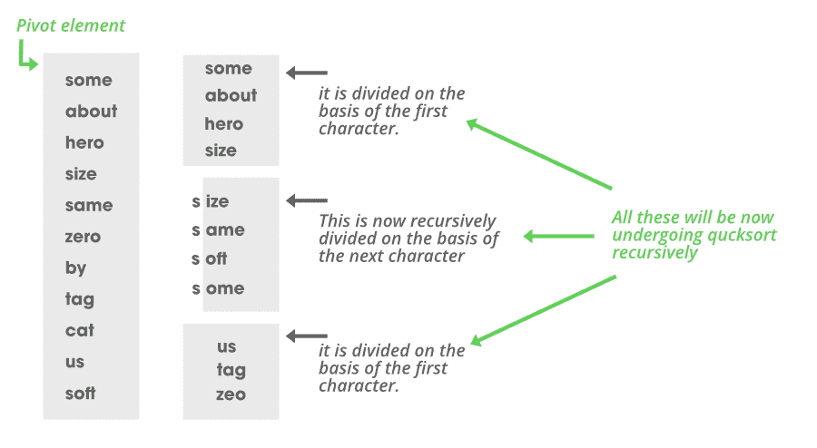

# Java 中的三路基数快速排序

> 原文:[https://www . geesforgeks . org/3 路-radix-quicksort-in-java/](https://www.geeksforgeeks.org/3-way-radix-quicksort-in-java/)

基本上，顾名思义 [3 路基数快速排序](https://www.geeksforgeeks.org/3-way-quicksort-dutch-national-flag/)是基数和 3 路快速排序的组合。它是介于基数排序和三向快速排序之间的混合排序。该算法主要用于字符串排序。

基数排序背后的主要思想是使用所有整数的数字(从最小二乘到 MSD)来执行散列，并将它们分成单独的列表并连接起来。同样，我们将使用字符串的 MSD 字符，然后使用这些字符继续执行所谓的 3 向快速排序。

3 路快速排序基本上只是一般快速排序的一种情况。这个想法是，如果我们使用快速排序，那么可能会出现这样的情况，即我们在字符数组中获得相同的字符(这里我们使用基数排序思想对字符串进行排序，将所有字符一个接一个地进行排序)。

为了处理这种情况，我们将数组分为三个部分:

1.  分区包含的字符少于透视字符。
2.  等于透视字符的字符分区。
3.  最后一个分区包含大于透视字符的字符。

所以基本上将要发生的是:

1.  我们将考虑每个字符串的 MSD 字符(基数排序的概念)。
2.  然后我们将对这个字符数组执行快速排序，这将导致数组被分成 3 个部分(如上所述)。

这种划分如下图所示。



**图像说明:**

> *   如图所示，数组中有 11 个字符串，我们必须对它们进行排序。所以现在考虑所有字符串的第一个字符，给出一个{s，a，h，s，s，z，b，t，c，u，s}的数组。这是从基数排序得到的想法。现在，我们将根据快速排序的思想对这一组字符进行排序。
> *   因此，这里我们考虑的枢轴元素是数组的第一个元素，即“s”。现在我们使用 quicksort 进行分区。分区是在以下基础上完成的:
> *   首先，我们考虑第一个字符作为轴心，我们还必须指向指针“I”和“j”。指针“I”从起点移动到终点，“j”从终点移动到起点。最初 i=1，j = n-1；这将帮助我们获得第二个分区的两个边界索引。
> *   分区的范围将是第一个 0-I 型、第二个 I+1-j-1 型和第三个 j-n-1 型；
> 
> 1.  如果 arr[i]
> 2.  如果 arr[i]==pivot，它只保留在那里，指针递增到下一个。
> 3.  如果 arr[i]>pivot，则 j 处的字符串与 arr[i]字符串交换，j 递减。
> 
> 因此，在执行这些操作之后，我们将得到如图所示的三个分区阵列。

在获得分区后，我们可以看到在第二个分区中，我们不能递归地对字符串的第一个字符执行快速排序，因为在该分区中，所有字符串都具有相同的第一个字符(在本例中是“s”)。所以我们将在下一个字符的基础上进行分区。对于另外两个，我们将从第一个字符开始再次回忆相同的排序。这就是三向快速排序的全部思想。

这里要注意的主要问题是，所有字符串的长度都不相同，因此在某些步骤中，我们可以有一个条件，即透视字符串中没有其他字符，而其他字符串中有字符，因此在这种情况下不可能交换和比较字符。

因此，为了处理这种情况，我们将首先找到数组中字符串的最大长度，然后为每个字符串添加一个 ASCII 值**小于字母表**的字符。

> **为什么变小？**
> 
> 考虑一个例子:
> 
> 数组是一个= {英雄，英雄，她}
> 
> 在这里，如果我们给每个字符少于最大需要量(即 6 个)的字符串一个大于字母(比如“~”)的字符，那么 a 将变成={hero~~，hero，her~~~}。
> 
> 对这个数组进行排序会给出{heroes，hero~~，her~~~}的结果，但真正的答案应该是{her，hero，heroes}。

递归执行上述算法**将生成一个排序数组，因此我们将能够对字符串数组进行排序。**

****递归实现:****

## **Java 语言(一种计算机语言，尤用于创建网站)**

```
// Java program for 3-Way Radix Quicksort

import java.io.BufferedInputStream;
import java.io.FileInputStream;
import java.io.FileNotFoundException;
import java.io.FileOutputStream;
import java.io.IOException;
import java.io.InputStream;
import java.util.Enumeration;
import java.util.Scanner;
import java.util.zip.ZipEntry;
import java.util.zip.ZipFile;
import java.util.zip.ZipInputStream;

public class GFG {

    // swapping method.
    public static void swp(String[] s, int x, int y)
    {
        String tmp = s[x];
        s[x] = s[y];
        s[y] = tmp;
    }

    // sort method.
    public static void srt(String[] s, int start, int last,
                           int character_index)
    {
        // base condition if no further index possible.
        if (start >= last)
            return;

        // first making a start pointer for dividing the
        // list from start to start_pointer.
        int start_pointer = start;

        // last_pointer and last are the boundaries for the
        // third list.
        int last_pointer = last;

        // taking the ascii value of the pivot at the index
        // given.
        int char_ascii_value_pivot
            = s[start].charAt(character_index);

        int pointer = start + 1;

        // starting a pointer to scan the whole array to
        // sort.
        while (pointer <= last) {

            // ASCII value of char at the position of all
            // the strings to compare with that of the pivot
            // char.
            int char_ascii_value_element
                = s[pointer].charAt(character_index);

            // if the element has char less than pivot than
            // swapping it with the top element and
            // incrementing the top boundary of the first
            // list.
            if (char_ascii_value_pivot
                > char_ascii_value_element) {
                swp(s, start_pointer, pointer);
                start_pointer++;

                // incrementing the pointer to check for
                // next string.
                pointer++;
            }
            else

                // if found larger character than it is
                // replaced by the element at last_pointer
                // and lower boundary is raised by
                // decrementing it.
                if (char_ascii_value_pivot
                    < char_ascii_value_element) {
                swp(s, last_pointer, pointer);
                last_pointer--;
                pointer++;
            }

            // if character is the same as that of the pivot
            // then no need to swap and move the pointer on
            else {
                pointer++;
            }
        }

        // now performing same sort on the first list
        // bounded by start and start_pointer with same
        // character_index
        srt(s, start, start_pointer - 1, character_index);

        // if we have more character left in the pivot
        // element than recll quicksort on the second list
        // bounded by  start_pointer and last_pointer and
        // next character_index.
        if (char_ascii_value_pivot >= 0)

            srt(s, start_pointer, last_pointer,
                character_index + 1);

        // lastly the third list with boundaries as
        // last_pointer and last.
        srt(s, last_pointer + 1, last, character_index);
    }

    public static void main(String[] args) throws Exception
    {
        // predefined array of five element all of same
        // length.
        String s[]
            = { "some", "same", "hero", "make", "zero" };

        // calling sort function to sort the array using
        // 3-way-radix-quicksort.
        srt(s, 0, 4, 0);

        // printing the sorted array;
        // here w are calling function by passing parameters
        // using references .
        for (int i = 0; i < 5; ++i)
            System.out.println(s[i]);
    }
}
```

****Output**

```
hero
make
same
some
zero
```** 

****例 2:对不同长度的字符串进行排序。****

## **Java 语言(一种计算机语言，尤用于创建网站)**

```
// Java program for 3-Way radix QuickSort

import java.io.BufferedInputStream;
import java.io.FileInputStream;
import java.io.FileNotFoundException;
import java.io.FileOutputStream;
import java.io.IOException;
import java.io.InputStream;
import java.util.Enumeration;
import java.util.Scanner;
import java.util.zip.ZipEntry;
import java.util.zip.ZipFile;
import java.util.zip.ZipInputStream;

public class GFG {

    // swapping method.
    public static void swp(String[] s, int x, int y)
    {
        String tmp = s[x];
        s[x] = s[y];
        s[y] = tmp;
    }

    // sort method.
    public static void srt(String[] s, int start, int last,
                           int character_index)
    {
        // base condition if no further index possible.
        if (start >= last)
            return;

        // first making a start pointer for dividing the
        // list from start to start_pointer.
        int start_pointer = start;

        // last_pointer and last are the boundaries for the
        // third list.
        int last_pointer = last;

        // taking the ASCII value of the pivot at the index
        // given.
        int char_ascii_value_pivot = s[start].charAt(character_index);
        int pointer = start + 1;

        // starting a pointer to scan the whole array to
        // sort.
        while (pointer <= last)
        {
            // ASCII value of char at the position of all
            // the strings to compare with that of the pivot
            // char.
            int char_ascii_value_element = s[pointer].charAt(character_index);

            // if the element has char less than pivot than
            // swapping it with the top element and
            // incrementing the top boundary of the first
            // list.
            if (char_ascii_value_pivot> char_ascii_value_element)
            {
                swp(s, start_pointer, pointer);
                start_pointer++;

                // incrementing the pointer to check for
                // next string.
                pointer++;
            }
            else

                // if found larger character than it is
                // replaced by the element at last_pointer
                // and lower boundary is raised by
                // decrementing it.
                if (char_ascii_value_pivot< char_ascii_value_element)
                {
                swp(s, last_pointer, pointer);
                last_pointer--;
                pointer++;
            }

            // if character is same as that of the pivot then
            // no need to swap and move the pointer on
            else
            {
                pointer++;
            }
        }

        // now performing same sort on the first list
        // bounded by start and start_pointer with same
        // character_index
        srt(s, start, start_pointer - 1, character_index);

        // if we have more character left in the pivot
        // element than recll quicksort on the second list
        // bounded by  start_pointer and last_pointer and
        // next character_index.
        if (char_ascii_value_pivot >= 0)
            srt(s, start_pointer, last_pointer,character_index + 1);

        // lastly the third list with boundaries as
        // last_pointer and last.
        srt(s, last_pointer + 1, last, character_index);
    }

    public static void main(String[] args) throws Exception
    {
        // predefined array of five element all of different
        // length.
        String s[] = { "sam", "same", "her", "make", "zebra" };
        int max_character_index = 0;

        // finding max_character_index
        for (int i = 0; i < 5; ++i)
            if (s[i].length() > max_character_index)
                max_character_index = s[i].length();

        // adding each string with a character having less
        // ascii value than alphabets.
        for (int i = 0; i < 5; ++i)
            if (s[i].length() < max_character_index)
                while (s[i].length() < max_character_index)
                    s[i] += '?';

        // calling sort function to sort the array using
        // 3-way-radix-quicksort.
        srt(s, 0, 4, 0);

        // printing the sorted array;
        // here we are calling function by passing
        // parameters using references . printing without the
        // appended character.
        for (int i = 0; i < 5; ++i)
        {
            String ans = "";
            for (int j = 0; j < s[i].length(); ++j)
                if (s[i].charAt(j) != '?')
                    ans += s[i].charAt(j);
                else
                    break;

            System.out.println(ans);
        }
    }
}
```

****Output**

```
her
make
sam
same
zebra
```**