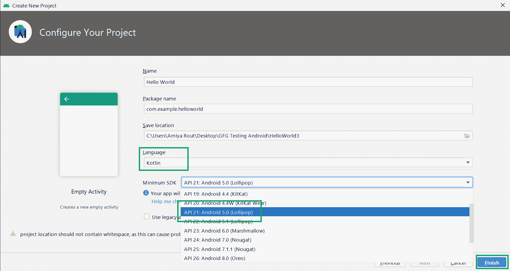
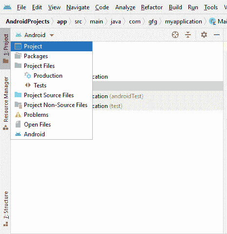
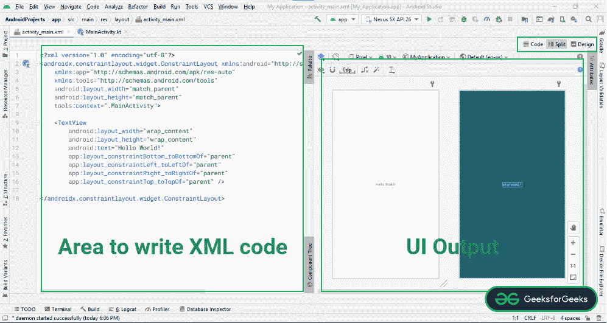
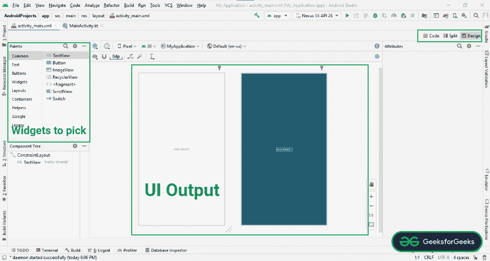
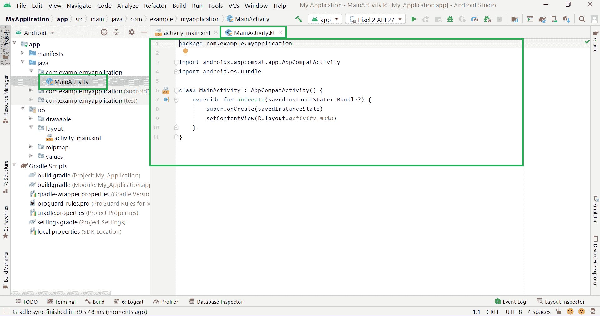
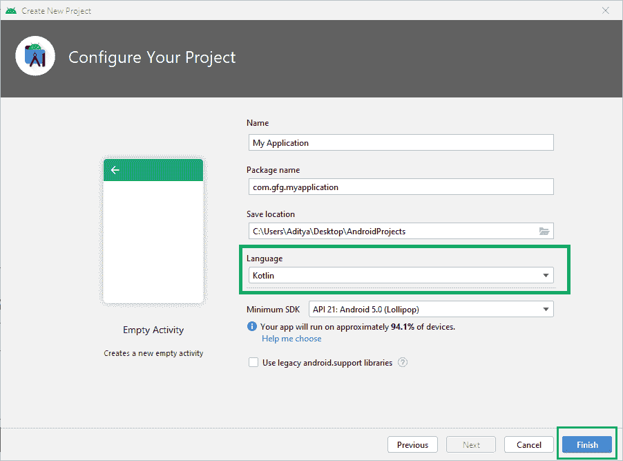
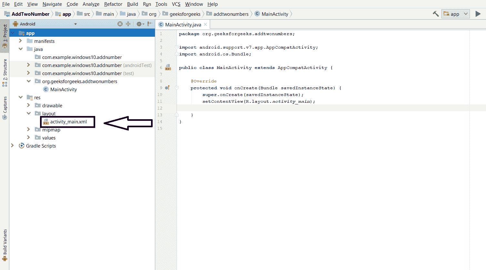
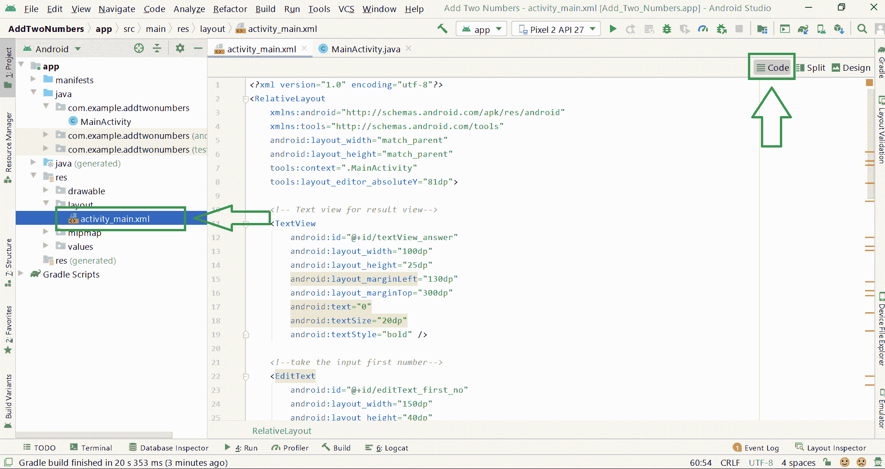
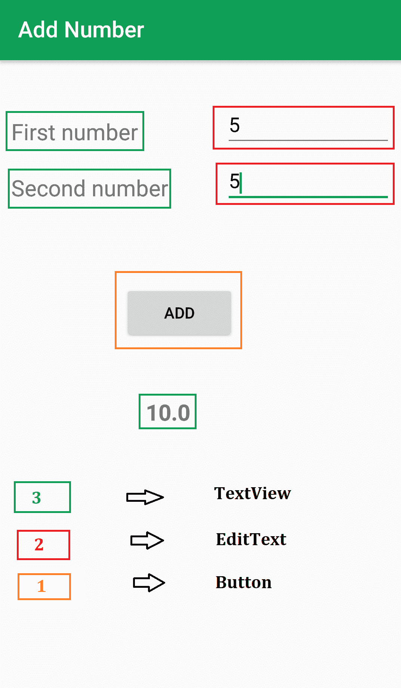

# 6 周安卓应用开发–基于免费项目的学习

> 原文:[https://www . geesforgeks . org/6 周安卓-app-开发-免费-基于项目-学习/](https://www.geeksforgeeks.org/6-weeks-of-android-app-development-free-project-based-learning/)

你是一开始就想学安卓应用开发的人吗？你是一个对安卓应用开发一无所知的人吗？或者你刚刚开始你的旅程，但你不知道你是否走在正确的道路上。所以，在你最初的旅程中，你所需要的只是适当的引导。如果你得到了你的向导，那么你就可以走了。是的，这就是为什么我们准备了一篇完整的文章。为了帮助您实现这一目标，我们为“为期 **6 周的安卓应用开发–基于项目的学习**”创建了一个实用的路线图。我们将通过开发 **6 安卓项目**来学习安卓应用开发。正如本文前面所说，[成为安卓开发者的最佳途径——完整路线图](https://www.geeksforgeeks.org/best-way-to-become-android-developer-a-complete-roadmap/)

> **学习安卓最好的方法就是把一些基础项目开发到一些高级项目。**


这篇文章是这样设计的，你将通过开发一个项目每周学习安卓概念，这个项目也被称为“**项目基础学习**”。本次学习将为您提供完整的指南，帮助您在安卓系统中建立强大的概念知识，并实现您的安卓开发者目标。

### 先决条件

所以，进入安卓开发世界的第一个先决条件是你对学习和构建令人敬畏的安卓应用程序的“奉献精神”和“T2 动力”。是的，这是真的。首先，找一个强有力的理由**为什么**你要进入这个世界。例如，你日夜练习数据结构和算法，因为你将在一家以产品为基础的顶级公司找到一份工作。同样，问问自己，“**为什么是安卓？**为什么不是 Web 开发？为什么不是数据科学和机器学习？如果你找到了答案，那么没有人能阻止你学习安卓应用开发。

第二个是**编程语言**。在安卓系统中，编程是用两种语言完成的: **JAVA 或 Kotlin** 和 **XML(扩展标记语言)。**XML 文件处理设计、表示、布局、蓝图等(作为前端)，而 JAVA 或 KOTLIN 处理按钮、变量、存储等的工作(作为后端)。所以你所需要的就是掌握 Java 或者 Kotlin 和 XML 的知识。

> **注意**:我们已经用 **Java 和 Kotlin 语言**准备了本教程。(Java 个项目，Kotlin 3 个项目)。

**一些有用的学习资源链接可以在 GeeksforGeeks:** 上找到

*   [<u>Java 编程语言</u>](https://www.geeksforgeeks.org/java/)
*   [<u>科特林编程语言</u>](https://www.geeksforgeeks.org/kotlin-programming-language/)
*   [<u>XML</u>](https://www.geeksforgeeks.org/tag/html-and-xml/)

### 为什么是原生安卓？为什么不是混合应用？

原生应用程序是专门为移动操作系统开发的智能手机应用程序，如安卓系统的 Java/Kotlin 和 iOS 系统的 Swift。由于该应用是在成熟的生态系统中开发的，因此遵循操作系统本身提供的技术用户和用户指南体验，如安卓和 iOS 的中心左侧的滑动手势或对齐。当然，现在它们为用户提供了最快、最可靠、最灵敏的体验。该应用程序将具有内置于设备中的大多数原生应用程序的外观和感觉以及一致性。本机应用程序的显著优势是可以轻松访问和利用用户设备的内置功能。例如，全球定位系统，也许你的地址簿或你的相机，以及大量其他东西。

好吧，另一方面，如果我们谈论混合应用程序，它们在用本地包装器包装的核心网站包中，有时是 PhoneGap 或其他。它们看起来和感觉上都像一个原生应用程序，但最终超出了应用程序的基本框架。它们由公司网站本身提供动力。例如，像脸书或网飞这样的网站，拥有一个原生的应用平台，甚至仅仅为了一个功能而重新编译他们的应用，都没有真正的意义。这将需要很多时间，而且太繁重，所以他们开始使用混合应用程序确实很有意义。现在，混合应用程序也可以使用本机功能，如相机和全球定位系统，但是通过一些第三方插件，需要附上大量代码，而另一方面，本机应用程序非常容易使用和利用这些功能，如相机或您的全球定位系统。

在真实的行业世界中，发生的情况是，如果你是在一家从事混合应用程序的初创公司开始职业生涯，当公司获得资金并且团队规模增加时，他们通常会转向原生应用程序开发。此外，请记住，Native 应用程序开发人员的工资观点实际上要高一点，并且在 Hybrid 应用程序开发人员之上。

### 谁能学会安卓应用开发？

“**度不重要**”，对！！如果你在读理学学士(计算机科学)，BCA 或任何其他学位，也可以学习安卓应用程序开发。你需要的只是“**编码技巧**”。在安卓开发中，数据结构和算法不需要很深的知识，你只需要提前学习 Java/Kotlin，就能成为一个更好的安卓应用开发者。

### 系统要求(Windows | Mac | Linux)

**对于窗户:**

*   微软视窗 7/8/10 (32 位或 64 位)
*   最小 4 GB 内存，推荐 8 GB 内存(安卓模拟器加 1 GB)
*   最少 2 GB 可用磁盘空间，建议 4gb(IDE 为 500 MB，安卓 SDK 和仿真器系统映像为 1.5 GB)
*   1280 x 800 最小屏幕分辨率

**对于 Mac:**

*   Mac OS X 10.10(约塞米蒂)或更高，最高可达 10.13(高塞拉)
*   最小 4 GB 内存，推荐 8 GB 内存(安卓模拟器加 1 GB)
*   最少 2 GB 可用磁盘空间，建议 4gb(IDE 为 500 MB，安卓 SDK 和仿真器系统映像为 1.5 GB)
*   1280 x 800 最小屏幕分辨率

**对于 Linux:**

*   GNOME 或 KDE 桌面。在 Ubuntu 14.04 LTS 上测试，Trusty Tahr(能够运行 32 位应用程序的 64 位发行版)
*   能够运行 32 位应用程序的 64 位分布
*   GNU C 库(glibc) 2.19 或更高版本
*   最小 4 GB 内存，推荐 8 GB 内存(安卓模拟器加 1 GB)
*   最少 2 GB 可用磁盘空间，建议 4gb(IDE 为 500 MB，安卓 SDK 和仿真器系统映像为 1.5 GB)
*   1280 x 800 最小屏幕分辨率

### 安卓应用开发后会怎样？

*   通过开发一个安卓应用来实现你独特的想法。
*   为你的大学小项目和大项目开发一个安卓应用。
*   在大学期间从事自由职业的安卓项目并赚钱。
*   参加黑客马拉松。
*   申请在不同公司实习等。

### 我们开始吧

> **非常非常重要的一点:**请不要完全复制粘贴代码。首先，试着理解逻辑。并通过放置不同的逻辑、值等来玩弄它。这将有助于提高你的发展技能。

### 第一周

在“安卓应用开发 6 周”的第一天，你必须研究和阅读一些与安卓相关的博客，保持自己对安卓应用开发的动力。像“[成为安卓开发者的最佳途径——完整路线图](https://www.geeksforgeeks.org/best-way-to-become-android-developer-a-complete-roadmap/)”、“[为什么 Kotlin 会取代 Java 用于安卓应用开发](https://www.geeksforgeeks.org/kotlin-will-replace-java-android-app-development/)”、“[关于安卓的有趣事实](https://www.geeksforgeeks.org/interesting-facts-about-andriod/)”、“[安卓历史](https://www.geeksforgeeks.org/history-of-android/)”、“[安卓应用是如何工作的？](https://www.geeksforgeeks.org/how-does-android-app-work/)”等。

然后，在第一周的 **6 周安卓应用开发–基于项目的学习**中，你将学习如何为安卓应用开发建立一个安卓工作室，如何在安卓工作室中创建一个新项目，如何在真实设备或模拟器上运行你的项目，并且你将在第一周开发两个基本的安卓应用。在这一部分中，您将创建以下两个非常基本的 android 应用程序

1.  **非常著名的“你好世界”安卓 App**
2.  **安卓 app 添加两个数字**

好激动啊！！开始吧！

**安卓工作室设置**

在设置安卓工作室之前，让我们把它安装在你的系统上。

*   **对于 Windows/Mac:** [安装并设置安卓工作室](https://www.geeksforgeeks.org/guide-to-install-and-set-up-android-studio/)
*   **对于 Linux:** [如何在 Ubuntu 上安装 Android Studio？](https://www.geeksforgeeks.org/how-to-install-android-studio-on-ubuntu/)

所以假设你已经成功安装了安卓工作室，并且你现在在下面的屏幕上。


所以只需点击**新建项目**，在下一个屏幕上，你可以看到很多**活动**(标记这个词)都在那里。你可以探索每个活动，但是对于初学者来说，让我们选择**空活动**并为初学者进一步移动

> 在这里你将学习安卓中的**第一个**重要概念，即**活动**。你可以参考下面的文章来了解一下安卓系统中的活动是什么。
> 
> *   [安卓活动介绍](https://www.geeksforgeeks.org/introduction-to-activities-in-android/)
> *   [安卓工作室不同类型的活动](https://www.geeksforgeeks.org/different-types-of-activities-in-android-studio/)

<video class="wp-video-shortcode" id="video-672122-1" width="640" height="360" preload="metadata" controls=""><source type="video/mp4" src="https://media.geeksforgeeks.org/wp-content/uploads/20210512005315/2-Android-Studio-Set-Up.mp4?_=1">[https://media.geeksforgeeks.org/wp-content/uploads/20210512005315/2-Android-Studio-Set-Up.mp4](https://media.geeksforgeeks.org/wp-content/uploads/20210512005315/2-Android-Studio-Set-Up.mp4)</video>

现在在下一个屏幕上

*   **名称:**写下你适合的项目名称。
*   **包名:**默认保留吧。
*   **保存位置:**选择要保存该项目的位置。
*   **语言:**在 Java 和 Kotlin 之间选择你的语言
*   **最小 SDK** (标注这个词) **:** 大家知道，安卓定期发布版本，他们在最新版本中提供了一些老版本不支持的新功能。所以你要选择你想打哪个用户群。假设你选择“API 21: Android 5.0(棒棒糖)”，那么你可以看到“你的应用将在大约 94.1%的设备上运行”。否则，你也可以点击“帮我选择”按钮。

最后，点击**完成**按钮。

> 在这里你将学习安卓系统中第二个重要的概念，即**软件开发工具包**。你可以参考下面的文章来了解一下 Android 中的 SDK 是什么。
> 
> [安卓 SDK 及其组件](https://www.geeksforgeeks.org/android-sdk-and-its-components/)



点击完成按钮后恭喜你，第一个安卓工作室项目已经准备好了。最初，它显示一天的提示，这给出了提高工作效率的提示。在开始探索安卓工作室之前，先熟悉下面显示的初始屏幕。


**为了更好的了解 Android Studio 环境，分为 4 个部分:**

**1。菜单部分:**在本部分中，它提供了创建新项目、打开现有安卓工作室项目、运行应用程序的按钮、选择运行和测试应用程序所需设备的下拉菜单等选项。

**2。编码区:**这部分提供了为像**这样的文件编写代码。xml，。Java . . kt .**它允许你在不同的选项卡中一次打开多个文件，但是它允许你一次编辑一个文件。

**3。项目结构:**这个区域允许我们浏览项目的每个文件。有各种不同的结构视图。**安卓**是项目结构层次的总结视图，**项目**是项目层次的详细视图。请看下图。



**4。当前执行部分:**安卓工作室环境中最重要的部分之一。它提供了流程或活动当前执行的详细视图。它显示了哪些错误、构建输出、logcat 结果等。

### **理解设计部分**

应用程序的所有用户界面布局都可以在 res/layout 目录下找到。这些是。xml 扩展，负责为应用程序构建 UIs。安卓工作室为应用程序提供了两种设计用户界面的方式。一个是**文本**，需要通过硬编码设计 UI，一个是**设计**部分，为构建 UI 提供了便捷的拖拽机制。请看下面的图片，它显示了代码是如何编写的，它继续在右窗格中显示结果。



下图显示了用于在应用程序的用户界面中挑选和添加小部件的拖放环境。点击左下角按钮，可以切换到**设计**布局，如下图。



### **理解编码部分**

正如我们对设计部分的理解一样，另一个主要部分是编码部分。在下图中，您可以看到一个名为 **MainActivity.kt** 的文件。是的，这是您编写后端部分的文件。逻辑部分。例如，您想要添加两个数字。因此，在编辑文本中输入两个数字后，当用户点击按钮时，它会给出两个数字之和的输出。所以要计算总和，你必须把逻辑写在它的部分。



> **注意:**如果在项目创建时选择**语言为 Java** ，那么文件名为**MainActivity.java**。



### **运行安卓应用**

要运行应用程序，有两种方法。一种是使用仿真器，另一种是通过 USB 电缆连接使用物理设备。参考[如何安装安卓虚拟设备(AVD)](https://www.geeksforgeeks.org/how-to-install-android-virtual-deviceavd/) 如何设置安卓虚拟设备或者参考[如何在真实设备上运行安卓 App？](https://www.geeksforgeeks.org/how-to-run-the-android-app-on-a-real-device/)设置一个真实的物理安卓设备，并在上面运行应用。看看下面这个关于如何在你的安卓模拟器中运行你非常著名的“**你好世界安卓应用程序**”的视频。

<video class="wp-video-shortcode" id="video-672122-2" width="640" height="360" preload="metadata" controls=""><source type="video/mp4" src="https://media.geeksforgeeks.org/wp-content/uploads/20210615001923/4-Run-the-App.mp4?_=2">[https://media.geeksforgeeks.org/wp-content/uploads/20210615001923/4-Run-the-App.mp4](https://media.geeksforgeeks.org/wp-content/uploads/20210615001923/4-Run-the-App.mp4)</video>

没错。！您已经成功构建了您的第一个安卓应用程序。现在让我们构建第二个“**安卓 App 添加两个数字**

### 项目一分步实施:**安卓 App 加两个数字**

**步骤 1:** 同样，创建一个新项目，但这次选择 **Java** 作为编程语言。自己选择项目名称。

**第二步:**首先转到 XML 文件



现在转到**代码**部分，编写添加 3 **文本视图**、2 **编辑文本**和 1 **按钮**的代码，并为每个组件分配一个标识。为位置指定上边距、左边距和右边距。



> 在这里你将学习安卓系统中的其他重要概念，即**相对于**是什么？什么是**文本视图**？什么是**编辑文本？**和**按钮是什么？**你可以参考下面的文章来了解一下那些是什么？
> 
> *   [安卓中的 relative layout](https://www.geeksforgeeks.org/android-relativelayout-in-kotlin/)
> *   [安卓中的文本视图小部件，示例](https://www.geeksforgeeks.org/edittext-widget-in-android-using-java-with-examples/)
> *   [用示例编辑安卓中的文本小部件](https://www.geeksforgeeks.org/edittext-widget-in-android-using-java-with-examples/)
> *   [安卓中的按钮](https://www.geeksforgeeks.org/button-in-kotlin/)

所以我们要开发类似这样的用户界面



下面是 **activity_main.xml** 文件的代码。代码中添加了注释，以更详细地理解代码。详细参考代码，可以改变数值，玩转 UI。

## 可扩展标记语言

```
<?xml version="1.0" encoding="utf-8"?>
<RelativeLayout xmlns:android="http://schemas.android.com/apk/res/android"
    xmlns:tools="http://schemas.android.com/tools"
    android:layout_width="match_parent"
    android:layout_height="match_parent"
    tools:context=".MainActivity"
    tools:layout_editor_absoluteY="81dp">

    <!-- for message input first number -->
    <TextView
        android:id="@+id/textView_first_no"
        android:layout_width="150dp"
        android:layout_height="25dp"
        android:layout_marginLeft="10dp"
        android:layout_marginTop="50dp"
        android:text="First number"
        android:textSize="20dp" />

    <!-- take the input first number -->
    <EditText
        android:id="@+id/editText_first_no"
        android:layout_width="150dp"
        android:layout_height="40dp"
        android:layout_marginLeft="200dp"
        android:layout_marginTop="40dp"
        android:inputType="number" />

    <!-- for message input second number -->
    <TextView
        android:id="@+id/textView_second_no"
        android:layout_width="150dp"
        android:layout_height="25dp"
        android:layout_marginLeft="10dp"
        android:layout_marginTop="100dp"
        android:text="Second number"
        android:textSize="20dp" />

    <!-- take input for second number -->
    <EditText
        android:id="@+id/editText_second_no"
        android:layout_width="150dp"
        android:layout_height="40dp"
        android:layout_marginLeft="200dp"
        android:layout_marginTop="90dp"
        android:inputType="number"
        tools:ignore="MissingConstraints" />

    <!-- button for run add logic and view result -->
    <Button
        android:id="@+id/add_button"
        android:layout_width="100dp"
        android:layout_height="50dp"
        android:layout_marginLeft="110dp"
        android:layout_marginTop="200dp"
        android:text="ADD" />

    <!-- Text view for result view-->
    <TextView
        android:id="@+id/textView_answer"
        android:layout_width="100dp"
        android:layout_height="25dp"
        android:layout_marginLeft="130dp"
        android:layout_marginTop="300dp"
        android:text="0"
        android:textSize="20dp"
        android:textStyle="bold" />

</RelativeLayout>
```

**步骤 3:使用 MainActivity.java 文件**

在这个文件中，我们将编写两个数相加的逻辑。让我们看看下面的代码。别担心，我们将详细解释每一行代码。

## Java 语言(一种计算机语言，尤用于创建网站)

```
package com.example.addtwonumbers;

// Each new activity has its own layout and Java files,
// here we build the logic for adding two number

import android.os.Bundle;
import android.view.View;
import android.widget.Button;
import android.widget.EditText;
import android.widget.TextView;

import androidx.appcompat.app.AppCompatActivity;

public class MainActivity extends AppCompatActivity {

    // define the global variable

    // variable number1, number2 
    // for input input number
    // Add_button, result textView
    EditText number1;
    EditText number2;
    Button Add_button;
    TextView result;

    int ans = 0;

    @Override
    protected void onCreate(Bundle savedInstanceState) {
        super.onCreate(savedInstanceState);
        setContentView(R.layout.activity_main);

        // by ID we can use each component which id is assign in xml file
        number1 = (EditText) findViewById(R.id.editText_first_no);
        number2 = (EditText) findViewById(R.id.editText_second_no);
        Add_button = (Button) findViewById(R.id.add_button);
        result = (TextView) findViewById(R.id.textView_answer);

        // Add_button add clicklistener
        Add_button.setOnClickListener(new View.OnClickListener() {

            public void onClick(View v) {

                // num1 or num2 double type
                // get data which is in edittext, convert it to string
                // using parse Double convert it to Double type
                double num1 = Double.parseDouble(number1.getText().toString());
                double num2 = Double.parseDouble(number2.getText().toString());
                // add both number and store it to sum
                double sum = num1 + num2;
                // set it ot result textview
                result.setText(Double.toString(sum));
            }
        });
    }
}
```

**说明:**

你的安卓应用的包名。

```
package com.example.addtwonumbers;
```

应用程序中使用的库列表。

```
import android.os.Bundle;
import android.view.View;
import android.widget.Button;
import android.widget.EditText;
import android.widget.TextView;

import androidx.appcompat.app.AppCompatActivity;
```

变量**数字 1，数字 2** 为输入数字(编辑文本)。类似地 **add_button** 变量用于我们在 XML 代码中使用的 button， **result** 变量用于 TextView。

```
EditText number1;
EditText number2;
Button add_button;
TextView result;
```

请记住，您已经为 XML 文件中的每个组件分配了一个标识。是的，他们将在这里使用它。通过标识，我们可以使用在 XML 文件中分配的每个组件的标识，如下所示。

```
number1 = (EditText) findViewById(R.id.editText_first_no);
number2 = (EditText) findViewById(R.id.editText_second_no);
add_button = (Button) findViewById(R.id.add_button);
result = (TextView) findViewById(R.id.textView_answer);
```

最后，我们在我们的按钮中添加一个 **setOnClickListener()** 。因此，当用户点击按钮时，这将为我们提供输出。在这里面，我们写了简单的逻辑来把这些数字相加。还有**设置文本()**为我们的输出文本视图。就这么简单。就这样。

```
add_button.setOnClickListener(new View.OnClickListener() {
            public void onClick(View v) {

                double num1 = Double.parseDouble(number1.getText().toString());
                double num2 = Double.parseDouble(number2.getText().toString());
                double sum = num1 + num2;
                result.setText(Double.toString(sum));
       }
});
```

是的，你已经成功开发了一个安卓应用程序，它从用户那里获取两个数字并添加它们。现在像以前一样运行应用程序，您可以看到如下输出。

**输出:**

<video class="wp-video-shortcode" id="video-672122-3" width="640" height="360" preload="metadata" controls=""><source type="video/mp4" src="https://media.geeksforgeeks.org/wp-content/uploads/20210617001524/8-Add-Two-Numbers-Output.mp4?_=3">[https://media.geeksforgeeks.org/wp-content/uploads/20210617001524/8-Add-Two-Numbers-Output.mp4](https://media.geeksforgeeks.org/wp-content/uploads/20210617001524/8-Add-Two-Numbers-Output.mp4)</video>

**完整文章请参考此:** [安卓 App 添加两个数字](https://www.geeksforgeeks.org/android-app-to-add-two-numbers/)

### 第二周

在第一周，你已经构建了一个非常非常基本的安卓应用程序，它只接受两个数字并将其相加。只有几行代码可以执行这个操作。所以你现在已经对安卓应用开发有了一些基本的想法。让我们进入下一个项目，**一款科学计算器安卓应用**，看起来是这样的。

<video class="wp-video-shortcode" id="video-672122-4" width="640" height="360" preload="metadata" controls=""><source type="video/mp4" src="https://media.geeksforgeeks.org/wp-content/uploads/20210515140312/20210515_140129.mp4?_=4">[https://media.geeksforgeeks.org/wp-content/uploads/20210515140312/20210515_140129.mp4](https://media.geeksforgeeks.org/wp-content/uploads/20210515140312/20210515_140129.mp4)</video>

注意，我们将使用 **Kotlin** 语言来实现这个项目。别担心，Kotlin 和 Java 类似。我在这里分享一下安卓工作室的一些小技巧。

> 1.  [How to convert Java code into Kotlin code in Android Studio?](https://www.geeksforgeeks.org/how-to-convert-java-code-to-kotlin-code-in-android-studio/)
> 2.  [How to convert Kotlin code into Java code in Android Studio?](https://www.geeksforgeeks.org/how-to-convert-kotlin-code-to-java-code-in-android-studio/)

### 通过建设这个项目，我们将学到什么？

*   在你的安卓应用中使用不同的颜色。
*   在 Android 中构建一些复杂的 UI，让应用的 UI 变得牛逼。
    *   [相对布局](https://www.geeksforgeeks.org/android-relativelayout-in-kotlin/)和[线性布局](https://www.geeksforgeeks.org/android-linearlayout-in-kotlin/)。以及它们之间的[区别](https://www.geeksforgeeks.org/difference-between-linearlayout-and-relativelayout-in-android/)。
    *   [卡迪维](https://www.geeksforgeeks.org/cardview-in-android-with-example/)
*   为简单的数学计算写一些简单的逻辑。
*   [安卓吐司](https://www.geeksforgeeks.org/android-what-is-toast-and-how-to-use-it-with-examples/)

### 项目 2:科学计算器安卓应用的分步实施

**第一步:创建新项目**

在安卓工作室创建新项目请参考 [<u>【如何在安卓工作室创建/启动新项目】</u>](https://www.geeksforgeeks.org/android-how-to-create-start-a-new-project-in-android-studio/) 。注意这次选择**科特林**作为编程语言。

**第二步:给 colors.xml 文件添加新的颜色**

导航至**应用程序>RES>values>colors . XML**文件，如下图截图。


并为不同的颜色添加下面的代码。

## 可扩展标记语言

```
<?xml version="1.0" encoding="utf-8"?>
<resources>

    <color name="purple_200">#0F9D58</color>
    <color name="purple_500">#0F9D58</color>
    <color name="purple_700">#0F9D58</color>
    <color name="teal_200">#FF03DAC5</color>
    <color name="teal_700">#FF018786</color>
    <color name="black">#FF000000</color>
    <color name="white">#FFFFFFFF</color>

    <!--three different shades of black color-->
    <color name="blac_shade_1">#292D36</color>
    <color name="black_shade_2">#272B33</color>
    <color name="black_shade_3">#22252D</color>
    <color name="yellow">#ffa500</color>

</resources>
```

**步骤 3:使用 activity_main.xml 文件**

导航到**应用程序> res >布局> activity_main.xml** 并将下面的代码添加到该文件中。我们在此文件中使用的内容:

*   相对视频
*   文本视图
*   卡特维
*   线形布局
*   纽扣

我们已经为您提供了本学期必要的推荐链接。你可以仔细阅读。下面是 **activity_main.xml** 文件的代码。您可以使用这些值，看看代码是如何工作的。

## 可扩展标记语言

```
<?xml version="1.0" encoding="utf-8"?>
<RelativeLayout
    xmlns:android="http://schemas.android.com/apk/res/android"
    xmlns:app="http://schemas.android.com/apk/res-auto"
    xmlns:tools="http://schemas.android.com/tools"
    android:layout_width="match_parent"
    android:layout_height="match_parent"
    android:background="@color/black_shade_3"
    tools:context=".MainActivity">

    <TextView
        android:id="@+id/idTVSecondary"
        android:layout_width="match_parent"
        android:layout_height="70dp"
        android:background="@color/black_shade_3"
        android:gravity="bottom"
        android:maxLines="1"
        android:padding="10dp"
        android:paddingTop="30dp"
        android:text=""
        android:textAlignment="viewEnd"
        android:textColor="@color/white"
        android:textSize="15sp"
        tools:ignore="RtlCompat" />

    <TextView
        android:id="@+id/idTVprimary"
        android:layout_width="match_parent"
        android:layout_height="100dp"
        android:layout_below="@id/idTVSecondary"
        android:background="@color/black_shade_3"
        android:gravity="bottom"
        android:maxLines="1"
        android:padding="10dp"
        android:text=""
        android:textAlignment="viewEnd"
        android:textColor="#fff"
        android:textSize="50sp"
        tools:ignore="RtlCompat" />

    <androidx.cardview.widget.CardView
        android:layout_width="match_parent"
        android:layout_height="match_parent"
        android:layout_below="@id/idTVprimary"
        android:background="@color/blac_shade_1"
        app:cardCornerRadius="4dp"
        app:cardElevation="2dp">

        <LinearLayout
            android:layout_width="match_parent"
            android:layout_height="match_parent"
            android:layout_weight="7"
            android:background="@color/blac_shade_1"
            android:orientation="vertical">

            <LinearLayout
                android:layout_width="match_parent"
                android:layout_height="match_parent"
                android:orientation="vertical"
                android:weightSum="7">

                <LinearLayout
                    android:layout_width="match_parent"
                    android:layout_height="match_parent"
                    android:layout_weight="1"
                    android:orientation="horizontal">

                    <LinearLayout
                        android:layout_width="match_parent"
                        android:layout_height="match_parent"
                        android:orientation="horizontal"
                        android:weightSum="4">

                        <Button
                            android:id="@+id/bac"
                            android:layout_width="match_parent"
                            android:layout_height="match_parent"
                            android:layout_margin="3dp"
                            android:layout_weight="1"
                            android:backgroundTint="@color/black_shade_2"
                            android:padding="6dp"
                            android:text="AC"
                            android:textColor="@color/yellow"
                            android:textSize="15sp"
                            tools:targetApi="lollipop" />

                        <Button
                            android:id="@+id/bc"
                            android:layout_width="match_parent"
                            android:layout_height="match_parent"
                            android:layout_margin="3dp"
                            android:layout_weight="1"
                            android:backgroundTint="@color/black_shade_2"
                            android:padding="6dp"
                            android:text="C"
                            android:textColor="@color/yellow"
                            android:textSize="15sp" />

                        <Button
                            android:id="@+id/bbrac1"
                            android:layout_width="match_parent"
                            android:layout_height="match_parent"
                            android:layout_margin="3dp"
                            android:layout_weight="1"
                            android:backgroundTint="@color/black_shade_2"
                            android:padding="6dp"
                            android:text="("
                            android:textColor="#ffa500"
                            android:textSize="15sp" />

                        <Button
                            android:id="@+id/bbrac2"
                            android:layout_width="match_parent"
                            android:layout_height="match_parent"
                            android:layout_margin="3dp"
                            android:layout_weight="1"
                            android:backgroundTint="@color/black_shade_2"
                            android:padding="6dp"
                            android:text=")"
                            android:textColor="#ffa500"
                            android:textSize="15sp" />

                    </LinearLayout>

                </LinearLayout>

                <LinearLayout
                    android:layout_width="match_parent"
                    android:layout_height="match_parent"
                    android:layout_weight="1"
                    android:orientation="horizontal">

                    <LinearLayout
                        android:layout_width="match_parent"
                        android:layout_height="match_parent"
                        android:orientation="horizontal"
                        android:weightSum="5">

                        <Button
                            android:id="@+id/bsin"
                            android:layout_width="match_parent"
                            android:layout_height="match_parent"
                            android:layout_margin="3dp"
                            android:layout_weight="1"
                            android:backgroundTint="@color/black_shade_2"
                            android:padding="6dp"
                            android:text="sin"
                            android:textAllCaps="false"
                            android:textColor="#ffa500"
                            android:textSize="15sp" />

                        <Button
                            android:id="@+id/bcos"
                            android:layout_width="match_parent"
                            android:layout_height="match_parent"
                            android:layout_margin="3dp"
                            android:layout_weight="1"
                            android:backgroundTint="@color/black_shade_2"
                            android:padding="6dp"
                            android:text="cos"
                            android:textAllCaps="false"
                            android:textColor="#ffa500"
                            android:textSize="15sp" />

                        <Button
                            android:id="@+id/btan"
                            android:layout_width="match_parent"
                            android:layout_height="match_parent"
                            android:layout_margin="3dp"
                            android:layout_weight="1"
                            android:backgroundTint="@color/black_shade_2"
                            android:padding="6dp"
                            android:text="tan"
                            android:textAllCaps="false"
                            android:textColor="#ffa500"
                            android:textSize="15sp" />

                        <Button
                            android:id="@+id/blog"
                            android:layout_width="match_parent"
                            android:layout_height="match_parent"
                            android:layout_margin="3dp"
                            android:layout_weight="1"
                            android:backgroundTint="@color/black_shade_2"
                            android:padding="6dp"
                            android:text="log"
                            android:textAllCaps="false"
                            android:textColor="#ffa500"
                            android:textSize="15sp" />

                        <Button
                            android:id="@+id/bln"
                            android:layout_width="match_parent"
                            android:layout_height="match_parent"
                            android:layout_margin="3dp"
                            android:layout_weight="1"
                            android:backgroundTint="@color/black_shade_2"
                            android:padding="6dp"
                            android:text="ln"
                            android:textAllCaps="false"
                            android:textColor="#ffa500"
                            android:textSize="15sp" />

                    </LinearLayout>

                </LinearLayout>

                <LinearLayout
                    android:layout_width="match_parent"
                    android:layout_height="match_parent"
                    android:layout_weight="1"
                    android:orientation="horizontal">

                    <LinearLayout
                        android:layout_width="match_parent"
                        android:layout_height="match_parent"
                        android:orientation="horizontal"
                        android:weightSum="5">

                        <Button
                            android:id="@+id/bfact"
                            android:layout_width="match_parent"
                            android:layout_height="match_parent"
                            android:layout_margin="3dp"
                            android:layout_weight="1"
                            android:backgroundTint="@color/black_shade_2"
                            android:padding="6dp"
                            android:text="x!"
                            android:textAllCaps="false"
                            android:textColor="#ffa500"
                            android:textSize="15sp" />

                        <Button
                            android:id="@+id/bsquare"
                            android:layout_width="match_parent"
                            android:layout_height="match_parent"
                            android:layout_margin="3dp"
                            android:layout_weight="1"
                            android:backgroundTint="@color/black_shade_2"
                            android:padding="6dp"
                            android:text="x²"
                            android:textAllCaps="false"
                            android:textColor="#ffa500"
                            android:textSize="15sp" />

                        <Button
                            android:id="@+id/bsqrt"
                            android:layout_width="match_parent"
                            android:layout_height="match_parent"
                            android:layout_margin="3dp"
                            android:layout_weight="1"
                            android:backgroundTint="@color/black_shade_2"
                            android:padding="6dp"
                            android:text="√"
                            android:textColor="#ffa500"
                            android:textSize="15sp" />

                        <Button
                            android:id="@+id/binv"
                            android:layout_width="match_parent"
                            android:layout_height="match_parent"
                            android:layout_margin="3dp"
                            android:layout_weight="1"
                            android:backgroundTint="@color/black_shade_2"
                            android:padding="6dp"
                            android:text="1/x"
                            android:textAllCaps="false"
                            android:textColor="#ffa500"
                            android:textSize="15sp" />

                        <Button
                            android:id="@+id/bdiv"
                            android:layout_width="match_parent"
                            android:layout_height="match_parent"
                            android:layout_margin="3dp"
                            android:layout_weight="1"
                            android:backgroundTint="@color/black_shade_2"
                            android:padding="6dp"
                            android:text="÷"
                            android:textColor="#ffa500"
                            android:textSize="15sp" />

                    </LinearLayout>

                </LinearLayout>

                <LinearLayout
                    android:layout_width="match_parent"
                    android:layout_height="match_parent"
                    android:layout_weight="1"
                    android:orientation="horizontal">

                    <LinearLayout
                        android:layout_width="match_parent"
                        android:layout_height="match_parent"
                        android:orientation="horizontal"
                        android:weightSum="4">

                        <Button
                            android:id="@+id/b7"
                            android:layout_width="match_parent"
                            android:layout_height="match_parent"
                            android:layout_margin="3dp"
                            android:layout_weight="1"
                            android:backgroundTint="@color/black_shade_2"
                            android:padding="6dp"
                            android:text="7"
                            android:textColor="#fff"
                            android:textSize="15sp" />

                        <Button
                            android:id="@+id/b8"
                            android:layout_width="match_parent"
                            android:layout_height="match_parent"
                            android:layout_margin="3dp"
                            android:layout_weight="1"
                            android:backgroundTint="@color/black_shade_2"
                            android:padding="6dp"
                            android:text="8"
                            android:textColor="#fff"
                            android:textSize="15sp" />

                        <Button
                            android:id="@+id/b9"
                            android:layout_width="match_parent"
                            android:layout_height="match_parent"
                            android:layout_margin="3dp"
                            android:layout_weight="1"
                            android:backgroundTint="@color/black_shade_2"
                            android:padding="6dp"
                            android:text="9"
                            android:textColor="#fff"
                            android:textSize="15sp" />

                        <Button
                            android:id="@+id/bmul"
                            android:layout_width="match_parent"
                            android:layout_height="match_parent"
                            android:layout_margin="3dp"
                            android:layout_weight="1"
                            android:backgroundTint="@color/black_shade_2"
                            android:padding="6dp"
                            android:text="×"
                            android:textColor="#ffa500"
                            android:textSize="15sp" />

                    </LinearLayout>

                </LinearLayout>

                <LinearLayout
                    android:layout_width="match_parent"
                    android:layout_height="match_parent"
                    android:layout_weight="1"
                    android:orientation="horizontal">

                    <LinearLayout
                        android:layout_width="match_parent"
                        android:layout_height="match_parent"
                        android:orientation="horizontal"
                        android:weightSum="4">

                        <Button
                            android:id="@+id/b4"
                            android:layout_width="match_parent"
                            android:layout_height="match_parent"
                            android:layout_margin="3dp"
                            android:layout_weight="1"
                            android:backgroundTint="@color/black_shade_2"
                            android:padding="6dp"
                            android:text="4"
                            android:textColor="#fff"
                            android:textSize="15sp" />

                        <Button
                            android:id="@+id/b5"
                            android:layout_width="match_parent"
                            android:layout_height="match_parent"
                            android:layout_margin="3dp"
                            android:layout_weight="1"
                            android:backgroundTint="@color/black_shade_2"
                            android:padding="6dp"
                            android:text="5"
                            android:textColor="#fff"
                            android:textSize="15sp" />

                        <Button
                            android:id="@+id/b6"
                            android:layout_width="match_parent"
                            android:layout_height="match_parent"
                            android:layout_margin="3dp"
                            android:layout_weight="1"
                            android:backgroundTint="@color/black_shade_2"
                            android:padding="6dp"
                            android:text="6"
                            android:textColor="#fff"
                            android:textSize="15sp" />

                        <Button
                            android:id="@+id/bminus"
                            android:layout_width="match_parent"
                            android:layout_height="match_parent"
                            android:layout_margin="3dp"
                            android:layout_weight="1"
                            android:backgroundTint="@color/black_shade_2"
                            android:padding="6dp"
                            android:text="-"
                            android:textColor="#ffa500"
                            android:textSize="15sp" />

                    </LinearLayout>

                </LinearLayout>

                <LinearLayout
                    android:layout_width="match_parent"
                    android:layout_height="match_parent"
                    android:layout_weight="1"
                    android:orientation="horizontal">

                    <LinearLayout
                        android:layout_width="match_parent"
                        android:layout_height="match_parent"
                        android:orientation="horizontal"
                        android:weightSum="4">

                        <Button
                            android:id="@+id/b1"
                            android:layout_width="match_parent"
                            android:layout_height="match_parent"
                            android:layout_margin="3dp"
                            android:layout_weight="1"
                            android:backgroundTint="@color/black_shade_2"
                            android:padding="6dp"
                            android:text="1"
                            android:textColor="#fff"
                            android:textSize="15sp" />

                        <Button
                            android:id="@+id/b2"
                            android:layout_width="match_parent"
                            android:layout_height="match_parent"
                            android:layout_margin="3dp"
                            android:layout_weight="1"
                            android:backgroundTint="@color/black_shade_2"
                            android:padding="6dp"
                            android:text="2"
                            android:textColor="#fff"
                            android:textSize="15sp" />

                        <Button
                            android:id="@+id/b3"
                            android:layout_width="match_parent"
                            android:layout_height="match_parent"
                            android:layout_margin="3dp"
                            android:layout_weight="1"
                            android:backgroundTint="@color/black_shade_2"
                            android:padding="6dp"
                            android:text="3"
                            android:textColor="#fff"
                            android:textSize="15sp" />

                        <Button
                            android:id="@+id/bplus"
                            android:layout_width="match_parent"
                            android:layout_height="match_parent"
                            android:layout_margin="3dp"
                            android:layout_weight="1"
                            android:backgroundTint="@color/black_shade_2"
                            android:padding="6dp"
                            android:text="+"
                            android:textColor="#ffa500"
                            android:textSize="15sp" />

                    </LinearLayout>

                </LinearLayout>

                <LinearLayout
                    android:layout_width="match_parent"
                    android:layout_height="match_parent"
                    android:layout_weight="1"
                    android:orientation="horizontal">

                    <LinearLayout
                        android:layout_width="match_parent"
                        android:layout_height="match_parent"
                        android:orientation="horizontal"
                        android:weightSum="4">

                        <Button
                            android:id="@+id/bpi"
                            android:layout_width="match_parent"
                            android:layout_height="match_parent"
                            android:layout_margin="3dp"
                            android:layout_weight="1"
                            android:backgroundTint="@color/black_shade_2"
                            android:padding="6dp"
                            android:text="π"
                            android:textColor="#fff"
                            android:textSize="15sp" />

                        <Button
                            android:id="@+id/b0"
                            android:layout_width="match_parent"
                            android:layout_height="match_parent"
                            android:layout_margin="3dp"
                            android:layout_weight="1"
                            android:backgroundTint="@color/black_shade_2"
                            android:padding="6dp"
                            android:text="0"
                            android:textColor="#fff"
                            android:textSize="15sp" />

                        <Button
                            android:id="@+id/bdot"
                            android:layout_width="match_parent"
                            android:layout_height="match_parent"
                            android:layout_margin="3dp"
                            android:layout_weight="1"
                            android:backgroundTint="@color/black_shade_2"
                            android:padding="6dp"
                            android:text="."
                            android:textColor="#fff"
                            android:textSize="15sp" />

                        <Button
                            android:id="@+id/bequal"
                            android:layout_width="match_parent"
                            android:layout_height="match_parent"
                            android:layout_margin="3dp"
                            android:layout_weight="1"
                            android:backgroundTint="@color/black_shade_2"
                            android:padding="6dp"
                            android:text="="
                            android:textColor="#ffa500"
                            android:textSize="15sp" />

                    </LinearLayout>

                </LinearLayout>

            </LinearLayout>

        </LinearLayout>

    </androidx.cardview.widget.CardView>

</RelativeLayout>
```

**第 4 步:使用 MainActivity.kt 文件**

正如我们之前讨论的，后端部分写在这个文件中。后端部分意味着简单的逻辑部分。对于这个项目，我们将使用 **Kotlin** 语言编写代码。

**4.1:为我们的文本视图和按钮**创建变量

```
lateinit var tvsec: TextView
lateinit var tvMain: TextView
lateinit var bac: Button
lateinit var bc: Button
lateinit var bbrac1: Button
lateinit var bbrac2: Button
--------------------------
--------------------------
--------------------------
// similarly create variable for all the TextView 
// and Button you have declared in the XML file
```

**4.2:初始化所有变量**

```
tvsec = findViewById(R.id.idTVSecondary)
tvMain = findViewById(R.id.idTVprimary)
bac = findViewById(R.id.bac)
bc = findViewById(R.id.bc)
--------------------------
--------------------------
--------------------------
// similarly initialize all the variables
```

**4.3:将 onClickListener()添加到所有按钮中**

```
b1.setOnClickListener {
  // on below line we are appending 
  // the expression to our text view.
  tvMain.text = (tvMain.text.toString() + "1")
}
b2.setOnClickListener {
  // on below line we are appending 
  // the expression to our text view.
  tvMain.text = (tvMain.text.toString() + "2")
--------------------------
--------------------------
// similarly Add onClickListener() to all the Buttons
```

最后写下所有计算(加法、乘法、除法等)的逻辑。).让我们来写一个数的阶乘的代码。所以把代码写下来如下:

```
fun factorial(n: Int): Int {
        // this method is use to find factorial
        return if (n == 1 || n == 0) 1 else n * factorial(n - 1)
    }
```

以下是**MainActivity.java**文件的完整代码。代码中添加了注释，以更详细地理解代码。

## 我的锅

```
import android.os.Bundle
import android.widget.Button
import android.widget.TextView
import android.widget.Toast
import androidx.appcompat.app.AppCompatActivity

class MainActivity : AppCompatActivity() {

    // creating variables for our text view and button
    lateinit var tvsec: TextView
    lateinit var tvMain: TextView
    lateinit var bac: Button
    lateinit var bc: Button
    lateinit var bbrac1: Button
    lateinit var bbrac2: Button
    lateinit var bsin: Button
    lateinit var bcos: Button
    lateinit var btan: Button
    lateinit var blog: Button
    lateinit var bln: Button
    lateinit var bfact: Button
    lateinit var bsquare: Button
    lateinit var bsqrt: Button
    lateinit var binv: Button
    lateinit var b0: Button
    lateinit var b9: Button
    lateinit var b8: Button
    lateinit var b7: Button
    lateinit var b6: Button
    lateinit var b5: Button
    lateinit var b4: Button
    lateinit var b3: Button
    lateinit var b2: Button
    lateinit var b1: Button
    lateinit var bpi: Button
    lateinit var bmul: Button
    lateinit var bminus: Button
    lateinit var bplus: Button
    lateinit var bequal: Button
    lateinit var bdot: Button
    lateinit var bdiv: Button

    override fun onCreate(savedInstanceState: Bundle?) {
        super.onCreate(savedInstanceState)
        setContentView(R.layout.activity_main)

        // initializing all our variables.
        tvsec = findViewById(R.id.idTVSecondary)
        tvMain = findViewById(R.id.idTVprimary)
        bac = findViewById(R.id.bac)
        bc = findViewById(R.id.bc)
        bbrac1 = findViewById(R.id.bbrac1)
        bbrac2 = findViewById(R.id.bbrac2)
        bsin = findViewById(R.id.bsin)
        bcos = findViewById(R.id.bcos)
        btan = findViewById(R.id.btan)
        blog = findViewById(R.id.blog)
        bln = findViewById(R.id.bln)
        bfact = findViewById(R.id.bfact)
        bsquare = findViewById(R.id.bsquare)
        bsqrt = findViewById(R.id.bsqrt)
        binv = findViewById(R.id.binv)
        b0 = findViewById(R.id.b0)
        b9 = findViewById(R.id.b9)
        b8 = findViewById(R.id.b8)
        b7 = findViewById(R.id.b7)
        b6 = findViewById(R.id.b6)
        b5 = findViewById(R.id.b5)
        b4 = findViewById(R.id.b4)
        b3 = findViewById(R.id.b3)
        b2 = findViewById(R.id.b2)
        b1 = findViewById(R.id.b1)
        bpi = findViewById(R.id.bpi)
        bmul = findViewById(R.id.bmul)
        bminus = findViewById(R.id.bminus)
        bplus = findViewById(R.id.bplus)
        bequal = findViewById(R.id.bequal)
        bdot = findViewById(R.id.bdot)
        bdiv = findViewById(R.id.bdiv)

        // adding on click listener to our all buttons.
        b1.setOnClickListener {
            // on below line we are appending
            // the expression to our text view.
            tvMain.text = (tvMain.text.toString() + "1")
        }
        b2.setOnClickListener {
            // on below line we are appending
            // the expression to our text view.
            tvMain.text = (tvMain.text.toString() + "2")
        }
        b3.setOnClickListener {
            // on below line we are appending
            // the expression to our text view.
            tvMain.text = (tvMain.text.toString() + "3")
        }
        b4.setOnClickListener {
            tvMain.text = (tvMain.text.toString() + "4")
        }
        b5.setOnClickListener {
            tvMain.text = (tvMain.text.toString() + "5")
        }
        b6.setOnClickListener {
            tvMain.text = (tvMain.text.toString() + "6")
        }
        b7.setOnClickListener {
            tvMain.text = (tvMain.text.toString() + "7")
        }
        b8.setOnClickListener {
            tvMain.text = (tvMain.text.toString() + "8")
        }
        b9.setOnClickListener {
            tvMain.text = (tvMain.text.toString() + "9")
        }
        b0.setOnClickListener {
            tvMain.text = (tvMain.text.toString() + "0")
        }
        bdot.setOnClickListener {
            tvMain.text = (tvMain.text.toString() + ".")
        }
        bplus.setOnClickListener {
            tvMain.text = (tvMain.text.toString() + "+")
        }
        bdiv.setOnClickListener {
            tvMain.text = (tvMain.text.toString() + "/")
        }
        bbrac1.setOnClickListener {
            tvMain.text = (tvMain.text.toString() + "(")
        }
        bbrac2.setOnClickListener {
            tvMain.text = (tvMain.text.toString() + ")")
        }
        bpi.setOnClickListener {
            // on clicking on pi button we are adding
            // pi value as 3.142 to our current value.
            tvMain.text = (tvMain.text.toString() + "3.142")
            tvsec.text = (bpi.text.toString())
        }
        bsin.setOnClickListener {
            tvMain.text = (tvMain.text.toString() + "sin")
        }
        bcos.setOnClickListener {
            tvMain.text = (tvMain.text.toString() + "cos")
        }
        btan.setOnClickListener {
            tvMain.text = (tvMain.text.toString() + "tan")
        }
        binv.setOnClickListener {
            tvMain.text = (tvMain.text.toString() + "^" + "(-1)")
        }
        bln.setOnClickListener {
            tvMain.text = (tvMain.text.toString() + "ln")
        }
        blog.setOnClickListener {
            tvMain.text = (tvMain.text.toString() + "log")
        }

        bminus.setOnClickListener {
            // on clicking on minus we are checking if
            // the user has already a minus operation on screen.
            // if minus operation is already present
            // then we will not do anything.
            val str: String = tvMain.text.toString()
            if (!str.get(index = str.length - 1).equals("-")) {
                tvMain.text = (tvMain.text.toString() + "-")
            }
        }
        bmul.setOnClickListener {
            // if mul sign is not present in our
            // text view then only we are adding
            // the multiplication operator to it.
            val str: String = tvMain.text.toString()
            if (!str.get(index = str.length - 1).equals("*")) {
                tvMain.text = (tvMain.text.toString() + "*")
            }
        }
        bsqrt.setOnClickListener {
            if (tvMain.text.toString().isEmpty()) {
                // if the entered number is empty we are displaying an error message.
                Toast.makeText(this, "Please enter a valid number..", Toast.LENGTH_SHORT).show()
            } else {
                val str: String = tvMain.text.toString()
                // on below line we are calculation
                // square root of the given number.
                val r = Math.sqrt(str.toDouble())
                // on below line we are converting our double
                // to string and then setting it to text view.
                val result = r.toString()
                tvMain.setText(result)
            }
        }
        bequal.setOnClickListener {
            val str: String = tvMain.text.toString()
            // on below line we are calling an evaluate
            // method to calculate the value of expressions.
            val result: Double = evaluate(str)
            // on below line we are getting result
            // and setting it to text view.
            val r = result.toString()
            tvMain.setText(r)
            tvsec.text = str
        }
        bac.setOnClickListener {
            // on clicking on ac button we are clearing
            // our primary and secondary text view.
            tvMain.setText("")
            tvsec.setText("")
        }
        bc.setOnClickListener {
            // on clicking on c button we are clearing
            // the last character by checking the length.
            var str: String = tvMain.text.toString()
            if (!str.equals("")) {
                str = str.substring(0, str.length - 1)
                tvMain.text = str
            }
        }
        bsquare.setOnClickListener {
            if (tvMain.text.toString().isEmpty()) {
                // if the entered number is empty we are displaying an error message.
                Toast.makeText(this, "Please enter a valid number..", Toast.LENGTH_SHORT).show()
            } else {
                // on below line we are getting the expression and then calculating the square of the number
                val d: Double = tvMain.getText().toString().toDouble()
                // on below line we are calculating the square.
                val square = d * d
                // after calculating the square we
                // are setting it to text view.
                tvMain.setText(square.toString())
                // on below line we are setting
                // the d to secondary text view.
                tvsec.text = "$d²"
            }
        }
        bfact.setOnClickListener {
            if (tvMain.text.toString().isEmpty()) {
                // if the entered number is empty we are displaying an error message.
                Toast.makeText(this, "Please enter a valid number..", Toast.LENGTH_SHORT).show()
            } else {
                // on below line we are getting int value
                // and calculating the factorial value of the entered number.
                val value: Int = tvMain.text.toString().toInt()
                val fact: Int = factorial(value)
                tvMain.setText(fact.toString())
                tvsec.text = "$value`!"
            }

        }

    }

    fun factorial(n: Int): Int {
        // this method is use to find factorial
        return if (n == 1 || n == 0) 1 else n * factorial(n - 1)
    }

    fun evaluate(str: String): Double {
        return object : Any() {
            // on below line we ar creating variable
            // for tracking the position and char pos.
            var pos = -1
            var ch = 0

            // below method is for moving to next character.
            fun nextChar() {
                // on below line we are incrementing our position
                // and moving it to next position.
                ch = if (++pos < str.length) str[pos].toInt() else -1
            }

            // this method is use to check the extra space
            // present int the expression and removing it.
            fun eat(charToEat: Int): Boolean {
                while (ch == ' '.toInt()) nextChar()
                // on below line we are checking the char pos
                // if both is equal then we are returning it to true.
                if (ch == charToEat) {
                    nextChar()
                    return true
                }
                return false
            }

            // below method is to parse our
            // expression and to get the ans
            // in this we are calling a parse
            // expression method to calculate the value.
            fun parse(): Double {
                nextChar()
                val x = parseExpression()
                if (pos < str.length) throw RuntimeException("Unexpected: " + ch.toChar())
                return x
            }

            // in this method we will only perform addition and
            // subtraction operation on the expression.
            fun parseExpression(): Double {
                var x = parseTerm()
                while (true) {
                    if (eat('+'.toInt())) x += parseTerm() // addition
                    else if (eat('-'.toInt())) x -= parseTerm() // subtraction
                    else return x
                }
            }

            // in below method we will perform
            // only multiplication and division operation.
            fun parseTerm(): Double {
                var x = parseFactor()
                while (true) {
                    if (eat('*'.toInt())) x *= parseFactor() // multiplication
                    else if (eat('/'.toInt())) x /= parseFactor() // division
                    else return x
                }
            }

            // below method is use to parse the factor
            fun parseFactor(): Double {
                //on below line we are checking for addition
                // and subtraction and performing unary operations.
                if (eat('+'.toInt())) return parseFactor() // unary plus
                if (eat('-'.toInt())) return -parseFactor() // unary minus
                // creating a double variable for ans.
                var x: Double
                // on below line we are creating
                // a variable for position.
                val startPos = pos
                // on below line we are checking
                // for opening and closing parenthesis.
                if (eat('('.toInt())) { // parentheses
                    x = parseExpression()
                    eat(')'.toInt())
                } else if (ch >= '0'.toInt() && ch <= '9'.toInt() || ch == '.'.toInt()) {
                    // numbers
                    while (ch >= '0'.toInt() && ch <= '9'.toInt() || ch == '.'.toInt()) nextChar()
                    // on below line we are getting sub string from our string using start and pos.
                    x = str.substring(startPos, pos).toDouble()
                } else if (ch >= 'a'.toInt() && ch <= 'z'.toInt()) {
                    // on below function we are checking for the operator in our expression.
                    while (ch >= 'a'.toInt() && ch <= 'z'.toInt()) nextChar()
                    val func = str.substring(startPos, pos)
                    // calling a method to parse our factor.
                    x = parseFactor()
                    // on below line we are checking for square root.
                    x =
                        if (func == "sqrt") Math.sqrt(x)
                        // on below line we are checking for sin function
                        // and calculating sin function using Math class.
                        else if (func == "sin") Math.sin(
                            Math.toRadians(x)
                            // on below line we are calculating the cos value
                        ) else if (func == "cos") Math.cos(
                            Math.toRadians(x)
                            // on below line we are calculating
                            // the tan value of our expression.
                        ) else if (func == "tan")
                            Math.tan(Math.toRadians(x))
                        // on below line we are calculating
                        // log value of the expression.
                        else if (func == "log")
                            Math.log10(x)
                        // on below line we are calculating
                        // ln value of expression.
                        else if (func == "ln") Math.log(x)
                        // f we get any error then
                        // we simply return the exception.
                        else throw RuntimeException(
                            "Unknown function: $func"
                        )
                } else {
                    // if the condition not satisfy then we are returning the exception
                    throw RuntimeException("Unexpected: " + ch.toChar())
                }
                // on below line we are calculating the power of the expression.
                if (eat('^'.toInt())) x = Math.pow(x, parseFactor()) // exponentiation
                return x
            }
            // at last calling a parse for our expression.
        }.parse()
    }
}
```

**输出:**

<video class="wp-video-shortcode" id="video-672122-5" width="640" height="360" preload="metadata" controls=""><source type="video/mp4" src="https://media.geeksforgeeks.org/wp-content/uploads/20210515140312/20210515_140129.mp4?_=5">[https://media.geeksforgeeks.org/wp-content/uploads/20210515140312/20210515_140129.mp4](https://media.geeksforgeeks.org/wp-content/uploads/20210515140312/20210515_140129.mp4)</video>

**完整文章参考本** : [如何使用安卓工作室制作科学计算器安卓应用？](https://www.geeksforgeeks.org/how-to-make-a-scientific-calculator-android-app-using-android-studio/)

**也可以参考以下视频:**

### 第三周

在安卓应用开发的第三周，我们将学习以下非常重要的概念

1.  **什么是 REST API**
2.  **安卓中的凌空库**
3.  **什么是 JSON 文件？**
4.  **使用凌空库**解析安卓系统中的 JSON

**1。什么是“休息应用编程接口”**

**RE** 表示法 **S** 状态**T**transfer(REST)是一种架构风格，定义了一组用于创建 web 服务的约束。REST API 是一种无需任何处理就能简单灵活地访问 web 服务的方式。

***阅读更多参考本文:***[REST API 简介](https://www.geeksforgeeks.org/rest-api-introduction/)

**2。安卓截击库**

凌空是一个超文本传输协议库，使网络非常容易和快速，为安卓应用程序。它由谷歌开发，并在谷歌 I/O 2013 期间推出。它的开发是因为安卓软件开发工具包中没有一个能够在不干扰用户体验的情况下工作的网络类。尽管凌空是安卓开源项目(AOSP)的一部分，谷歌在 2017 年 1 月宣布凌空将转移到一个独立的库。它管理网络请求的处理和缓存，并且它为开发人员节省了宝贵的时间，避免了一次又一次地编写相同的网络调用/缓存代码。

***阅读更多参考本文:*** [](https://www.geeksforgeeks.org/rest-api-introduction/)[安卓中的凌空库](https://www.geeksforgeeks.org/volley-library-in-android/)

**3。什么是 JSON 文件？**

JSON 代表 **JavaScript 对象符号**。它是一种基于文本的数据交换格式，用于维护数据的结构。JSON 是 JSON 中 XML 数据交换格式的替代。与 XML 相比，结构化数据很容易。它支持数组和对象等数据结构，以及在服务器上快速执行的 JSON 文档。它也是一种独立于语言的格式，是从 JavaScript 派生出来的。JSON 的官方媒体类型是 application/json，用于保存这些文件。json 扩展。

***阅读更多参考本文:*** [](https://www.geeksforgeeks.org/rest-api-introduction/)[什么是 JSON 文件？](https://www.geeksforgeeks.org/json-full-form/)

**4。使用凌空库**在安卓系统中解析 JSON

***参考本文，了解如何使用凌空库在安卓系统中正确实现** :* [JSON 解析](https://www.geeksforgeeks.org/json-parsing-in-android-using-volley-library/)

所以在学习了这些重要的概念之后，我们将在本周开发一个中间项目，项目名称为“**打造新冠肺炎追踪器安卓 App** ”。

### 项目 3:如何构建新冠肺炎追踪器安卓应用

***要构建这个完整的项目，请参考本文:*** [如何构建新冠肺炎追踪器安卓 App](https://www.geeksforgeeks.org/how-to-create-a-covid-19-tracker-android-app/) 。在这篇文章中，完整的一步一步的过程得到了详细的解释，我们还附上了一段视频来更深入地了解这个项目。

### 第四周

当开发人员在一个真实的移动应用程序上工作时，该应用程序的本质是动态的，并将根据用户的需求扩展其功能，那么就不可能在活动或片段中编写核心逻辑。为了构建项目的代码并给它一个模块化的设计(分离的代码部分)，架构模式被用来分离关注点。开发人员使用的最流行的 android 架构如下:

1.  **MVC(模型-视图-控制器)**
2.  **MVP(模型-视图-演示者)**
3.  **MVVM(模型-视图-视图模型)**

所以在第四周，我们将学习另一个非常重要的概念，即安卓架构模式。请阅读以下文章，并尽可能多地尝试探索，因为这些概念对于成为一名成功的安卓开发者非常非常有用。

*   [安卓架构模式](https://www.geeksforgeeks.org/android-architecture-patterns/)
*   [MVC(模型-视图-控制器)](https://www.geeksforgeeks.org/mvc-model-view-controller-architecture-pattern-in-android-with-example/)
*   [MVP(模型-视图-演示者)](https://www.geeksforgeeks.org/mvp-model-view-presenter-architecture-pattern-in-android-with-example/)
*   [MVVM(模型-视图-视图模型)](https://www.geeksforgeeks.org/mvvm-model-view-viewmodel-architecture-pattern-in-android/)

因此，利用这些概念，本周我们将开发另一个应用程序“使用安卓架构模式构建一个简单的笔记应用程序”。

### 项目 4:在科特林使用 MVVM 和房间数据库构建一个简单的笔记安卓应用程序

***要构建这个完整的项目，请参考本文:*** [如何使用 MVVM 和房间数据库](https://www.geeksforgeeks.org/how-to-build-a-simple-note-android-app-using-mvvm-and-room-database/)构建一个简单的 Note Android App。在这篇文章中，完整的一步一步的过程得到了详细的解释，我们还附上了一段视频来更深入地了解这个项目。

https://youtu.be/D2F5t-phP04

### 第五周

**火焰基地！**我想你听过这个词。Firebase 是谷歌的一款产品，帮助开发者轻松构建、管理和开发他们的应用程序。它帮助开发者以更快、更安全的方式构建他们的应用程序。在 firebase 端不需要编程，这使得更有效地使用它的特性变得容易。它为安卓、ios、网络和 unity 提供服务。它提供云存储。它使用 NoSQL 作为存储数据的数据库。 ***阅读更多请参考本文:*** [](https://www.geeksforgeeks.org/rest-api-introduction/)[火基地介绍](https://www.geeksforgeeks.org/firebase-introduction/)

### 项目 5:安卓系统中 Firebase 实时数据库的用户认证和 CRUD 操作

所以在安卓 App 开发的第五周，我们将探索 Firebase 数据库，以及如何使用 Firebase 执行基本身份验证和 **CRUD(创建、读取、更新、删除)**操作。 ***要构建这个完整的项目，请参考本文:*** [安卓](https://www.geeksforgeeks.org/user-authentication-and-crud-operation-with-firebase-realtime-database-in-android/)中 Firebase 实时数据库的用户认证和 CRUD 操作。在这篇文章中，完整的一步一步的过程得到了详细的解释，我们还附上了一段视频来更深入地了解这个项目。

你也可以参考这一部分来了解更多 [**Firebase +安卓**T3 的东西。](https://www.geeksforgeeks.org/android-tutorial/#Database)

### 第六周

在安卓应用开发的最后一周，我们将使用多个高级概念开发一个高级安卓应用。我们将构建一个杂货安卓应用程序，其输出如下。

<video class="wp-video-shortcode" id="video-672122-6" width="640" height="360" preload="metadata" controls=""><source type="video/mp4" src="https://media.geeksforgeeks.org/wp-content/uploads/20210124220621/Fresh-Basket.mp4?_=6">[https://media.geeksforgeeks.org/wp-content/uploads/20210124220621/Fresh-Basket.mp4](https://media.geeksforgeeks.org/wp-content/uploads/20210124220621/Fresh-Basket.mp4)</video>

### 项目 6:如何使用 MVVM 和房间数据库构建一个食品杂货安卓应用程序

因此在这个项目中，我们将使用 android studio 在 android 中构建一个杂货应用程序。很多时候我们会忘记购买想要购买的东西，毕竟我们不可能记住所有的物品，所以借助这个 app，你可以记下你要购买的杂货物品，这样做你就不会忘记任何你想要购买的物品。下面给出了一个示例图像，以了解我们将在本文中做什么。注意，我们将使用 **Kotlin** 语言来实现这个项目。在这个项目中，我们使用 [MVVM(模型视图视图模型)](https://www.geeksforgeeks.org/mvvm-model-view-viewmodel-architecture-pattern-in-android/)作为建筑模式，[房间](https://www.geeksforgeeks.org/overview-of-room-in-android-architecture-components/)作为数据库， [Coroutines](https://www.geeksforgeeks.org/kotlin-coroutines-on-android/) 和[recycle View](https://www.geeksforgeeks.org/android-recyclerview/)来显示项目列表。

***要构建这个完整的项目，请参考本文:*** [如何使用 MVVM 和房间数据库](https://www.geeksforgeeks.org/how-to-build-a-grocery-android-app-using-mvvm-and-room-database/)构建一个杂货安卓 App。在这篇文章中，完整的一步一步的过程得到了详细的解释，我们还附上了一段视频来更深入地了解这个项目。

**一定要参考安卓的以下教程**

*   [Android 教程](https://www.geeksforgeeks.org/android-tutorial/)
*   [安卓工作室教程](https://www.geeksforgeeks.org/android-studio-tutorial/)
*   [安卓项目教程](https://www.geeksforgeeks.org/android-projects-from-basic-to-advanced-level/)