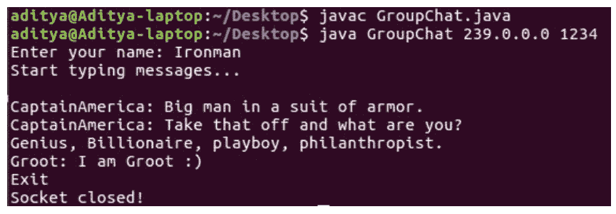
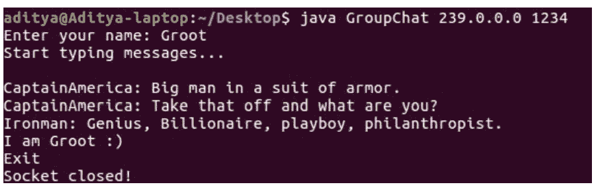
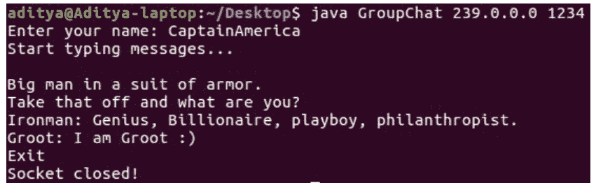

# 一个 Java 的群聊应用

> 原文:[https://www . geesforgeks . org/a-group-chat-application-in-Java/](https://www.geeksforgeeks.org/a-group-chat-application-in-java/)

在这篇文章中，讨论了一个使用 multicast socket(Java Platform SE 7)类的群聊应用程序。多播套接字是一种(UDP)数据报套接字，具有加入互联网上其他多播主机“组”的附加功能。

**实施**

```java
import java.net.*;
import java.io.*;
import java.util.*;
public class GroupChat
{
    private static final String TERMINATE = "Exit";
    static String name;
    static volatile boolean finished = false;
    public static void main(String[] args)
    {
        if (args.length != 2)
            System.out.println("Two arguments required: <multicast-host> <port-number>");
        else
        {
            try
            {
                InetAddress group = InetAddress.getByName(args[0]);
                int port = Integer.parseInt(args[1]);
                Scanner sc = new Scanner(System.in);
                System.out.print("Enter your name: ");
                name = sc.nextLine();
                MulticastSocket socket = new MulticastSocket(port);

                // Since we are deploying
                socket.setTimeToLive(0);
                //this on localhost only (For a subnet set it as 1)

                socket.joinGroup(group);
                Thread t = new Thread(new
                ReadThread(socket,group,port));

                // Spawn a thread for reading messages
                t.start(); 

                // sent to the current group
                System.out.println("Start typing messages...\n");
                while(true)
                {
                    String message;
                    message = sc.nextLine();
                    if(message.equalsIgnoreCase(GroupChat.TERMINATE))
                    {
                        finished = true;
                        socket.leaveGroup(group);
                        socket.close();
                        break;
                    }
                    message = name + ": " + message;
                    byte[] buffer = message.getBytes();
                    DatagramPacket datagram = new
                    DatagramPacket(buffer,buffer.length,group,port);
                    socket.send(datagram);
                }
            }
            catch(SocketException se)
            {
                System.out.println("Error creating socket");
                se.printStackTrace();
            }
            catch(IOException ie)
            {
                System.out.println("Error reading/writing from/to socket");
                ie.printStackTrace();
            }
        }
    }
}
class ReadThread implements Runnable
{
    private MulticastSocket socket;
    private InetAddress group;
    private int port;
    private static final int MAX_LEN = 1000;
    ReadThread(MulticastSocket socket,InetAddress group,int port)
    {
        this.socket = socket;
        this.group = group;
        this.port = port;
    }

    @Override
    public void run()
    {
        while(!GroupChat.finished)
        {
                byte[] buffer = new byte[ReadThread.MAX_LEN];
                DatagramPacket datagram = new
                DatagramPacket(buffer,buffer.length,group,port);
                String message;
            try
            {
                socket.receive(datagram);
                message = new
                String(buffer,0,datagram.getLength(),"UTF-8");
                if(!message.startsWith(GroupChat.name))
                    System.out.println(message);
            }
            catch(IOException e)
            {
                System.out.println("Socket closed!");
            }
        }
    }
}
```

将文件保存为 GroupChat.java 并使用 javac 编译它，然后使用指定的两个命令行参数运行程序。多播主机由一个 D 类 IP 地址和一个标准的 UDP 端口号指定。D 类 IP 地址在 224.0.0.0 到 239.255.255.255(含)之间。地址 224.0.0.0 是保留的，不应使用。
以下是上述程序的输出示例:
[](https://media.geeksforgeeks.org/wp-content/uploads/multicast-socket-api-in-java.png)

[ ](https://media.geeksforgeeks.org/wp-content/uploads/multicast-socket-api-in-java1.png) [](https://media.geeksforgeeks.org/wp-content/uploads/multicast-socket-api-in-java12.png) 
我们使用的组播主机 IP 地址为 239.0.0.0，端口号为 1234(因为端口号 0 到 1023 是保留的)。这个小组有 3 名成员:铁人、美国队长和格鲁特。在发送消息之前，首先启动所有三个终端，否则在启动终端之前发送的消息会丢失(因为没有用于存储消息的缓冲设施。)在这个应用程序中，我们需要两个线程。一个用于接受用户输入(使用 java.util.Scanner 类)，另一个用于读取从其他客户端发送的消息。因此，我将执行读取工作的线程分成了 ReadThreadclass。要离开该组，任何用户都可以键入 Exit 来终止会话。

上述程序在一台机器上执行。套接字编程意味着分布式编程。相同的代码片段出现在安装了 Java 的不同机器上就可以满足这个要求。这只是最基本的服务逻辑。如果开发出前端，这个项目会更加引人入胜。您可以使用 Java 的 AWT(抽象窗口工具包)或其高级对应物 Java Swing 来开发前端。因为这不是 Socket 编程的一部分，所以我没有深入讨论细节。
**附加积分:**

*   在通过网络发送消息之前，您可以通过执行加密来整合网络安全功能。
*   凯撒密码等原始技术或 RSA 等高级方法可用于执行加密-解密。您可以尝试使用 Java 的 RMI(远程方法调用)来执行相同的任务。
*   在这里，您可以最大限度地利用 Java 提供的抽象。然而，如果你的首要目标是效率，那么 Socket 编程是最好的选择。因为它不需要任何运行时支持，所以它比 RMI 快一点。

本文由 **Aditya ch** 供稿。如果你喜欢 GeeksforGeeks 并想投稿，你也可以使用[contribute.geeksforgeeks.org](http://www.contribute.geeksforgeeks.org)写一篇文章或者把你的文章邮寄到 contribute@geeksforgeeks.org。看到你的文章出现在极客博客主页上，帮助其他极客。

如果你发现任何不正确的地方，或者你想分享更多关于上面讨论的话题的信息，请写评论。