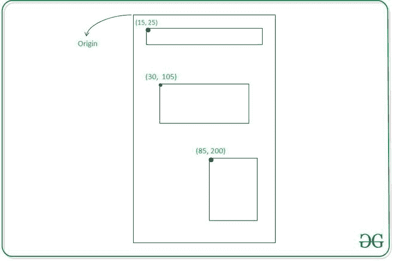
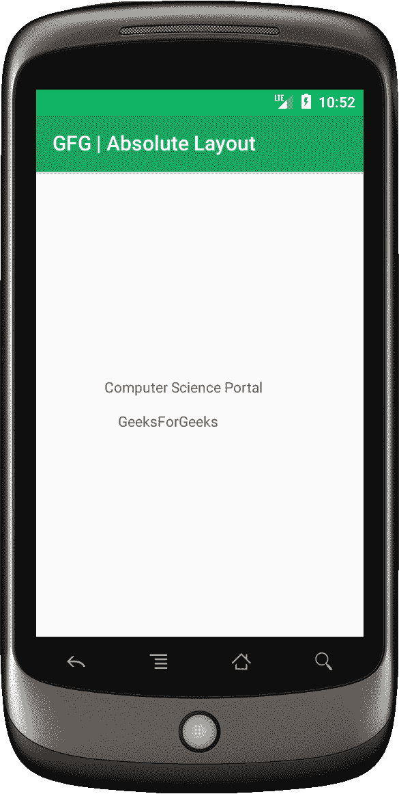

# 安卓绝对布局示例

> 原文:[https://www . geeksforgeeks . org/绝对-带示例的安卓布局/](https://www.geeksforgeeks.org/absolute-layout-in-android-with-example/)

一个**绝对布局**允许你指定精确的位置，即它的子元素相对于布局左上角原点的 X 和 Y 坐标。绝对布局不太灵活，对于不同尺寸的屏幕更难维护，这就是为什么不建议使用的原因。虽然绝对布局现在已经被否决了。



一些重要的绝对布局属性如下:

1.  **安卓:id** :唯一指定绝对布局
2.  **安卓:layout_x:** 它指定视图的 X 坐标(可能的值在[密度-像素或像素](https://www.geeksforgeeks.org/how-to-scale-different-views-to-all-screen-sizes-in-android-studio/)中)
3.  **安卓:layout_y:** 它指定视图的 Y 坐标(可能的值是 dp 或 px)

**绝对布局的语法**

## 可扩展标记语言

```
<AbsoluteLayout
    xmlns:android="http://schemas.android.com/apk/res/android"
    android:layout_width="fill_parent"
    android:layout_height="fill_parent">
<!--add child views-->
</AbsoluteLayout>
```

## **例**

在这个例子中，我们将创建一个带有绝对布局的基本应用程序，它有两个[文本视图](https://www.geeksforgeeks.org/textview-widget-in-android-using-java-with-examples/)。请注意，我们将使用 **Java** 语言来实现这个项目。

### **分步实施**

**第一步:创建新项目**

要在安卓工作室创建新项目，请参考[如何在安卓工作室创建/启动新项目](https://www.geeksforgeeks.org/android-how-to-create-start-a-new-project-in-android-studio/)。注意选择 **Java** 作为编程语言。

**第二步:创建布局文件**

为此，转到**应用程序> res >布局> activity_main.xml** 文件，并将约束布局更改为绝对布局，并添加[文本视图](https://www.geeksforgeeks.org/textview-widget-in-android-using-java-with-examples/)。下面是**activity _ main . XML**文件的代码片段。

## 可扩展标记语言

```
<?xml version="1.0" encoding="utf-8"?>
<AbsoluteLayout 
    xmlns:android="http://schemas.android.com/apk/res/android"
    xmlns:app="http://schemas.android.com/apk/res-auto"
    xmlns:tools="http://schemas.android.com/tools"
    android:layout_width="fill_parent"
    android:layout_height="fill_parent"
    tools:context=".MainActivity">

    <!--Setting up TextViews-->
    <TextView
        android:layout_width="wrap_content"
        android:layout_height="wrap_content"
        android:layout_x="100px"
        android:layout_y="300px" />

    <TextView
        android:layout_width="wrap_content"
        android:layout_height="wrap_content"
        android:layout_x="120px"
        android:layout_y="350px" />

</AbsoluteLayout>
```

在进一步移动之前，让我们添加一些颜色属性，以增强应用程序栏。转到**应用程序> res >值> colors.xml** 并添加以下颜色属性。

## 可扩展标记语言

```
<resources> 
    <color name="colorPrimary">#0F9D58</color> 
    <color name="colorPrimaryDark">#16E37F</color> 
    <color name="colorAccent">#03DAC5</color> 
</resources> 
```

**步骤 3:使用 MainActivity.java 文件**

在这一步中，我们将初始化我们的**MainActivity.java**文件中的文本视图。

## Java 语言(一种计算机语言，尤用于创建网站)

```
import androidx.appcompat.app.AppCompatActivity;
import android.os.Bundle;
import android.widget.TextView;

public class MainActivity extends AppCompatActivity {

    TextView heading, subHeading;

    @Override
    protected void onCreate(Bundle savedInstanceState) {
        super.onCreate(savedInstanceState);
        setContentView(R.layout.activity_main);

        // Referencing the TextViews
        heading = (TextView) findViewById(R.id.heading);
        subHeading = (TextView) findViewById(R.id.subHeading);

        // Setting text dynamically
        heading.setText("Computer Science Portal");
        subHeading.setText("GeeksForGeeks");
    }
}
```

### **输出:在仿真器上运行**

你会看到文本视图有固定的 X 和 Y 坐标。

