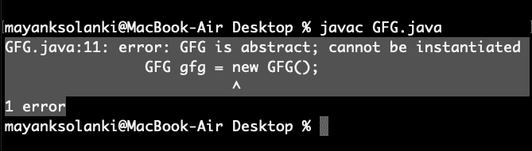

# Java 中的抽象类

> 原文:[https://www.geeksforgeeks.org/abstract-classes-in-java/](https://www.geeksforgeeks.org/abstract-classes-in-java/)

在 C++中，如果一个类至少有一个[纯虚函数](https://www.geeksforgeeks.org/pure-virtual-functions-and-abstract-classes/)，那么这个类就变成了抽象的。与 C++不同，在 Java 中，一个单独的[关键字*抽象*](https://www.geeksforgeeks.org/abstract-keyword-in-java/) 用于使类抽象。

**图解:**抽象类

```java
abstract class Shape 
{
    int color;

    // An abstract function
    abstract void draw();
}
```

以下是关于 Java 中抽象类的一些重要观察。

1.  无法创建抽象类的实例。
2.  允许构造函数。
3.  我们可以有一个没有任何抽象方法的抽象类。
4.  抽象类不能有最终方法，因为当你把一个方法变成最终方法时，你不能重写它，但是抽象方法是用来重写的。
5.  我们不允许为任何抽象类创建对象。
6.  我们可以在抽象类中定义静态方法

让我们详细说明这些观察结果，并在干净的 java 程序的帮助下证明它们的合理性，如下所示。

**观察 1:** 在 Java 中，很可能在 C++中无法创建抽象类的实例，但是我们可以有对抽象类类型的引用。它是如下所示通过干净的 java 程序。

**例**

## Java 语言(一种计算机语言，尤用于创建网站)

```java
// Java Program to Illustrate That an Iinstance of Abstract
// Class Can not be created

// Class 1
// Abstract class
abstract class Base {
    abstract void fun();
}

// Class 2
class Derived extends Base {
    void fun()
    {
        System.out.println("Derived fun() called");
    }
}

// Class 3
// Main class
class Main {

    // Main driver method
    public static void main(String args[])
    {

        // Uncommenting the following line will cause
        // compiler error as the line tries to create an
        // instance of abstract class. Base b = new Base();

        // We can have references of Base type.
        Base b = new Derived();
        b.fun();
    }
}
```

**Output**

```java
Derived fun() called
```

**观察 2:** 像 C++一样，一个抽象类可以包含 Java 中的构造函数。创建继承类的实例时，会调用抽象类的构造函数。如下图所示:

**例**

## Java 语言(一种计算机语言，尤用于创建网站)

```java
// Java Program to Illustrate Abstract Class
// Can contain Constructors

// Class 1
// Abstract class
abstract class Base {

    // Constructor of class 1
    Base()
    {
        // Print statement
        System.out.println("Base Constructor Called");
    }

    // Abstract method inside class1
    abstract void fun();
}

// Class 2
class Derived extends Base {

    // Constructor of class2
    Derived()
    {
        System.out.println("Derived Constructor Called");
    }

    // Method of class2
    void fun()
    {
        System.out.println("Derived fun() called");
    }
}

// Class 3
// Main class
class GFG {

    // Main driver method
    public static void main(String args[])
    {
        // Creating object of class 2
        // inside main() method
        Derived d = new Derived();
    }
}
```

**Output**

```java
Base Constructor Called
Derived Constructor Called
```

**观察 3:** 在 Java 中，我们可以有一个抽象类，不需要任何抽象方法。这允许我们创建不能被实例化但只能被继承的类。在干净的 java 程序的帮助下，如下所示。

**例**

## Java 语言(一种计算机语言，尤用于创建网站)

```java
// Java Program to illustrate Abstract class
// Without any abstract method

// Class 1
// An abstract class without any abstract method
abstract class Base {

    // Demo method
    void fun()
    {
        // Print message if class 1 function is called
        System.out.println(
            "Function of Base class is called");
    }
}

// Class 2
class Derived extends Base {
}

// Class 3
class Main {

    // Main driver method
    public static void main(String args[])
    {
        // Creating object of class 2
        Derived d = new Derived();

        // Calling function defined in class 1 inside main()
        // with object of class 2 inside main() method
        d.fun();
    }
}
```

**Output**

```java
Function of Base class is called
```

**观察 4:** 抽象类也可以有最终方法(不能被覆盖的方法)

**例**

## Java 语言(一种计算机语言，尤用于创建网站)

```java
// Java Program to Illustrate Abstract classes
// Can also have Final Methods

// Class 1
// Abstract class
abstract class Base {

    final void fun()
    {
        System.out.println("Base fun() called");
    }
}

// Class 2
class Derived extends Base {
}

// Class 3
// Main class
class GFG {

    // Main driver method
    public static void main(String args[])
    {

        // Creating object of abstract class
        Base b = new Derived();

        // Calling method on object created above
        // inside main()
        b.fun();
    }
}
```

**Output**

```java
Base fun() called

```

**观察 5:** 对于任何抽象 java 类，我们都不允许创建对象，即对于抽象类，实例化是不可能的。

**例**

## Java 语言(一种计算机语言，尤用于创建网站)

```java
// Java Program to Illustrate Abstract Class

// Main class
// An abstract class
abstract class GFG {

    // Main driver method
    public static void main(String args[])
    {

        // Trying to create an object
        GFG gfg = new GFG();
    }
}
```

**输出:**



**观察 6:** 类似于接口，我们可以在一个抽象类中定义静态方法，无需对象就可以独立调用。

**例**

## Java 语言(一种计算机语言，尤用于创建网站)

```java
// Java Program to Illustrate Static Methods in Abstract
// Class Can be called Independently

// Class 1
// Abstract class
abstract class Helper {

    // Abstract method
    static void demofun()
    {

        // Print statement
        System.out.println("Geeks for Geeks");
    }
}

// Class 2
// Main class extending Helper class
public class GFG extends Helper {

    // Main driver method
    public static void main(String[] args)
    {

        // Calling method inside main()
        // as defined in above class
        Helper.demofun();
    }
}
```

**Output**

```java
Geeks for Geeks
```

**必读:**

*   [Java 中抽象类和接口的区别](https://www.geeksforgeeks.org/difference-between-abstract-class-and-interface-in-java/)
*   [抽象类和抽象方法的区别](https://www.geeksforgeeks.org/difference-between-abstract-class-and-abstract-method-in-java/)
*   [Java 抽象类中的构造函数](https://www.geeksforgeeks.org/constructor-in-java-abstract-class/)

如果你发现任何不正确的地方，或者你想分享更多关于上面讨论的话题的信息，请写评论。