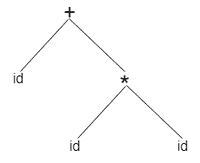
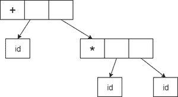

# Java 中的抽象语法树(AST)

> 原文:[https://www . geesforgeks . org/abstract-syntax-tree-ast-in-Java/](https://www.geeksforgeeks.org/abstract-syntax-tree-ast-in-java/)

抽象语法树是用编程语言编写的源代码的抽象语法结构的一种树表示。树的每个节点表示源代码中出现的一个构造。

抽象语法树是编译器中广泛使用的表示程序代码结构的数据结构，因此在编译器中应用抽象语法树有许多重要性。AST 通常是编译器语法分析阶段的结果。它通常在编译器要求的几个阶段中充当程序的中间表示，对编译器的最终输出有很大影响。

在进一步讨论实现部分之前，让我们讨论一下 AST 的使用。AST 主要用于编译器检查代码的准确性。如果生成的树有错误，编译器会打印一条错误消息。使用抽象语法树(AST)是因为有些构造不能用上下文无关的语法来表示，例如隐式类型。它们是高度特定于编程语言的，但是对通用语法树的研究正在进行中。

> **流程图:**
> 
> **id + id * id** 将具有如下语法树:
> 
> 
> 
> **抽象语法树**将如下:
> 
> 

**实施:**

在这里，我们将编写定制的 java 源代码，相应地，我们将为与实现中相同的 java 源代码提供 AST。

**示例 1(A)** Java 源代码

## Java 语言(一种计算机语言，尤用于创建网站)

```java
// Java Custom Source Code

// Main class
class GFG {

    // Main driver method
    public static void main(String[] args)
    {

        // Print statement
        System.out.println("Hello World!");
    }
}
```