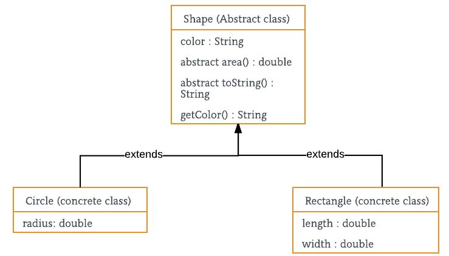

# Java 中的抽象

> 原文:[https://www.geeksforgeeks.org/abstraction-in-java-2/](https://www.geeksforgeeks.org/abstraction-in-java-2/)

数据抽象是一种属性，通过它，只有基本的细节才会显示给用户。琐碎的或非基本的单元不会显示给用户。汽车被看作是一辆汽车，而不是它的单个部件。

数据抽象也可以定义为只识别对象所需特征而忽略无关细节的过程。对象的属性和行为使其区别于其他类似类型的对象，也有助于对对象进行分类/分组。

考虑一个男人开车的真实例子。这个人只知道踩油门会提高汽车的速度，或者踩刹车会让汽车停下来，但他不知道踩油门后速度实际上是如何提高的，他不知道汽车的内部机制或者油门、刹车等在汽车中的实施。这就是抽象。

在 java 中，抽象是通过[接口](https://www.geeksforgeeks.org/interfaces-in-java/)和[抽象类](https://www.geeksforgeeks.org/abstract-classes-in-java/)实现的。我们可以使用接口实现 100%的抽象。

**抽象类和抽象方法:**

1.  抽象类是用[抽象关键字声明的类。](https://www.geeksforgeeks.org/abstract-keyword-in-java/)
2.  抽象方法是在没有实现的情况下声明的方法。
3.  抽象类可以有也可以没有所有的抽象方法。其中一些可以是具体的方法
4.  方法定义的抽象必须总是在子类中被重新定义，因此使[覆盖](https://www.geeksforgeeks.org/overriding-in-java/)成为强制性的，或者使子类本身成为抽象的。
5.  任何包含一个或多个抽象方法的类也必须用抽象关键字声明。
6.  抽象类不能有对象。也就是说，抽象类不能直接用 [*新操作符*](https://www.geeksforgeeks.org/new-operator-java/) 实例化。
7.  抽象类可以有参数化构造函数，默认构造函数总是出现在抽象类中。

**什么时候用抽象类和抽象方法举例**

在某些情况下，我们希望定义一个超类，它声明给定抽象的结构，而不提供每个方法的完整实现。也就是说，有时我们会想创建一个超类，它只定义一个由其所有子类共享的一般化表单，让每个子类来填写细节。

考虑一个经典的“形状”例子，也许用于计算机辅助设计系统或游戏模拟。基本类型是“形状”，每个形状都有颜色、大小等。由此，衍生(继承)了特定类型的形状——圆形、正方形、三角形等等——每一种形状都可能具有额外的特征和行为。例如，某些形状可以翻转。某些行为可能会有所不同，例如当您想要计算形状的面积时。类型层次体现了形状之间的相似性和差异性。



## Java 语言(一种计算机语言，尤用于创建网站)

```
// Java program to illustrate the
// concept of Abstraction
abstract class Shape {
    String color;

    // these are abstract methods
    abstract double area();
    public abstract String toString();

    // abstract class can have the constructor
    public Shape(String color)
    {
        System.out.println("Shape constructor called");
        this.color = color;
    }

    // this is a concrete method
    public String getColor() { return color; }
}
class Circle extends Shape {
    double radius;

    public Circle(String color, double radius)
    {

        // calling Shape constructor
        super(color);
        System.out.println("Circle constructor called");
        this.radius = radius;
    }

    @Override double area()
    {
        return Math.PI * Math.pow(radius, 2);
    }

    @Override public String toString()
    {
        return "Circle color is " + super.getColor()
            + "and area is : " + area();
    }
}
class Rectangle extends Shape {

    double length;
    double width;

    public Rectangle(String color, double length,
                     double width)
    {
        // calling Shape constructor
        super(color);
        System.out.println("Rectangle constructor called");
        this.length = length;
        this.width = width;
    }

    @Override double area() { return length * width; }

    @Override public String toString()
    {
        return "Rectangle color is " + super.getColor()
            + "and area is : " + area();
    }
}
public class Test {
    public static void main(String[] args)
    {
        Shape s1 = new Circle("Red", 2.2);
        Shape s2 = new Rectangle("Yellow", 2, 4);

        System.out.println(s1.toString());
        System.out.println(s2.toString());
    }
}
```

**Output**

```
Shape constructor called
Circle constructor called
Shape constructor called
Rectangle constructor called
Circle color is Redand area is : 15.205308443374602
Rectangle color is Yellowand area is : 8.0
```

**封装与数据抽象**

1.  [封装](https://www.geeksforgeeks.org/encapsulation-in-java/)是数据隐藏(信息隐藏)，抽象是细节隐藏(实现隐藏)。
2.  当封装将数据和作用于数据的方法组合在一起时，数据抽象处理向用户公开接口和隐藏实现的细节。

**抽象的优势**

1.  它降低了观察事物的复杂性。
2.  避免代码重复并提高可重用性。
3.  有助于提高应用程序或程序的安全性，因为只有重要的细节才提供给用户。

**相关文章:**

*   [Java 中的接口](https://www.geeksforgeeks.org/interfaces-in-java/)
*   [Java 中的抽象类](https://www.geeksforgeeks.org/abstract-classes-in-java/)
*   [抽象类和接口的区别](https://www.geeksforgeeks.org/difference-between-abstract-class-and-interface-in-java/)
*   [Java 中的抽象关键字](https://www.geeksforgeeks.org/abstract-keyword-in-java/)