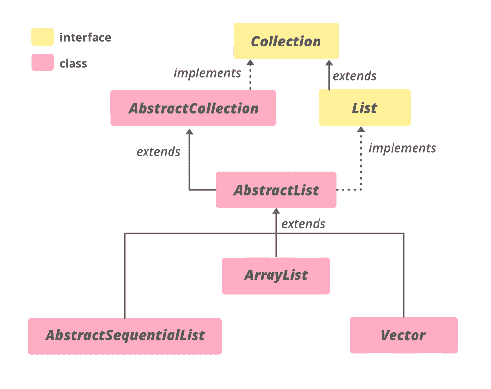

# Java 抽象列表，带示例

> 原文:[https://www . geesforgeks . org/abstract list-in-Java-with-examples/](https://www.geeksforgeeks.org/abstractlist-in-java-with-examples/)

Java 中的**抽象列表**类是 [Java 集合框架](https://www.geeksforgeeks.org/collections-in-java-2/)的一部分，实现了*集合接口*和 [*抽象集合*](https://www.geeksforgeeks.org/abstractcollection-in-java-with-examples/#:~:text=The%20AbstractCollection%20class%20in%20Java,iterator%20and%20the%20size%20methods.) *类*。该类提供了[列表](https://www.geeksforgeeks.org/list-interface-java-examples/)接口的框架实现，以最小化实现该接口所需的工作量，该接口由**随机访问**数据存储(如数组)支持。对于顺序访问数据(如链表)，应优先使用[抽象顺序列表](https://www.geeksforgeeks.org/abstractsequentiallist-in-java-with-examples/)。

要实现一个不可修改的列表，只需要扩展这个抽象列表类并实现 [get(int)](https://www.geeksforgeeks.org/abstractlist-get-method-in-java-with-examples/) 和 [size()](https://www.geeksforgeeks.org/list-size-method-in-java-with-examples/) 方法。为了实现一个可修改的列表，需要额外覆盖[集合(int index，E element)](https://www.geeksforgeeks.org/abstractlist-set-method-in-java-with-examples/) 方法(否则会抛出一个 UnsupportedOperationException)。如果列表是可变大小的，应该覆盖[添加(int，E](https://www.geeksforgeeks.org/abstractlist-adde-ele-method-in-java-with-examples/) )和[删除(int)](https://www.geeksforgeeks.org/abstractlist-remove-method-in-java-with-examples/) 方法。

**等级等级:**



**申报:**

```java
public abstract class AbstractList<E> extends AbstractCollection<E> implements List<E>

where E is the type of elements maintained by this collection.

```

**构造函数:**受保护的抽象列表()–默认构造函数，但受保护，不允许创建抽象列表对象。

> 抽象列表 <e>al =新数组列表<e>()；</e></e>

**示例 1:** 抽象列表是一个[抽象类](https://www.geeksforgeeks.org/abstract-classes-in-java/)，因此应该为它分配一个子类的实例，如[数组列表](https://www.geeksforgeeks.org/arraylist-in-java/)、[链接列表](https://www.geeksforgeeks.org/linked-list-in-java/)或[向量](https://www.geeksforgeeks.org/java-util-vector-class-java/)。

## Java 语言(一种计算机语言，尤用于创建网站)

```java
// Java code to illustrate AbstractList
import java.util.*;

public class AbstractListDemo {
    public static void main(String args[])
    {

        // Creating an empty AbstractList
        AbstractList<String> list = new ArrayList<String>();

        // Use add() method to add elements in the list
        list.add("Geeks");
        list.add("for");
        list.add("Geeks");
        list.add("10");
        list.add("20");

        // Displaying the AbstractList
        System.out.println("AbstractList:" + list);
    }
}
```

**输出:**

```java
AbstractList:[Geeks, for, Geeks, 10, 20]
```

**例 2:**

## Java 语言(一种计算机语言，尤用于创建网站)

```java
// Java code to illustrate 
// methods of AbstractCollection 

import java.util.*; 

public class AbstractListDemo { 
    public static void main(String args[]) 
    { 

        // Creating an empty AbstractList 
        AbstractList<String> 
            list = new LinkedList<String>(); 

        // Using add() method to add elements in the list 
        list.add("Geeks"); 
        list.add("for"); 
        list.add("Geeks"); 
        list.add("10"); 
        list.add("20"); 

        // Output the list 
        System.out.println("AbstractList: " + list); 

        // Remove the head using remove() 
        list.remove(3); 

        // Print the final list 
        System.out.println("Final AbstractList: " + list); 

        // getting the index of last occurence 
        // using lastIndexOf() method 
        int lastindex = list.lastIndexOf("A"); 

        // printing the Index 
        System.out.println("Last index of A : "
                        + lastindex); 
    } 
} 
```

**输出:**

```java
AbstractList: [Geeks, for, Geeks, 10, 20]
Final AbstractList: [Geeks, for, Geeks, 20]
Last index of A : -1
```

### **抽象列表中的方法**

<figure class="table">

| 

方法

 | 

描述

 |
| --- | --- |
| 加法(整数索引，E 元素) | 在列表中的指定位置插入指定元素(可选操作)。 |
| [加(E e)](https://www.geeksforgeeks.org/abstractlist-adde-ele-method-in-java-with-examples/) | 将指定的元素追加到该列表的末尾(可选操作)。 |
| add all(int 指数，[收藏<？延伸 E > c)](https://www.geeksforgeeks.org/abstractlist-addall-method-in-java-with-examples/) | 将指定集合中的所有元素插入列表中的指定位置(可选操作)。 |
| [晴()](https://www.geeksforgeeks.org/abstractlist-clear-method-in-java-with-examples/#:~:text=The%20clear()%20method%20of,empty%20after%20this%20call%20returns.) | 从此列表中移除所有元素(可选操作)。 |
| [等于(对象 o)](https://www.geeksforgeeks.org/abstractlist-equals-method-in-java-with-examples/) | 将指定的对象与该列表进行比较，看是否相等。 |
| [get (int index)](https://www.geeksforgeeks.org/abstractlist-get-method-in-java-with-examples/) | 返回列表中指定位置的元素。 |
| [hashCode()](https://www.geeksforgeeks.org/abstractlist-hashcode-method-in-java-with-examples/) | 返回此列表的哈希代码值。 |
| [索引（对象 o）](https://www.geeksforgeeks.org/abstractlist-indexof-method-in-java-with-examples/) | 返回此列表中指定元素的第一个匹配项的索引，如果此列表不包含该元素，则返回-1。 |
| [迭代器()](https://www.geeksforgeeks.org/abstractlist-iterator-method-in-java-with-examples/) | 以适当的顺序返回列表中元素的迭代器。 |
| [最后索引（对象 o）](https://www.geeksforgeeks.org/abstractlist-lastindexof-method-in-java-with-examples/) | 返回此列表中指定元素最后一次出现的索引，如果此列表不包含该元素，则返回-1。 |
| [列表迭代器()](https://www.geeksforgeeks.org/abstractlist-listiterator-method-in-java-with-examples/) | 返回列表中元素的列表迭代器(按正确的顺序)。 |
| [列表迭代器(int index)](https://www.geeksforgeeks.org/abstractlist-listiterator-method-in-java-with-examples/) | 从列表中的指定位置开始，返回列表中元素的列表迭代器(按正确的顺序)。 |
| [移除(int index)](https://www.geeksforgeeks.org/abstractlist-remove-method-in-java-with-examples/#:~:text=The%20remove(int%20index)%20method,a%20specific%20position%20or%20index.&text=Parameters%3A%20The%20parameter%20index%20is,be%20removed%20from%20the%20AbstractList.) | 移除列表中指定位置的元素(可选操作)。 |
| removeRange (int fromIndex，int toIndex) | 从该列表中删除索引介于 fromIndex(包含)和 toIndex(不包含)之间的所有元素。 |
| [集合(int 索引，E 元素)](https://www.geeksforgeeks.org/abstractlist-set-method-in-java-with-examples/#:~:text=The%20set()%20method%20of,of%20the%20set()%20method.) | 用指定的元素替换列表中指定位置的元素(可选操作)。 |
| [子列表（int fromIndex， int toIndex）](https://www.geeksforgeeks.org/abstractlist-sublist-method-in-java-with-examples/) | 返回此列表中指定的 fromIndex(包含)和 toIndex(不包含)之间的部分的视图。 |

</figure>

### java.util.AbstractCollection 类中声明的方法

<figure class="table">

| 

方法

 | 

描述

 |
| --- | --- |
| [addAll(收藏<？延伸 E > c)](https://www.geeksforgeeks.org/abstractcollection-addall-method-in-java-with-examples/) | 将指定集合中的所有元素添加到此集合中(可选操作)。 |
| [包含(对象 o)](https://www.geeksforgeeks.org/abstractcollection-contains-method-in-java-with-examples/) | 如果此集合包含指定的元素，则返回 true。 |
| [包含所有(收藏<？> c)](https://www.geeksforgeeks.org/abstractcollection-containsall-method-in-java-with-examples/) | 如果此集合包含指定集合中的所有元素，则返回 true。 |
| [【isempty()](https://www.geeksforgeeks.org/abstractcollection-isempty-method-in-java-with-examples/) | 如果此集合不包含元素，则返回 true。 |
| [移除(物体 o)](https://www.geeksforgeeks.org/abstractcollection-remove-method-in-java-with-examples/#:~:text=The%20remove(Object%20O)%20method,particular%20element%20from%20a%20Collection.&text=Parameters%3A%20The%20parameter%20O%20is,be%20removed%20from%20the%20collection.) | 从该集合中移除指定元素的单个实例(如果存在)(可选操作)。 |
| [移除所有(集合<？> c)](https://www.geeksforgeeks.org/abstractcollection-removeall-method-in-java-with-example/) | 移除此集合中也包含在指定集合中的所有元素(可选操作)。 |
| [零售(收藏<？> c)](https://www.geeksforgeeks.org/abstractcollection-retainall-method-in-java-with-examples/) | 仅保留此集合中包含在指定集合中的元素(可选操作)。 |
| [toaarray()](https://www.geeksforgeeks.org/abstractcollection-toarray-method-in-java-with-examples/) | 返回包含此集合中所有元素的数组。 |
| [toaarray(t[]a)](https://www.geeksforgeeks.org/abstractcollection-toarray-method-in-java-with-examples/) | 返回包含此集合中所有元素的数组；返回数组的运行时类型是指定数组的运行时类型。 |
| [toString()](https://www.geeksforgeeks.org/abstractcollection-tostring-method-in-java-with-examples/) | 返回此集合的字符串表示形式。 |

</figure>

### 接口 java.util.Collection 中声明的方法

<figure class="table">

| 

方法

 | 

描述

 |
| --- | --- |
| 并行流() | 以此集合为源返回一个可能并行的流。 |
| 移除 If(谓词 super E>过滤器) | 移除此集合中满足给定谓词的所有元素。 |
| 流() | 返回以此集合为源的顺序流。 |
| toArray (IntFunction <t>生成器)</t> | 使用返回包含此集合中所有元素的数组提供生成器函数来分配返回的数组。 |

</figure>

### 接口 java.util.List 中声明的方法

<figure class="table">

| 

方法

 | 

描述

 |
| --- | --- |
| [addAll(收藏<？延伸 E > c)](https://www.geeksforgeeks.org/list-addall-method-in-java-with-examples/) | 将指定集合中的所有元素追加到此列表的末尾，顺序如下它们由指定集合的迭代器返回(可选操作)。 |
| [包含(对象 o)](https://www.geeksforgeeks.org/list-contains-method-in-java-with-examples/) | 如果此列表包含指定的元素，则返回 true。 |
| [包含所有(收藏<？> c)](https://www.geeksforgeeks.org/list-containsall-method-in-java-with-examples/#:~:text=The%20containsAll()%20method%20of,set%20of%20elements%20or%20not.&text=Parameters%3A%20This%20method%20accepts%20a,of%20the%20type%20of%20collection.) | 如果此列表包含指定集合的所有元素，则返回 true。 |
| [【isempty()](https://www.geeksforgeeks.org/list-isempty-method-in-java-with-examples/) | 如果此列表不包含任何元素，则返回 true。 |
| 移除(整数索引) | 移除列表中指定位置的元素(可选操作)。 |
| 移除所有(集合> c) | 从此列表中移除指定集合中包含的所有元素(可选操作)。 |
| 替换所有(取消操作符<e>操作符)</e> | 将列表中的每个元素替换为对该元素应用运算符的结果。 |
| [零售(收藏<？> c)](https://www.geeksforgeeks.org/list-retainall-method-in-java-with-examples/) | 仅保留此列表中包含在指定集合中的元素(可选操作)。 |
| [尺寸()](https://www.geeksforgeeks.org/list-size-method-in-java-with-examples/#:~:text=The%20size()%20method%20of,present%20in%20this%20list%20container.&text=Parameters%3A%20This%20method%20does%20not,of%20elements%20in%20this%20list.) | 返回此列表中的元素数量。 |
| 排序(比较器 super E> c) | 根据指定比较器引发的顺序对该列表进行排序。 |
| 拆分器() | 在此列表中的元素上创建拆分器。 |
| toarray() | 返回一个数组，该数组按正确的顺序(从第一个元素到最后一个元素)包含列表中的所有元素。 |
| toaarray(t[]a) | 返回一个数组，该数组包含此列表中按正确顺序排列的所有元素(从第一个元素到最后一个元素)；返回数组的运行时类型是指定数组的运行时类型。 |

</figure>

**参考:**[https://docs . Oracle . com/en/Java/javase/11/docs/API/Java . base/Java/util/abstract list . html](https://docs.oracle.com/en/java/javase/11/docs/api/java.base/java/util/AbstractList.html)