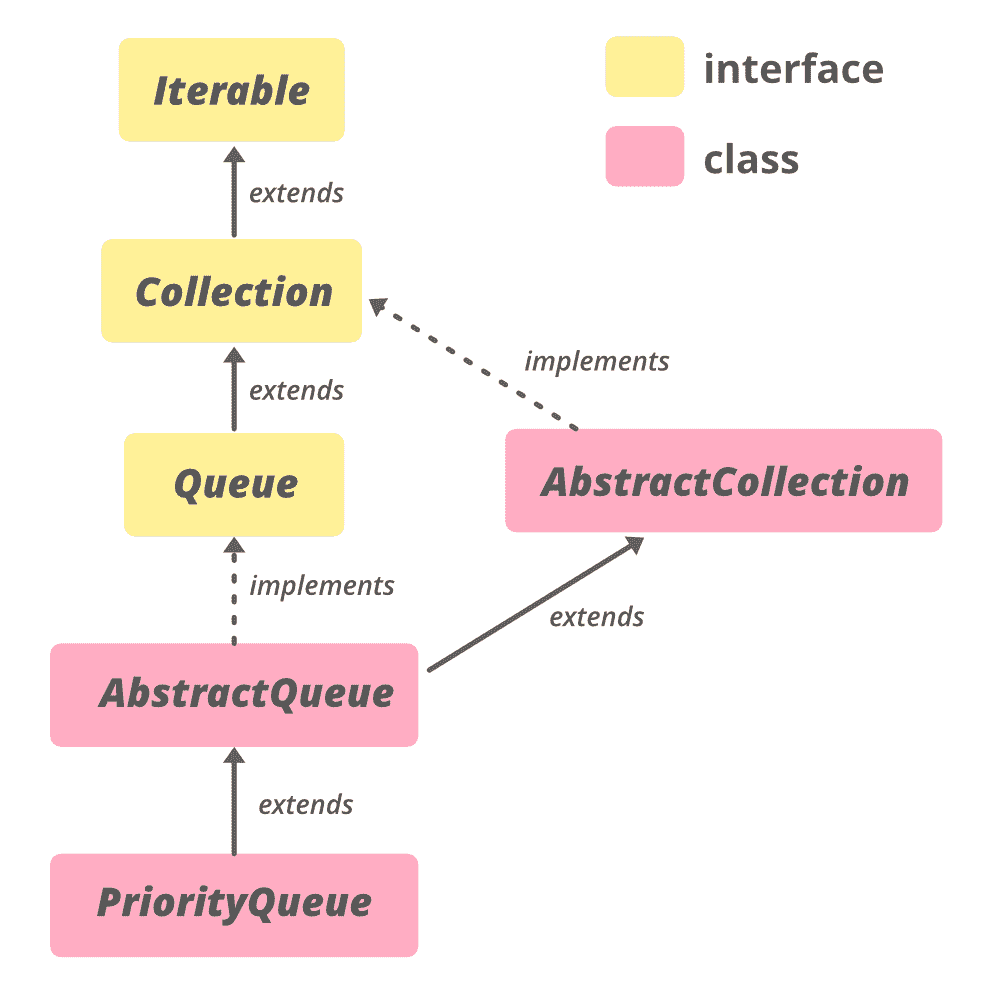

# Java 中的抽象队列，示例

> 原文:[https://www . geesforgeks . org/abstract queue-in-Java-with-examples/](https://www.geeksforgeeks.org/abstractqueue-in-java-with-examples/)

Java 中的**抽象队列**类是 [Java 集合框架](https://www.geeksforgeeks.org/collections-in-java-2/)的一部分，实现了*集合**接口***和[抽象集合](https://www.geeksforgeeks.org/abstractcollection-in-java-with-examples/#:~:text=The%20AbstractCollection%20class%20in%20Java,iterator%20and%20the%20size%20methods.) *类*。它提供了一些**队列**操作的框架实现。当基本实现不允许空元素时，此类中的实现是合适的。方法 add、remove 和 element 分别基于 offer、poll 和 peek，但是抛出异常，而不是通过 false 或 null 返回来指示失败。

**等级等级:**

```
java.lang.Object
 ↳ java.util.AbstractCollection<E>
    ↳ Class AbstractQueue<E>

```



该类实现了**可迭代<E>T1、**集合<E>T3、[队列<E>T5】接口，扩展了](https://www.geeksforgeeks.org/queue-interface-java/)[抽象集合](https://www.geeksforgeeks.org/abstractcollection-in-java-with-examples/#:~:text=The%20AbstractCollection%20class%20in%20Java,iterator%20and%20the%20size%20methods)****

**申报:**

> 公共抽象类抽象队列<e>扩展抽象集合<e>实现队列</e></e>

**E–**集合框架类或接口维护的元素类型。

### Java 抽象队列中的构造函数

由于抽象队列是一个抽象类，它的实现是由其子类提供的。下面显示了可以提供实现的类的列表。要创建它，我们需要从 **java.uti.AbstractQueue** 开始创建。

**受保护的抽象队列()**:默认构造函数，但由于抽象，不允许创建抽象队列对象。实现应该由它的一个子类提供，如 [ArrayBlockingQueue](https://www.geeksforgeeks.org/arrayblockingqueue-class-in-java/#:~:text=ArrayBlockingQueue%20class%20is%20a%20bounded,result%20in%20the%20operation%20blocking.) 、 [ConcurrentLinkedQueue](https://www.geeksforgeeks.org/concurrentlinkedqueue-in-java-with-examples/) 、 [DelayQueue](https://www.geeksforgeeks.org/delayqueue-class-in-java-with-example/#:~:text=DelayQueue%20is%20a%20specialized%20Priority,queue%20whose%20time%20has%20expired.) 、[LinkedBlockingQueue](https://www.geeksforgeeks.org/linkedblockingdeque-in-java-with-examples/)、 [LinkedBlockingQueue](https://www.geeksforgeeks.org/linkedblockingqueue-class-in-java/#:~:text=LinkedBlockingQueue%20is%20an%20optionally%2Dbounded,the%20LinkedBlockingQueue%20will%20be%20unbounded.&text=It%20means%20that%20the%20head,elements%20present%20in%20this%20queue.) 、 [LinkedTransferQueue](https://www.geeksforgeeks.org/linkedtransferqueue-in-java-with-examples/#:~:text=The%20LinkedTransferQueue%20class%20in%20Java,functionality%20based%20on%20linked%20nodes.) 、 [PriorityBlockingQueue](https://www.geeksforgeeks.org/priorityblockingqueue-class-in-java/#:~:text=PriorityBlockingQueue%20is%20an%20unbounded%20blocking,resource%20exhaustion%20resulting%20in%20OutOfMemoryError.) 、 [PriorityQueue](https://www.geeksforgeeks.org/priority-queue-class-in-java-2/) 、**synchrousqueue**

```
AbstractQueue<E> objName = new ArrayBlockingQueue<E>();

```

下面是一个用 Java 说明抽象队列的示例程序:

## Java 语言(一种计算机语言，尤用于创建网站)

```
// Java code to illustrate AbstractQueue

import java.util.*;
import java.util.concurrent.LinkedBlockingQueue;

public class AbstractQueueExample {

    public static void main(String[] argv) throws Exception
    {
        // Creating object of AbstractQueue<Integer>
        AbstractQueue<Integer> AQ = new LinkedBlockingQueue<Integer>();

        // Adding elements to the Queue
        AQ.add(10);
        AQ.add(20);
        AQ.add(30);
        AQ.add(40);
        AQ.add(50);

        // print the queue contents to the console
        System.out.println("AbstractQueue contains: " + AQ);
    }
}
```

**Output:** 

```
AbstractQueue contains: [10, 20, 30, 40, 50]
```

### 基本操作

**1。添加元素**

为了将元素添加到抽象队列中，它提供了两种方法。 [add(E e)](https://www.geeksforgeeks.org/abstractqueue-add-method-in-java-with-examples/) 方法在不违反容量限制的情况下，将指定的元素插入该队列。成功后返回真，如果当前没有可用空间，则抛出**非法状态异常**。 [addAll(E e)](https://www.geeksforgeeks.org/abstractqueue-addall-method-in-java-with-examples/) 方法将指定集合中的所有元素添加到该队列中。

## Java 语言(一种计算机语言，尤用于创建网站)

```
// Java program to illustrate the
// adding elements to the AbstractQueue

import java.util.*;
import java.util.concurrent.LinkedBlockingQueue;

public class AddingElementsExample {

    public static void main(String[] argv) throws Exception
    {
        // Since AbstractQueue is an abstract class
        // create object using LinkedBlockingQueue
        AbstractQueue<Integer> AQ1 = new LinkedBlockingQueue<Integer>();

        // Populating AQ
        AQ1.add(10);
        AQ1.add(20);
        AQ1.add(30);
        AQ1.add(40);
        AQ1.add(50);

        // print AQ
        System.out.println("AbstractQueue contains : "
                           + AQ1);

        // Since AbstractQueue is an abstract class
        // create object using LinkedBlockingQueue
        AbstractQueue<Integer> AQ2 = new LinkedBlockingQueue<Integer>();

        // print AQ2 initially
        System.out.println("AbstractQueue2 initially contains : " + AQ2);

        // adds elements of AQ1 in AQ2
        AQ2.addAll(AQ1);

        System.out.println( "AbstractQueue1 after addition contains : " + AQ2);
    }
}
```

**Output**

```
AbstractQueue contains : [10, 20, 30, 40, 50]
AbstractQueue2 initially contains : []
AbstractQueue1 after addition contains : [10, 20, 30, 40, 50]
```

**2。移除元素**

为了从抽象队列中移除元素，它提供了 remove()和 clear()方法。

*   [remove()](https://www.geeksforgeeks.org/abstractqueue-remove-method-in-java-with-examples/) 方法返回并移除该队列的头部。
*   [clear()](https://www.geeksforgeeks.org/abstractqueue-remove-method-in-java-with-examples/) 方法从该队列中移除所有元素。该调用返回后，队列将为空。

## Java 语言(一种计算机语言，尤用于创建网站)

```
// Java program to illustrate the
// removal of elements from AbstractQueue

import java.util.*;
import java.util.concurrent.LinkedBlockingQueue;

public class RemovingElementsExample {
    public static void main(String[] argv) throws Exception
    {
        // Since AbstractQueue is an abstract class
        // create object using LinkedBlockingQueue
        AbstractQueue<Integer> AQ1 = new LinkedBlockingQueue<Integer>();

        // Add elements using add method
        AQ1.add(10);
        AQ1.add(20);
        AQ1.add(30);
        AQ1.add(40);
        AQ1.add(50);

        // print the queue contents to the console
        System.out.println("AbstractQueue1 contains : " + AQ1);

        // Retrieves the head
        int head = AQ1.remove();

        // print the head element to the console
        System.out.println("head : " + head);

        // print the modified queue
        System.out.println("AbstractQueue1 after removal of head : " + AQ1);

        // remove all the elements
        AQ1.clear();

        // print the modified queue
        System.out.println("AbstractQueue1 : " + AQ1);
    }
}
```

**Output**

```
AbstractQueue1 contains : [10, 20, 30, 40, 50]
head : 10
AbstractQueue1 after removal of head : [20, 30, 40, 50]
AbstractQueue1 : []
```

**3。访问元素**

抽象队列的[元素()](https://www.geeksforgeeks.org/abstractqueue-element-method-in-java-with-examples/)方法检索但不移除该队列的头。

## Java 语言(一种计算机语言，尤用于创建网站)

```
// Java program to illustrate the
// accessing element from AbstractQueue

import java.util.*;
import java.util.concurrent.LinkedBlockingQueue;

public class AccessingElementExample {

    public static void main(String[] argv) throws Exception
    {
        // Since AbstractQueue is an abstract class
        // create object using LinkedBlockingQueue
        AbstractQueue<Integer> AQ1 = new LinkedBlockingQueue<Integer>();

        // Populating AQ1 using add method
        AQ1.add(10);
        AQ1.add(20);
        AQ1.add(30);
        AQ1.add(40);
        AQ1.add(50);

        // print AQ to the console
        System.out.println("AbstractQueue1 contains : " + AQ1);

        // access the head element
        System.out.println("head : " + AQ1.element());
    }
}
```

**Output**

```
AbstractQueue1 contains : [10, 20, 30, 40, 50]
head : 10
```

### 抽象队列的方法

<figure class="table">

| 

方法

 | 

描述

 |
| --- | --- |
| [加(E e)](https://www.google.com/url?client=internal-element-cse&cx=009682134359037907028:tj6eafkv_be&q=https://www.geeksforgeeks.org/abstractqueue-add-method-in-java-with-examples/&sa=U&ved=2ahUKEwjq1bS-x-_rAhV_7XMBHUZ-AiYQFjACegQICRAC&usg=AOvVaw2tSVSE8j-RVhLFBLz7Rrsb) | 如果可以在不违反容量限制的情况下立即将指定的元素插入到该队列中，成功时返回 true，如果当前没有可用空间，则抛出 IllegalStateException。 |
| [addAll(收藏<？延伸 E > c)](https://www.google.com/url?client=internal-element-cse&cx=009682134359037907028:tj6eafkv_be&q=https://www.geeksforgeeks.org/abstractqueue-addall-method-in-java-with-examples/&sa=U&ved=2ahUKEwjq1bS-x-_rAhV_7XMBHUZ-AiYQFjAEegQIBRAC&usg=AOvVaw3tiI5l9H_0El51jVdIYwdO) | 将指定集合中的所有元素添加到该队列中。 |
| [晴()](https://www.google.com/url?client=internal-element-cse&cx=009682134359037907028:tj6eafkv_be&q=https://www.geeksforgeeks.org/abstractqueue-clear-method-in-java-with-examples/&sa=U&ved=2ahUKEwjq1bS-x-_rAhV_7XMBHUZ-AiYQFjAFegQIAxAB&usg=AOvVaw3-MiU4gEoSZdwjGbwtcAKO) | 从此队列中移除所有元素。 |
| [元素()](https://www.google.com/url?client=internal-element-cse&cx=009682134359037907028:tj6eafkv_be&q=https://www.geeksforgeeks.org/abstractqueue-element-method-in-java-with-examples/&sa=U&ved=2ahUKEwjq1bS-x-_rAhV_7XMBHUZ-AiYQFjABegQIBxAC&usg=AOvVaw2SSwlZVlA-CLvk_bZMfKDx) | 检索但不移除该队列的头。 |
| [移除()](https://www.google.com/url?client=internal-element-cse&cx=009682134359037907028:tj6eafkv_be&q=https://www.geeksforgeeks.org/abstractqueue-remove-method-in-java-with-examples/&sa=U&ved=2ahUKEwjq1bS-x-_rAhV_7XMBHUZ-AiYQFjADegQICBAC&usg=AOvVaw28OjXkHNQ3DUvYI6CJNsyd) | 检索并删除该队列的头。 |

</figure>

### java.util.AbstractCollection 类中声明的方法

<figure class="table">

| 

方法

 | 

描述

 |
| --- | --- |
| [包含(对象 o)](https://www.google.com/url?client=internal-element-cse&cx=009682134359037907028:tj6eafkv_be&q=https://www.geeksforgeeks.org/abstractcollection-contains-method-in-java-with-examples/&sa=U&ved=2ahUKEwiqk4fGyO_rAhU873MBHcAhAkM4ChAWMAF6BAgJEAI&usg=AOvVaw1KoEh8BiYtOD8Nf1tnH1bm) | 如果此集合包含指定的元素，则返回 true。 |
| [包含所有(收藏<？> c)](https://www.google.com/url?client=internal-element-cse&cx=009682134359037907028:tj6eafkv_be&q=https://www.geeksforgeeks.org/abstractcollection-containsall-method-in-java-with-examples/&sa=U&ved=2ahUKEwjA8ZycyO_rAhWb8XMBHV3PBKUQFjAIegQIAhAC&usg=AOvVaw0TvSNdf7n0wNDmurCL2gZ7) | 如果此集合包含指定集合中的所有元素，则返回 true。 |
| [【isempty()](https://www.google.com/url?client=internal-element-cse&cx=009682134359037907028:tj6eafkv_be&q=https://www.geeksforgeeks.org/abstractcollection-isempty-method-in-java-with-examples/&sa=U&ved=2ahUKEwiqk4fGyO_rAhU873MBHcAhAkM4ChAWMAB6BAgAEAI&usg=AOvVaw0o4bMLMjv_1bSKbHesuVAd) | 如果此集合不包含元素，则返回 true。 |
| [迭代器()](https://www.google.com/url?client=internal-element-cse&cx=009682134359037907028:tj6eafkv_be&q=https://www.geeksforgeeks.org/absractcollection-iterator-method-in-java-with-examples/&sa=U&ved=2ahUKEwiqk4fGyO_rAhU873MBHcAhAkM4ChAWMAR6BAgCEAI&usg=AOvVaw2L2VQorKqIxTb47ZMLMhw7) | 返回此集合中包含的元素的迭代器。 |
| [移除(物体 o)](https://www.google.com/url?client=internal-element-cse&cx=009682134359037907028:tj6eafkv_be&q=https://www.geeksforgeeks.org/abstractcollection-remove-method-in-java-with-examples/&sa=U&ved=2ahUKEwjA8ZycyO_rAhWb8XMBHV3PBKUQFjADegQIBxAC&usg=AOvVaw0ZX1THQwnsEKgdGbmjGggp) | 从该集合中移除指定元素的单个实例(如果存在)(可选操作)。 |
| [移除所有(集合<？> c)](https://www.google.com/url?client=internal-element-cse&cx=009682134359037907028:tj6eafkv_be&q=https://www.geeksforgeeks.org/abstractcollection-removeall-method-in-java-with-example/&sa=U&ved=2ahUKEwjA8ZycyO_rAhWb8XMBHV3PBKUQFjAHegQIARAC&usg=AOvVaw07bT5_80TswpDColqWSbpZ) | 移除此集合中也包含在指定集合中的所有元素(可选操作)。 |
| 零售(集合> c) | 仅保留此集合中包含在指定集合中的元素(可选操作)。 |
| [toaarray()](https://www.google.com/url?client=internal-element-cse&cx=009682134359037907028:tj6eafkv_be&q=https://www.geeksforgeeks.org/abstractcollection-toarray-method-in-java-with-examples/&sa=U&ved=2ahUKEwjA8ZycyO_rAhWb8XMBHV3PBKUQFjAEegQIBRAC&usg=AOvVaw1_3fqWLHYo42GUuuJG5Bxt) | 返回包含此集合中所有元素的数组。 |
| [toaarray(t[]a)](https://www.google.com/url?client=internal-element-cse&cx=009682134359037907028:tj6eafkv_be&q=https://www.geeksforgeeks.org/abstractcollection-toarray-method-in-java-with-examples/&sa=U&ved=2ahUKEwjA8ZycyO_rAhWb8XMBHV3PBKUQFjAEegQIBRAC&usg=AOvVaw1_3fqWLHYo42GUuuJG5Bxt) | 返回包含此集合中所有元素的数组；返回数组的运行时类型是指定数组的运行时类型。 |
| toString() | 返回此集合的字符串表示形式。 |

</figure>

### 接口 java.util.Collection 中声明的方法

<figure class="table">

| 

方法

 | 

描述

 |
| --- | --- |
| [包含(对象 o)](https://www.google.com/url?client=internal-element-cse&cx=009682134359037907028:tj6eafkv_be&q=https://www.geeksforgeeks.org/collection-contains-method-in-java-with-examples/&sa=U&ved=2ahUKEwibidzjx-_rAhVX6nMBHf8-A1A4ChAWMAZ6BAgCEAI&usg=AOvVaw1GBnC5kWxMLjtDqBKHWuVv) | 如果此集合包含指定的元素，则返回 true。 |
| 包含所有(集合> c) | 如果此集合包含指定集合中的所有元素，则返回 true。 |
| 等于(对象 0) | 将指定的对象与此集合进行比较，看是否相等。 |
| hashCode() | 返回此集合的哈希代码值。 |
| [【isempty()](https://www.google.com/url?client=internal-element-cse&cx=009682134359037907028:tj6eafkv_be&q=https://www.geeksforgeeks.org/collection-isempty-method-in-java-with-examples/&sa=U&ved=2ahUKEwjutsX4x-_rAhUL6XMBHYLyBSw4KBAWMAB6BAgBEAI&usg=AOvVaw1Y-72j9yHlvu2dfwM_FE5-) | 如果此集合不包含元素，则返回 true。 |
| 迭代器() | 返回集合中元素的迭代器。 |
| 并行流() | 以此集合为源返回一个可能并行的流。 |
| 移除(对象 o) | 从该集合中移除指定元素的单个实例(如果存在)(可选操作)。 |
| 移除所有(集合> c) | 移除此集合中也包含在指定集合中的所有元素(可选操作)。 |
| 移除 If(谓词 super E>过滤器) | 移除此集合中满足给定谓词的所有元素。 |
| 零售(集合> c) | 仅保留此集合中包含在指定集合中的元素(可选操作)。 |
| 大小() | 返回此集合中的元素数量。 |
| 拆分器() | 在此集合中的元素上创建拆分器。 |
| 流() | 返回以此集合为源的顺序流。 |
| toarray() | 返回包含此集合中所有元素的数组。 |
| toArray (IntFunction <t>生成器)</t> | 使用提供的生成器函数分配返回的数组，返回包含此集合中所有元素的数组。 |
| toaarray(t[]a) | 返回包含此集合中所有元素的数组；返回数组的运行时类型是指定数组的运行时类型。 |

</figure>

### 在接口 java.lang.Iterable 中声明的方法

<figure class="table">

| 

方法

 | 

描述

 |
| --- | --- |
| [forEach(消费者<？超 T >动作)](https://www.geeksforgeeks.org/iterable-foreach-method-in-java-with-examples/#:~:text=One%20of%20them%20is%20forEach,the%20elements%20inside%20the%20collection.) | 对 Iterable 的每个元素执行给定的操作，直到所有元素都被处理完或者该操作引发异常。 |

</figure>

### 接口 java.util.Queue 中声明的方法

<figure class="table">

| 

方法

 | 

描述

 |
| --- | --- |
| [报价(E e)](https://www.geeksforgeeks.org/queue-offer-method-in-java/#:~:text=The%20offer(E%20e)%20method,immediately%20without%20violating%20capacity%20restrictions.) | 如果可以在不违反容量限制的情况下立即将指定的元素插入到该队列中。 |
| [peek()](https://www.geeksforgeeks.org/queue-peek-method-in-java/#:~:text=The%20peek()%20method%20of,empty%2C%20it%20returns%20null%20instead.) | 检索但不移除该队列的头，如果该队列为空，则返回 null。 |
| [投票()](https://www.geeksforgeeks.org/queue-poll-method-in-java/) | 检索并删除该队列的头，如果该队列为空，则返回 null。 |

</figure>

**参考:**[https://docs . Oracle . com/en/Java/javase/11/docs/API/Java . base/Java/util/abstractqueue . html](https://docs.oracle.com/en/java/javase/11/docs/api/java.base/java/util/AbstractQueue.html)