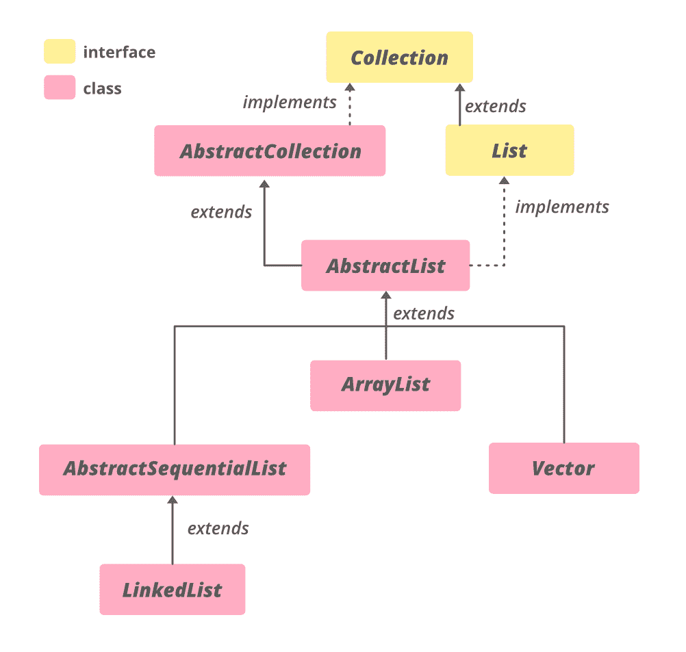

# Java 中的抽象顺序列表，带示例

> 原文:[https://www . geesforgeks . org/abstractsequentialist-in-Java-with-examples/](https://www.geeksforgeeks.org/abstractsequentiallist-in-java-with-examples/)

Java 中的**抽象顺序列表**类是 [Java 集合框架](https://www.geeksforgeeks.org/collections-in-java-2/)的一部分，实现了*集合接口*和*抽象集合类*。它用于实现一个不可修改的列表，对于这个列表，只需要扩展这个抽象列表类，并且只实现 get()和 size()方法。

这个类提供了一个列表接口的框架实现，以最小化实现这个接口所需的工作量，这个接口由一个“顺序访问”数据存储(如链表)支持。对于随机访问数据(如数组)，应该优先使用抽象列表。

**等级等级:**



**申报:**

```
public abstract class AbstractSequentialList<E>
    extends AbstractList<E>

Where E is the type of element maintained by this List.

```

实现**可迭代<E>T1、**集合<E>T3、[列表<E>T5】接口。](https://www.geeksforgeeks.org/list-interface-java-examples/) [LinkedList](https://www.geeksforgeeks.org/linked-list-in-java/) 是 AbstractSequentialList 的唯一直接子类。****

**构造函数:** *受保护的 AbstractSequentialList()**–**T5】默认构造函数，但受保护，不允许创建 AbstractSequentialList 对象。*

> 抽象顺序列表 <e>asl =新链接列表<e>()；</e></e>

**示例 1:**abstractsequentialist 是一个抽象类，所以应该为它分配一个子类的实例，比如 [LinkedList](https://www.geeksforgeeks.org/linked-list-in-java/) 。

## Java 语言(一种计算机语言，尤用于创建网站)

```
// Java code to illustrate AbstractSequentialList
import java.util.*;

public class GfG {

    public static void main(String[] args)
    {
        // Creating an instance of
        // the AbstractSequentialList
        AbstractSequentialList<Integer> absl
            = new LinkedList<>();

        // adding elements to absl
        absl.add(5);
        absl.add(6);
        absl.add(7);

        // Printing the list
        System.out.println(absl);
    }
}
```

**输出:**

```
[5, 6, 7]

```

**例 2:**

## Java 语言(一种计算机语言，尤用于创建网站)

```
// Java code to illustrate
// methods of AbstractSequentialList

import java.util.*;
import java.util.AbstractSequentialList;

public class AbstractSequentialListDemo {
    public static void main(String args[])
    {

        // Creating an empty AbstractSequentialList
        AbstractSequentialList<String>
            absqlist = new LinkedList<String>();

        // Using add() method to
          // add elements in the list
        absqlist.add("Geeks");
        absqlist.add("for");
        absqlist.add("Geeks");
        absqlist.add("10");
        absqlist.add("20");

        // Output the list
        System.out.println("AbstractSequentialList: "
                           + absqlist);

        // Remove the head using remove()
        absqlist.remove(3);

        // Print the final list
        System.out.println("Final List: "
                           + absqlist);

        // Fetching the specific 
          // element from the list
        // using get() method
        System.out.println("The element is: "
                           + absqlist.get(2));
    }
}
```

**输出:**

```
AbstractSequentialList: [Geeks, for, Geeks, 10, 20]
Final List: [Geeks, for, Geeks, 20]
The element is: Geeks

```

### 抽象序列列表的方法

<figure class="table">

| 

方法

 | 

描述

 |
| --- | --- |
| [添加(int 索引，E 元素)](https://www.geeksforgeeks.org/java-abstractsequentiallist-add/) | 在列表中的指定位置插入指定元素(可选操作)。 |
| [addAll (int index，Collection <？延伸 E > c)](https://www.geeksforgeeks.org/abstractsequentiallist-addall-method-in-java-with-examples/) | 将指定集合中的所有元素插入列表中的指定位置(可选操作)。 |
| get (int 索引) | 返回列表中指定位置的元素。 |
| [迭代器()](https://www.geeksforgeeks.org/java-abstractsequentiallist-iterator-method/) | 返回列表中元素的迭代器(按正确的顺序)。 |
| [列表迭代器(int index)](https://www.geeksforgeeks.org/java-abstractsequentiallist-listiterator/) | 返回列表中元素的列表迭代器(按正确的顺序)。 |
| [移除(int index)](https://www.geeksforgeeks.org/abstractsequentiallist-remove-method-in-java-with-examples/) | 移除列表中指定位置的元素(可选操作)。 |
| [集合(int 索引，E 元素)](https://www.geeksforgeeks.org/abstractsequentiallist-set-method-in-java-with-examples/) | 用指定的元素替换列表中指定位置的元素(可选操作)。 |

</figure>

### 方法继承自 java.util.AbstractList 类

<figure class="table">

| 

方法

 | 

描述

 |
| --- | --- |
| [加(E e)](https://www.geeksforgeeks.org/abstractlist-adde-ele-method-in-java-with-examples/) | 将指定的元素追加到该列表的末尾(可选操作)。 |
| [晴()](https://www.geeksforgeeks.org/abstractlist-clear-method-in-java-with-examples/#:~:text=The%20clear()%20method%20of,empty%20after%20this%20call%20returns.) | 从此列表中移除所有元素(可选操作)。 |
| [等于(对象 o)](https://www.geeksforgeeks.org/abstractlist-equals-method-in-java-with-examples/) | 将指定的对象与该列表进行比较，看是否相等。 |
| [hashCode()](https://www.geeksforgeeks.org/abstractlist-hashcode-method-in-java-with-examples/) | 返回此列表的哈希代码值。 |
| [索引（对象 o）](https://www.geeksforgeeks.org/abstractlist-indexof-method-in-java-with-examples/) | 返回此列表中指定元素的第一个匹配项的索引，如果此列表不包含该元素，则返回-1。 |
| [最后索引（对象 o）](https://www.geeksforgeeks.org/abstractlist-lastindexof-method-in-java-with-examples/) | 返回此列表中指定元素最后一次出现的索引，如果此列表不包含该元素，则返回-1。 |
| [列表迭代器()](https://www.geeksforgeeks.org/abstractlist-listiterator-method-in-java-with-examples/) | 返回列表中元素的列表迭代器(按正确的顺序)。 |
| removeRange (int fromIndex，int toIndex) | 从该列表中删除索引介于 fromIndex(包含)和 toIndex(不包含)之间的所有元素。 |
| [子列表（int fromIndex， int toIndex）](https://www.geeksforgeeks.org/abstractlist-sublist-method-in-java-with-examples/) | 返回此列表中指定的 fromIndex(包含)和 toIndex(不包含)之间的部分的视图。 |

</figure>

### 方法继承自 java.util.AbstractCollection 类

<figure class="table">

| 

方法

 | 

描述

 |
| --- | --- |
| [addAll(收藏<？延伸 E > c)](https://www.geeksforgeeks.org/abstractcollection-addall-method-in-java-with-examples/) | 将指定集合中的所有元素添加到此集合中(可选操作)。 |
| [包含(对象 o)](https://www.geeksforgeeks.org/abstractcollection-contains-method-in-java-with-examples/) | 如果此集合包含指定的元素，则返回 true。 |
| [包含所有(收藏<？> c)](https://www.geeksforgeeks.org/abstractcollection-containsall-method-in-java-with-examples/) | 如果此集合包含指定集合中的所有元素，则返回 true。 |
| [【isempty()](https://www.geeksforgeeks.org/abstractcollection-isempty-method-in-java-with-examples/) | 如果此集合不包含元素，则返回 true。 |
| [移除(物体 o)](https://www.geeksforgeeks.org/abstractcollection-remove-method-in-java-with-examples/#:~:text=The%20remove(Object%20O)%20method,particular%20element%20from%20a%20Collection.&text=Parameters%3A%20The%20parameter%20O%20is,be%20removed%20from%20the%20collection.) | 从该集合中移除指定元素的单个实例(如果存在)(可选操作)。 |
| [移除所有(集合<？> c)](https://www.geeksforgeeks.org/abstractcollection-removeall-method-in-java-with-example/) | 移除此集合中也包含在指定集合中的所有元素(可选操作)。 |
| [零售(收藏<？> c)](https://www.geeksforgeeks.org/abstractcollection-retainall-method-in-java-with-examples/) | 仅保留此集合中包含在指定集合中的元素(可选操作)。 |
| [toaarray()](https://www.geeksforgeeks.org/abstractcollection-toarray-method-in-java-with-examples/) | 返回包含此集合中所有元素的数组。 |
| [toaarray(t[]a)](https://www.geeksforgeeks.org/abstractcollection-toarray-method-in-java-with-examples/) | 返回包含此集合中所有元素的数组；返回数组的运行时类型是指定数组的运行时类型。 |
| [toString()](https://www.geeksforgeeks.org/abstractcollection-tostring-method-in-java-with-examples/) | 返回此集合的字符串表示形式。 |

</figure>

### 从接口继承的方法

<figure class="table">

| 

方法

 | 

描述

 |
| --- | --- |
| 并行流() | 以此集合为源返回一个可能并行的流。 |
| 移除 If(谓词 super E>过滤器) | 移除此集合中满足给定谓词的所有元素。 |
| 流() | 返回以此集合为源的顺序流。 |
| toArray (IntFunction <t>生成器)</t> | 使用提供的生成器函数分配返回的数组，返回包含此集合中所有元素的数组。 |

</figure>

### 从接口 java.lang.Iterable 继承的方法

<figure class="table">

| 

方法

 | 

描述

 |
| --- | --- |
| forEach(消费者 super T>行动) | 对 Iterable 的每个元素执行给定的操作，直到所有元素都被处理完或者该操作引发异常。 |

</figure>

### 从接口继承的方法

<figure class="table">

| 方法 | 描述 |
| --- | --- |
| [addAll(收藏<？延伸 E > c)](https://www.geeksforgeeks.org/list-addall-method-in-java-with-examples/) | 将指定集合中的所有元素按顺序追加到该列表的末尾由指定集合的迭代器返回(可选操作)。 |
| [包含(对象 o)](https://www.geeksforgeeks.org/list-contains-method-in-java-with-examples/) | 如果此列表包含指定的元素，则返回 true。 |
| [包含所有(收藏<？> c)](https://www.geeksforgeeks.org/list-containsall-method-in-java-with-examples/#:~:text=The%20containsAll()%20method%20of,set%20of%20elements%20or%20not.&text=Parameters%3A%20This%20method%20accepts%20a,of%20the%20type%20of%20collection.) | 如果此列表包含指定集合的所有元素，则返回 true。 |
| [【isempty()](https://www.geeksforgeeks.org/list-isempty-method-in-java-with-examples/) | 如果此列表不包含任何元素，则返回 true。 |
| 移除(对象 o) | 从列表中删除指定元素的第一个匹配项(如果存在)(可选操作)。 |
| [移除所有(集合<？> c)](https://www.geeksforgeeks.org/list-removeall-method-in-java-with-examples/) | 从此列表中移除指定集合中包含的所有元素(可选操作)。 |
| 替换所有(取消操作符<e>操作符)</e> | 将列表中的每个元素替换为对该元素应用运算符的结果。 |
| [零售(收藏<？> c)](https://www.geeksforgeeks.org/list-retainall-method-in-java-with-examples/) | 仅保留此列表中包含在指定集合中的元素(可选操作)。 |
| [尺寸()](https://www.geeksforgeeks.org/list-size-method-in-java-with-examples/) | 返回此列表中的元素数量。 |
| 排序(比较器 super E> c) | 根据指定比较器引发的顺序对该列表进行排序。 |
| 拆分器() | 在此列表中的元素上创建拆分器。 |
| toarray() | 返回一个数组，该数组按正确的顺序(从第一个元素到最后一个元素)包含列表中的所有元素。 |
| toaarray(t[]a) | 返回一个数组，该数组包含此列表中按正确顺序排列的所有元素(从第一个元素到最后一个元素)；返回数组的运行时类型是指定数组的运行时类型。 |

</figure>

**参考**:[https://docs . Oracle . com/en/Java/javase/11/docs/API/Java . base/Java/util/abstractsequentialilist . html](https://docs.oracle.com/en/java/javase/11/docs/api/java.base/java/util/AbstractSequentialList.html)