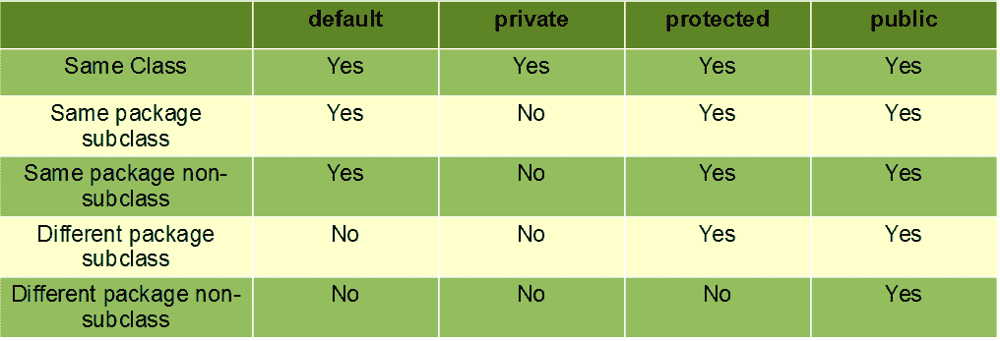

# Java 中的访问修饰符

> 原文:[https://www.geeksforgeeks.org/access-modifiers-java/](https://www.geeksforgeeks.org/access-modifiers-java/)

顾名思义，Java 中的访问修饰符有助于限制类、构造函数、变量、方法或数据成员的范围。java 中有四种类型的访问修饰符:

1.  默认-不需要关键字
2.  私人的
3.  保护
4.  公众



*   **默认**:当没有为类、方法或数据成员指定访问修饰符时——它被称为默认具有**默认**访问修饰符。
    *   未使用任何访问修饰符(即具有默认访问修饰符)声明的数据成员、类或方法只能在同一个包中访问**。**

在本例中，我们将创建两个包，包中的类将具有默认的访问修饰符，我们将尝试从第二个包的类中访问一个包中的类。

## Java 语言(一种计算机语言，尤用于创建网站)

```java
// Java program to illustrate default modifier 
package p1; 

// Class Geeks is having Default access modifier 
class Geek 
{ 
    void display() 
    { 
        System.out.println("Hello World!"); 
    } 
} 
```

## Java 语言(一种计算机语言，尤用于创建网站)

```java
// Java program to illustrate error while 
// using class from different package with 
// default modifier 
package p2; 
import p1.*; 

// This class is having default access modifier 
class GeekNew 
{ 
    public static void main(String args[]) 
    { 
        // Accessing class Geek from package p1 
        Geeks obj = new Geek(); 

        obj.display(); 
    } 
} 
```

**输出:**

```java
Compile time error
```

*   **Private** :使用关键字 **private** 指定私有访问修饰符。
    *   声明为私有的方法或数据成员只能在声明它们的类中**访问。**
    *   同一个 T2 包的任何其他等级都不能访问这些成员。
    *   顶级类或接口不能声明为私有，因为
        1.  private 表示“仅在封闭类中可见”。
        2.  protected 表示“仅在封闭类和任何子类中可见”

因此，这些修饰符在应用于类时，只适用于嵌套类，而不适用于顶级类

在这个例子中，我们将在同一个包 p1 中创建两个类 A 和 B。我们将把 A 类中的一个方法声明为私有的，并尝试从 B 类访问这个方法，看看结果。

## Java 语言(一种计算机语言，尤用于创建网站)

```java
// Java program to illustrate error while 
// using class from different package with 
// private modifier 
package p1; 

class A 
{ 
private void display() 
    { 
        System.out.println("GeeksforGeeks"); 
    } 
} 

class B 
{ 
public static void main(String args[]) 
    { 
        A obj = new A(); 
        // Trying to access private method
        // of another class 
        obj.display(); 
    } 
} 
```

**输出:**

```java
error: display() has private access in A
        obj.display();
```

*   **受保护**:使用关键字**受保护**指定受保护的访问修饰符。
    *   声明为受保护的方法或数据成员可以在同一个包或不同包的子类中访问**。**

在这个例子中，我们将创建两个包 p1 和 p2。p1 中的 A 类被公开，以便在 p2 中访问它。A 类中的方法显示是受保护的，B 类是从 A 类继承的，然后通过创建 B 类的对象来访问这个受保护的方法

## Java 语言(一种计算机语言，尤用于创建网站)

```java
// Java program to illustrate 
// protected modifier 
package p1; 

// Class A 
public class A 
{ 
protected void display() 
    { 
        System.out.println("GeeksforGeeks"); 
    } 
} 
```

## Java 语言(一种计算机语言，尤用于创建网站)

```java
// Java program to illustrate 
// protected modifier 
package p2; 
import p1.*; // importing all classes in package p1 

// Class B is subclass of A 
class B extends A 
{ 
public static void main(String args[]) 
{ 
    B obj = new B(); 
    obj.display(); 
} 

} 
```

**输出:**

```java
GeeksforGeeks
```

*   **公共**:公共访问修饰符使用关键字**公共**指定。
    *   在所有其他访问修饰符中，公共访问修饰符的范围最广。
    *   声明为公共的类、方法或数据成员可以从程序中的任何地方访问。对公共数据成员的范围没有限制。

## Java 语言(一种计算机语言，尤用于创建网站)

```java
// Java program to illustrate 
// public modifier 
package p1; 
public class A 
{ 
public void display() 
    { 
        System.out.println("GeeksforGeeks"); 
    } 
}
```

## Java 语言(一种计算机语言，尤用于创建网站)

```java
package p2;
import p1.*;
class B {
    public static void main(String args[])
    {
        A obj = new A;
        obj.display();
    }
}
```

**输出:**

```java
GeeksforGeeks
```

**要点:**

*   如果其他程序员使用您的类，请尝试使用对特定成员有意义的最严格的访问级别。除非你有充分的理由不这么做，否则请使用 private。
*   除常数外，避免使用公共字段。