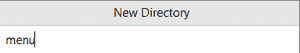
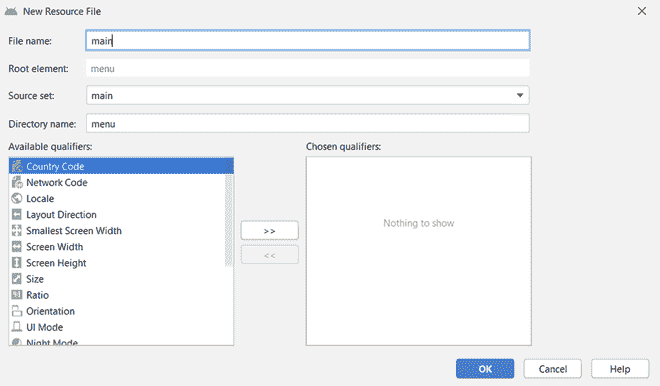
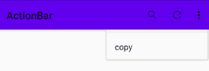

# 安卓中的动作栏，示例

> 原文:[https://www . geesforgeks . org/action bar-in-Android-with-example/](https://www.geeksforgeeks.org/actionbar-in-android-with-example/)

在[安卓](https://www.geeksforgeeks.org/kotlin-android-tutorial/)应用中，**动作栏**是出现在[活动](https://www.geeksforgeeks.org/activity-lifecycle-in-android-with-demo-app/)屏幕顶部的元素。这是移动应用程序的一个显著特征，它在其所有活动中都具有一致的存在。它为应用程序提供了一个视觉结构，并包含了一些用户经常使用的元素。安卓 ActionBar 由**谷歌于 2013 年**推出，发布了**安卓 3.0(API 11)** 。在此之前，这个最顶级的视觉元素的名字是 **AppBar** 。AppBar 只包含应用程序或当前活动的名称。这对用户来说不是很有用，开发人员也可以选择对其进行定制。

随着 ActionBar 的推出，谷歌宣布了一个**支持库**。该库是 **AppCompat** 的一部分，其目的是为旧版安卓提供向后兼容性，并支持选项卡式界面。所有使用安卓提供的默认主题的应用程序(主题。默认情况下，包含一个动作栏。但是，开发人员可以根据自己的需要以多种方式对其进行定制。动作栏中包含的组件有:

*   **应用图标:**显示应用的品牌标志/图标。
*   **查看控件:**显示应用程序或当前活动名称的部分。开发人员还可以包括微调器或选项卡式导航，用于在视图之间切换。
*   **动作按钮:**包含应用程序中一些重要的动作/元素，这些动作/元素可能是用户经常需要的。
*   **动作溢出:**包括其他将显示为菜单的动作。

### 设计自定义操作栏

以下示例演示了为应用程序的主活动创建自定义操作栏的步骤。视觉元素的所有重要方面，如图标、标题、字幕、动作按钮和溢出菜单都将被涵盖。

> **注意:**在 Android Studion 版本上执行以下步骤

**第一步:默认动作栏**

如前所述，默认情况下，每个安卓应用程序都包含一个 ActionBar。这个预先包含的动作栏显示由 **AncdroidManifest.xml** 文件管理的当前活动的标题。应用程序标题的字符串值由位于**应用程序节点**下的 **@string/app_name** 资源提供。

> …..
> 
> …..
> 
> Android:label = " @ string/app _ name "
> 
> …..

**输出:**


**第二步:新建动作栏的目录和设计项**

要对 ActionBar 的元素进行编码，请在应用程序项目文件的**资源文件夹**中创建新目录。右键单击 **res** 文件夹，选择**新建- >目录**。将新目录命名为**“菜单”**。



此外，通过右键单击菜单目录创建新的**菜单资源文件**。为主活动创建动作栏时，在菜单资源文件中键入名称**“主”**。这样，必须在菜单目录下创建一个名为**“main . XML”**的新文件。在该文件中，可以声明将显示为动作栏的**动作按钮**的项目。



对于每个菜单项，需要配置以下属性:

*   **android:title:** 其值包含用户在 app 中点击并按住菜单项时将显示的菜单项标题。
*   **android:id:** 菜单项的唯一 id，将用于访问整个应用程序文件中的任何位置。
*   **安卓:orderincatory:**该属性的值指定了项目在 ActionBar 中的位置。有两种方法可以定义不同菜单项的位置。第一种方法是为所有项目提供相同的属性值，并且位置将按照代码中声明的顺序进行定义。第二种方法是为所有项目提供一个不同的数值，然后项目将根据该属性的值的升序来定位自己。
*   **app:showasaaction:**该属性定义了项目将如何出现在动作栏中。有四种可能的标志可供选择:
    *   **a .始终:**始终在动作栏中显示项目。
    *   **b. ifRoom:** 如果有空间，保留物品。
    *   **c. never:** 有了这个标志，该项目不会在 ActionBar 中显示为图标，而是会出现在溢出菜单中。
    *   **d. withText:** 要将一个项目既表示为图标又表示为标题，可以在该标志后附加一个总是或 ifRoom 标志(总是|withText 或 ifRoom|withText)。
*   **安卓:图标:**一个项目的图标通过该属性在可绘制目录中被引用。

**动作栏项目的图标**

要为项目提供图标，右键单击 res 文件夹，选择新建，然后选择 [**【图像资源】**](https://www.geeksforgeeks.org/how-to-add-images-in-flutter-app/) 。将出现一个对话框，选择**图标类型**作为**动作栏和标签图标**。选择资产类型为**“剪贴画”**，并从剪贴画集合中选择一个图像。为图标提供所需的名称。单击下一步，然后单击完成。该图标现在将被加载到 res 文件夹的可绘制目录中。开发人员为这些图标提供的名称现在将用于引用该项目的图标资源。


下面是在操作栏中放置搜索图标、刷新图标和溢出菜单的代码。

## 可扩展标记语言

```
<?xml version="1.0" encoding="utf-8"?>
<menu xmlns:app="http://schemas.android.com/apk/res-auto"
    xmlns:android="http://schemas.android.com/apk/res/android">

    <!-- action button for search -->
    <item android:title="search"
        android:id="@+id/search"
        android:orderInCategory="100"
        app:showAsAction="ifRoom"
        android:icon="@drawable/search_icon"/>

    <!-- action button for refresh -->
    <item android:title="refresh"
        android:id="@+id/refresh"
        android:orderInCategory="100"
        app:showAsAction="ifRoom"
        android:icon="@drawable/refresh_icon"/>

    <!-- action button for copy -->
    <item android:title="copy"
        android:id="@+id/copy"
        android:orderInCategory="100"
        app:showAsAction="never"
        android:icon="@drawable/copy_icon"/>
</menu>
```

**输出:**



**步骤 3:使用活动文件**

动作栏的项目是为执行某些操作而设计的。项目的那些操作/动作是在活动文件中声明的，活动文件是为动作栏设计的。在本例中，目标活动是**主活动**文件。此外，自定义标题、副标题和应用程序徽标也在该文件中定义。下面是正确的代码，用于设计所有提到的项目，并在用户单击操作栏的项目时显示一条祝酒信息。

## Java 语言(一种计算机语言，尤用于创建网站)

```
import androidx.annotation.NonNull;
import androidx.appcompat.app.ActionBar;
import androidx.appcompat.app.AppCompatActivity;
import android.os.Bundle;
import android.view.Menu;
import android.view.MenuItem;
import android.widget.Toast;

public class MainActivity extends AppCompatActivity {

    @Override
    protected void onCreate( Bundle savedInstanceState ) {
        super.onCreate(savedInstanceState);
        setContentView(R.layout.activity_main);

        // calling this activity's function to
        // use ActionBar utility methods
        ActionBar actionBar = getSupportActionBar();

        // providing title for the ActionBar
        actionBar.setTitle("  GfG | Action Bar");

        // providing subtitle for the ActionBar
        actionBar.setSubtitle("   Design a custom Action Bar");

        // adding icon in the ActionBar
        actionBar.setIcon(R.drawable.app_logo);

        // methods to display the icon in the ActionBar
        actionBar.setDisplayUseLogoEnabled(true);
        actionBar.setDisplayShowHomeEnabled(true);

    }

    // method to inflate the options menu when
    // the user opens the menu for the first time
    @Override
    public boolean onCreateOptionsMenu( Menu menu ) {

        getMenuInflater().inflate(R.menu.main, menu);
        return super.onCreateOptionsMenu(menu);
    }

    // methods to control the operations that will
    // happen when user clicks on the action buttons
    @Override
    public boolean onOptionsItemSelected( @NonNull MenuItem item ) {

        switch (item.getItemId()){
            case R.id.search:
                Toast.makeText(this, "Search Clicked", Toast.LENGTH_SHORT).show();
                break;
            case R.id.refresh:
                Toast.makeText(this, "Refresh Clicked", Toast.LENGTH_SHORT).show();
                break;
            case R.id.copy:
                Toast.makeText(this, "Copy Clicked", Toast.LENGTH_SHORT).show();
                break;
        }
        return super.onOptionsItemSelected(item);
    }
}
```

## 我的锅

```
import android.os.Bundle
import android.view.Menu
import android.view.MenuItem
import android.widget.Toast
import androidx.appcompat.app.AppCompatActivity

class MainActivity : AppCompatActivity() {
    override fun onCreate(savedInstanceState: Bundle?) {
        super.onCreate(savedInstanceState)
        setContentView(R.layout.activity_main)

        // calling this activity's function to
        // use ActionBar utility methods
        val actionBar = supportActionBar

        // providing title for the ActionBar
        actionBar!!.title = "  GfG | Action Bar"

        // providing subtitle for the ActionBar
        actionBar.subtitle = "   Design a custom Action Bar"

        // adding icon in the ActionBar
        actionBar.setIcon(R.drawable.app_logo)

        // methods to display the icon in the ActionBar
        actionBar.setDisplayUseLogoEnabled(true)
        actionBar.setDisplayShowHomeEnabled(true)
    }

    // method to inflate the options menu when
    // the user opens the menu for the first time
    override fun onCreateOptionsMenu(menu: Menu): Boolean {
        menuInflater.inflate(R.menu.main, menu)
        return super.onCreateOptionsMenu(menu)
    }

    // methods to control the operations that will
    // happen when user clicks on the action buttons
    override fun onOptionsItemSelected(item: MenuItem): Boolean {
        when (item.itemId) {
            R.id.search -> Toast.makeText(this, "Search Clicked", Toast.LENGTH_SHORT).show()
            R.id.refresh -> Toast.makeText(this, "Refresh Clicked", Toast.LENGTH_SHORT).show()
            R.id.copy -> Toast.makeText(this, "Copy Clicked", Toast.LENGTH_SHORT).show()
        }
        return super.onOptionsItemSelected(item)
    }
}
```

**输出:**


**第四步:动作栏的颜色**

前往位于 **res 文件夹**的**值目录**中的 **style.xml 文件**。要更改动作栏的默认颜色，必须更改**颜色主**资源。下面是使动作栏颜色为“绿色”的代码。

## 可扩展标记语言

```
<resources>
<!-- Base application theme. -->
<style name="AppTheme" parent="Theme.AppCompat.Light.DarkActionBar">
    <!-- Customize your theme here. -->

    <!-- provided green color to the ActionBar -->
    <item name="colorPrimary">#0F9D58</item>
    <item name="colorPrimaryDark">@color/colorPrimaryDark</item>
    <item name="colorAccent">@color/colorAccent</item>
</style>

</resources>
```

**输出:**


**第五步:使用 activity_main.xml 文件**

该文件定义了活动的布局。在这个例子中，主要的焦点是动作栏，因此活动将只包含一个简单的[文本视图](https://www.geeksforgeeks.org/textview-in-kotlin/)。下面是代码。

## 可扩展标记语言

```
<?xml version="1.0" encoding="utf-8"?>
<androidx.constraintlayout.widget.ConstraintLayout 
    xmlns:android="http://schemas.android.com/apk/res/android"
    xmlns:app="http://schemas.android.com/apk/res-auto"
    xmlns:tools="http://schemas.android.com/tools"
    android:layout_width="match_parent"
    android:layout_height="match_parent"
    android:background="#168BC34A"
    tools:context=".MainActivity">

    <!-- Adding a TextView in the activity -->
    <TextView
        android:layout_width="wrap_content"
        android:layout_height="wrap_content"
        android:text="Hello Geek!!"
        android:textColor="#000000"
        android:textSize="24sp"
        android:textStyle="bold"
        app:layout_constraintBottom_toBottomOf="parent"
        app:layout_constraintLeft_toLeftOf="parent"
        app:layout_constraintRight_toRightOf="parent"
        app:layout_constraintTop_toTopOf="parent" />

  </androidx.constraintlayout.widget.ConstraintLayout>
```

**输出:**

<video class="wp-video-shortcode" id="video-547025-1" width="640" height="360" preload="metadata" controls=""><source type="video/mp4" src="https://media.geeksforgeeks.org/wp-content/uploads/20210122145704/ActionBar-Recording.mp4?_=1">[https://media.geeksforgeeks.org/wp-content/uploads/20210122145704/ActionBar-Recording.mp4](https://media.geeksforgeeks.org/wp-content/uploads/20210122145704/ActionBar-Recording.mp4)</video>

### **action bar 的优势**

*   提供自定义区域来设计应用程序的标识
*   通过显示当前活动的标题来指定用户在应用程序中的位置。
*   提供对重要和常用操作的访问
*   支持视图切换和导航的选项卡和下拉列表。

### **action bar 的缺点**

*   ActionaBar 的所有特性不是一次引入的，而是随着不同 API 级别(如 API 15、17 和 19)的发布而引入的。
*   当 ActionBar 在不同的 API 级别上运行时，它的行为会有所不同。
*   特定应用编程接口引入的功能不提供向后兼容性。

> **注:**为了解决所有与 ActionBar 相关的问题，谷歌在发布 **API 21** (安卓棒棒糖)的同时，推出了**工具栏**。