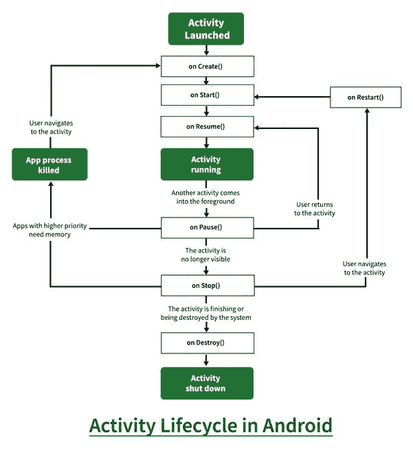

# 带演示应用的安卓活动生命周期

> 原文:[https://www . geesforgeks . org/activity-life cycle-in-Android-with-demo-app/](https://www.geeksforgeeks.org/activity-lifecycle-in-android-with-demo-app/)

在[安卓](https://www.geeksforgeeks.org/android-app-development-fundamentals-for-beginners/)中，**活动**被称为应用程序中的一个屏幕。它非常类似于任何桌面应用程序的单个窗口。安卓应用程序由一个或多个屏幕或活动组成。
每个活动都经历不同的阶段或生命周期，并由活动堆栈管理。所以当一个新的活动开始时，前一个活动总是在它下面。一项活动有四个阶段。

1.  如果一个活动在屏幕的前台，即在堆栈的顶部，那么它被称为是活动的或正在运行的。这通常是用户当前正在与之交互的活动。
2.  如果一个活动失去了焦点，而一个非全尺寸或透明的活动集中在你的活动之上。在这种情况下，或者另一个活动在多窗口模式中具有更高的位置，或者该活动本身在当前窗口模式中不可聚焦。这样的活动是完全活跃的。
3.  如果一个活动被另一个活动完全隐藏，它将被停止或隐藏。它仍然保留所有的信息，并且由于它的窗口是隐藏的，因此当其他地方需要内存时，它经常会被系统杀死。
4.  系统可以通过要求活动完成或简单地终止其进程来从内存中破坏活动。当它再次显示给用户时，必须完全重新启动并恢复到以前的状态。

对于每个阶段，安卓为我们提供了一套 7 种方法，它们对生命周期的每个阶段都有自己的意义。该图显示了应用程序从一种状态切换到另一种状态时的迁移路径。



每种方法的详细介绍如下:

### **1 .onCreate()**

它在活动首次创建时被调用。这是完成所有静态工作的地方，比如创建视图、将数据绑定到列表等。该方法还提供了一个包含其先前冻结状态的包(如果有的话)。

**示例:**

## Java 语言(一种计算机语言，尤用于创建网站)

```
import android.support.v7.app.AppCompatActivity;
import android.os.Bundle;
import android.widget.Toast;

public class MainActivity extends AppCompatActivity {

    @Override
    protected void onCreate(Bundle savedInstanceState)
    {
        super.onCreate(savedInstanceState);

        // Bundle containing previous frozen state
        setContentView(R.layout.activity_main);

        // The content view pointing to the id of layout
        // in the file activity_main.xml
        Toast toast = Toast.makeText(getApplicationContext(), "onCreate Called", Toast.LENGTH_LONG).show();
    }
}
```

## 我的锅

```
import android.os.Bundle
import android.widget.Toast
import androidx.appcompat.app.AppCompatActivity

class MainActivity : AppCompatActivity() {

    override fun onCreate(savedInstanceState: Bundle?) {
        super.onCreate(savedInstanceState)

        // Bundle containing previous frozen state
        setContentView(R.layout.activity_main)

        // The content view pointing to the id of layout
        // in the file activity_main.xml
        val toast = Toast.makeText(applicationContext, "onCreate Called", Toast.LENGTH_LONG).show()
        }
}
```

### **2.onStart（）**

当活动对用户可见时调用它。如果从后台调用活动，则后跟 onResume()。当活动第一次启动时，它也会在 onCreate()之后调用。

**例**:

## Java 语言(一种计算机语言，尤用于创建网站)

```
import android.support.v7.app.AppCompatActivity;
import android.os.Bundle;
import android.widget.Toast;

public class MainActivity extends AppCompatActivity {

    @Override
    protected void onCreate(Bundle savedInstanceState)
    {
        super.onCreate(savedInstanceState);

        // Bundle containing previous frozen state
        setContentView(R.layout.activity_main);

        // The content view pointing to the id of layout
        // in the file activity_main.xml
        Toast toast = Toast.makeText(getApplicationContext(), "onCreate Called", Toast.LENGTH_LONG).show();
    }

    protected void onStart()
    {
        // It will show a message on the screen
        // then onStart is invoked
        Toast toast = Toast.makeText(getApplicationContext(), "onStart Called", Toast.LENGTH_LONG).show();
    }
}
```

## 我的锅

```
import android.os.Bundle
import android.widget.Toast
import androidx.appcompat.app.AppCompatActivity

class MainActivity : AppCompatActivity() {

    override fun onCreate(savedInstanceState: Bundle?) {
        super.onCreate(savedInstanceState)
        setContentView(R.layout.activity_main)

        val toast = Toast.makeText(applicationContext, "onCreate Called", Toast.LENGTH_LONG).show()
        }

    override fun onStart() {
        super.onStart()
        // It will show a message on the screen
        // then onStart is invoked
        val toast  = Toast.makeText(applicationContext, "onStart Called", Toast.LENGTH_LONG).show()
    }
}
```

### **3.onRestart（）**

它在活动停止后和开始阶段前被调用，因此当任何活动从后台恢复到屏幕上时，onStart()总是跟在后面。

**例**:

## Java 语言(一种计算机语言，尤用于创建网站)

```
import android.support.v7.app.AppCompatActivity;
import android.os.Bundle;
import android.widget.Toast;

public class MainActivity extends AppCompatActivity {

    @Override
    protected void onCreate(Bundle savedInstanceState) {
        super.onCreate(savedInstanceState);

        // Bundle containing previous frozen state
        setContentView(R.layout.activity_main);

        // The content view pointing to the id of layout
        // in the file activity_main.xml
        Toast toast = Toast.makeText(getApplicationContext(), "onCreate Called", Toast.LENGTH_LONG).show();
    }

    protected void onRestart() {
        // It will show a message on the screen
        // then onRestart is invoked
        Toast toast = Toast.makeText(getApplicationContext(), "onRestart Called", Toast.LENGTH_LONG).show();
    }
}
```

## 我的锅

```
import android.os.Bundle
import android.widget.Toast
import androidx.appcompat.app.AppCompatActivity

class MainActivity : AppCompatActivity() {

    override fun onCreate(savedInstanceState: Bundle?) {
        super.onCreate(savedInstanceState)
        setContentView(R.layout.activity_main)

        val toast = Toast.makeText(applicationContext, "onCreate Called", Toast.LENGTH_LONG).show()
        }

    override fun onRestart() {
        super.onRestart()
        // It will show a message on the screen
        // then onRestart is invoked
        val toast = Toast.makeText(applicationContext, "onRestart Called", Toast.LENGTH_LONG).show()
    }
}
```

### **4 .onResume()**

它在活动开始与用户交互时被调用。此时，活动处于活动堆栈的顶部，用户与之交互。当活动进入后台或被用户关闭时，总是后跟 onPause()。

**例**:

## Java 语言(一种计算机语言，尤用于创建网站)

```
import android.support.v7.app.AppCompatActivity;
import android.os.Bundle;
import android.widget.Toast;

import com.example.share.R;

public class MainActivity extends AppCompatActivity {

    @Override
    protected void onCreate(Bundle savedInstanceState) {

        // Bundle containing previous frozen state
        super.onCreate(savedInstanceState);

        // The content view pointing to the id of layout
        // in the file activity_main.xml
        setContentView(R.layout.activity_main);

        Toast toast = Toast.makeText(getApplicationContext(), "onCreate Called", Toast.LENGTH_LONG).show();
    }

    protected void onResume() {
        // It will show a message on the screen
        // then onResume is invoked
        Toast toast = Toast.makeText(getApplicationContext(), "onResume Called", Toast.LENGTH_LONG).show();
    }
}
```

## 我的锅

```
import android.os.Bundle
import android.widget.Toast
import androidx.appcompat.app.AppCompatActivity

class MainActivity : AppCompatActivity() {

    override fun onCreate(savedInstanceState: Bundle?) {
        super.onCreate(savedInstanceState)
        setContentView(R.layout.activity_main)

        val toast = Toast.makeText(applicationContext, "onCreate Called", Toast.LENGTH_LONG).show()
        }

    override fun onResume() {
        super.onResume()
        // It will show a message on the screen
        // then onResume is invoked
        val toast = Toast.makeText(applicationContext, "onResume Called", Toast.LENGTH_LONG).show()
    }
}
```

### **5。onpe()**

当一个活动进入后台，但尚未被终止时，将调用它。它是 onResume()的对应项。当一个活动在另一个活动之前启动时，这个回调将在最上面的活动(当前在屏幕上)上被调用。活动活动下的活动在活动活动的 onPause()返回之前不会创建，因此建议不要在此部分进行繁重的处理。

**例**:

## Java 语言(一种计算机语言，尤用于创建网站)

```
import android.support.v7.app.AppCompatActivity;
import android.os.Bundle;
import android.widget.Toast;

public class MainActivity extends AppCompatActivity {

    @Override
    protected void onCreate(Bundle savedInstanceState) {

        // Bundle containing previous frozen state
        super.onCreate(savedInstanceState);

        // The content view pointing to the id of layout
        // in the file activity_main.xml
        setContentView(R.layout.activity_main);

        Toast toast = Toast.makeText(getApplicationContext(), "onCreate Called", Toast.LENGTH_LONG).show();
    }

    protected void onPause() {
        // It will show a message on the screen
        // then onPause is invoked
        Toast toast = Toast.makeText(getApplicationContext(), "onPause Called", Toast.LENGTH_LONG).show();
    }
}
```

## 我的锅

```
import android.os.Bundle
import android.widget.Toast
import androidx.appcompat.app.AppCompatActivity

class MainActivity : AppCompatActivity() {

    override fun onCreate(savedInstanceState: Bundle?) {
        super.onCreate(savedInstanceState)
        setContentView(R.layout.activity_main)

        val toast = Toast.makeText(applicationContext, "onCreate Called", Toast.LENGTH_LONG).show()
        }

    override fun onPause() {
        super.onPause()
        // It will show a message on the screen
        // then onPause is invoked
        val toast = Toast.makeText(applicationContext, "onPause Called", Toast.LENGTH_LONG).show()
    }
}
```

### **6。onStop()**

当活动对用户不可见时调用它。当活动从后台撤销时，后面跟着 **onRestart()** ，当活动关闭或完成时，后面跟着 onDestroy()，当活动仅保留在后台时，什么也没有。请注意，在内存不足的情况下，当调用 onPause()方法后，系统没有足够的内存来保持活动的进程运行时，可能永远不会调用此方法。

**例**:

## Java 语言(一种计算机语言，尤用于创建网站)

```
import android.support.v7.app.AppCompatActivity;
import android.os.Bundle;
import android.widget.Toast;

public class MainActivity extends AppCompatActivity {

    @Override
    protected void onCreate(Bundle savedInstanceState) {

        // Bundle containing previous frozen state
        super.onCreate(savedInstanceState);

        // The content view pointing to the id of layout
        // in the file activity_main.xml
        setContentView(R.layout.activity_main);

        Toast toast = Toast.makeText(getApplicationContext(), "onCreate Called", Toast.LENGTH_LONG).show();
    }

    protected void onStop() {
        // It will show a message on the screen
        // then onStop is invoked
        Toast toast = Toast.makeText(getApplicationContext(), "onStop Called", Toast.LENGTH_LONG).show();
    }
}
```

## 我的锅

```
import android.os.Bundle
import android.widget.Toast
import androidx.appcompat.app.AppCompatActivity

class MainActivity : AppCompatActivity() {

    override fun onCreate(savedInstanceState: Bundle?) {
        super.onCreate(savedInstanceState)
        setContentView(R.layout.activity_main)

        val toast = Toast.makeText(applicationContext, "onCreate Called", Toast.LENGTH_LONG).show()
        }

    override fun onStop() {
        super.onStop()
        // It will show a message on the screen
        // then onStop is invoked
        val toast = Toast.makeText(applicationContext, "onStop Called", Toast.LENGTH_LONG).show()
    }
}
```

### **7。where stroy()**

活动被破坏前收到的最后一个呼叫。这可能是因为活动正在结束(当调用 finish()时)，也可能是因为系统正在临时销毁活动的这个实例以节省空间。要区分这些场景，请使用 **isFinishing()** 方法进行检查。

**例**:

## Java 语言(一种计算机语言，尤用于创建网站)

```
import android.support.v7.app.AppCompatActivity;
import android.os.Bundle;
import android.widget.Toast;

public class MainActivity extends AppCompatActivity {

    @Override
    protected void onCreate(Bundle savedInstanceState) {

        // Bundle containing previous frozen state
        super.onCreate(savedInstanceState);

        // The content view pointing to the id of layout
        // in the file activity_main.xml
        setContentView(R.layout.activity_main);

        Toast toast = Toast.makeText(getApplicationContext(), "onCreate Called", Toast.LENGTH_LONG).show();
    }

    protected void onDestroy() {
        // It will show a message on the screen
        // then onDestroy is invoked
        Toast toast = Toast.makeText(getApplicationContext(), "onDestroy Called", Toast.LENGTH_LONG).show();
    }
}
```

## 我的锅

```
import android.os.Bundle
import android.widget.Toast
import androidx.appcompat.app.AppCompatActivity

class MainActivity : AppCompatActivity() {

    override fun onCreate(savedInstanceState: Bundle?) {
        super.onCreate(savedInstanceState)
        setContentView(R.layout.activity_main)

        val toast = Toast.makeText(applicationContext, "onCreate Called", Toast.LENGTH_LONG).show()
        }

    override fun onDestroy() {
        super.onDestroy()
        // It will show a message on the screen
        // then onDestroy is invoked
        val toast = Toast.makeText(applicationContext, "onDestroy Called", Toast.LENGTH_LONG).show()
    }
}
```

### **演示安卓应用，展示安卓中的活动生命周期**

## Java 语言(一种计算机语言，尤用于创建网站)

```
import android.support.v7.app.AppCompatActivity;
import android.os.Bundle;
import android.widget.Toast;

public class MainActivity extends AppCompatActivity {

    @Override
    protected void onCreate(Bundle savedInstanceState) {
        super.onCreate(savedInstanceState);
        setContentView(R.layout.activity_main);
        Toast toast = Toast.makeText(getApplicationContext(), "onCreate Called", Toast.LENGTH_LONG).show();
    }

    protected void onStart() {
        super.onStart();
        Toast toast = Toast.makeText(getApplicationContext(), "onStart Called", Toast.LENGTH_LONG).show();
    }

    @Override
    protected void onRestart() {
        super.onRestart();
        Toast toast = Toast.makeText(getApplicationContext(), "onRestart Called", Toast.LENGTH_LONG).show();
    }

    protected void onPause() {
        super.onPause();
        Toast toast = Toast.makeText(getApplicationContext(), "onPause Called", Toast.LENGTH_LONG).show();
    }

    protected void onResume() {
        super.onResume();
        Toast toast = Toast.makeText(getApplicationContext(), "onResume Called", Toast.LENGTH_LONG).show();
    }

    protected void onStop() {
        super.onStop();
        Toast toast = Toast.makeText(getApplicationContext(), "onStop Called", Toast.LENGTH_LONG).show();
    }

    protected void onDestroy() {
        super.onDestroy();
        Toast toast = Toast.makeText(getApplicationContext(), "onDestroy Called", Toast.LENGTH_LONG).show();
    }
}
```

## 我的锅

```
import android.os.Bundle
import android.widget.Toast
import androidx.appcompat.app.AppCompatActivity

class MainActivity : AppCompatActivity() {

    override fun onCreate(savedInstanceState: Bundle?) {
        super.onCreate(savedInstanceState)
        setContentView(R.layout.activity_main)

        val toast = Toast.makeText(applicationContext, "onCreate Called", Toast.LENGTH_LONG).show()
        }

    override fun onStart() {
        super.onStart()
        val toast = Toast.makeText(applicationContext, "onStart Called", Toast.LENGTH_LONG).show()
    }

    override fun onRestart() {
        super.onRestart()
        val toast = Toast.makeText(applicationContext, "onRestart Called", Toast.LENGTH_LONG).show()
    }

    override fun onPause() {
        super.onPause()
        val toast = Toast.makeText(applicationContext, "onPause Called", Toast.LENGTH_LONG).show()
    }

    override fun onResume() {
        super.onResume()
        val toast = Toast.makeText(applicationContext, "onResume Called", Toast.LENGTH_LONG).show()
    }

    override fun onStop() {
        super.onStop()
        val toast = Toast.makeText(applicationContext, "onStop Called", Toast.LENGTH_LONG).show()
    }

    override fun onDestroy() {
        super.onDestroy()
        val toast = Toast.makeText(applicationContext, "onDestroy Called", Toast.LENGTH_LONG).show()
    }
}
```

**输出:**

<video class="wp-video-shortcode" id="video-361966-1" width="640" height="360" preload="metadata" controls=""><source type="video/mp4" src="https://media.geeksforgeeks.org/wp-content/uploads/20191125171002/Activity-Lifecycle-in-Android-Demo-App.mp4?_=1">[https://media.geeksforgeeks.org/wp-content/uploads/20191125171002/Activity-Lifecycle-in-Android-Demo-App.mp4](https://media.geeksforgeeks.org/wp-content/uploads/20191125171002/Activity-Lifecycle-in-Android-Demo-App.mp4)</video>