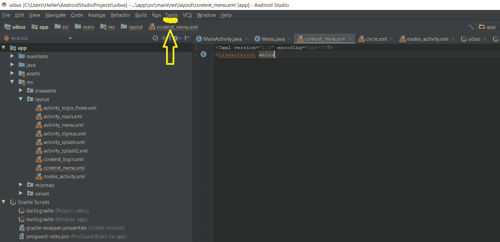
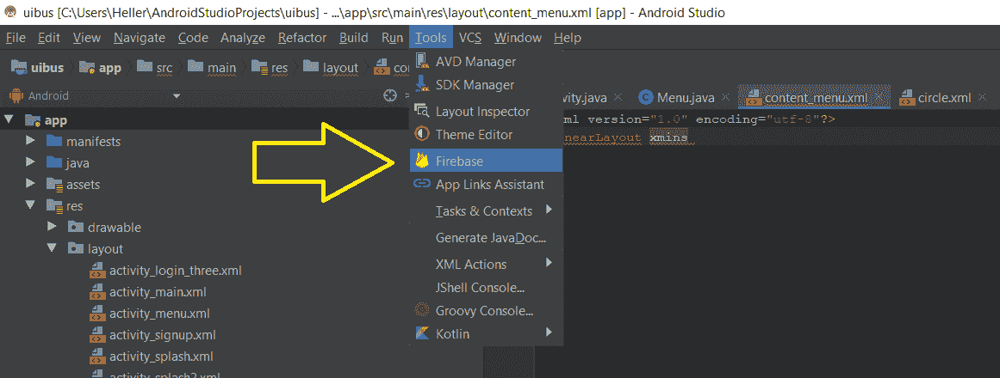
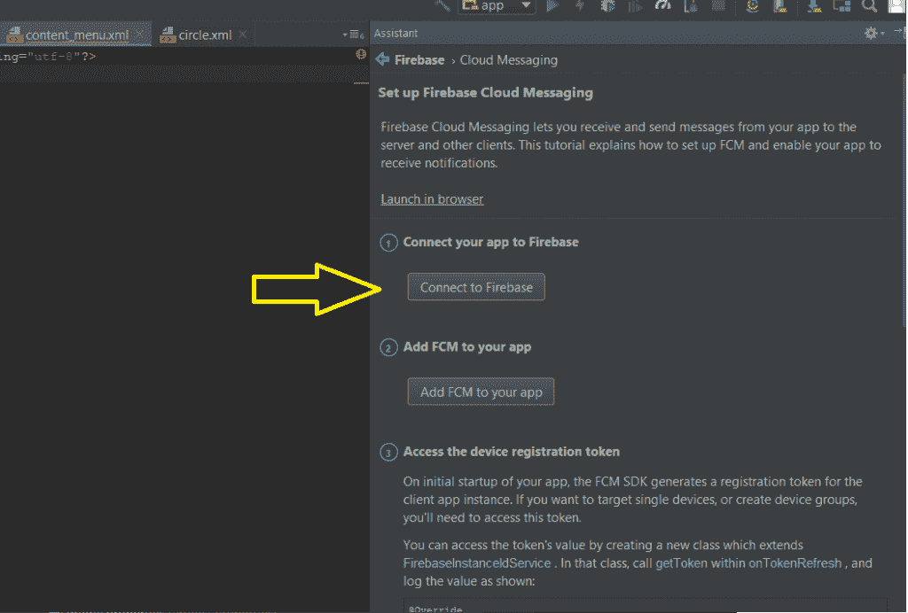
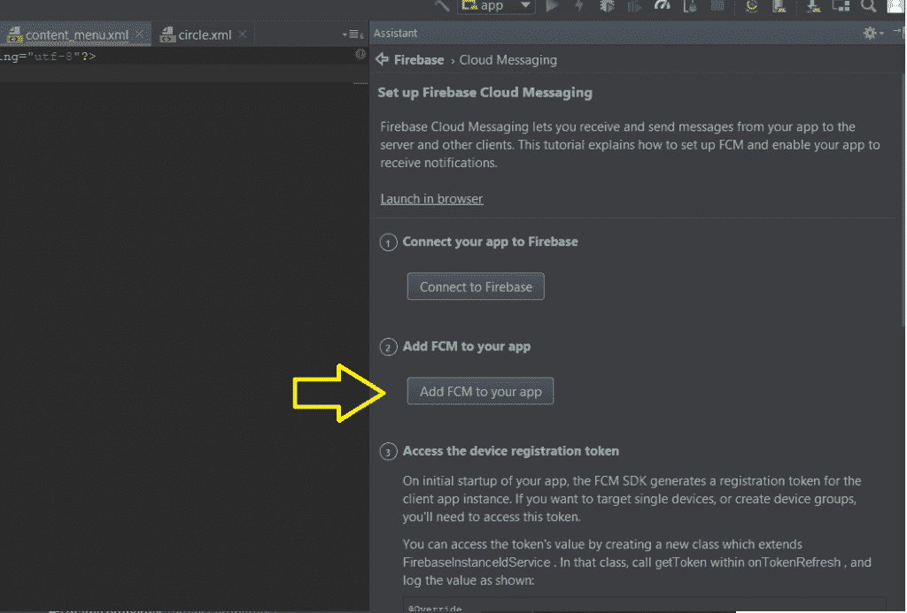
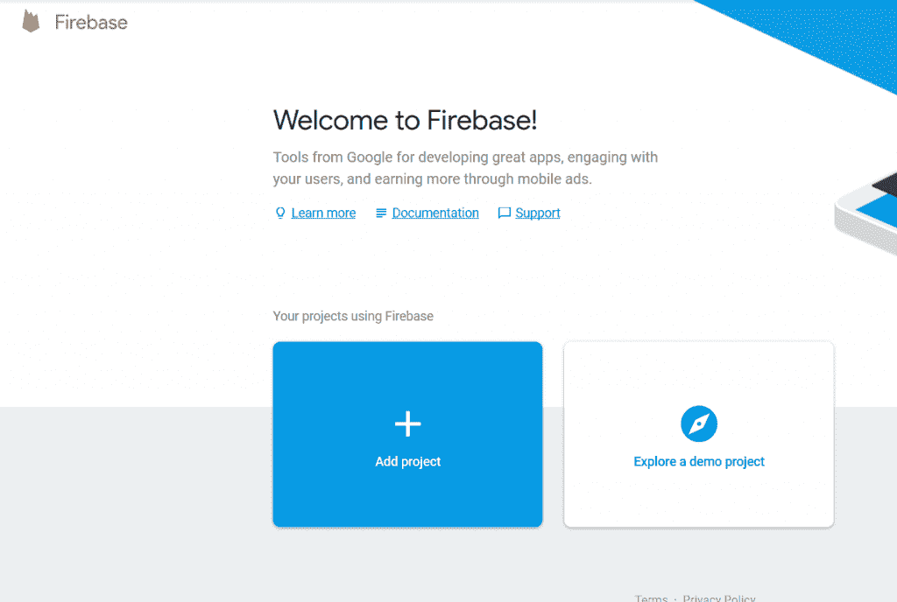
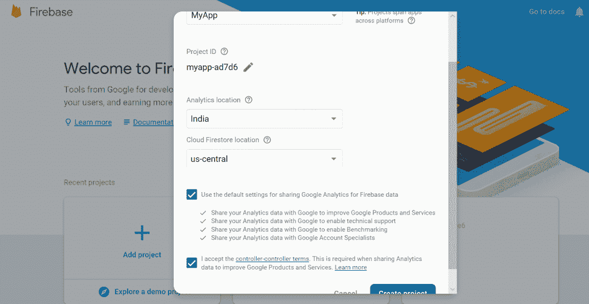
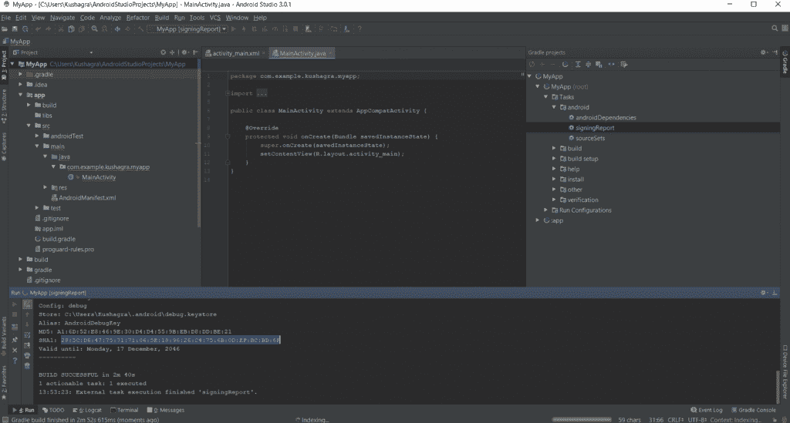
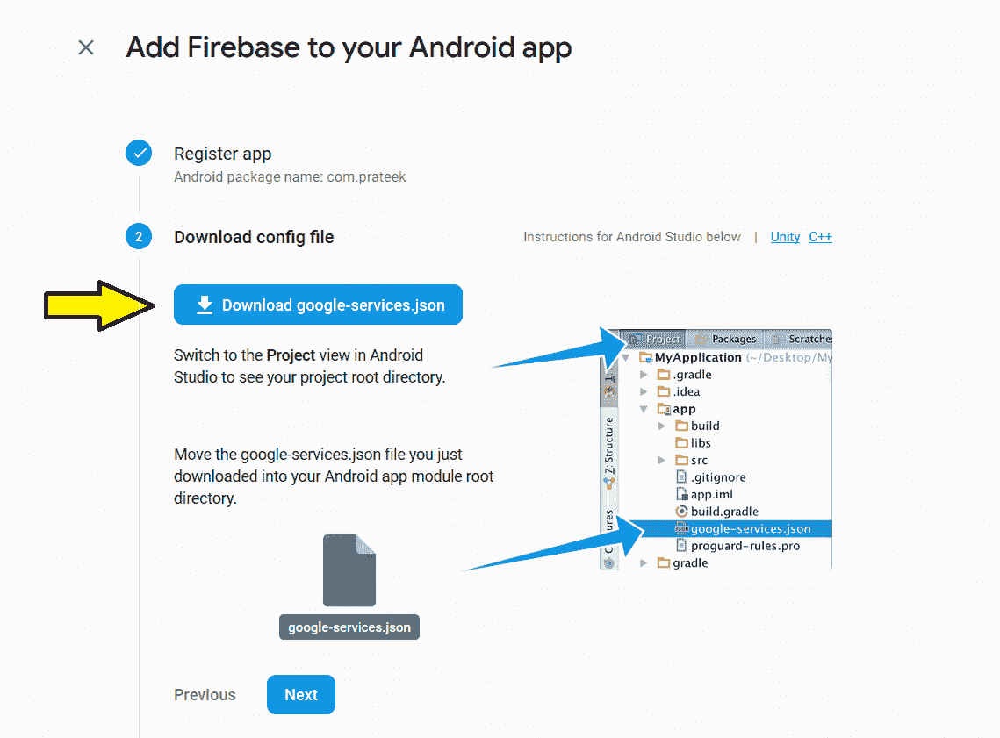

# 给安卓应用添加 Firebase

> 原文:[https://www . geesforgeks . org/add-firebase-to-Android-app/](https://www.geeksforgeeks.org/adding-firebase-to-android-app/)

在线提供各种服务，如存储、在线处理、实时数据库、用户授权等。谷歌开发了一个名为“T2”的平台，提供所有这些在线服务。它还提供了这些服务的日常使用分析以及用户使用它的详细信息。

简单来说，可以说 Firebase 是一个移动和 web 应用开发平台。它提供 web 应用程序或移动应用程序可能需要的服务。任何人都可以轻松地将 firebase 包含到应用程序中，这将使他们的在线工作比过去更容易。

有两种方法可以将 firebase 添加到任何安卓应用程序中:

### **使用 Firebase 助手**

以下是在安卓工作室中加入 Firebase 到安卓项目的步骤:

1.  **更新**安卓工作室(> = 2.2)
2.  Create a **new project** in the firebase by clicking on the Add project.

    

3.  Now open the android studio and click on **Tools** in the upper left corner.

    

4.  Now click on the **Firebase** option in the drop down menu.

    

5.  屏幕右侧将出现一个菜单。它将显示 Firebase 提供的各种**服务**。选择所需的服务。
6.  Now Click on the **Connect to Firebase** option in the menu of desired service.

    

7.  Add the dependencies of your service by clicking on the **Add [YOUR SERVICE NAME] to the app option**. (In the image below, the Firebase cloud messaging service is chosen)

    

### 手动添加 firebase

在这方面，步骤包括:

1.  创建一个 firebase 项目
    *   Create a project by clicking on **create project** in the firebase console.

        

    *   Fill the necessary details in the pop up window about the project. Edit the project ID if required.

        

    *   点击创建项目，最终创建它。
2.  现在将这个项目添加到 android 应用程序中
    *   Click on the **Add firebase to your android app** option on the starting window.

        

    *   将会出现一个提示，提示您在哪里输入应用程序的软件包名称。
    *   现在该应用程序已连接到 Firebase。现在，所有基于云以及基于服务器的服务都可以在应用程序中轻松使用。
    *   现在该应用程序将在 firebase 注册。
3.  Also, the SHA1 certificate, can be given, of the app by following steps:

    ```java
    Go to android studio project
     ↳ gradle
       ↳ root folder
         ↳ Tasks
           ↳ Android
             ↳ signingReport
               ↳ copy paste SHA1 from console
    ```

    

4.  Now download the **google-services.json** file and place it in the root directory of the android app.

    

5.  Now add the following in the project.
    *   在项目中添加 sdk。
        将以下代码添加到应用程序的项目级 *build.gradle* 中。

        ```java
        buildscript {
          dependencies {
            classpath 'com.google.gms:google-services:4.0.0'
          }
        }
        ```

    *   将以下代码添加到应用程序的 APP-LEVEL *build.gradle* 中。

        ```java
        dependencies {
          compile 'com.google.firebase:firebase-core:16.0.0'
        }
        ...
        // Add to the bottom of the file
        apply plugin: 'com.google.gms.google-services'
        ```

    

6.  现在**通过点击现在同步来同步**梯度。
7.  添加上述代码(sdk)后，运行应用程序将验证发送到 Firebase 控制台。

**Firebase 现已成功安装。**