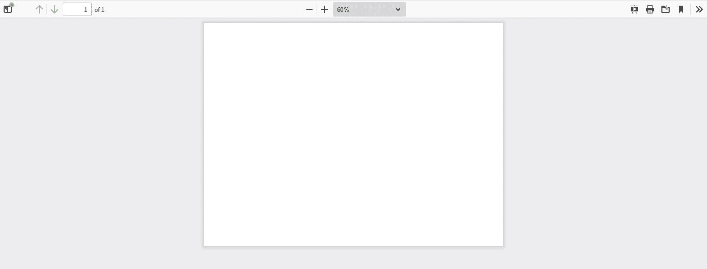

# 使用 Java 在现有 PDF 文件中添加图像

> 原文:[https://www . geesforgeks . org/add-image-in-existing-pdf-file-use-Java/](https://www.geeksforgeeks.org/adding-image-in-existing-pdf-file-using-java/)

现在，PDF 经常被用来生成报告，为了使 java 程序与任何类型的文件进行交互，excel openCV Apache 框架应运而生。构建此代码所需的外部文件。第一个要求是导入以下库文件

1.  Pdfbox-xxx.jar
2.  org . Apache . commons . logging-XXX . jar

**算法:**

1.  链接 PDF 文档和 java 程序
    *   创建 PDDocument 对象
    *   创建 PDPage
    *   向文档对象添加页面
    *   为图像创建文件输入流对象。
2.  通过将 PDDocument 对象和 FIleInputStream 作为其构造函数来创建 PDJpeg 对象
3.  调用 [*drawXObject()*](https://www.geeksforgeeks.org/adding-images-to-a-table-in-pdf-using-java/) 对象，并指定具有宽度和高度的坐标，将图像绘制到 PDF 文件上。
4.  关闭流，保存文档对象，并关闭文档。

**实现:**考虑输入图像样本来说明程序的工作，其中为了说明之前的工作 PDF 文档，如下所示:



使用 java 程序在上述 PDF 文档中插入文本的处理

## Java 语言(一种计算机语言，尤用于创建网站)

```
// Adding Image in Existing PDF using Java

// Importing openCV libraries
import java.io.File;
import org.apache.pdfbox.pdmodel.PDDocument;
import org.apache.pdfbox.pdmodel.PDPage;
import org.apache.pdfbox.pdmodel.graphics.image PDImageXObject;
import org.apache.pdfbox.pdmodel.PDPageContentStream;
import java.io.IOException;

class GFG {

    // Main driver method
    public static void main(String[] args)
        throws IOException
    {

        // Loading an already existing pdf document
        File file = new File("D:\\javong\\pdf1.pdf");
        PDDocument doc = new PDDocument.load(file);

        // Retrieve the page
        PDPage page = doc.getPage(0);

        // Creating Object of PDImageXObject for selecting
        // Image and provide the path of file in argument
        PDImageXObject pdfimg
            = PDImageXImage.createFromFile(
                "D:\\Images\\chloro.jpg", doc);

        // Creating the PDPageContentStream Object
        // for Inserting Image
        PDPageContentStream image
            = new PDPageContentStream(doc, page);

        // set the Image inside the Page
        image.drawImage(pdfImage, 55, 370);
        System.out.println("Image Inserted");

        // Closing the page of PDF by closing
        // PDPageContentStream Object
        // && Saving the Document
        image.close();
        doc.save("D:\\javong\\pdf1.pdf");

        // Closing the Document
        doc.close();
    }
}
```

**输出:**在同一输入图像中插入的文本。

