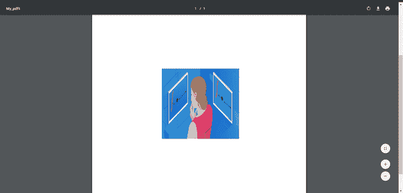

# 使用 Java 将图像添加到 PDF 表格中

> 原文:[https://www . geesforgeks . org/add-images-to-a-table-in-pdf-using-Java/](https://www.geeksforgeeks.org/adding-images-to-a-table-in-pdf-using-java/)

**PDFBox** 是一个用 Java 编写的开源库。它有助于 PDF 文档的开发和转换。PDFBox 库以 [JAR 文件](https://www.geeksforgeeks.org/jar-files-java/)的形式出现。它可以创建新的 PDF 文档，操作现有文档，为 PDF 添加书签，还可以从 PDF 文档中提取内容。我们可以使用这个库进行数字签名，根据 **PDF/A-1b 标准**打印和验证文件。它附带了一系列命令行实用程序来对 PDF 文档执行各种操作。一些实用程序正在加密和解密 PDF，调试，合并，叠加，将文本转换为 PDF 和将 PDF 转换为图像。PDFBox 的一些组件是 PDFBox、FontBox、XmpBox、预检。 **PDFBox** 是 PDFBox 库的主要部分。因为它包含用于内容提取和文件操作/修改的类和接口。**字体盒**保存处理字体信息的类和接口。 **XmpBox** 包含处理 **XMP** 元数据的类和接口。**预检**用于验证 PDF/A-1B 标准的 PDF 文件。

**iText** 是一个用 Java 和**创建和操作 PDF 文件的开源 Java 库。NET** 。最初，源代码是根据 Mozilla 公共许可证或 GNU 库通用公共许可证开源许可证作为开源分发的。iText 提供对大多数高级 PDF 功能的支持，如基于 PKI 的签名、40 位和 128 位加密、颜色校正、Tagged PDF、PDF 表单(AcroForms)、PDF/X、通过 ICC 配置文件和条形码进行颜色管理，并被多个产品和服务使用，包括 Eclipse BIRT、Jasper Reports、JBoss Seam、Windward Reports 和 pdftk。iText 为用户提供了生成交互式 PDF 文档的类。通过这些，我们可以创造地图和书籍。我们可以添加书签、页码和水印。我们可以将一个现有的 PDF 分割成多个 PDF，还可以向其中添加/连接其他页面。我们可以在 PDF 文档中填写交互式表单。我们可以将 pdf 保存为图像文件，如 PNG 或 JPEG (JPG)。iText 库为我们提供了一个 Canvas 类，使用它我们可以在 PDF 文档上绘制各种几何形状，如矩形、圆形、直线等。使用 iText，你可以从你的 Java 程序中创建一个新的 PDF 文件。我们也可以包括图像和字体。

**环境设置**

*   使用 Java[maven](https://www.geeksforgeeks.org/introduction-apache-maven-build-automation-tool-java-projects/)制作一个项目。
*   转到[pdfbox.apache.org](https://pdfbox.apache.org/2.0/dependencies.html)并将依赖项添加到您的项目中。这样，库就被导入到您的项目中。
*   现在，在源代码包中的 **com.mycompany. <下创建一个 java 类。**
*   很好，现在你可以用图书馆了。

### 理解概念

**创建文档**

首先，我们创建一个属于 org.apache.pdfbox.pdmodel 包的 **PDDocument** 类的实例。通过获取一个 PDDocument 类的实例，我们能够创建一个空的 PDF 文档。

```
PDDocument doc = new PDDocument();   

```

**创建空白页**

PDPage 类用于在 PDF 文档中创建空白页。下面的代码在我们的 PDF 文档中创建了一个页面。

```
PDPage blankPage = new PDPage();  

```

**添加页面**

**addPage()** 方法用于在 PDF 文档中添加页面。下面的代码在我们的 PDF 文档中添加了一页。

```
doc.addPage( blankPage );  

```

**保存文件**

当我们创建文档时，我们必须将文档保存到我们想要的位置。所以，我们使用 **save()** 方法保存文档。save()方法接受一个字符串值，并将文档路径作为参数传递。

```
doc.save("Path of Document");  

```

**关闭文档**

完成任务后，我们需要使用 close()方法关闭 PDDocument 类对象

```
doc.close();  

```

**示例:**

## Java 语言(一种计算机语言，尤用于创建网站)

```
// Importing the required library functions

import java.io.FileInputStream;
import java.io.FileNotFoundException;
import java.io.IOException;
import org.apache.pdfbox.exceptions.COSVisitorException;
import org.apache.pdfbox.pdmodel.PDDocument;
import org.apache.pdfbox.pdmodel.PDPage;
import org.apache.pdfbox.pdmodel.edit.PDPageContentStream;
import org.apache.pdfbox.pdmodel.graphics.*;
import org.apache.pdfbox.pdmodel.graphics.xobject.PDJpeg;

public class image_insert {
    public static void main(String[] args)
        throws FileNotFoundException, IOException,
               COSVisitorException
    {
        // Create a pdfdocument object
        PDDocument doc = new PDDocument();

        // Create a PDPage  object
        PDPage page = new PDPage();

        // Add page to document object
        doc.addPage(page);

        // Create FileInputStream object for your image
        FileInputStream in
            = new FileInputStream("D:/Downloads/abc1.jpg");
        PDJpeg img = new PDJpeg(doc, in);
        PDPageContentStream stream
            = new PDPageContentStream(doc, page);

        // Invoke drawXObject() object to draw image onto
        // pdf file.
        stream.drawXObject(img, 200, 220, 220, 200);
        // First two integers are x and y
        // coordinates(position of image) Second two
        // integers are width and height of the image

        stream.close();
        doc.save("D:/My_pdf1");
        doc.close();
    }
}
```

**输出:**

> CD D:\ netbeans projects \ ImagePdf；" JAVA _ HOME = C:\ \ Program Files \ \ JAVA \ \ JDK-14 . 0 . 2 " cmd/C " \ " C:\ \ Program Files \ \ NetBeans-12.0 \ \ NetBeans \ \ JAVA \ \ maven \ \ bin \ \ mvn . cmd \ "-dexec . args = \ "-class path % com . my company . image pdf . image _ insert \ "-dexec . executable = \ " C:\ \ Program Files \ \ JAVA \ \ JDK-14 . 0 . 2 \ \ bin \ \ JAVA . exe \ "-dexec . class path scope = 1
> 
> 执行保存时运行网络 bean 编译。阶段执行被跳过，依赖项目的输出目录(打开保存时编译)将被使用，而不是它们的 jar 工件。
> 
> 正在扫描项目…
> 
> ——————< com.mycompany:ImagePdf >——————————
> 
> 构建图像 pdf 1.0-快照
> 
> ————————[罐子]————————————————————
> 
> — exec-maven-plugin:1.5.0:exec(默认-cli) @ ImagePdf —
> 
> ————————————————————————
> 
> 构建成功
> 
> ————————————————————————
> 
> 总时间:1.372 秒
> 
> 完成时间:2020-10-31T23:31:58+05:30
> 
> ————————————————————————

如果您获得类似的输出，这意味着代码已经成功执行。



**注意:**在上述代码的帮助下，您只能将 jpg 图像插入 PDF。

### **使用 PDFBox 添加图像**

**1。**用 java [maven](https://www.google.com/url?client=internal-element-cse&cx=009682134359037907028:tj6eafkv_be&q=https://www.geeksforgeeks.org/introduction-apache-maven-build-automation-tool-java-projects/&sa=U&ved=2ahUKEwj5hPPUjfXsAhWuzjgGHen_ArQQFjAAegQIAxAC&usg=AOvVaw1n36-S-V3ibftMgdFu5J4a) 做一个项目。

**2** 。编辑【项目文件】下的 **pom.xml** 文件。您应该添加如下所示的粗体部分。

```
<?xml version="1.0" encoding="UTF-8"?>
<project xmlns="http://maven.apache.org/POM/4.0.0" xmlns:xsi="http://www.w3.org/2001/XMLSchema-instance" xsi:schemaLocation="http://maven.apache.org/POM/4.0.0 http://maven.apache.org/xsd/maven-4.0.0.xsd">
    <modelVersion>4.0.0</modelVersion>
    <groupId>com.mycompany</groupId>
    <artifactId>Itextt</artifactId>
    <version>1.0-SNAPSHOT</version>
    <packaging>jar</packaging>
    <properties>
        <project.build.sourceEncoding>UTF-8</project.build.sourceEncoding>
        <maven.compiler.source>14</maven.compiler.source>
        <maven.compiler.target>14</maven.compiler.target>
    </properties>
<dependencies> 
 <dependency> 
 <groupId>com.itextpdf</groupId> 
 <artifactId>itext7-core</artifactId> 
 <version>7.1.10</version> 
 <type>pom</type> 
 </dependency> 
</dependencies> 
</project>

```

**3。**现在只要运行它，你可以观察到所有的 jar 文件都会自动安装。

### 理解概念

**创建 PdfWriter 对象**

类代表属于 com.itextpdf.kernel.pdf 包的一个 PDF 的文档作者。构造函数将一个字符串作为输入，该字符串表示要创建 PDF 的文件的路径。然后通过将一个字符串值(表示我们需要创建一个 PDF 的路径)传递给它的构造函数来初始化 PdfWriter 类，如下所示。

```
String destination = "D:/Downloads/My_pdf.pdf";  
PdfWriter writer = new PdfWriter(destination);

```

当这种类型的对象被传递给一个 PdfDocument 类时，添加到该文档中的每个元素都将被写入指定的文件。

**创建 PdF 文档对象**

PdfDocument 类是在 iText 中表示 PDF 文档的类。这个班属于 com.itextpdf.kernel.pdf 包。为了初始化这个类(在编写模式下)，我们需要将类 PdfWriter 的一个对象传递给它的构造函数。

通过将上面创建的 PdfWriter 对象传递给它的构造函数来初始化 PdfDocument 类，如下所示。

```
PdfDocument pdfdocument= new PdfDocument(writer);  

```

当创建一个 PdfDocument 对象时，可以使用其类提供的相应方法添加各种元素，如页面、文件附件、字体和事件处理程序。

**创建文档对象**

创建一个自给自足的 PDF 时，根元素是包 com.itextpdf.layout 的 Document 类。该类的一个构造函数接受一个类 PdfDocument 的对象。通过传递在前面步骤中创建的类 PdfDocument 的对象来初始化 Document 类，如下所示。

```
Document document = new Document(pdfdocument);  

```

**创建图像对象**

为了创建图像对象，首先，我们使用 ImageDataFactory 类的 create()方法创建一个 ImageData 对象。然后，我们传递一个表示图像路径的字符串参数作为这个方法的参数。

```
String imgFile = "D:/img.jpg";  
ImageData data = ImageDataFactory.create(imgFile);

```

现在，初始化 com.itextpdf.layout.element 包的 Image 类。实例化时，我们将上面创建的 ImageData 对象作为参数传递给它的构造函数，如图所示

```
Image img = new Image(data);  

```

**向文档添加图像**

我们可以使用 Document 类的 add()方法添加上一步创建的图像对象。

```
document.add(img);

```

**关闭文件**

我们需要使用 document 类的 close()方法关闭文档

```
document.close(); 

```

**示例:**

## Java 语言(一种计算机语言，尤用于创建网站)

```
// Adding image to pdf

import com.itextpdf.io.image.ImageData;
import com.itextpdf.io.image.ImageDataFactory;
import com.itextpdf.kernel.pdf.PdfDocument;
import com.itextpdf.kernel.pdf.PdfWriter;
import com.itextpdf.layout.Document;
import com.itextpdf.layout.element.Image;

public class Itext_final {
    public static void main(String args[]) throws Exception
    {

        // Creating a PdfWriter
        PdfWriter writer = new PdfWriter("D:/mypdf1.pdf");

        // Creating a PdfDocument
        PdfDocument pdf = new PdfDocument(writer);

        // Creating a Document
        Document document = new Document(pdf);

        // Creating an ImageData object
        ImageData data = ImageDataFactory.create(
            "D:/Downloads/Image.png");

        // Creating an Image object
        Image image = new Image(data);

        // Adding image to the document
        document.add(image);

        // Closing the document
        document.close();

        System.out.println("Image added successfully!!");
    }
}
```

**输出**

```
Image added successfully!!

```


***注意:*** 在这个方法中，我们可以添加 PNG 格式的图像，也可以添加 jpg 格式，这比 PDFBox 库有优势。