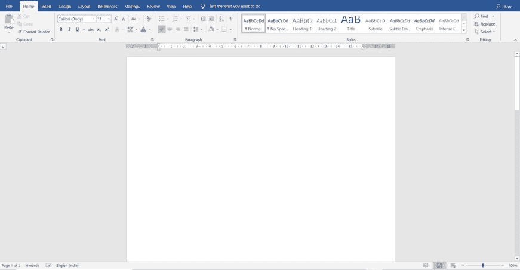
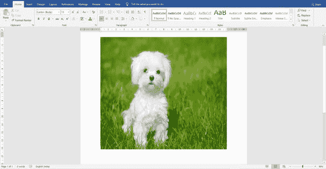

# 使用 Java 向 Word 文档添加图像

> 原文:[https://www . geesforgeks . org/add-images-to-a-word-document-use-Java/](https://www.geeksforgeeks.org/adding-images-to-a-word-document-using-java/)

Java 使得使用 [Apache POI](https://www.geeksforgeeks.org/apache-poi-introduction/) 包提供的 [XWPFRun](https://poi.apache.org/apidocs/dev/org/apache/poi/xwpf/usermodel/XWPFRun.html) 类的 **addPicture()** 方法向 Word 文档添加图像成为可能。Apache POI 是由 Apache 软件基金会开发和维护的一个流行的 API。它提供了几个类和方法来使用 Java 对 Microsoft office 文件执行不同的文件操作。为了将图像附加到 word 文档，基本需要导入以下 Apache 库。

> **then-ooxml . jar**

**方法:**

*   **addPicture():** 帮助将图像附加到整个文件。其定义如下:

**语法:**

> run . add info(Java . io . input stream image data、int imageType、java.lang.String imageFileName、int width、int height)

**参数:**

*   图像数据:原始图像数据
*   图像类型:图片的类型，例如 XWPFDocument。图片类型 JPEG
*   图像文件名:图像文件的名称
*   宽度:电动车组的宽度
*   高度:电动车组的高度

**进场:**

1.  使用 Apache POI 包的[xwpfddocument](https://www.geeksforgeeks.org/java-program-to-write-a-paragraph-in-a-word-document/)创建一个空白文档。
2.  使用 [XWPFParagraph](https://www.geeksforgeeks.org/java-program-to-write-a-paragraph-in-a-word-document/) 对象的 [createParagraph()](https://www.geeksforgeeks.org/java-program-to-align-the-text-in-a-word-document/) 方法创建一个段落。
3.  分别创建文字和图像的[文件输出流](https://www.geeksforgeeks.org/fileoutputstream-in-java/)和[文件输入流](https://www.geeksforgeeks.org/java-io-fileinputstream-class-java/)。
4.  创建 XWPFRun 对象，并使用 addPicture()方法添加图片。

**实施:**

*   **步骤 1:** 创建空白文档
*   **步骤 2:** 创建段落
*   **步骤 3:** 在所需位置创建 word 文档的文件输出流
*   **步骤 4:** 通过指定图像的路径来创建图像的文件输入流
*   **步骤 5:** 检索图像文件名和图像类型
*   **步骤 6:** 以像素为单位设置图像的宽度和高度
*   **第 7 步:**使用 addPicture()方法添加图片并写入文档
*   **步骤 8:** 关闭连接

**样本输入图像:**实施前



**示例:**

## Java 语言(一种计算机语言，尤用于创建网站)

```
// Java program to Demonstrate Adding a jpg image
// To a Word Document

// Importing Input output package for basic file handling
import java.io.*;
import org.apache.poi.util.Units;
// Importing Apache POI package
import org.apache.poi.xwpf.usermodel.*;

// Main class
// To add image into a word document
public class GFG {

    // Main driver method
    public static void main(String[] args) throws Exception
    {

        // Step 1: Creating a blank document
        XWPFDocument document = new XWPFDocument();

        // Step 2: Creating a Paragraph using
        // createParagraph() method
        XWPFParagraph paragraph
            = document.createParagraph();
        XWPFRun run = paragraph.createRun();

        // Step 3: Creating a File output stream of word
        // document at the required location
        FileOutputStream fout = new FileOutputStream(
            new File("D:\\WordFile.docx"));

        // Step 4: Creating a file input stream of image by
        // specifying its path
        File image = new File("D:\\Images\\image.jpg");
        FileInputStream imageData
            = new FileInputStream(image);

        // Step 5: Retrieving the image file name and image
        // type
        int imageType = XWPFDocument.PICTURE_TYPE_JPEG;
        String imageFileName = image.getName();

        // Step 6: Setting the width and height of the image
        // in pixels.
        int width = 450;
        int height = 400;

        // Step 7: Adding the picture using the addPicture()
        // method and writing into the document
        run.addPicture(imageData, imageType, imageFileName,
                       Units.toEMU(width),
                       Units.toEMU(height));
        document.write(fout);

        // Step 8: Closing the connections
        fout.close();
        document.close();
    }
}
```

**输出:**

