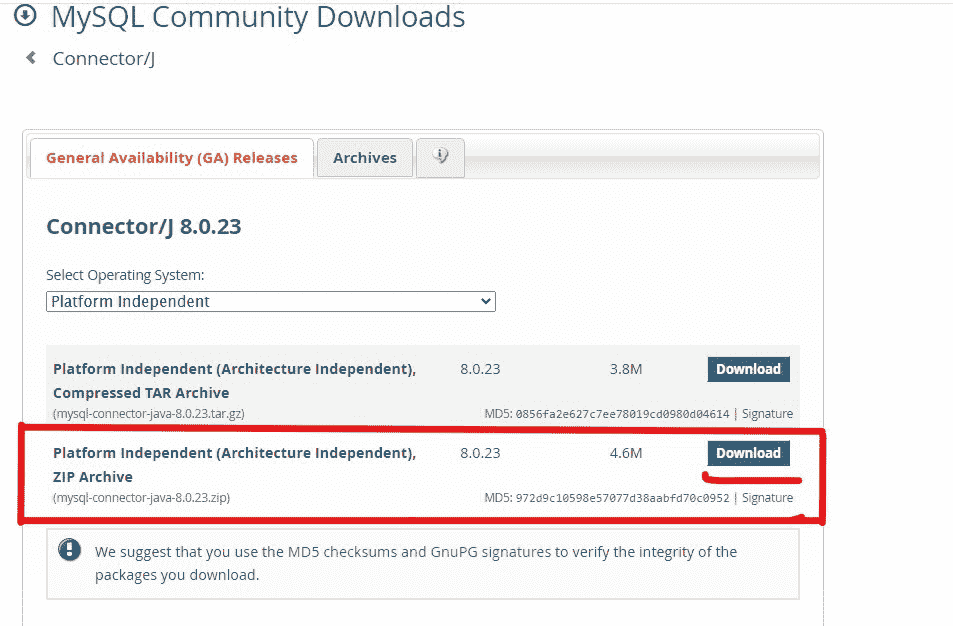
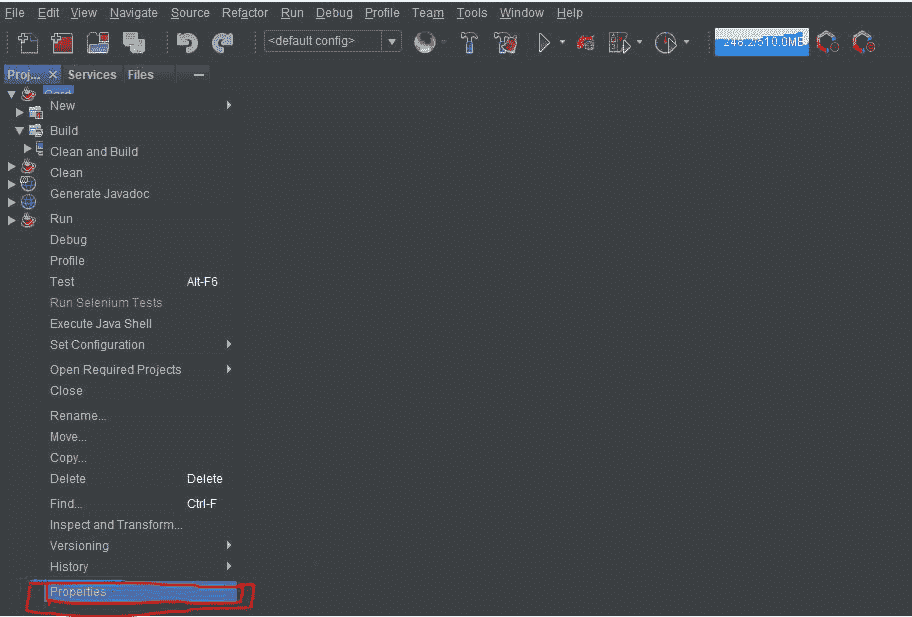
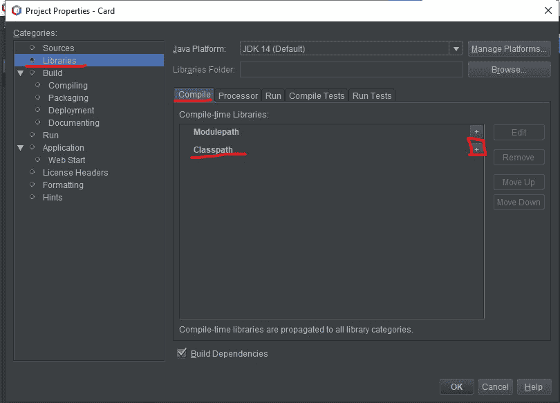
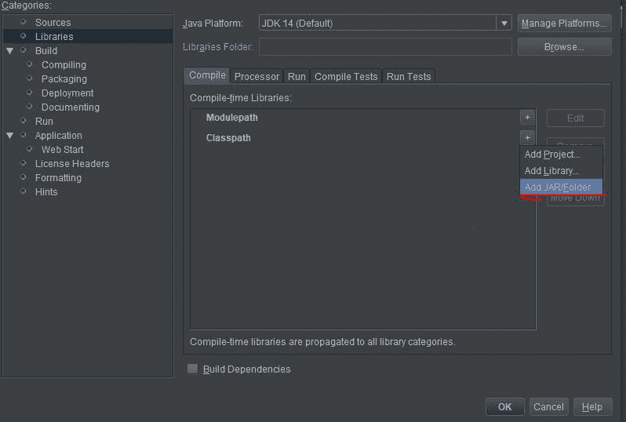
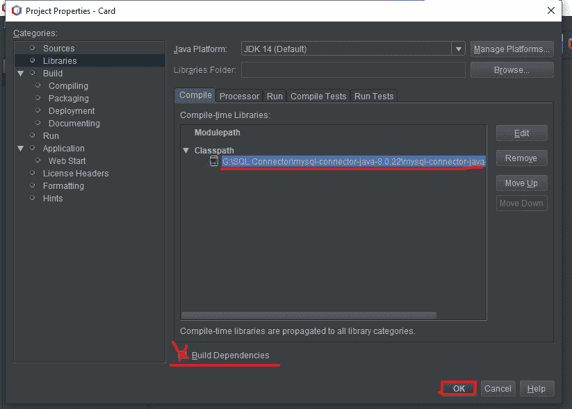
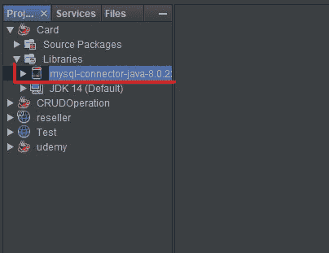

# 在 Apache NetBeans 的 Java 项目中添加 MySQL 连接器

> 原文:[https://www . geesforgeks . org/add-MySQL-connector-to-the-Java-project-in-Apache-netbeans/](https://www.geeksforgeeks.org/adding-mysql-connector-to-the-java-project-in-apache-netbeans/)

在 Java 项目中添加 MySQL 连接器有时会给程序员带来麻烦。在本文中，我们提供了在项目中安装或添加 MySQL 连接器的步骤。

请注意，在下载 MySQL 连接器之前，您应该清楚您使用的 MySQL 版本，即版本 5 还是版本 8。要检查您的计算机上安装了哪个版本的 MySQL，请打开 MySQL 命令行客户端；编写查询**显示像“%version%”这样的变量；**这会给你一个包含多行的表格，检查表格的版本行，确认你安装的版本。

**第一步:**确定版本后，如果你有 8 版，那就搜索 MySQL 连接器 8 版，从官网下载即可。否则，如果版本是 5，那么转到 MySQL 的“存档”页面，从所有版本 5 的用户中选择产品版本。选择独立于平台的操作系统。下载包含连接器 JAR 文件的 ZIP 存档文件。

**步骤 2:** 打开下载的压缩文件夹，将其中的文件夹复制到您选择的其他位置。

**第三步:**打开 Apache NetBeans，右键点击需要添加连接器的项目。在选项窗格中，单击属性。

**第 4 步:**在属性中，转到**库**，点击**类路径**的加号“+”选项卡，选择**添加 JAR/文件夹。**

 

**第五步:**浏览我们复制到其他位置的文件夹，选择该文件夹中存在的名为**MySQL-connector-Java-8 . 0 . 22**的 JAR 文件，点击**打开。**

**第 6 步:**取消勾选构建依赖项框，点击**确定。**

**第 7 步:**您会注意到 MySQL 连接器显示在项目的 Libraries 包中。

祝贺您，MySQL 连接器已成功安装到您的项目中。