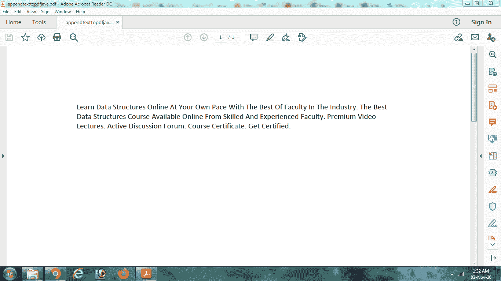

# 使用 Java 将段落作为文本添加到 PDF 中

> 原文:[https://www . geesforgeks . org/add-段落-as-text-to-a-pdf-using-Java/](https://www.geeksforgeeks.org/adding-paragraphs-as-text-to-a-pdf-using-java/)

**iText** 是一个开发的 Java 库，用来访问和操作 PDF 文件，也就是对 PDF 内容进行提取和修改。Java 允许我们合并各种完全开发的包和模块，以便处理 PDF 文件。我们将看到如何使用 **iText** 库创建一个 PDF 文档并添加一个段落。

**1。PdfWriter** 的缩写形式

Java 有一个内置的包**com.itextpdf.kernel.pdf**，它基本上提供了用 Java 创建 PDF 文档的类和模块。这个包中的一个可用类是 **PdfWriter。**我们实例化这个类的一个对象，并将文件路径以及我们希望创建的新 PDF 文件的名称作为参数传递。一个对象被传递给这个类，以便将文本追加到指定的文件位置。下面的 Java 代码片段说明了这个类的用法:

```java
// path to create the file 
String file_path = "C:/appendtexttopdfjava.pdf";

// creating an object of PdfWriter class with file_path as argument
PdfWriter pdf_writer = new PdfWriter(file_path); 

```

这将在 C:中创建新的 PDF 文件，名称为**appendtexttopdfjava.pdf**。

**2 .pdf 文件〔t1〕**

包**com.itextpdf.kernel.pdf**包含另一个类来表示 iText 中指定的 PDF 文件，通过结合该类的各种方法，用户可以轻松添加各种功能，如页面字体、文件附件。需要通过将使用 PdfWriter 类创建的 pdf_writer 对象作为参数传递来实例化该类的对象。下面的 Java 代码片段说明了这个类的用法:

```java
// Representing PDF document in iText 
PdfDocument pdf_doc = new PdfDocument(pdf_writer); 

```

**3。文件**

包的文档类 **com.itextpdf.layout** 将创建的 PdfDocument 对象作为参数，并实例化文档，该文档用作要执行的所有 pdf 操作的源。它充当需要修改或追加到文档文件中的内容的容器。

```java
// Instantiating a document object from pdf document object 
Document document = new Document(pdf_doc); 

```

当创建这个类的对象时，文件被可视化为一个字符流，对其进行操作(添加新字符、修改以前的字符、删除等)。)可以在。

**4。段落**

Java 内置包**的段落类基本上是 Document 类的子类。它使用文本流创建一个对象，即实际上要添加到 PDF 文档中的内容。内容可能是一个行块，需要使用文档类提供的 **add()方法**添加到文档类对象中。段落类基本上是文档类的一个元素。可以创建多个段落对象并将其添加到同一文档中。**

将内容写入文档后，文档将被关闭。

```java
//content to be added to the pdf document
String paragraph = "Geeks For Geeks makes you learn coding. It also provides competitions"; 

//Creating a paragraph class object
Paragraph para_obj = new Paragraph (paragraph); 

//adding paragraph to the document object 
document.add(para_obj); 

//closing the document after writing the contents
document.close();

```

下面的 Java 代码指出了在 Java 文件中添加段落的功能:

## Java 语言(一种计算机语言，尤用于创建网站)

```java
// importing thr required packages
import com.itextpdf.kernel.pdf.PdfDocument;
import com.itextpdf.kernel.pdf.PdfWriter;
import com.itextpdf.layout.Document;
import com.itextpdf.layout.element.Paragraph;

public class AppendtoPdf {
    public static void main(String args[]) throws Exception
    {
        // path to create the file
        String file_path = "C:/appendtexttopdfjava.pdf";

        // creating PdfWriter object
        PdfWriter pdf_writer = new PdfWriter(file_path);

        // Representing PdfDocument object
        PdfDocument pdf_doc = new PdfDocument(pdf_writer);

        // Creating a Document
        // Instantiating a document object from pdf document
        // object
        Document document = new Document(pdf_doc);

        // paragraph to be added
        String para
            = "Learn Data Structures Online At Your Own Pace With 
              The Best Of Faculty In The Industry
                  .The Best Data Structures Course Available
                      Online From Skilled And Experienced
                          Faculty.Premium Video Lectures
                  .Active Discussion Forum
                  .Course Certificate.Get Certified.";

              // Creating Paragraph object
              Paragraph paragraph_obj
            = new Paragraph(para);

        // Adding paragraphs to document
        document.add(paragraph_obj);

        // Closing the document
        document.close();

        // final message
        System.out.println(
            "Finished writing contents to the file!");
    }
}
```

该代码在终端上执行时会在终端上产生以下输出，并在本地计算机上保存一个 C:文件。

```java
Finished writing contents to the file!

```

保存的 PDF 文件内容如下:

