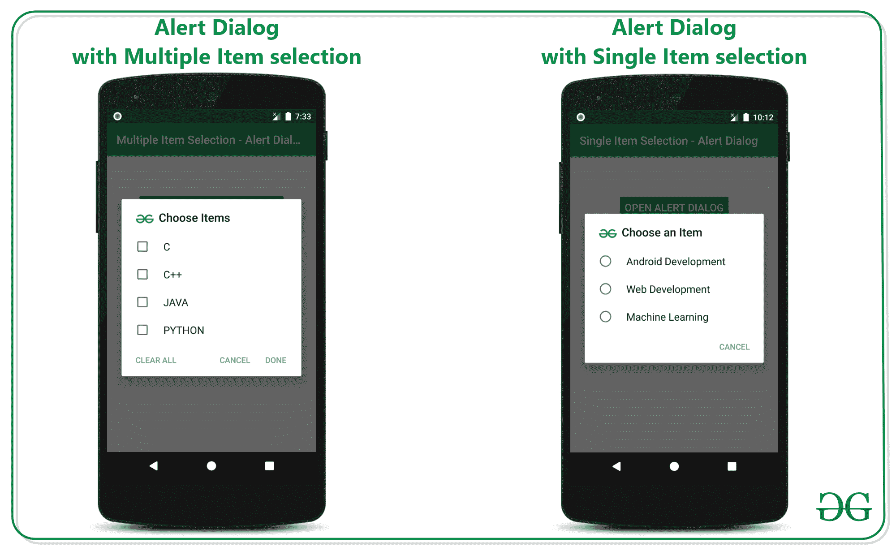
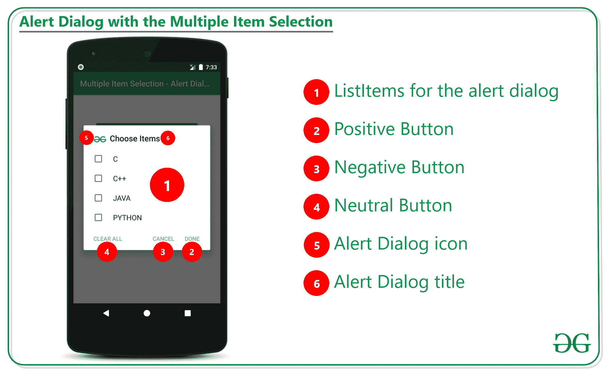

# 安卓多项目选择提醒对话框

> 原文:[https://www . geesforgeks . org/alert-dialog-with-multipleitems selection-in-Android/](https://www.geeksforgeeks.org/alert-dialog-with-multipleitemselection-in-android/)

在之前的文章[安卓](https://www.geeksforgeeks.org/alert-dialog-with-singleitemselection-in-android/)**中的带单品选择的提醒对话框中，我们已经看到了如何为单品选择构建提醒对话框。在本文中，已经讨论了如何建立一个多项目选择的警报对话框。当用户想要一次选择多个项目时，使用多个项目选择对话框。请看下图，区分单项选择和多项选择警告对话框。**

****

### ****通过多项选择实现报警对话框的步骤****

****第一步:创建一个空的活动项目****

*   **创建一个空的活动安卓工作室项目。并选择 **Java** 作为编程语言。**
*   **创建一个空的活动安卓工作室项目参考[安卓|如何在安卓工作室创建/启动一个新项目？](https://www.geeksforgeeks.org/how-to-upload-project-on-github-from-android-studio/)**

****步骤 2:使用 activity_main.xml****

*   **主布局包括一个简单的按钮和一个文本视图小部件。实现文本视图来预览列表中的选定项目。**
*   **调用以下代码构建用户界面:**

## **可扩展标记语言**

```
<?xml version="1.0" encoding="utf-8"?>
<LinearLayout
    xmlns:android="http://schemas.android.com/apk/res/android"
    xmlns:tools="http://schemas.android.com/tools"
    android:layout_width="match_parent"
    android:layout_height="match_parent"
    android:orientation="vertical"
    tools:context=".MainActivity"
    tools:ignore="HardcodedText">

    <Button
        android:id="@+id/openAlertDialogButton"
        android:layout_width="256dp"
        android:layout_height="60dp"
        android:layout_gravity="center_horizontal"
        android:layout_marginTop="64dp"
        android:backgroundTint="@color/colorPrimary"
        android:text="OPEN ALERT DIALOG"
        android:textColor="@android:color/white"
        android:textSize="18sp" />

    <TextView
        android:id="@+id/selectedItemPreview"
        android:layout_width="wrap_content"
        android:layout_height="wrap_content"
        android:layout_gravity="center_horizontal"
        android:layout_marginStart="16dp"
        android:layout_marginTop="16dp"
        android:layout_marginEnd="16dp"
        android:textColor="@android:color/black"
        android:textSize="18sp" />

</LinearLayout>
```

****输出 UI:****

****

****步骤 3:使用 MainActivity.java 文件****

*   **需要了解多项目选择警告对话框的各个部分。请看下图了解零件:**

****

*   **下面讨论实现警报对话框的多项目选择所需的功能。**

> ****语法:****
> 
> **setmultichoiceitems(列表、签入项目、新对话框界面)。onmultichoiceclicklistener()**
> 
> ****参数:****
> 
> ****列表项目:**是要在警报对话框中显示的项目。**
> 
> ****检查编辑项:**是布尔数组，它将选定的值保持为真，将未选定的值保持为假。**
> 
> ****对话界面。onmultichoiceliclistener():**当项目选择发生变化时进行回调。**

*   **调用下面的代码来实现这些东西。添加注释是为了更好地理解。**

## **Java 语言(一种计算机语言，尤用于创建网站)**

```
import androidx.appcompat.app.AlertDialog;
import androidx.appcompat.app.AppCompatActivity;
import android.annotation.SuppressLint;
import android.content.DialogInterface;
import android.os.Bundle;
import android.view.View;
import android.widget.Button;
import android.widget.TextView;
import java.util.Arrays;
import java.util.List;

public class MainActivity extends AppCompatActivity {

    @Override
    protected void onCreate(Bundle savedInstanceState) {
        super.onCreate(savedInstanceState);
        setContentView(R.layout.activity_main);

        // UI widgets button and
        Button bOpenAlertDialog = findViewById(R.id.openAlertDialogButton);
        final TextView tvSelectedItemsPreview = findViewById(R.id.selectedItemPreview);

        // initialise the list items for the alert dialog
        final String[] listItems = new String[]{"C", "C++", "JAVA", "PYTHON"};
        final boolean[] checkedItems = new boolean[listItems.length];

        // copy the items from the main list to the selected item list
        // for the preview if the item is checked then only the item
          // should be displayed for the user
        final List<String> selectedItems = Arrays.asList(listItems);

        // handle the Open Alert Dialog button
        bOpenAlertDialog.setOnClickListener(new View.OnClickListener() {
            @Override
            public void onClick(View v) {

                // initially set the null for the text preview
                tvSelectedItemsPreview.setText(null);

                // initialise the alert dialog builder
                AlertDialog.Builder builder = new AlertDialog.Builder(MainActivity.this);

                // set the title for the alert dialog
                builder.setTitle("Choose Items");

                // set the icon for the alert dialog
                builder.setIcon(R.drawable.image_logo);

                // now this is the function which sets the alert dialog for multiple item selection ready
                builder.setMultiChoiceItems(listItems, checkedItems, new DialogInterface.OnMultiChoiceClickListener() {
                    @Override
                    public void onClick(DialogInterface dialog, int which, boolean isChecked) {
                        checkedItems[which] = isChecked;
                        String currentItem = selectedItems.get(which);
                    }
                });

                // alert dialog shouldn't be cancellable
                builder.setCancelable(false);

                // handle the positive button of the dialog
                builder.setPositiveButton("Done", new DialogInterface.OnClickListener() {
                    @SuppressLint("SetTextI18n")
                    @Override
                    public void onClick(DialogInterface dialog, int which) {
                        for (int i = 0; i < checkedItems.length; i++) {
                            if (checkedItems[i]) {
                                tvSelectedItemsPreview.setText(tvSelectedItemsPreview.getText() + selectedItems.get(i) + ", ");
                            }
                        }
                    }
                });

                // handle the negative button of the alert dialog
                builder.setNegativeButton("CANCEL", new DialogInterface.OnClickListener() {
                    @Override
                    public void onClick(DialogInterface dialog, int which) {

                    }
                });

                // handle the neutral button of the dialog to clear
                  // the selected items boolean checkedItem
                builder.setNeutralButton("CLEAR ALL", new DialogInterface.OnClickListener() {
                    @Override
                    public void onClick(DialogInterface dialog, int which) {
                        for (int i = 0; i < checkedItems.length; i++) {
                            checkedItems[i] = false;
                        }
                    }
                });

                // create the builder
                builder.create();

                // create the alert dialog with the
                  // alert dialog builder instance
                AlertDialog alertDialog = builder.create();
                alertDialog.show();
            }
        });
    }
}
```

### ****输出:在仿真器上运行****

**<video class="wp-video-shortcode" id="video-525597-1" width="640" height="360" preload="metadata" controls=""><source type="video/mp4" src="https://media.geeksforgeeks.org/wp-content/uploads/20201204193252/GFG_nexus_5.mp4?_=1">[https://media.geeksforgeeks.org/wp-content/uploads/20201204193252/GFG_nexus_5.mp4](https://media.geeksforgeeks.org/wp-content/uploads/20201204193252/GFG_nexus_5.mp4)</video>**