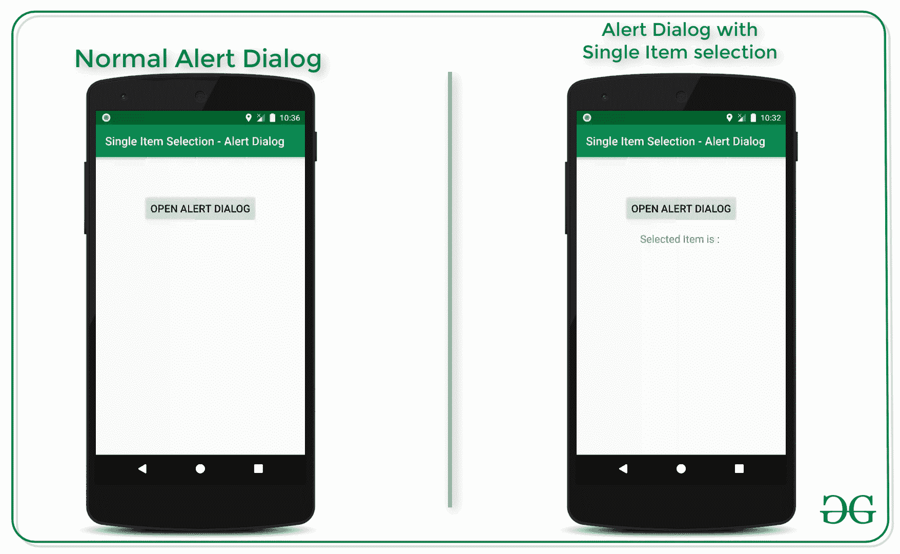
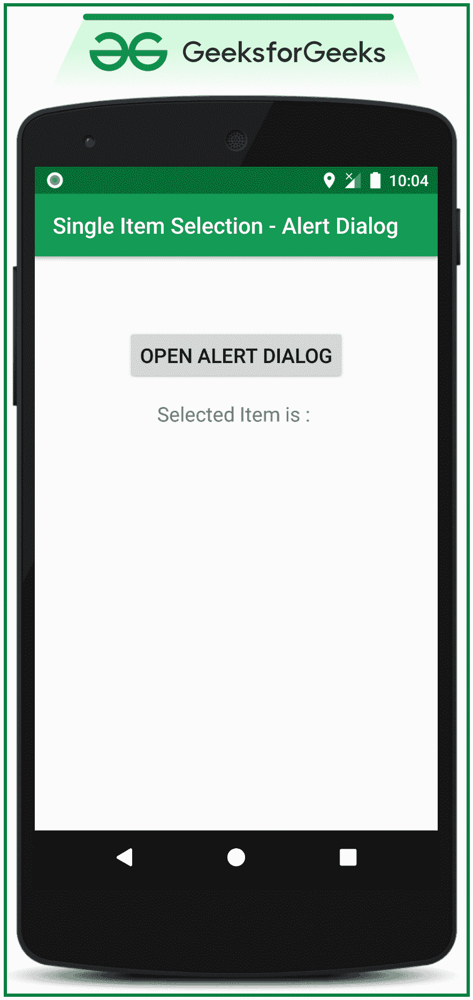
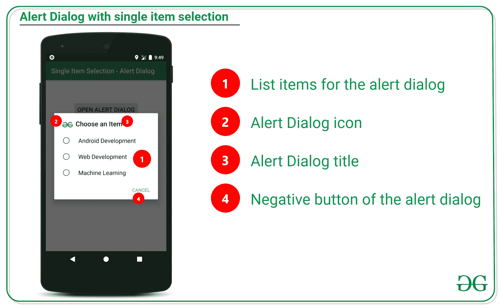

# 安卓系统中带单项选择的提醒对话框

> 原文:[https://www . geesforgeks . org/alert-dialog-with-single items selection-in-Android/](https://www.geeksforgeeks.org/alert-dialog-with-singleitemselection-in-android/)

[警报对话框](https://www.geeksforgeeks.org/android-alert-dialog-box-and-how-to-create-it/)是当用户使用应用程序执行一些关键操作时弹出的用户界面元素。这些是类似窗口的元素，可能包含多个或单个项目以从列表中选择，或者它可能有错误消息和一些操作按钮。在本文中，我们已经讨论了如何使用单个项目选择来实现警报对话框。请看下图，区分带有操作按钮和单项选择的警报对话框。注意，我们将使用 **Java** 语言来实现这个项目。



### **通过单项选择实现报警对话框的步骤**

**第一步:创建一个空的活动安卓工作室项目**

*   创建一个空的活动安卓工作室项目。并选择***【Java】***作为编程语言。
*   参考[安卓|如何在安卓工作室创建/启动新项目？](https://www.geeksforgeeks.org/android-how-to-create-start-a-new-project-in-android-studio/)了解如何创建一个空的活动 Android Studio 项目。

**步骤 2:使用 activty _ main.xml 文件**

*   在包含一个按钮和文本视图的 activity_main.xml 中。按钮打开带有单个项目选择列表的警报对话框。和预览由用户选择的所选项目的文本视图。
*   在 activity_main.xml 文件中调用下面的布局代码，该文件只包含一个 Button 和 TextView 元素。

## 可扩展标记语言

```
<?xml version="1.0" encoding="utf-8"?>
<LinearLayout 
    xmlns:android="http://schemas.android.com/apk/res/android"
    xmlns:tools="http://schemas.android.com/tools"
    android:layout_width="match_parent"
    android:layout_height="match_parent"
    android:orientation="vertical"
    tools:context=".MainActivity"
    tools:ignore="HardcodedText">

    <Button
        android:id="@+id/openAlertDialogButton"
        android:layout_width="wrap_content"
        android:layout_height="wrap_content"
        android:layout_gravity="center_horizontal"
        android:layout_marginTop="64dp"
        android:text="OPEN ALERT DIALOG"
        android:textSize="18sp" />

    <TextView
        android:id="@+id/selectedItemPreview"
        android:layout_width="wrap_content"
        android:layout_height="wrap_content"
        android:layout_gravity="center_horizontal"
        android:layout_marginTop="16dp"
        android:text="Selected Item is : "
        android:textSize="18sp" />

</LinearLayout>
```

**输出 UI:**



**步骤 3:使用 MainActivity.java 文件**

*   需要了解 AlertDialog 中有单项选择的部分。请看下图:



*   用于实现单项选择的功能是**设置单项选择项**，如下所述:

> **语法:**
> 
> setsinglechiceitems(listitem，check in[0])对话方块介面。onclicklistener
> 
> **参数:**
> 
> **列表项目:**是要在警报对话框中显示的项目。
> 
> **检查编辑项:**是布尔数组，它将选定的值保持为真，将未选定的值保持为假。
> 
> **对话界面。onmultichoiceliclistener():**当项目选择发生变化时进行回调。

*   调用以下代码。为了更好地理解，在代码中添加了注释。

## Java 语言(一种计算机语言，尤用于创建网站)

```
import androidx.appcompat.app.AlertDialog;
import androidx.appcompat.app.AppCompatActivity;
import android.annotation.SuppressLint;
import android.content.DialogInterface;
import android.os.Bundle;
import android.view.View;
import android.widget.Button;
import android.widget.TextView;

public class MainActivity extends AppCompatActivity {

    // Button and TextView instances
    Button bOpenAlertDialog;
    TextView tvSelectedItemPreview;

    @Override
    protected void onCreate(Bundle savedInstanceState) {
        super.onCreate(savedInstanceState);
        setContentView(R.layout.activity_main);

        // register both UI elements with their appropriate IDs.
        bOpenAlertDialog = findViewById(R.id.openAlertDialogButton);
        tvSelectedItemPreview = findViewById(R.id.selectedItemPreview);

        // single item array instance to store 
          // which element is selected by user
        // initially it should be set to zero meaning 
          // none of the element is selected by default
        final int[] checkedItem = {-1};

        // handle the button to open the alert dialog with
          // the single item selection when clicked
        bOpenAlertDialog.setOnClickListener(new View.OnClickListener() {
            @Override
            public void onClick(View v) {

                // AlertDialog builder instance to build the alert dialog
                AlertDialog.Builder alertDialog = new AlertDialog.Builder(MainActivity.this);

                // set the custom icon to the alert dialog
                alertDialog.setIcon(R.drawable.image_logo);

                // title of the alert dialog
                alertDialog.setTitle("Choose an Item");

                // list of the items to be displayed to 
                  // the user in the form of list
                // so that user can select the item from
                final String[] listItems = new String[]{"Android Development", "Web Development", "Machine Learning"};

                // the function setSingleChoiceItems is the function which builds
                // the alert dialog with the single item selection
                alertDialog.setSingleChoiceItems(listItems, checkedItem[0], new DialogInterface.OnClickListener() {
                    @SuppressLint("SetTextI18n")
                    @Override
                    public void onClick(DialogInterface dialog, int which) {

                        // update the selected item which is selected by the user
                        // so that it should be selected when user opens the dialog next time
                        // and pass the instance to setSingleChoiceItems method
                        checkedItem[0] = which;

                        // now also update the TextView which previews the selected item
                        tvSelectedItemPreview.setText("Selected Item is : " + listItems[which]);

                        // when selected an item the dialog should be closed with the dismiss method
                        dialog.dismiss();
                    }
                });

                // set the negative button if the user 
                  // is not interested to select or change
                // already selected item
                alertDialog.setNegativeButton("Cancel", new DialogInterface.OnClickListener() {
                    @Override
                    public void onClick(DialogInterface dialog, int which) {

                    }
                });

                // create and build the AlertDialog instance 
                  // with the AlertDialog builder instance
                AlertDialog customAlertDialog = alertDialog.create();

                // show the alert dialog when the button is clicked
                customAlertDialog.show();
            }
        });
    }
}
```

### **输出:在仿真器上运行**

<video class="wp-video-shortcode" id="video-525594-1" width="640" height="360" preload="metadata" controls=""><source type="video/mp4" src="https://media.geeksforgeeks.org/wp-content/uploads/20201129223048/Untitled-Project1.mp4?_=1">[https://media.geeksforgeeks.org/wp-content/uploads/20201129223048/Untitled-Project1.mp4](https://media.geeksforgeeks.org/wp-content/uploads/20201129223048/Untitled-Project1.mp4)</video>