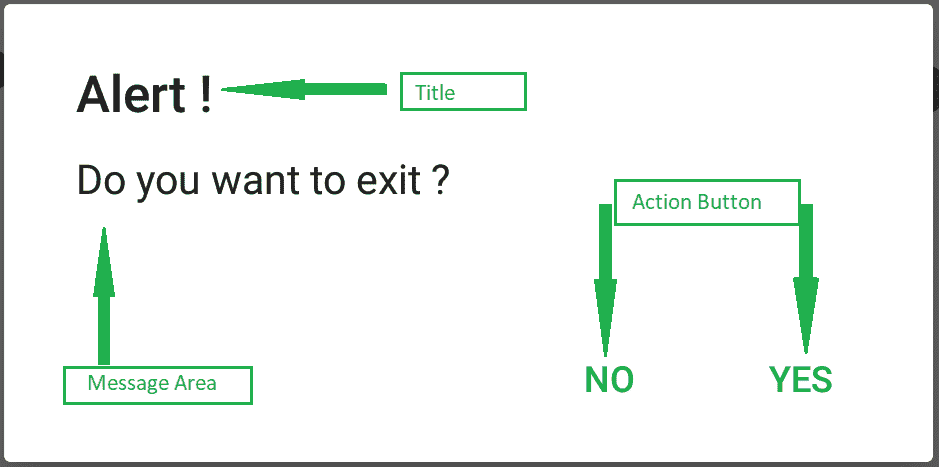
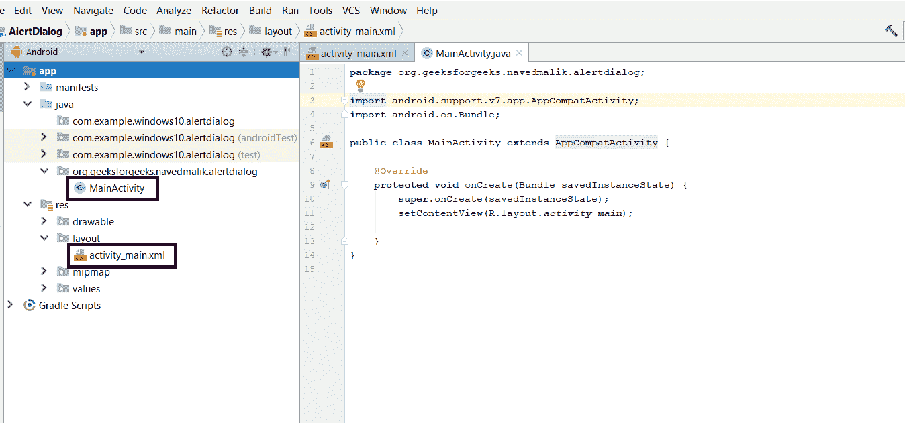
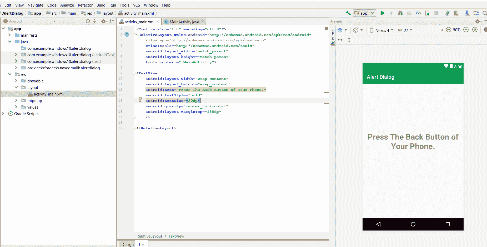
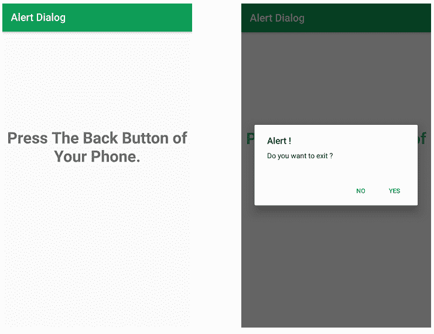

# 安卓|提醒对话框以及如何创建

> 原文:[https://www . geesforgeks . org/Android-alert-dialog-box-以及如何创建它/](https://www.geeksforgeeks.org/android-alert-dialog-box-and-how-to-create-it/)

警报对话框显示警报消息，并以是或否的形式给出答案。警报对话框显示消息以警告您，然后根据您的响应处理下一步。

安卓提醒对话框是使用三个**字段**构建的:**标题、消息区、操作按钮。**
警报对话框代码有三种**方法**:

*   **设置(T1)显示报警对话框标题的方法**
*   **设置消息()**显示消息的方法
*   **设置图标()**方法用于在报警对话框中设置图标。

然后我们将两个按钮**设置位置按钮**和**设置否定按钮**添加到我们的警告对话框中，如下所示。

**例:**


**以下是创建报警对话框安卓应用的步骤:**

*   **Step 1:** Create a new project. After that, you have java and XML file.

    

*   **Step 2:** Open your XML file and then add TextView for message as shown below (you can change it accordingly).

    

*   **第三步:**现在，打开活动 java 文件。之后，在创建方法声明时，当您单击设备的后退按钮时，将调用 onbackpressed 方法。
*   **步骤 4:** 使用 AlertDialog.Builder 创建 Builder 类的对象。现在，设置标题，消息。
*   **第 5 步:**在构建器对象设置中，正按钮现在给出按钮名称，并添加 DialogInterface 的 OnClickListener。与负按钮相同，最后，使用构建器对象创建警报对话框，然后显示警报对话框。
*   **第 6 步:**如果是肯定的，按完成按钮，应用程序从应用程序转到外面，如果是否定的，则完成对话框
*   **Step 7:** Now run it and then press the back button. After that click Yes or No Button.

    **报警对话框的 MainActivity.java 或 activity_main.xml 的完整代码如下:**

    ## activity_main.xml

    ```
    <?xml version="1.0" encoding="utf-8"?>
    <RelativeLayout 
        xmlns:android="http://schemas.android.com/apk/res/android"
        xmlns:app="http://schemas.android.com/apk/res-auto"
        xmlns:tools="http://schemas.android.com/tools"
        android:layout_width="match_parent"
        android:layout_height="match_parent"
        tools:context=".MainActivity">

    <TextView
        android:layout_width="wrap_content"
        android:layout_height="wrap_content"
        android:text="Press The Back Button of Your Phone."
        android:textStyle="bold"
        android:textSize="30dp"
        android:gravity="center_horizontal"
        android:layout_marginTop="180dp"
        />

    </RelativeLayout>
    ```

    ## MainActivity.java

    ```
    package org.geeksforgeeks.navedmalik.alertdialog;

    import android.content.DialogInterface;
    import android.support.v7.app.AlertDialog;
    import android.support.v7.app.AppCompatActivity;
    import android.os.Bundle;

    public class MainActivity extends AppCompatActivity {

        @Override
        protected void onCreate(Bundle savedInstanceState)
        {
            super.onCreate(savedInstanceState);
            setContentView(R.layout.activity_main);
        }

        // Declare the onBackPressed method
        // when the back button is pressed
        // this method will call
        @Override
        public void onBackPressed()
        {

            // Create the object of
            // AlertDialog Builder class
            AlertDialog.Builder builder
                = new AlertDialog
                      .Builder(MainActivity.this);

            // Set the message show for the Alert time
            builder.setMessage("Do you want to exit ?");

            // Set Alert Title
            builder.setTitle("Alert !");

            // Set Cancelable false
            // for when the user clicks on the outside
            // the Dialog Box then it will remain show
            builder.setCancelable(false);

            // Set the positive button with yes name
            // OnClickListener method is use of
            // DialogInterface interface.

            builder
                .setPositiveButton(
                    "Yes",
                    new DialogInterface
                        .OnClickListener() {

                            @Override
                            public void onClick(DialogInterface dialog,
                                                int which)
                            {

                                // When the user click yes button
                                // then app will close
                                finish();
                            }
                        });

            // Set the Negative button with No name
            // OnClickListener method is use
            // of DialogInterface interface.
            builder
                .setNegativeButton(
                    "No",
                    new DialogInterface
                        .OnClickListener() {

                            @Override
                            public void onClick(DialogInterface dialog,
                                                int which)
                            {

                                // If user click no
                                // then dialog box is canceled.
                                dialog.cancel();
                            }
                        });

            // Create the Alert dialog
            AlertDialog alertDialog = builder.create();

            // Show the Alert Dialog box
            alertDialog.show();
        }
    }
    ```

    **Output:**
    