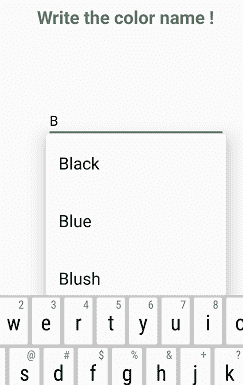
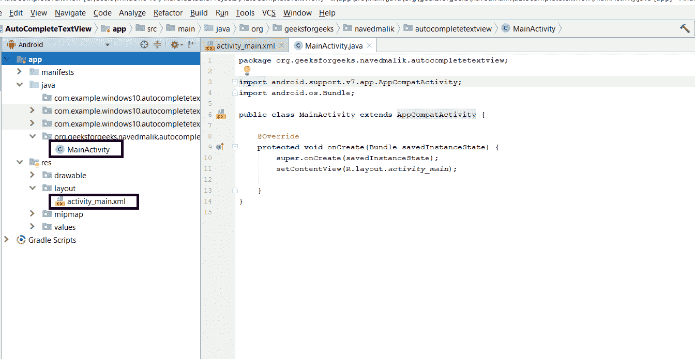
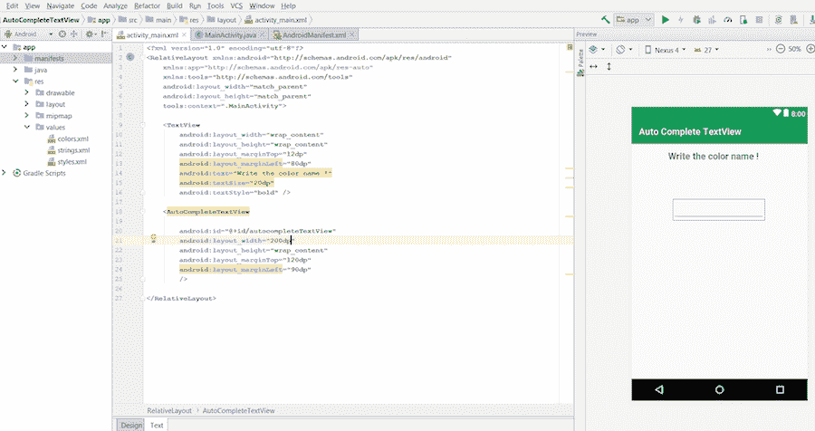
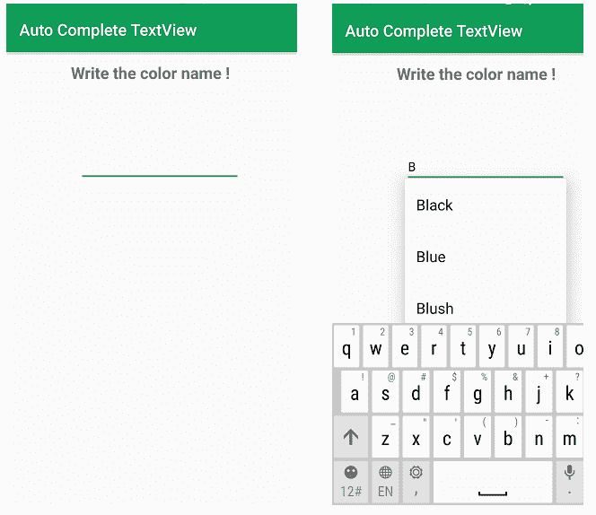

# 安卓|自动完成文本框以及如何创建

> 原文:[https://www . geesforgeks . org/Android-auto-complete-textbox-以及如何创建它/](https://www.geeksforgeeks.org/android-auto-complete-textbox-and-how-to-create-it/)

**先决条件:**

*   [新手安卓应用开发基础](https://www.geeksforgeeks.org/android-app-development-fundamentals-for-beginners/)
*   [安卓工作室安装设置指南](https://www.geeksforgeeks.org/guide-to-install-and-set-up-android-studio/)
*   [安卓|从第一个 app/安卓项目开始](https://www.geeksforgeeks.org/android-starting-with-first-app-android-project/)
*   [安卓|运行你的第一个安卓应用](https://www.geeksforgeeks.org/android-running-your-first-android-app/)

[安卓](https://www.geeksforgeeks.org/android-app-development-fundamentals-for-beginners/) **自动完成文本视图**用于自动完成单词。每当用户书写一个字符时，**自动完成文本视图**将显示用户可以选择的单词的建议。自动完成文本视图是编辑文本的子类。

**例如:**



**自动完成文本视图**提供以下方法:

1.  **setThreshold()** 方法开始第一个字符中的建议词。
2.  **setAdapter()** 方法设置 AutoCompleteTextView 中的所有数据。
3.  **setTextColor** 这是用于黑色的文本。

### 如何创建安卓应用来使用自动完成文本视图

这个例子将有助于开发一个安卓应用程序，根据上面显示的例子创建自动完成文本视图:
一些颜色存储在字符串数组中。现在单词显示在列表中，所以我们使用 **ArrayAdapter 类**。
ArrayAdapter 类用于将颜色字符串数组的数据保存为如下所示的列表项，然后在 AutoCompleteTextView 中设置上述所有方法。

**示例:**

**以下是创建报警对话框安卓应用的步骤:**

**步骤 1:** 首先创建一个新的安卓应用。这将创建一个 XML 文件“activity_main.xml”和一个 Java 文件“MainActivity”。Java”。请参考先决条件以了解有关此步骤的更多信息。



**步骤 2:** 打开“activity_main.xml”文件，在[相对布局](https://www.geeksforgeeks.org/layouts-android-ui-design/)中添加以下小部件:

*   显示信息的**文本视图**
*   A **自动完成文本查看**借助自动完成建议获取用户答案。

此外，将 **标识** 以及其他属性分配给每个组件，如下图和代码所示。组件上分配的标识有助于在 Java 文件中轻松找到和使用该组件。

**语法:**

```java
android:id="@+id/id_name"
```

这里给定的标识如下:

*   自动完成 xtView:Android:id = " @+id/自动完成 xtview "

这将使应用程序的用户界面。



**第三步:**现在，在 UI 之后，这一步将创建 App 的后端。为此，请打开“MainActivity.java”文件，并使用 findViewById()方法实例化在 XML 文件(AutoCompleteTextView)中制作的组件。此方法借助于分配的标识将创建的对象绑定到用户界面组件。
**通用语法:**

> **组件类型对象=(组件类型)findviewbyid(r . id . idfthek 组件)；**

**所用组件的语法:**

> **autocomputextview autocomputextview =(autocomputextview)findviewbyid(r . id . autocomputextview)；**

**步骤 4:** 该步骤包括在自动完成文本视图上设置操作。这些操作如下:

1.创建字符串数组并存储建议中显示的颜色值。

> **String[] colors = {“红色”、“绿色”、“黑色”、“橙色”、“蓝色”、“粉色”、“腮红”、“棕色”、“黄色”}；**

2.用字符串创建 ArrayAdapter 对象，该对象将数据保存为列表项。

> **ArrayAdapter 适配器=新 ArrayAdapter(这个，安卓。R.layout.select_dialog_item，colors)；**

**ArrayAdapter 类**用于将颜色字符串数组的数据保存为如下所示的列表项，然后在 AutoCompleteTextView 中设置上述所有方法。

3.将阈值设置为 1，表示给出建议的字母数量。这里设置为 1 个字符。

> **自动完成的 xtview . setthrehold(1)；**

4.为作为列表传递的数据设置适配器。

> **自动完成的 xtView.setAdapter(适配器)；**

**第 5 步:**现在运行应用程序，操作如下:

*   当应用程序打开时，它会显示一条消息，输入颜色名称，并在下方显示一个文本框，以获得用户响应。
*   当输入一个字符时，会显示以输入文本开始的建议，用户可以从中进行选择。

**自动完成视图的 MainActivity.java 或 activity_main.xml 的完整代码如下。**

activity_main.xml

## 可扩展标记语言

```java
<?xml version="1.0" encoding="utf-8"?>
<RelativeLayout
    xmlns:android="http://schemas.android.com/apk/res/android"
    xmlns:app="http://schemas.android.com/apk/res-auto"
    xmlns:tools="http://schemas.android.com/tools"
    android:layout_width="match_parent"
    android:layout_height="match_parent"
    tools:context=".MainActivity">

    <TextView
        android:layout_width="wrap_content"
        android:layout_height="wrap_content"
        android:layout_marginTop="12dp"
        android:layout_marginLeft="80dp"
        android:text="Write the color name !"
        android:textSize="20dp"
        android:textStyle="bold" />

    <AutoCompleteTextView

        android:id="@+id/autocompleteTextView"
        android:layout_width="200dp"
        android:layout_height="wrap_content"
        android:layout_marginTop="120dp"
        android:layout_marginLeft="90dp"
        />

</RelativeLayout>
```

MainActivity.java

## Java 语言(一种计算机语言，尤用于创建网站)

```java
package org.geeksforgeeks.navedmalik.autocompletetextview;

import android.arch.lifecycle.AndroidViewModel;
import android.graphics.Color;
import android.support.v7.app.AppCompatActivity;
import android.os.Bundle;
import android.widget.ArrayAdapter;
import android.widget.AutoCompleteTextView;

public class MainActivity extends AppCompatActivity {

    @Override
    protected void onCreate(Bundle savedInstanceState)
    {
        super.onCreate(savedInstanceState);
        setContentView(R.layout.activity_main);

        // By ID get the AutoCompleteTextView
        // which id is assign in xml file
        AutoCompleteTextView
            autoCompleteTextView
            = (AutoCompleteTextView)
                findViewById(
                    R.id.autocompleteTextView);

        // Create the string array
        // and store the values.
        String[] colors
            = { "Red", "Green", "Black",
                "Orange", "Blue", "Pink",
                "Blush", "Brown", "Yellow" };

        // Create the object of ArrayAdapter with String
        // which hold the data as the list item.
        ArrayAdapter<String> adapter
            = new ArrayAdapter<String>(
                this,
                android.R.layout.select_dialog_item,
                colors);

        // Give the suggestion after 1 words.
        autoCompleteTextView.setThreshold(1);

        // Set the adapter for data as a list
        autoCompleteTextView.setAdapter(adapter);
        autoCompleteTextView.setTextColor(Color.BLACK);
    }
}
```

**输出:**

