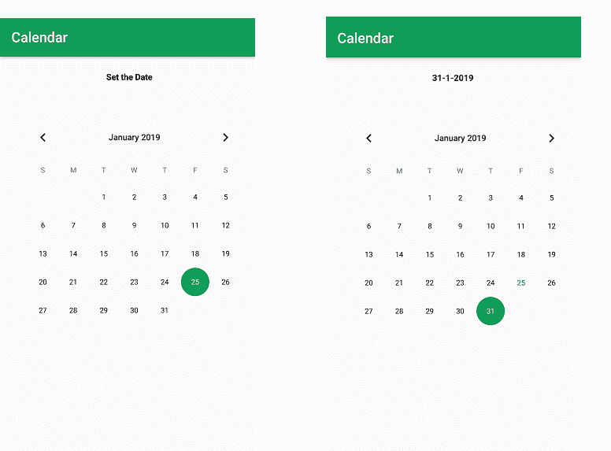

# 安卓|创建日历视图应用

> 原文:[https://www . geesforgeks . org/Android-creating-a-calendar-view-app/](https://www.geeksforgeeks.org/android-creating-a-calendar-view-app/)

本文展示了如何使用日历视图创建一个显示日历的安卓应用程序。它还提供当前日期的选择和日期显示。使用了 setOnDateChangeListener 接口，它提供了 onSelectedDayChange 方法。

1.  **onSelectedDayChange:** 在这个方法中，我们得到用户选择的日、月、年的值。

**以下是创建日历的** **安卓应用的步骤。**

*   **第一步:**创建一个新项目，你会有一个布局 XML 文件和 java 文件。您的屏幕将如下图所示。
    T3】
*   **第二步:**打开你的 xml 文件，添加 CalendarView 和 TextView。并为 TextView 和 CalendarView 分配 id。完成此过程后，xml 文件屏幕如下所示。
    T3】
*   **第三步:**现在，打开活动 java 文件，定义 CalendarView 和 textview 类型变量，同时使用 findViewById()获取 Calendarview 和 TextView。

*   **第四步:**现在，在提供 setandtechangelistener 方法的 CalendarView 的对象中添加 setondtechangelistener 接口。在这种方法中，我们获取日期(日、月、年)，并在文本视图中设置显示日期。

*   **第五步:**现在运行应用程序并设置当前日期，该日期将显示在屏幕顶部。
    **日历的 MainActivity.java 或 activity_main.xml 完整代码如下。**

## activity_main.xml

```java
<?xml version="1.0" encoding="utf-8"?>
<RelativeLayout 
    xmlns:android="http://schemas.android.com/apk/res/android"
    xmlns:app="http://schemas.android.com/apk/res-auto"
    xmlns:tools="http://schemas.android.com/tools"
    android:layout_width="match_parent"
    android:layout_height="match_parent"
    tools:context=".MainActivity">

    <!-- Add TextView to display the date -->
    <TextView
        android:id="@+id/date_view"
        android:layout_width="wrap_content"
        android:layout_height="wrap_content"
        android:layout_marginLeft="150dp"
        android:layout_marginTop="20dp"
        android:text="Set the Date"
        android:textColor="@android:color/background_dark"
        android:textStyle="bold" />

    <!-- Add CalendarView to display the Calendar -->
    <CalendarView
        android:id="@+id/calendar"
        android:layout_marginTop="80dp"
        android:layout_marginLeft="19dp"
        android:layout_width="wrap_content"
        android:layout_height="wrap_content">
    </CalendarView>

</RelativeLayout>
```

## MainActivity.java

```java
package org.geeksforgeeks.navedmalik.calendar;

import android.support.annotation.NonNull;
import android.support.v7.app.AppCompatActivity;
import android.os.Bundle;
import android.widget.Button;
import android.widget.CalendarView;
import android.widget.TextView;

public class MainActivity extends AppCompatActivity {

    // Define the variable of CalendarView type
    // and TextView type;
    CalendarView calendar;
    TextView date_view;
    @Override
    protected void onCreate(Bundle savedInstanceState)
    {
        super.onCreate(savedInstanceState);
        setContentView(R.layout.activity_main);

        // By ID we can use each component
        // which id is assign in xml file
        // use findViewById() to get the
        // CalendarView and TextView
        calendar = (CalendarView)
            findViewById(R.id.calendar);
        date_view = (TextView)
            findViewById(R.id.date_view);

        // Add Listener in calendar
        calendar
            .setOnDateChangeListener(
                new CalendarView
                    .OnDateChangeListener() {
                        @Override

                        // In this Listener have one method
                        // and in this method we will
                        // get the value of DAYS, MONTH, YEARS
                        public void onSelectedDayChange(
                            @NonNull CalendarView view,
                            int year,
                            int month,
                            int dayOfMonth)
                        {

                            // Store the value of date with
                            // format in String type Variable
                            // Add 1 in month because month
                            // index is start with 0
                            String Date
                                = dayOfMonth + "-"
                                  + (month + 1) + "-" + year;

                            // set this date in TextView for Display
                            date_view.setText(Date);
                        }
                    });
    }
}
```

**输出:**

