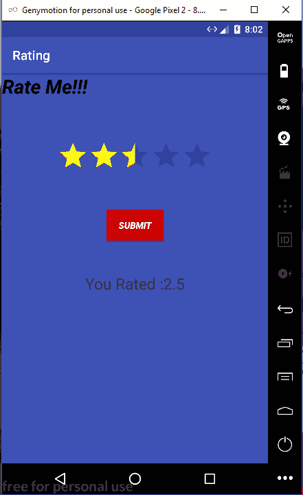

# 安卓|创建评论栏

> 原文:[https://www.geeksforgeeks.org/android-creating-a-ratingbar/](https://www.geeksforgeeks.org/android-creating-a-ratingbar/)

评级栏用于允许用户对一些产品进行评级。在下面的代码中 *getRating()* 函数用于计算产品的评级。 *getRating()* 函数返回双精度类型值。

**在安卓系统中创建评论栏涉及以下步骤:**

1.  创建一个新的安卓项目。
2.  在 activity_main.xml 中添加 RatingBar。
3.  添加按钮以调用操作。
4.  使用文本视图显示评分。

*   要在应用程序中使用评级栏，我们将使用内置的评级栏小部件，因此第一步是将其导入项目。
*   在 MainActivity 中，使 RatingBar 对象由变量“rt”表示，并在 XML 文件中找到其对应的视图。这是通过 findViewById()方法完成的。在 java 对象成功绑定到其视图后，创建用户将与之交互的“stars”布局来设置评级。
*   为了获得可绘制的星星，使用了 rt.getProcessDrawable()方法。然后修改星星的颜色，使用方法 setColorFilter()和参数 Color。黄色通过。最后，编写 Call 方法，通过 rt.getMethod()方法提取用户选择的评级值。

**创建主活动的程序:**

```java
// Below is the code for MainActivity.java
package com.example.hp.rating;

// importing required libraries
import android.graphics.Color;
import android.graphics.PorterDuff;
import android.graphics.drawable.LayerDrawable;
import android.support.v7.app.AppCompatActivity;
import android.os.Bundle;
import android.view.View;
import android.widget.RatingBar;
import android.widget.TextView;

public class MainActivity extends AppCompatActivity {
RatingBar rt;
    @Override
    protected void onCreate(Bundle savedInstanceState) {
        super.onCreate(savedInstanceState);
        setContentView(R.layout.activity_main);

        //binding MainActivity.java with activity_main.xml file
        rt = (RatingBar) findViewById(R.id.ratingBar);

        //finding the specific RatingBar with its unique ID
        LayerDrawable stars=(LayerDrawable)rt.getProgressDrawable();

       //Use for changing the color of RatingBar
        stars.getDrawable(2).setColorFilter(Color.YELLOW, PorterDuff.Mode.SRC_ATOP);
    }

    public void Call(View v)  
    {
        // This function is called when button is clicked.
        // Display ratings, which is required to be converted into string first.
        TextView t = (TextView)findViewById(R.id.textView2);
        t.setText("You Rated :"+String.valueOf(rt.getRating()));
    }
}
```

**注意:**对于布局，如果你是初学者，ConstraintLayout 很好用，因为它可以根据屏幕调整视图。
这个 XML 文件定义了应用程序的视图。

**为主要活动创建布局的程序:**

```java
<?xml version="1.0" encoding="utf-8"?>
<android.support.constraint.ConstraintLayout
    xmlns:android="http://schemas.android.com/apk/res/android"
    xmlns:tools="http://schemas.android.com/tools"
    xmlns:app="http://schemas.android.com/apk/res-auto"

    <!-- Cover the entire width of the screen -->
    android:layout_width="match_parent"
    <!-- Cover the entire height of the screen -->
    android:layout_height="match_parent"  

    tools:context="com.example.hp.rating.MainActivity"
    android:background="@color/colorPrimary">

    <RatingBar
        android:id="@+id/ratingBar"
        android:layout_width="wrap_content"
        android:layout_height="wrap_content"
        android:layout_marginTop="104dp"
        android:background="@color/colorPrimary"
        app:layout_constraintLeft_toLeftOf="parent"
        app:layout_constraintRight_toRightOf="parent"
        app:layout_constraintTop_toTopOf="parent"
        tools:layout_constraintLeft_creator="1"
        tools:layout_constraintRight_creator="1"
        tools:layout_constraintTop_creator="1" />

    <TextView
        android:id="@+id/textView"
        android:layout_width="wrap_content"
        android:layout_height="wrap_content"
        android:text="Rate Me!!!"
        android:textColor="@android:color/background_dark"
        android:textSize="30sp"
        android:textStyle="bold|italic"
        tools:layout_editor_absoluteX="127dp"
        tools:layout_editor_absoluteY="28dp" />

    <TextView
        android:id="@+id/textView2"
        android:layout_width="wrap_content"
        android:layout_height="wrap_content"
        android:layout_marginTop="148dp"
        android:textColorHint="@color/colorAccent"
        android:textSize="24sp"
        app:layout_constraintLeft_toLeftOf="parent"
        app:layout_constraintRight_toRightOf="parent"
        app:layout_constraintTop_toBottomOf="@+id/ratingBar"
        tools:layout_constraintRight_creator="1"
        tools:layout_constraintLeft_creator="1" />

    <Button
        android:id="@+id/button"
        android:layout_width="wrap_content"
        android:layout_height="wrap_content"
        android:layout_marginBottom="50dp"
        android:layout_marginTop="50dp"
        android:background="@android:color/holo_red_dark"
        android:onClick="Call"
        android:text="Submit"
        android:textColor="@android:color/background_light"
        android:textStyle="bold|italic"
        app:layout_constraintBottom_toTopOf="@+id/textView2"
        app:layout_constraintLeft_toLeftOf="parent"
        app:layout_constraintRight_toRightOf="parent"
        app:layout_constraintTop_toBottomOf="@+id/ratingBar"
        tools:layout_constraintBottom_creator="1"
        tools:layout_constraintLeft_creator="1"
        tools:layout_constraintRight_creator="1"
        tools:layout_constraintTop_creator="1" />
</android.support.constraint.ConstraintLayout>
```

这里我们不需要更改清单文件，不需要*评级栏*的许可。默认情况下，清单文件中会提到所有创建的新活动。

**下面是 AndroidManifest.xml 的代码**

```java
<?xml version="1.0" encoding="utf-8"?>
<manifest xmlns:android="http://schemas.android.com/apk/res/android"
    package="com.example.hp.rating" >

    <application
        android:allowBackup="true"
        android:icon="@mipmap/ic_launcher"
        android:label="@string/app_name"
        android:roundIcon="@mipmap/ic_launcher_round"
        android:supportsRtl="true"
        android:theme="@style/AppTheme" >
        <activity android:name=".MainActivity" >
            <intent-filter>
                <action android:name="android.intent.action.MAIN" />

                <category android:name="android.intent.category.LAUNCHER" />
            </intent-filter>
        </activity>
    </application>

</manifest>
```

**输出:**
