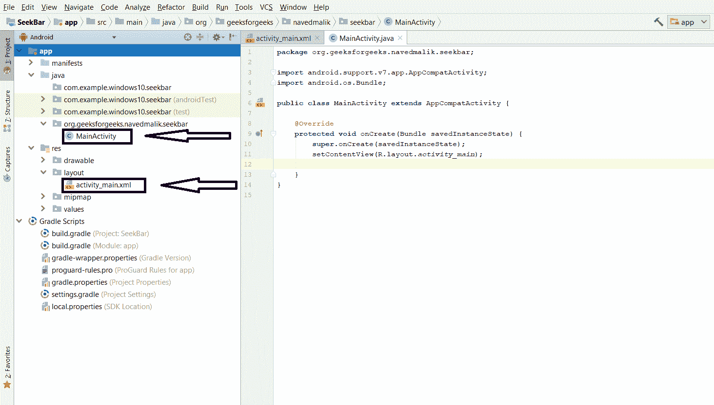
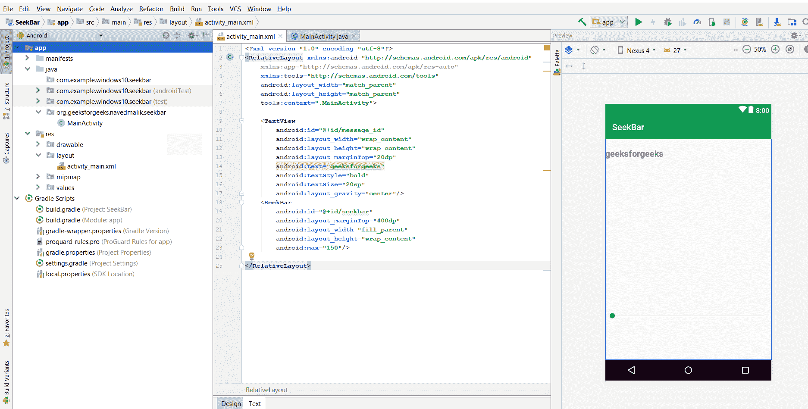
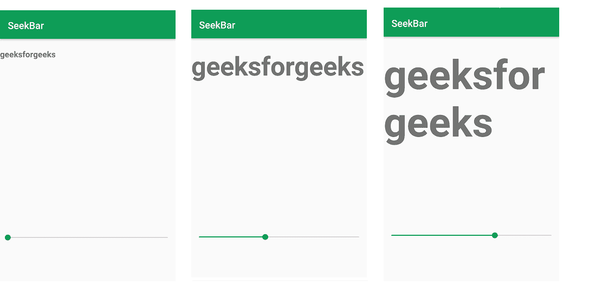

# 安卓|创建 SeekBar

> 原文:[https://www.geeksforgeeks.org/android-creating-a-seekbar/](https://www.geeksforgeeks.org/android-creating-a-seekbar/)

[安卓](https://www.geeksforgeeks.org/tag/android/) **SeekBar** 是 **ProgressBar** 的一种类型。触摸 seekbar 上的拇指，并将其向右或向左拖动，进度的当前值就会改变。SeekBar 用于转发或后退歌曲、视频等。在**设置中，使用了提供三种方法的**界面。

1.  **onProgressChanged** :在这个方法中，进度被改变，然后根据这个改变，进度值可以用在我们的逻辑中。
2.  **onStartTrackingTouch** :在这个方法中，当用户已经开始拖动时，那么这个方法将被自动调用。
3.  **ontoptrackingtouch**:在这个方法中，当用户停止拖动时，那么这个方法会自动调用。

**以下是创建 SeekBar 安卓应用的步骤:**

*   **Step1:** Create a new project. After that, you will have java and XML file.

    

*   **Step2:** Open your xml file and add a SeekBar and TextView for message as shown below, max attribute in SeekBar define the maximum it can take. Assign ID to SeekBar And TextView.

    

*   **步骤 3:** 现在，打开活动 java 文件然后定义 SeekBar 和 TextView 变量，使用 findViewById()获取 SeekBar 和 TextView。
*   **步骤 4:** 执行用于获取进度值的寻道条更改监听器事件。通过使用这个事件监听器，我们得到了 Progress 的值，并且通过使用 TextView 来显示进度，这会增加大小。
*   **第五步:**现在运行应用程序，触摸拇指然后拖动，文本大小会自动增加。

**SeekBar 的 MainActivity.java 或 activity_main.xml 的完整代码如下:**

## activity_main.xml

```
<?xml version="1.0" encoding="utf-8"?>
<RelativeLayout 
    xmlns:android="http://schemas.android.com/apk/res/android"
    xmlns:app="http://schemas.android.com/apk/res-auto"
    xmlns:tools="http://schemas.android.com/tools"
    android:layout_width="match_parent"
    android:layout_height="match_parent"
    tools:context=".MainActivity">

    <TextView
        android:id="@+id/message_id"
        android:layout_width="wrap_content"
        android:layout_height="wrap_content"
        android:layout_marginTop="20dp"
        android:text="geeksforgeeks"
        android:textStyle="bold"
        android:textSize="20sp"
        android:layout_gravity="center"/>
    <SeekBar
        android:id="@+id/seekbar"
        android:layout_marginTop="400dp"
        android:layout_width="fill_parent"
        android:layout_height="wrap_content"
        android:max="150"/>

</RelativeLayout>
```

## MainActivity.java

```
package org.geeksforgeeks.navedmalik.seekbar;

// Import the libraries
import android.support.v7.app.AppCompatActivity;
import android.os.Bundle;
import android.widget.SeekBar;
import android.widget.TextView;

public class MainActivity extends AppCompatActivity {

    // Define the global variable
    SeekBar seekbar;
    TextView Text_message;

    @Override
    protected void onCreate(Bundle savedInstanceState)
    {
        super.onCreate(savedInstanceState);

        // Binding the layout to the file
        setContentView(R.layout.activity_main);

        // use findViewById() to get the Button
        Text_message
            = (TextView)findViewById(R.id.message_id);
        seekbar
            = (SeekBar)findViewById(R.id.seekbar);

        // Get the progress value of the SeekBar
        // using setOnSeekBarChangeListener() method
        seekbar
            .setOnSeekBarChangeListener(
                new SeekBar
                    .OnSeekBarChangeListener() {

                        // When the progress value has changed
                        @Override
                        public void onProgressChanged(
                            SeekBar seekBar,
                            int progress,
                            boolean fromUser)
                        {

                            // increment 1 in progress and
                            // increase the textsize
                            // with the value of progress
                            message.setTextSize(progress + 1);
                        }

                        @Override
                        public void onStartTrackingTouch(SeekBar seekBar)
                        {

                            // This method will automatically
                            // called when the user touches the SeekBar
                        }

                        @Override
                        public void onStopTrackingTouch(SeekBar seekBar)
                        {

                            // This method will automatically
                            // called when the user
                            // stops touching the SeekBar
                        }Prograss
                    });
    }
}
```

**Output:**
