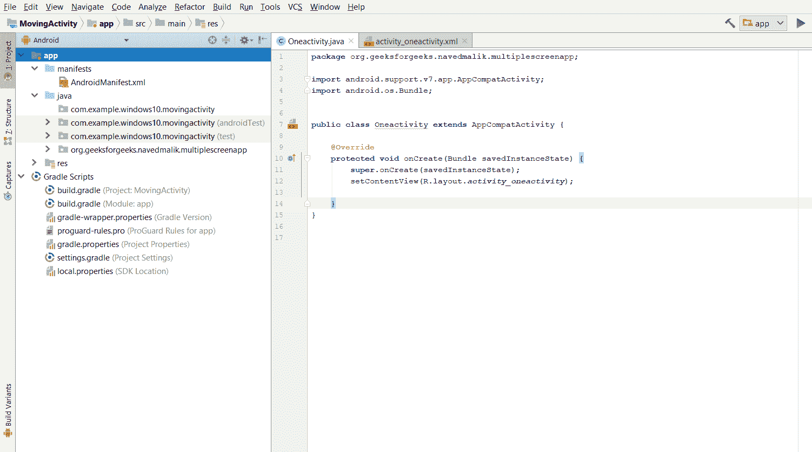
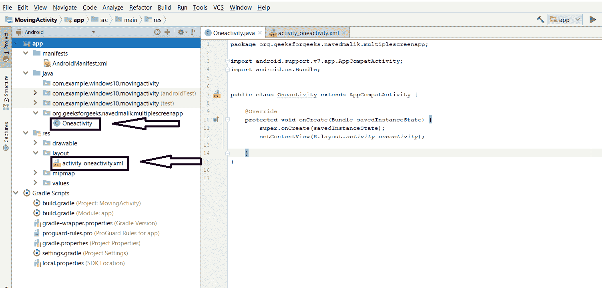
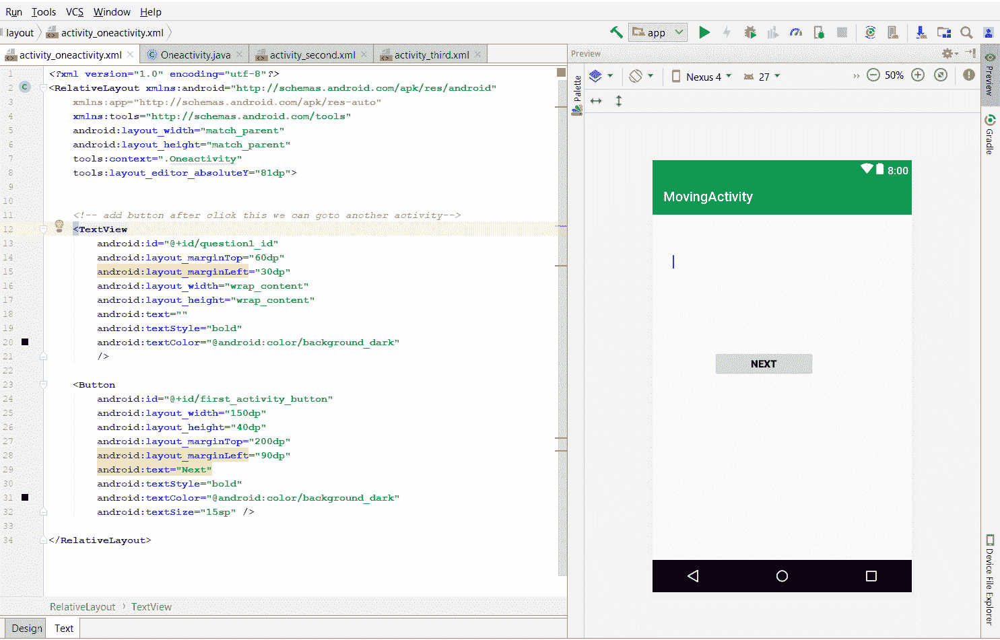
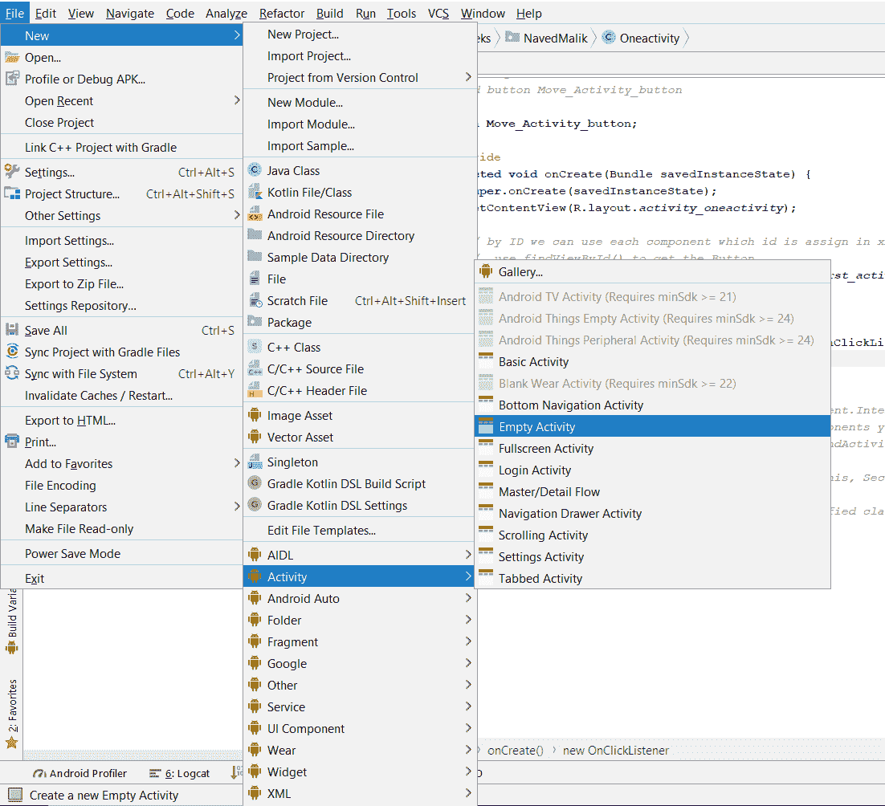
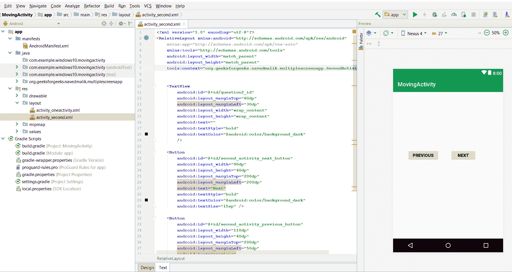
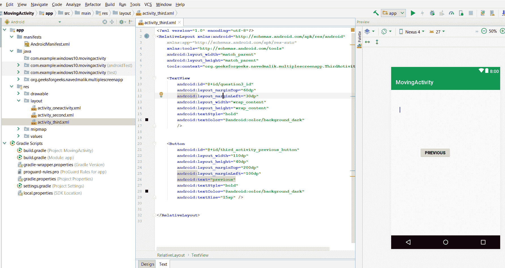
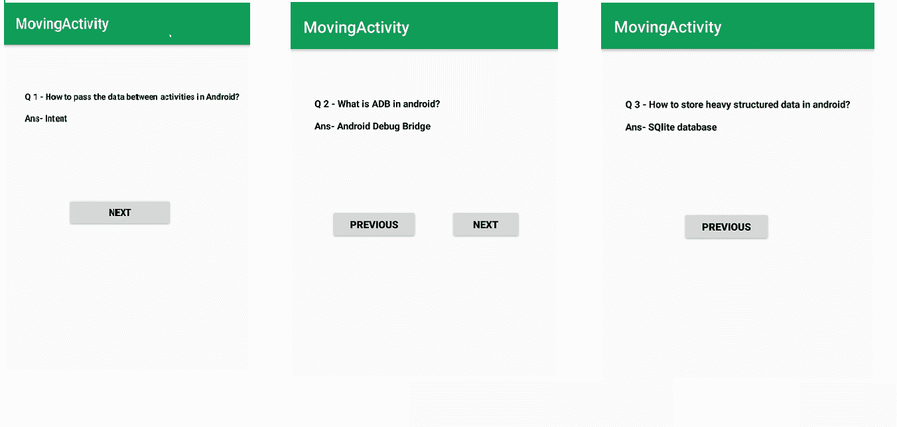

# 安卓|创建多屏应用

> 原文:[https://www . geesforgeks . org/Android-creating-multi-screen-app/](https://www.geeksforgeeks.org/android-creating-multiple-screen-app/)

本文展示了如何创建一个 android 应用程序来从一个活动转移到另一个活动。

下面是创建一个简单的安卓应用程序从一个活动转移到另一个活动的步骤。

**STEP-1:** 创建新项目，您的项目屏幕如下所示。



**STEP-2:** 您将拥有 xml 和活动 java 文件，下面给出了这两个文件的路径。



**STEP-3:** 打开你的 xml 文件，添加 Button，因为点击这个按钮后，我们会进入第二个活动，如下所示。为消息添加文本视图。为按钮和文本视图分配标识。



**STEP-4:** 现在我们必须创建另一个活动(SecondActivity)来从一个活动移动到另一个活动。创建第二个活动，转到安卓项目>文件>新的>活动>空活动



**STEP-5:** 现在打开你的第二个 xml 文件，这个文件的路径和第一个 xml 文件一样。为消息添加文本视图，并添加 2 个按钮一个用于下一个活动，第二个用于上一个活动。为文本视图和两个按钮分配标识。第二项活动如下所示:



**STEP-6:** 现在，我们必须创建与第二个活动相同的第三个活动，并且该文件的路径也与另一个相同。(“现在，您可以像这样创建许多活动”)这里，我们为消息添加了文本视图，为转到上一个活动添加了一个按钮。它将在下面显示



**STEP-7:** 现在，打开你的第一个活动 java 文件。定义 Button (next_button 或者可以是 previous_button)和 TextView 变量，使用 findViewById()获取 Button 和 TextView。

**STEP-8:** 我们需要将点击监听器添加到所有按钮(next_button 或者可以是 previous_button)。

**STEP-9:** 当 onclicklistener 方法中的按钮被单击时，创建一个启动一个称为另一个活动的活动的意图。

**STEP-10:** 对每个活动重复步骤 7、8、9。

**STEP-11:** 现在运行应用程序，点击按钮即可进入第二个活动。
在第一个活动中，这里只有一个按钮和文本视图

**OneActivity.java 或 activity_oneactivity 的完整代码，Firstactivity 的 xml 如下。**

**文件名:activity_oneactivity.xml**

## 可扩展标记语言

```
<?xml version="1.0" encoding="utf-8"?>
<RelativeLayout xmlns:android="http://schemas.android.com/apk/res/android"
    xmlns:app="http://schemas.android.com/apk/res-auto"
    xmlns:tools="http://schemas.android.com/tools"
    android:layout_width="match_parent"
    android:layout_height="match_parent"
    tools:context=".Oneactivity"
    tools:layout_editor_absoluteY="81dp">

    <TextView
        android:id="@+id/question1_id"
        android:layout_marginTop="60dp"
        android:layout_marginLeft="30dp"
        android:layout_width="wrap_content"
        android:layout_height="wrap_content"
        android:text=""
        android:textStyle="bold"
        android:textColor="@android:color/background_dark"
        />

    <!-- add button after click this we can goto another activity-->
    <Button
        android:id="@+id/first_activity_button"
        android:layout_width="150dp"
        android:layout_height="40dp"
        android:layout_marginTop="200dp"
        android:layout_marginLeft="90dp"
        android:text="Next"
        android:textStyle="bold"
        android:textColor="@android:color/background_dark"
        android:textSize="15sp" />

</RelativeLayout>
```

**文件名:OneActivity.java**

## Java 语言(一种计算机语言，尤用于创建网站)

```
// Each new activity has its own layout and Java files,
package org.geeksforgeeks.navedmalik.multiplescreenapp;

import android.content.Intent;
import android.support.v7.app.AppCompatActivity;
import android.os.Bundle;
import android.view.View;
import android.widget.Button;
import android.widget.TextView;

public class Oneactivity extends AppCompatActivity {

    // define the global variable

    TextView question1;
    // Add button Move to Activity

    Button next_Activity_button;

    @Override
    protected void onCreate(Bundle savedInstanceState)
    {
        super.onCreate(savedInstanceState);
        setContentView(R.layout.activity_oneactivity);

        // by ID we can use each component which id is assign in xml file
        // use findViewById() to get the Button
        next_Activity_button = (Button)findViewById(R.id.first_activity_button);
        question1 = (TextView)findViewById(R.id.question1_id);

        // In question1 get the TextView use by findViewById()
        // In TextView set question Answer for message
        question1.setText("Q 1 - How to pass the data between activities in Android?\n"
                          + "\n"
                          + "Ans- Intent");

        // Add_button add clicklistener
        next_Activity_button.setOnClickListener(new View.OnClickListener() {

            public void onClick(View v)
            {

                // Intents are objects of the android.content.Intent type. Your code can send them
                // to the Android system defining the components you are targeting.
                // Intent to start an activity called SecondActivity with the following code:

                Intent intent = new Intent(Oneactivity.this, SecondActivity.class);

                // start the activity connect to the specified class
                startActivity(intent);
            }
        });
    }
}
```

**注意:**这里我们将为消息添加下一个按钮和上一个按钮以及文本视图。

**SecondActivity.java 或第二活动的完整代码如下。**

**文件名:activity_second.xml**

## 可扩展标记语言

```
<?xml version="1.0" encoding="utf-8"?>
<RelativeLayout xmlns:android="http://schemas.android.com/apk/res/android"
    xmlns:app="http://schemas.android.com/apk/res-auto"
    xmlns:tools="http://schemas.android.com/tools"
    android:layout_width="match_parent"
    android:layout_height="match_parent"
    tools:context="org.geeksforgeeks.navedmalik.multiplescreenapp.SecondActivity">

    <TextView
        android:id="@+id/question2_id"
        android:layout_marginTop="60dp"
        android:layout_marginLeft="30dp"
        android:layout_width="wrap_content"
        android:layout_height="wrap_content"
        android:text=""
        android:textStyle="bold"
        android:textColor="@android:color/background_dark"
        />

    <Button
        android:id="@+id/second_activity_next_button"
        android:layout_width="90dp"
        android:layout_height="40dp"
        android:layout_marginTop="200dp"
        android:layout_marginLeft="200dp"
        android:text="Next"
        android:textStyle="bold"
        android:textColor="@android:color/background_dark"
        android:textSize="15sp" />

    <Button
        android:id="@+id/second_activity_previous_button"
        android:layout_width="110dp"
        android:layout_height="40dp"
        android:layout_marginTop="200dp"
        android:layout_marginLeft="50dp"
        android:text="previous"
        android:textStyle="bold"
        android:textColor="@android:color/background_dark"
        android:textSize="15sp" />

</RelativeLayout>
```

**文件名:SecondActivity.java**

## Java 语言(一种计算机语言，尤用于创建网站)

```
package org.geeksforgeeks.navedmalik.multiplescreenapp;

import android.support.v7.app.AppCompatActivity;
import android.os.Bundle;
import android.view.View;
import android.widget.Button;
import android.content.Intent;
import android.widget.TextView;

public class SecondActivity extends AppCompatActivity {

    // define the global variable
    TextView question2;
    // Add button Move to next Activity and previous Activity
    Button next_button, previous_button;
    @Override
    protected void onCreate(Bundle savedInstanceState)
    {
        super.onCreate(savedInstanceState);
        setContentView(R.layout.activity_second);

        // by ID we can use each component which id is assign in xml file
        // use findViewById() to get the both Button and textview

        next_button = (Button)findViewById(R.id.second_activity_next_button);
        previous_button = (Button)findViewById(R.id.second_activity_previous_button);
        question2 = (TextView)findViewById(R.id.question2_id);

        // In question1 get the TextView use by findViewById()
        // In TextView set question Answer for message

        question2.setText("Q 2 - What is ADB in android?\n"
                          + "\n"
                          + "Ans- Android Debug Bridge");

        // Add_button add clicklistener
        next_button.setOnClickListener(new View.OnClickListener() {

            public void onClick(View v)
            {

                // Intents are objects of the android.content.Intent type. Your code can send them
                // to the Android system defining the components you are targeting.
                // Intent to start an activity called ThirdActivity with the following code:

                Intent intent = new Intent(SecondActivity.this, ThirdActivity.class);

                // start the activity connect to the specified class
                startActivity(intent);
            }
        });

        // Add_button add clicklistener
        previous_button.setOnClickListener(new View.OnClickListener() {

            public void onClick(View v)
            {

                // Intents are objects of the android.content.Intent type. Your code can send them
                // to the Android system defining the components you are targeting.
                // Intent to start an activity called oneActivity with the following code:

                Intent intent = new Intent(SecondActivity.this, Oneactivity.class);

                // start the activity connect to the specified class
                startActivity(intent);
            }
        });
    }
}
```

**注意:**这里我们只为消息添加下一个按钮和文本视图。

**ThirdActivity.java 或第三活动的完整代码如下。**

**文件名:activity_third.xml**

## 可扩展标记语言

```
<?xml version="1.0" encoding="utf-8"?>
<RelativeLayout xmlns:android="http://schemas.android.com/apk/res/android"
    xmlns:app="http://schemas.android.com/apk/res-auto"
    xmlns:tools="http://schemas.android.com/tools"
    android:layout_width="match_parent"
    android:layout_height="match_parent"
    tools:context="org.geeksforgeeks.navedmalik.multiplescreenapp.ThirdActivity">

    <TextView
        android:id="@+id/question3_id"
        android:layout_marginTop="60dp"
        android:layout_marginLeft="30dp"
        android:layout_width="wrap_content"
        android:layout_height="wrap_content"
        android:textStyle="bold"
        android:textColor="@android:color/background_dark"
        />

    <Button
        android:id="@+id/third_activity_previous_button"
        android:layout_width="110dp"
        android:layout_height="40dp"
        android:layout_marginTop="200dp"
        android:layout_marginLeft="100dp"
        android:text="previous"
        android:textStyle="bold"
        android:textColor="@android:color/background_dark"
        android:textSize="15sp" />

</RelativeLayout>
```

**文件名:ThirdActivity.java**

## Java 语言(一种计算机语言，尤用于创建网站)

```
package org.geeksforgeeks.navedmalik.multiplescreenapp;

import android.support.v7.app.AppCompatActivity;
import android.os.Bundle;
import android.view.View;
import android.widget.Button;
import android.content.Intent;
import android.widget.TextView;

public class ThirdActivity extends AppCompatActivity {

    // define the global variable
    TextView question3;
    // Add button Move previous activity
    Button previous_button;
    @Override
    protected void onCreate(Bundle savedInstanceState)
    {
        super.onCreate(savedInstanceState);
        setContentView(R.layout.activity_third);

        // by ID we can use each component which id is assign in xml file
        // use findViewById() to get the Button and textview.

        previous_button = (Button)findViewById(R.id.third_activity_previous_button);
        question3 = (TextView)findViewById(R.id.question3_id);

        // In question1 get the TextView use by findViewById()
        // In TextView set question Answer for message

        question3.setText("Q 3 - How to store heavy structured data in android?\n"
                          + "\n"
                          + "Ans- SQlite database");
        // Add_button add clicklistener
        previous_button.setOnClickListener(new View.OnClickListener() {

            public void onClick(View v)
            {

                // Intents are objects of the android.content.Intent type. Your code can send them
                // to the Android system defining the components you are targeting.
                // Intent to start an activity called SecondActivity with the following code:

                Intent intent = new Intent(ThirdActivity.this, SecondActivity.class);

                // start the activity connect to the specified class
                startActivity(intent);
            }
        });
    }
}
```

**输出:**

