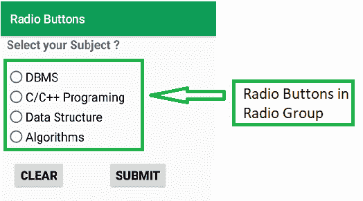
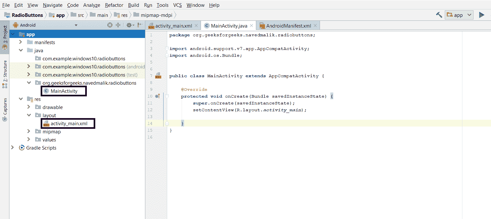
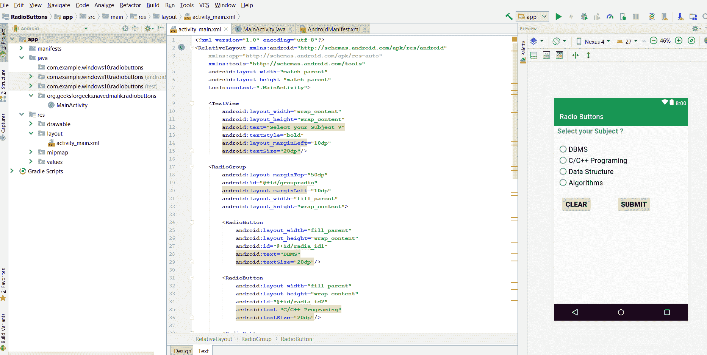

# 安卓|如何在安卓应用中添加单选按钮？

> 原文:[https://www . geeksforgeeks . org/android-如何添加单选按钮-在 Android 应用程序中/](https://www.geeksforgeeks.org/android-how-to-add-radio-buttons-in-an-android-application/)

**先决条件:**

*   [新手安卓应用开发基础](https://www.geeksforgeeks.org/android-app-development-fundamentals-for-beginners/)
*   [安卓工作室安装设置指南](https://www.geeksforgeeks.org/guide-to-install-and-set-up-android-studio/)
*   [安卓|从第一个 app/安卓项目开始](https://www.geeksforgeeks.org/android-starting-with-first-app-android-project/)
*   [安卓|运行你的第一个安卓应用](https://www.geeksforgeeks.org/android-running-your-first-android-app/)

[安卓](https://www.geeksforgeeks.org/tag/android/) **单选按钮**是一个可以有多个选项选择的小部件。用户一次只能选择一个选项。这里的每个选项都指一个单选按钮，该主题的所有选项统称为“单选按钮组”。因此，单选按钮在单选按钮组中使用。

**例如:**



这张图片显示了一个问题的 4 个主题选项。在这种情况下，每个提到的主题都是一个单选按钮，所有 4 个主题都包含在一个单选按钮组中。

### 如何创建使用单选按钮的安卓应用程序

这个例子将有助于根据上面的例子开发一个创建单选按钮的安卓应用程序:

**第一步:**首先创建一个新的安卓应用。这将创建一个 XML 文件“activity_main.xml”和一个 Java 文件“MainActivity”。Java”。请参考先决条件以了解有关此步骤的更多信息。



**步骤 2:** 打开“activity_main.xml”文件，在[相对布局](https://www.geeksforgeeks.org/layouts-android-ui-design/)中添加以下小部件:

*   显示问题信息的**文本视图**
*   一个**单选按钮组**，用于保存选项单选按钮，这些按钮是可能的答案
*   **4 个单选按钮**各持一个答案。
*   “提交”和“清除”按钮，用于存储响应。

此外，给每个组件分配**以及其他属性，如下图和代码所示。组件上分配的标识有助于在 Java 文件中轻松找到和使用该组件。**

****语法:****

```java
android:id="@+id/id_name"
```

**这里给定的标识如下:**

*   **无线电组:无线电组**
*   **RadioButton1: radia_id1**
*   **RadioButton2: radia_id2**
*   **RadioButton3: radia_id3**
*   **RadioButton4: radia_id4**
*   **提交按钮:提交**
*   **清除按钮:清除**

**这将使应用程序的用户界面。**

****

****步骤 3:** 现在，在 UI 之后，这一步将创建应用程序后端。为此，请打开“MainActivity.java”文件，并使用 findViewById()方法实例化在 XML 文件(RadioGroup、TextView、Clear 和 Submit Button)中制作的组件。此方法借助于分配的标识将创建的对象绑定到用户界面组件。**

****一般语法:****

> ****组件类型对象=(组件类型)findviewbyid(r . id . idfthek 组件)；****

****所用组件的语法:****

> ****按钮提交=(Button)findwiewbyid(r . id . submit)；**
> **按钮清除=(按钮)findwiewbyid(r . id . clear)；**
> **radio group radio group =(radio group)findwiewbyid(r . id . group radio)；****

****步骤 4:** 该步骤包括设置收音机组、收音机按钮以及提交和清除按钮的操作。**

**这些操作如下:**

*   **最初将所有单选按钮设为默认值。这是通过以下命令完成的:**

```java
radioGroup.clearCheck();
```

*   **在收音机组中添加监听器。这将有助于了解用户何时点击任何单选按钮，以及将执行的进一步操作。监听器可以添加如下:**

> ****射电集团。setoncheckedchangelistener(新射电集团。onchecedchangelistener(){ }****

*   **定义单击单选按钮时要执行的操作。这涉及到使用 id 获取已被点击的特定单选按钮。然后该单选按钮被设置，单选按钮的其余部分被重置。**
*   **在提交按钮和清除按钮上添加监听器。这将用于检查用户何时点击按钮。具体如下:**

> ****提交。setonclicklistener(新视图)。OnClickListener() {}**
> **清晰。setonclicklistener(新视图)。onclick listener(){ }****

*   **在提交按钮监听器中，设置要执行的操作。这包括以**吐司**的形式显示标记的答案。**
*   **在清除按钮监听器中，设置要执行的操作。这包括重置所有单选按钮。**

****步骤 5:** 现在运行应用程序，操作如下:**

*   **当应用程序打开时，它会显示一个有 4 个答案的问题和一个清晰的提交按钮。**
*   **单击任何答案时，该单选按钮将被设置。**
*   **单击任何其他单选按钮设置该选项，并重置其他选项。**
*   **单击提交按钮，将当前标记的答案显示为吐司。**
*   **单击清除按钮将所有单选按钮重置为默认状态。**

****MainActivity.java 的完整代码和 RadioButton 的 activity_main.xml 如下。****

****文件名:activity_main.xml****

## **可扩展标记语言**

```java
<?xml version="1.0" encoding="utf-8"?>
<RelativeLayout
    xmlns:android="http://schemas.android.com/apk/res/android"
    xmlns:app="http://schemas.android.com/apk/res-auto"
    xmlns:tools="http://schemas.android.com/tools"
    android:layout_width="match_parent"
    android:layout_height="match_parent"
    tools:context=".MainActivity">

    <TextView
        android:layout_width="wrap_content"
        android:layout_height="wrap_content"
        android:text="Select your Subject ?"
        android:textStyle="bold"
        android:layout_marginLeft="10dp"
        android:textSize="20dp"/>

    <!-- add RadioGroup which contain the many RadioButton-->
    <RadioGroup
        android:layout_marginTop="50dp"
        android:id="@+id/groupradio"
        android:layout_marginLeft="10dp"
        android:layout_width="fill_parent"
        android:layout_height="wrap_content">

         <!-- In RadioGroup create the 1 Radio Button-->
         <!-- like this we will add some more Radio Button-->
        <RadioButton
            android:layout_width="fill_parent"
            android:layout_height="wrap_content"
            android:id="@+id/radia_id1"
            android:text="DBMS"
            android:textSize="20dp"/>

        <RadioButton
            android:layout_width="fill_parent"
            android:layout_height="wrap_content"
            android:id="@+id/radia_id2"
            android:text="C/C++ Programming"
            android:textSize="20dp"/>

        <RadioButton
            android:layout_width="fill_parent"
            android:layout_height="wrap_content"
            android:id="@+id/radia_id3"
            android:text="Data Structure"
            android:textSize="20dp"/>

        <RadioButton
            android:layout_width="fill_parent"
            android:layout_height="wrap_content"
            android:id="@+id/radia_id4"
            android:text="Algorithms"
            android:textSize="20dp"/>
    </RadioGroup>

    <!-- add button For Submit the Selected item-->
    <Button
        android:layout_width="wrap_content"
        android:layout_height="wrap_content"
        android:text="Submit"
        android:id="@+id/submit"
        android:textStyle="bold"
        android:textSize="20dp"
        android:layout_marginTop="200dp"
        android:layout_marginLeft="180dp"
        />

    <!-- add clear button for clear the selected item-->
    <Button
        android:layout_width="wrap_content"
        android:layout_height="wrap_content"
        android:text="Clear"
        android:id="@+id/clear"
        android:textSize="20dp"
        android:textStyle="bold"
        android:layout_marginTop="200dp"
        android:layout_marginLeft="20dp"
        />

</RelativeLayout>
```

****文件名:MainActivity。Java〔t1〕****

## **Java 语言(一种计算机语言，尤用于创建网站)**

```java
package org.geeksforgeeks.navedmalik.radiobuttons;

import android.support.v7.app.AppCompatActivity;
import android.os.Bundle;
import android.view.View;
import android.widget.Button;
import android.widget.RadioButton;
import android.widget.RadioGroup;
import android.widget.Toast;

public class MainActivity extends AppCompatActivity {

    // Define the object for Radio Group,
    // Submit and Clear buttons
    private RadioGroup radioGroup;
    Button submit, clear;

    @Override
    protected void onCreate(Bundle savedInstanceState)
    {
        super.onCreate(savedInstanceState);
        setContentView(R.layout.activity_main);

        // Bind the components to their respective objects
        // by assigning their IDs
        // with the help of findViewById() method
        submit = (Button)findViewById(R.id.submit);
        clear = (Button)findViewById(R.id.clear);
        radioGroup = (RadioGroup)findViewById(R.id.groupradio);

        // Uncheck or reset the radio buttons initially
        radioGroup.clearCheck();

        // Add the Listener to the RadioGroup
        radioGroup.setOnCheckedChangeListener(
            new RadioGroup
                .OnCheckedChangeListener() {
                    @Override

                    // The flow will come here when
                    // any of the radio buttons in the radioGroup
                    // has been clicked

                    // Check which radio button has been clicked
                    public void onCheckedChanged(RadioGroup group,
                                                 int checkedId)
                    {

                        // Get the selected Radio Button
                        RadioButton
                            radioButton
                            = (RadioButton)group
                                  .findViewById(checkedId);
                    }
                });

        // Add the Listener to the Submit Button
        submit.setOnClickListener(new View.OnClickListener() {

            @Override
            public void onClick(View v)
            {

                // When submit button is clicked,
                // Ge the Radio Button which is set
                // If no Radio Button is set, -1 will be returned
                int selectedId = radioGroup.getCheckedRadioButtonId();
                if (selectedId == -1) {
                    Toast.makeText(MainActivity.this,
                                   "No answer has been selected",
                                   Toast.LENGTH_SHORT)
                        .show();
                }
                else {

                    RadioButton radioButton
                        = (RadioButton)radioGroup
                              .findViewById(selectedId);

                    // Now display the value of selected item
                    // by the Toast message
                    Toast.makeText(MainActivity.this,
                                   radioButton.getText(),
                                   Toast.LENGTH_SHORT)
                        .show();
                }
            }
        });

        // Add the Listener to the Submit Button
        clear.setOnClickListener(new View.OnClickListener() {

            @Override
            public void onClick(View v)
            {

                // Clear RadioGroup
                // i.e. reset all the Radio Buttons
                radioGroup.clearCheck();
            }
        });
    }
}
```

****输出:****

****