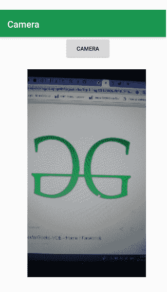
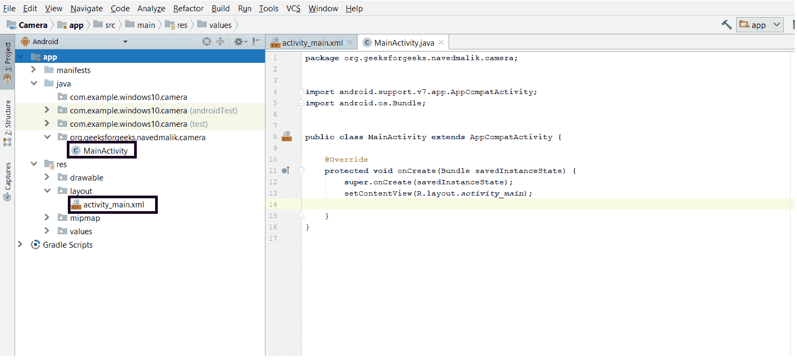
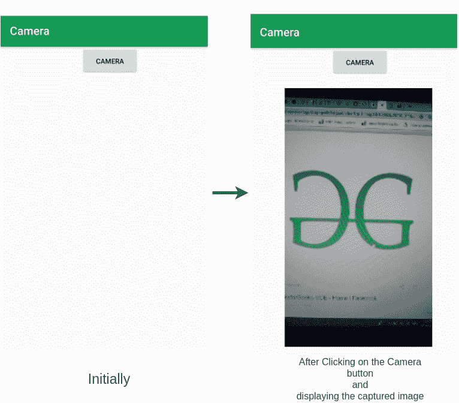

# 安卓|如何通过意图打开摄像头并显示拍摄的图像

> 原文:[https://www . geeksforgeeks . org/Android-如何通过意图和显示捕获的图像打开相机/](https://www.geeksforgeeks.org/android-how-to-open-camera-through-intent-and-display-captured-image/)

**先决条件:**

*   [新手安卓应用开发基础](https://www.geeksforgeeks.org/android-app-development-fundamentals-for-beginners/)
*   [安卓工作室安装设置指南](https://www.geeksforgeeks.org/guide-to-install-and-set-up-android-studio/)
*   [安卓|从第一个 app/安卓项目开始](https://www.geeksforgeeks.org/android-starting-with-first-app-android-project/)
*   [安卓|运行你的第一个安卓应用](https://www.geeksforgeeks.org/android-running-your-first-android-app/)

这篇文章的目的是展示如何从一个应用程序中打开相机，点击图像，然后在同一个应用程序中显示这个图像。本文开发了一个 android 应用程序来实现这一点。在**媒体商店**类的 **ACTION_IMAGE_CAPTURE** 意图的帮助下，从我们的应用程序内部打开摄像头。

**例如:**



此图像显示了摄像机点击并在图像视图中设置的图像。当应用程序打开时，它会显示“相机”按钮来打开相机。当按下时，动作 _ 图像 _ 捕获意图由媒体存储类启动。捕获图像后，它会显示在 imageview 中。

### 如何创建一个应用程序来打开相机通过意图和显示捕获的图像

**第一步:**首先创建一个新的安卓应用。这将创建一个 XML 文件“activity_main.xml”和一个 Java 文件“MainActivity”。Java”。请参考先决条件以了解有关此步骤的更多信息。



**步骤 2:** 打开“activity_main.xml”文件，并在相对布局中添加以下小部件:

*   打开摄像机的**按钮**
*   显示捕获图像的**图像视图**

此外，为每个组件分配 ID 以及其他属性，如下图和代码所示。组件上分配的标识有助于在 Java 文件中轻松找到和使用该组件。

**语法:**

```java
android:id="@+id/id_name"
```

这里给定的标识如下:

*   相机按钮:相机按钮
*   ImageView:单击 _image

这一步将使应用程序的用户界面。

**第三步:**现在，在 UI 之后，这一步将创建 App 的后端。为此，打开“MainActivity.java”文件，并使用 findViewById()方法实例化在 XML 文件(Camera Button，ImageView)中制作的组件。此方法借助于分配的标识将创建的对象绑定到用户界面组件。

**一般语法:**

> **组件类型对象=(组件类型)findviewbyid(r . id . idfthek 组件)；**

**所用组件的语法:**

> **Button camera _ open _ id =(Button)findwiewbyid(r . id . camera _ Button)；**
> **ImageView click _ image _ id =(ImageView)findwiewbyid(r . id . click _ image)；**

**步骤 4:** 该步骤包括设置相机按钮和图像视图的操作。这些操作如下:

*   首先定义变量 pic_id，它是被点击图像的请求 id。具体如下:

> **私有静态最终 int pic_id = 123**

*   在“相机”按钮上添加监听器。这将用于在用户点击按钮时打开相机。具体如下:

> **camera _ open _ id . setnccklistener(新视图)。onclick listener(){ }**

*   现在创建 MediaStore 提供的 ACTION_IMAGE_CAPTURE 意图。这一意图将有助于打开相机捕捉图像。用请求的 pic_id 开始意图。具体如下:

> **意向相机 _ 意向=新意向(MediaStore。ACTION _ IMAGE _ CAPTURE)；**
> **startActivityForResult(camera _ intent，pic _ id)；**

*   现在使用 onActivityResult()方法获取结果，这里是捕获的图像。具体如下:

> **受保护的无效活动结果(int requestCode，int resultCode，Intent data) { }**

*   然后在图像视图中将作为相机意图的结果而接收的图像设置为显示。

> **位图照片=(位图)数据. getextras()。get(" data ")；**
> **点击 _image_id.setImageBitmap(照片)；**

**第 5 步:**现在运行应用程序，操作如下:

*   当应用程序打开时，它会显示一个“相机”按钮。点击它打开相机。
*   捕获图像并显示捕获的图像。

**Camera 应用的 MainActivity.java 和 activity_main.xml 完整代码如下。**

**文件名:activity_main.xml**

## 可扩展标记语言

```java
<?xml version="1.0" encoding="utf-8"?>
<RelativeLayout
    xmlns:android="http://schemas.android.com/apk/res/android"
    xmlns:app="http://schemas.android.com/apk/res-auto"
    xmlns:tools="http://schemas.android.com/tools"
    android:layout_width="match_parent"
    android:layout_height="match_parent"
    tools:context=".MainActivity">

    <!-- add Camera Button to open the Camera-->
    <Button
        android:layout_width="100dp"
        android:layout_height="50dp"
        android:layout_marginLeft="140dp"
        android:id="@+id/camera_button"
        android:text="Camera" />

    <!-- add ImageView to display the captured image-->
    <ImageView
        android:layout_marginTop="70dp"
        android:layout_width="350dp"
        android:layout_marginLeft="15dp"
        android:layout_height="450dp"
        android:id="@+id/click_image"
        android:layout_marginBottom="10dp"/>
</RelativeLayout>
```

**文件名:MainActivity.java**

## Java 语言(一种计算机语言，尤用于创建网站)

```java
package org.geeksforgeeks.navedmalik.camera;

import android.content.Intent;
import android.graphics.Bitmap;
import android.provider.MediaStore;
import android.support.v7.app.AppCompatActivity;
import android.os.Bundle;
import android.view.View;
import android.widget.Button;
import android.widget.ImageView;

public class MainActivity extends AppCompatActivity {

    // Define the pic id
    private static final int pic_id = 123;

    // Define the button and imageview type variable
    Button camera_open_id;
    ImageView click_image_id;

    @Override
    protected void onCreate(Bundle savedInstanceState)
    {
        super.onCreate(savedInstanceState);
        setContentView(R.layout.activity_main);

        // By ID we can get each component
        // which id is assigned in XML file
        // get Buttons and imageview.
        camera_open_id = (Button)findViewById(R.id.camera_button);
        click_image_id = (ImageView)findViewById(R.id.click_image);

        // Camera_open button is for open the camera
        // and add the setOnClickListener in this button
        camera_open_id.setOnClickListener(new View.OnClickListener() {

            @Override
            public void onClick(View v)
            {

                // Create the camera_intent ACTION_IMAGE_CAPTURE
                // it will open the camera for capture the image
                Intent camera_intent
                    = new Intent(MediaStore
                                     .ACTION_IMAGE_CAPTURE);

                // Start the activity with camera_intent,
                // and request pic id
                startActivityForResult(camera_intent, pic_id);
            }
        });
    }

    // This method will help to retrieve the image
    protected void onActivityResult(int requestCode,
                                    int resultCode,
                                    Intent data)
    {

        // Match the request 'pic id with requestCode
        if (requestCode == pic_id) {

            // BitMap is data structure of image file
            // which stor the image in memory
            Bitmap photo = (Bitmap)data.getExtras()
                               .get("data");

            // Set the image in imageview for display
            click_image_id.setImageBitmap(photo);
        }
    }
}
```

**输出:**

