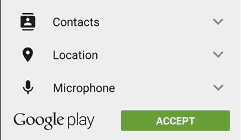
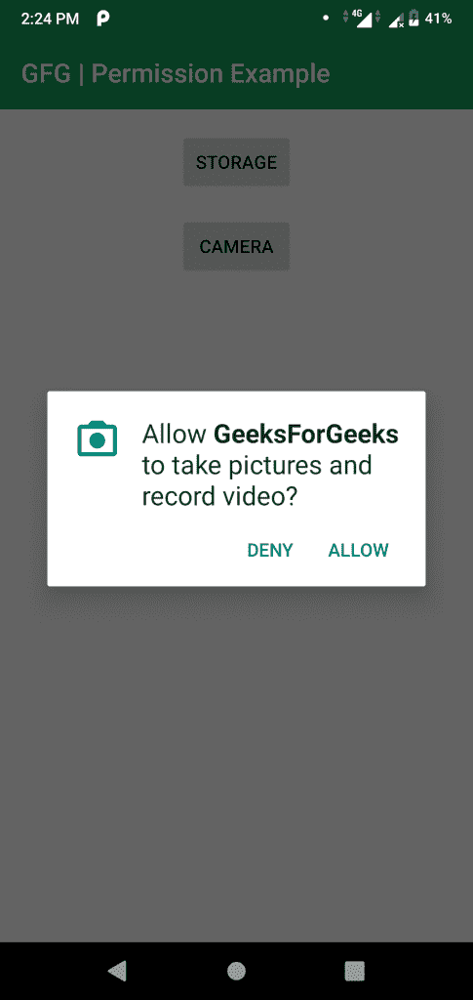

# 如何在安卓应用中请求权限？

> 原文:[https://www . geesforgeks . org/Android-如何在 android-application 中请求权限/](https://www.geeksforgeeks.org/android-how-to-request-permissions-in-android-application/)

从 **Android 6.0 (API 23)** 开始，用户在安装时不需要请求权限，而是开发人员需要在运行时请求权限。只有在清单文件中定义的**权限可以在运行时请求。**

### **权限类型**

**1。安装时权限:**如果**安卓 5.1.1 (API 22)或更低版本**，则在安装时需要在**谷歌 Play 商店**获得权限。



如果用户**接受**权限，则安装该应用。否则应用**安装被取消**。

**2。运行时权限:**如果**安卓 6 (API 23)或更高版本**，则在应用运行期间的运行时请求权限。



如果用户**接受**权限，则可以使用该应用的该功能。要使用该功能，应用程序**再次请求许可**。

所以，现在在运行时请求权限。在本文中，我们将讨论如何在运行时在安卓应用程序中请求权限。

### **运行时请求权限的步骤**

**第一步:在 [**安卓清单文件**](https://www.geeksforgeeks.org/application-manifest-file-android/) **中声明权限:**在安卓中，使用**use-permission**标签在**安卓清单. xml** 文件中声明权限。**

这里我们声明存储和相机许可。

## 可扩展标记语言

```
<!--Declaring the required permissions-->
<uses-permission android:name="android.permission.READ_EXTERNAL_STORAGE" />
<uses-permission android:name="android.permission.WRITE_EXTERNAL_STORAGE" />
<uses-permission android:name="android.permission.CAMERA" />
```