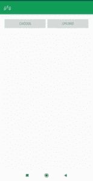
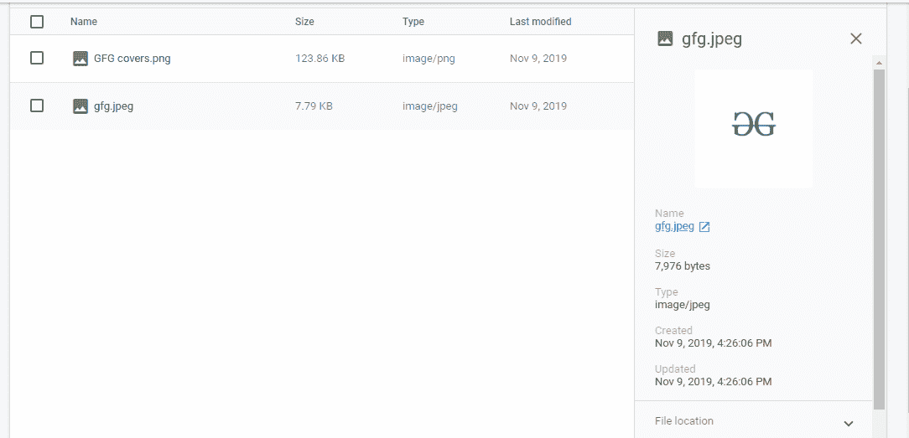

# 安卓:如何在 Firebase 存储上上传图片？

> 原文:[https://www . geesforgeks . org/Android-如何在 firebase-storage 上上传图像/](https://www.geeksforgeeks.org/android-how-to-upload-an-image-on-firebase-storage/)

[Firebase](https://www.geeksforgeeks.org/firebase-realtime-database-with-operations-in-android-with-examples/) 是一个移动和 web 应用开发平台。它提供 web 应用程序或移动应用程序可能需要的服务。Firebase 为 Firebase 应用程序提供安全的文件上传和下载。

**本文介绍了如何构建一个 Android 应用程序，能够从移动图库中选择图像，并将图像上传到 Firebase Storage。**

以下是详细的步骤:

*   **第一步。** [在安卓工作室](https://www.geeksforgeeks.org/android-how-to-create-start-a-new-project-in-android-studio/)上创建一个新项目，或者打开一个现有项目，在其中您想要添加身份验证，[将 firebase 添加到那个安卓应用程序](https://www.geeksforgeeks.org/adding-firebase-to-android-app/)。
*   **第二步。**在 **[build.gradle (Module:app)文件中添加火基存储依赖。](https://www.geeksforgeeks.org/android-build-gradle/)** 火基存储的最新依赖为:

    ```
    implementation 'com.google.firebase:firebase-storage:19.1.0'
    ```

*   **第三步。设置活动 _ 主. xml 布局文件**
    活动 _ 主. xml 布局文件包括:

1.  两种布局:在相对布局中嵌套线性布局
2.  两个按钮:
    *   一个用于从图库中选择图像
    *   另一个按钮用于上传云上 firebase 存储上的图像
3.  从图库中选择显示图像的图像视图

下面是 activity_main.xml 的完整代码:

## activity_main.xml

```
<?xml version="1.0" encoding="utf-8"?>
<RelativeLayout 
    xmlns:android="https://schemas.android.com/apk/res/android"
    xmlns:tools="http://schemas.android.com/tools"
    android:layout_width="match_parent"
    android:layout_height="match_parent"
    android:padding="16dp"
    tools:context=".MainActivity">

 <!--Linear Layout with horizontal orientation
     and other properties-->
 <LinearLayout
    android:id="@+id/layout_button"
    android:orientation="horizontal"
    android:layout_alignParentTop="true"
    android:weightSum="2"
    android:layout_width="match_parent"
    android:layout_height="wrap_content">

    <!--Button for choosing image from gallery-->
    <Button
        android:id="@+id/btnChoose"
        android:text="Choose"
        android:layout_weight="1"
        android:layout_width="0dp"
        android:layout_height="wrap_content" />

    <!--Button for uploading image-->
    <Button
        android:id="@+id/btnUpload"
        android:text="Upload"
        android:layout_weight="1"
        android:layout_width="0dp"
        android:layout_height="wrap_content" />
</LinearLayout>

    <!--Image View for showing image chosen from gallery-->
    <ImageView
        android:id="@+id/imgView"
        android:layout_width="match_parent"
        android:layout_height="match_parent" />
</RelativeLayout>
```

*   **Step 4\. Setting up MainActivity.java file**
    In MainActivity
    *   在已定义的按钮视图的交互上设置侦听器。在交互时，您希望调用一个方法来触发从图库中选择图像或将所选图像上传到 Firebase 存储。**设置点击监听器**用于交互的动作。
    *   调用 SelectImage 方法时，会创建一个新的意图实例。意图类型设置为图像，其动作设置为获取一些内容。该意图创建了一个图像选择器对话框，允许用户在设备图库中搜索以从图库中选择图像。
    *   **startActivityForResult** 用于接收结果，即选中的图像。
    *   要显示此图像，请使用名为**的方法。onActivityResult 接收请求代码、结果代码和数据。如果请求代码等于 **PICK_IMAGE_REQUEST** ，结果代码等于 **RESULT_OK** 且数据可用，则勾选此方法。如果所有这些都是真的，则在下面的图像视图按钮中显示选定的图像。**
    *   重写 startActivityForResult 方法并编写其实现。
    *   同样在 **uploadImage()** 方法中，取 firebase 存储引用， **putFile()** 函数将镜像上传到 Firebase 存储，有成功和失败监听器。如果上传的是图片，那么就有成功祝酒词，否则就有失败祝酒词。

    ## MainActivity.java

    ```
    package com.geeksforgeeks.uploadimagetofirebase;

    import android.app.ProgressDialog;
    import android.content.Intent;
    import android.graphics.Bitmap;
    import android.graphics.Color;
    import android.graphics.drawable.ColorDrawable;
    import android.net.Uri;
    import android.provider.MediaStore;
    import android.support.annotation.Nullable;
    import android.support.v7.app.ActionBar;
    import android.support.v7.app.AppCompatActivity;
    import android.os.Bundle;
    import android.view.View;
    import android.widget.Button;
    import android.widget.ImageView;
    import android.widget.Toast;

    import java.io.IOException;
    import java.util.UUID;

    public class MainActivity extends AppCompatActivity {

        // views for button
        private Button btnSelect, btnUpload;

        // view for image view
        private ImageView imageView;

        // Uri indicates, where the image will be picked from
        private Uri filePath;

        // request code
        private final int PICK_IMAGE_REQUEST = 22;

        // instance for firebase storage and StorageReference
        FirebaseStorage storage;
        StorageReference storageReference;

        @Override
        protected void onCreate(Bundle savedInstanceState)
        {
            super.onCreate(savedInstanceState);
            setContentView(R.layout.activity_main);

            ActionBar actionBar;
            actionBar = getSupportActionBar();
            ColorDrawable colorDrawable
                = new ColorDrawable(
                    Color.parseColor("#0F9D58"));
            actionBar.setBackgroundDrawable(colorDrawable);

            // initialise views
            btnSelect = findViewById(R.id.btnChoose);
            btnUpload = findViewById(R.id.btnUpload);
            imageView = findViewById(R.id.imgView);

            // get the Firebase  storage reference
            storage = FirebaseStorage.getInstance();
            storageReference = storage.getReference();

            // on pressing btnSelect SelectImage() is called
            btnSelect.setOnClickListener(new View.OnClickListener() {
                @Override
                public void onClick(View v)
                {
                    SelectImage();
                }
            });

            // on pressing btnUpload uploadImage() is called
            btnUpload.setOnClickListener(new View.OnClickListener() {
                @Override
                public void onClick(View v)
                {
                    uploadImage();
                }
            });
        }

        // Select Image method
        private void SelectImage()
        {

            // Defining Implicit Intent to mobile gallery
            Intent intent = new Intent();
            intent.setType("image/*");
            intent.setAction(Intent.ACTION_GET_CONTENT);
            startActivityForResult(
                Intent.createChooser(
                    intent,
                    "Select Image from here..."),
                PICK_IMAGE_REQUEST);
        }

        // Override onActivityResult method
        @Override
        protected void onActivityResult(int requestCode,
                                        int resultCode,
                                        Intent data)
        {

            super.onActivityResult(requestCode,
                                   resultCode,
                                   data);

            // checking request code and result code
            // if request code is PICK_IMAGE_REQUEST and
            // resultCode is RESULT_OK
            // then set image in the image view
            if (requestCode == PICK_IMAGE_REQUEST
                && resultCode == RESULT_OK
                && data != null
                && data.getData() != null) {

                // Get the Uri of data
                filePath = data.getData();
                try {

                    // Setting image on image view using Bitmap
                    Bitmap bitmap = MediaStore
                                        .Images
                                        .Media
                                        .getBitmap(
                                            getContentResolver(),
                                            filePath);
                    imageView.setImageBitmap(bitmap);
                }

                catch (IOException e) {
                    // Log the exception
                    e.printStackTrace();
                }
            }
        }

        // UploadImage method
        private void uploadImage()
        {
            if (filePath != null) {

                // Code for showing progressDialog while uploading
                ProgressDialog progressDialog
                    = new ProgressDialog(this);
                progressDialog.setTitle("Uploading...");
                progressDialog.show();

                // Defining the child of storageReference
                StorageReference ref
                    = storageReference
                          .child(
                              "images/"
                              + UUID.randomUUID().toString());

                // adding listeners on upload
                // or failure of image
                ref.putFile(filePath)
                    .addOnSuccessListener(
                        new OnSuccessListener<UploadTask.TaskSnapshot>() {

                            @Override
                            public void onSuccess(
                                UploadTask.TaskSnapshot taskSnapshot)
                            {

                                // Image uploaded successfully
                                // Dismiss dialog
                                progressDialog.dismiss();
                                Toast
                                    .makeText(MainActivity.this,
                                              "Image Uploaded!!",
                                              Toast.LENGTH_SHORT)
                                    .show();
                            }
                        })

                    .addOnFailureListener(new OnFailureListener() {
                        @Override
                        public void onFailure(@NonNull Exception e)
                        {

                            // Error, Image not uploaded
                            progressDialog.dismiss();
                            Toast
                                .makeText(MainActivity.this,
                                          "Failed " + e.getMessage(),
                                          Toast.LENGTH_SHORT)
                                .show();
                        }
                    })
                    .addOnProgressListener(
                        new OnProgressListener<UploadTask.TaskSnapshot>() {

                            // Progress Listener for loading
                            // percentage on the dialog box
                            @Override
                            public void onProgress(
                                UploadTask.TaskSnapshot taskSnapshot)
                            {
                                double progress
                                    = (100.0
                                       * taskSnapshot.getBytesTransferred()
                                       / taskSnapshot.getTotalByteCount());
                                progressDialog.setMessage(
                                    "Uploaded "
                                    + (int)progress + "%");
                            }
                        });
            }
        }
    }
    ```

    **输出:**

    *   **Main activity**
        [](https://media.geeksforgeeks.org/wp-content/uploads/20191109161428/18.jpeg) 

        contains the main activities of selecting and uploading image buttons

    *   **Choose image from gallery**
        [](https://media.geeksforgeeks.org/wp-content/uploads/20191109161548/17.jpeg)

        The image view contains the main activities

        of the image selected from the gallery.
    *   **火基地控制台上传的图片:**
        [](https://media.geeksforgeeks.org/wp-content/uploads/20191109162858/Screenshot-8641.png) 

        注册用户