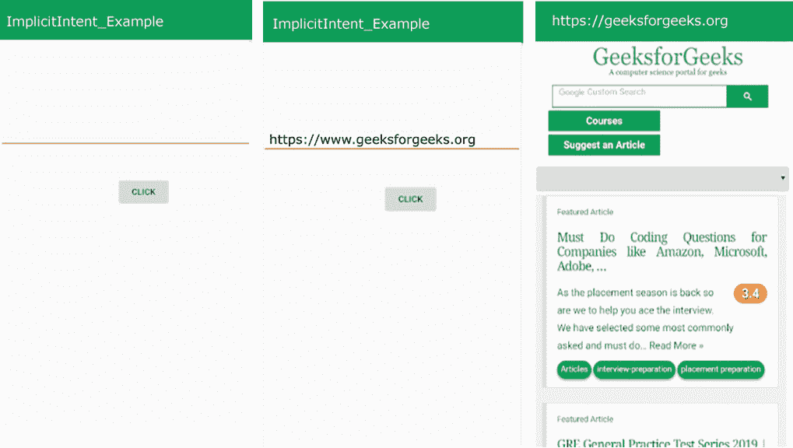
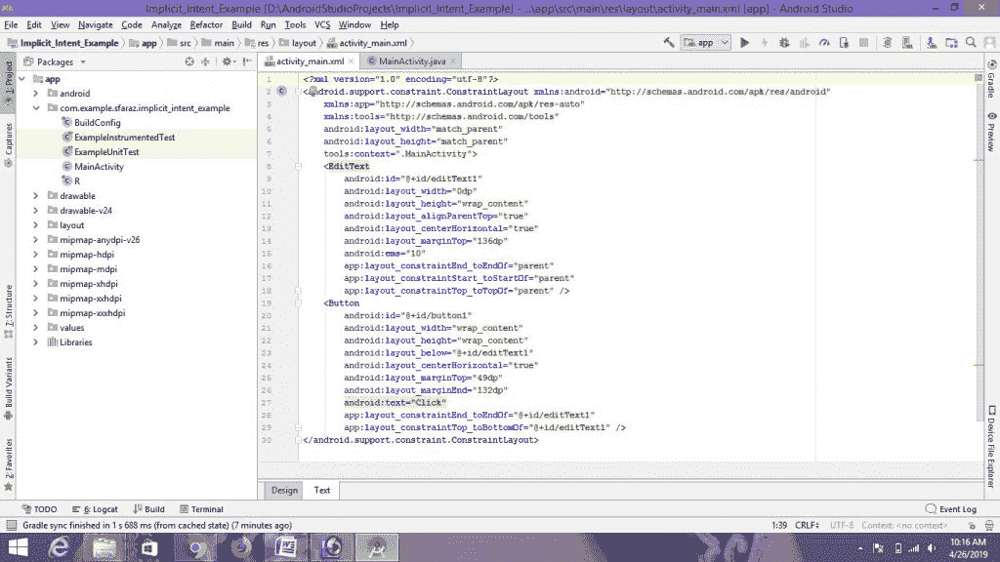
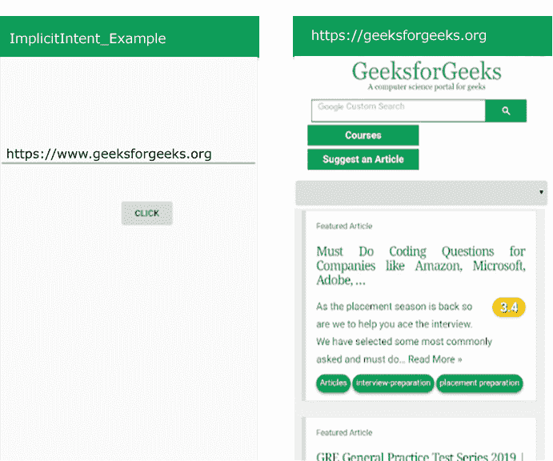
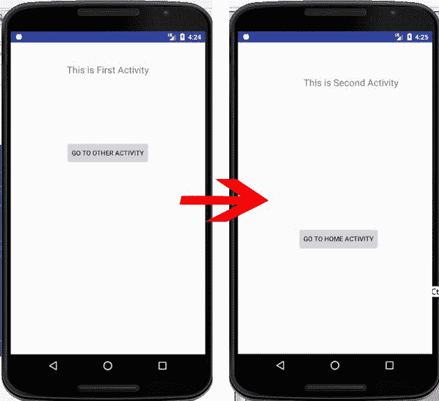
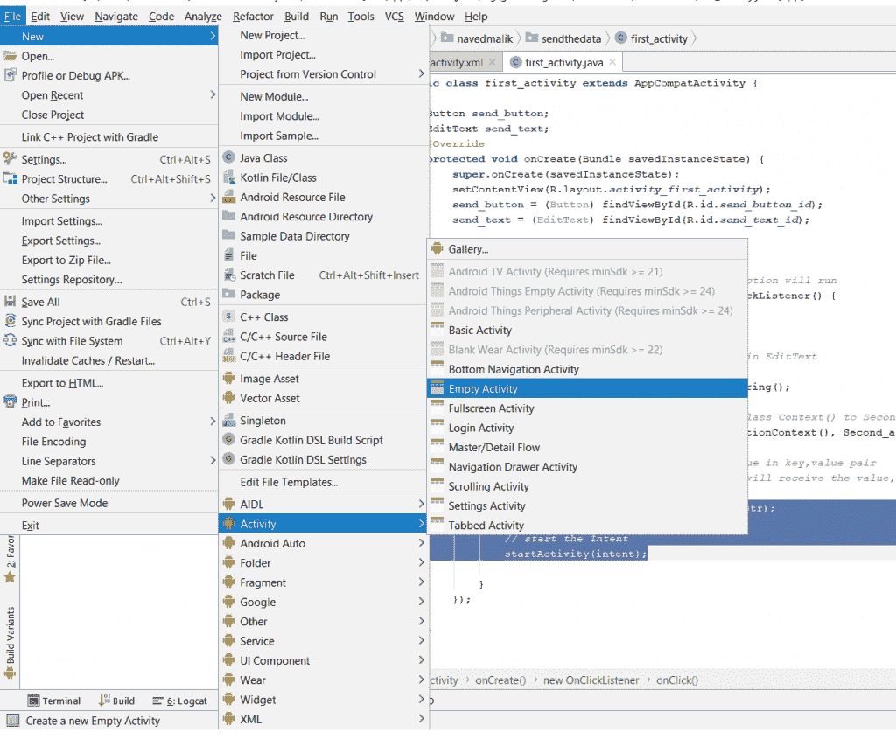
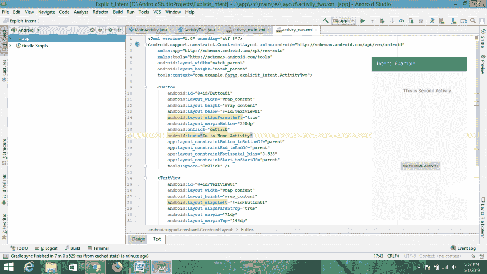
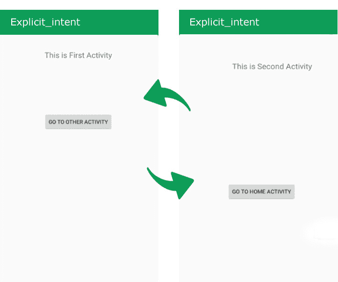

# 安卓|隐式和显式意图示例

> 原文:[https://www . geesforgeks . org/Android-隐式-显式-意图-示例/](https://www.geeksforgeeks.org/android-implicit-and-explicit-intents-with-examples/)

**先决条件:**

*   [新手安卓应用开发基础](https://www.geeksforgeeks.org/android-app-development-fundamentals-for-beginners/)
*   [安卓工作室安装设置指南](https://www.geeksforgeeks.org/guide-to-install-and-set-up-android-studio/)
*   [安卓|从第一个 app/安卓项目开始](https://www.geeksforgeeks.org/android-starting-with-first-app-android-project/)
*   [安卓|运行你的第一个安卓应用](https://www.geeksforgeeks.org/android-running-your-first-android-app/)

本文旨在讲述**隐含的**和**明确的**意图以及如何在安卓应用中使用它们。

### <u>**安卓中的意图是什么？**T3】</u>

**意图**是在服务、内容提供商、活动等组件之间传递的消息对象。通常 **startActivity()** 方法用于调用任何活动。

意图的一些一般功能是:

1.  开始服务
2.  启动活动
3.  显示网页
4.  显示联系人列表
5.  信息广播

**方法及其说明**

| 方法 | 描述 |
| --- | --- |
| **Context.startActivity()** | **这是启动一个新的活动或让一个现有的活动成为行动。** |
| **Context.startService()** | **这是启动一个新的服务或为一个存在服务传递指令。** |
| **Context.sendBroadcast()** | **这是将消息传递给广播接收器。**  |

**意向分类**
有两种类型的意向

```
1\. Implicit Intent
2\. Explicit Intent

```

1.  **Implicit Intent:** Using implicit Intent, component can’t be specifying. An action to be performed is declared by implicit intent. Then android operating system will filter out component which will response to the action.
    **For Example**
    

    在上面的例子中，没有指定组件，而是执行一个动作，即网页将被打开。输入所需网页的名称，然后点击“点击”按钮。您的网页已打开。

    ### <u>**如何使用隐式意图创建安卓应用打开网页(示例)**</u>

    *   **第一步:**创建 XML 文件和 Java 文件。请参考先决条件以了解有关此步骤的更多信息。
        T3】
    *   **Step 2:** Open “activity_main.xml” file and add following widgets in a [Constraint Layout](https://www.geeksforgeeks.org/layouts-android-ui-design/).
        1\. An **EditText** to input text.
        2\. A **Button** to open webpage.
        Also, Assign **IDs** for each component as shown in the image and the code below. The **assigned ID** for a component helps in the identification of component and can be easily use in the Java files.
        **Syntax:**

        ```
        android:id="@+id/id_name"
        ```

        这里给定的标识:**编辑文本 1** 、**按钮 1**
        这将构成应用程序的用户界面。

        

    *   **Step 3:** Now, after the UI, this step will create the Backend of the App. For this, Open “MainActivity.java” file and instantiate the component (Button) created in the XML file using findViewById() method. This method binds the created object to the UI Components with the help of the assigned ID.
        **General Syntax:**

        > **组件类型对象=(组件类型)findviewbyid(r . id . idfthek 组件)；**

        **已用组件的语法(编辑文本，按钮):**

        > **t1【edittext edittext =(edittext)findviewbyid(r . id . edittext 1)；
        > 按钮=(按钮)findviewbyid(r . id . button 1)；**

    *   **Step 4:** This step involves setting up the operations to display the Toast Message. These operations are as follows:

        a)。首先添加监听按钮，这个按钮将打开网页。

        > **按钮。setonclicklistener(新视图)。OnClickListener() {}：**

        b)。创建字符串类型变量来存储“编辑文本”的值。值被接受并转换为字符串。

        > **字串 url = editText1.getText()。tostring()；**

        c)。创建一个意图对象 MainActivity.java 类来打开网页。

        > **意向意向=新意向(意向。ACTION_VIEW，Uri . parse(URl))；**

        d)。startActivity()方法开始调用意图指定的网页进行打开。

        > **开始活动(意图)；**

**因此隐式意图的代码片段:**

```
String url = editText1.getText().toString();
Intent intent=new Intent(Intent.ACTION_VIEW, Uri.parse(url));
startActivity(intent);

```

**隐含意图的完整代码**

## activity_main.xml

```
<?xml version="1.0" encoding="utf-8"?>
<android.support.constraint.ConstraintLayout 
xmlns:android="http://schemas.android.com/apk/res/android"
    xmlns:app="http://schemas.android.com/apk/res-auto"
    xmlns:tools="http://schemas.android.com/tools"
    android:layout_width="match_parent"
    android:layout_height="match_parent"
    tools:context=".MainActivity">

<!-- add an edittext to input text -->
    <EditText
        android:id="@+id/editText1"
        android:layout_width="0dp"
        android:layout_height="wrap_content"
        android:layout_alignParentTop="true"
        android:layout_centerHorizontal="true"
        android:layout_marginTop="136dp"
        android:ems="10"
        app:layout_constraintEnd_toEndOf="parent"
        app:layout_constraintStart_toStartOf="parent"
        app:layout_constraintTop_toTopOf="parent" />

<!-- add a button for click -->
    <Button
        android:id="@+id/button1"
        android:layout_width="wrap_content"
        android:layout_height="wrap_content"
        android:layout_below="@+id/editText1"
        android:layout_centerHorizontal="true"
        android:layout_marginTop="49dp"
        android:layout_marginEnd="132dp"
        android:text="Click"
        app:layout_constraintEnd_toEndOf="@+id/editText1"
        app:layout_constraintTop_toBottomOf="@+id/editText1" />

</android.support.constraint.ConstraintLayout>
```

## MainActivity.java

```
package org.geeksforgeeks.implicitIntent_example;

import android.app.Activity;
import android.content.Intent;
import android.net.Uri;
import android.os.Bundle;
import android.view.View;
import android.widget.Button;
import android.widget.EditText;

public class MainActivity extends Activity {

    @Override
    protected void onCreate(Bundle savedInstanceState)
    {
        super.onCreate(savedInstanceState);
        setContentView(R.layout.activity_main);

        // Bind the components to their respective objects
        // by assigning their IDs
        // with the help of findViewById() method
        final EditText editText1 = (EditText)findViewById(R.id.editText1);
        Button button = (Button)findViewById(R.id.button1);

        // implementation of onClick event for Implicit Intent
        button.setOnClickListener(new View.OnClickListener() {
            @Override
            public void onClick(View v)
            {

                // performing webpage open action
                String url = editText1.getText().toString();
                Intent intent = new Intent(Intent.ACTION_VIEW, Uri.parse(url));
                startActivity(intent);
            }
        });
    }
}
```

**输出:**


7.  **Explicit Intent:** Using explicit intent any other component can be specified. In other words, the targeted component is specified by explicit intent. So only the specified target component will be invoked.

    **例如:**

    

    显式意图示例

    在上面的例子中，有两个活动(第一个活动，第二个活动)。当您在第一个活动中单击“转到其他活动”按钮时，您将转到第二个活动。当您在第二个活动中单击“回家活动”按钮时，您将进入第一个活动。这是通过显式意图实现的。

    ### <u>**如何使用显式意图创建安卓应用程序以进入下一个活动(示例)**</u>

    *   **第一步:**创建 XML 文件和 Java 文件。请参考先决条件以了解有关此步骤的更多信息。
        T3】
    *   **Step 2:** Open “activity_main.xml” file and add following widgets in a [Constraint Layout](https://www.geeksforgeeks.org/layouts-android-ui-design/).
        1\. A **Button** for moving to second activity.
        2\. A **TextView** for writing some text.
        Also, Assign **IDs** for each component (Button, TextView) as shown in the image and the code below. The **assigned ID** for a component helps in the identification of component and can be easily use in the Java files.
        **Syntax:**

        ```
        android:id="@+id/id_name"
        ```

        这里给定的标识:**按钮 01** ，**文本视图 01** 。
        这将使应用程序的用户界面。

        

    *   **Step 3:** Now, after the UI, this step will create the Backend of the App. For this, Open “MainActivity.java” file and instantiate the component (Button, TextView) created in the XML file using findViewById() method. This method binds the created object to the UI Components with the help of the assigned ID.

        **一般语法:**

        > **组件类型对象=(组件类型)findviewbyid(r . id . idfthek 组件)；**

        **已用组件的语法(按钮、文本视图):**

        > **1。button =(button)findviewbyid(r . id . button 01)：**
        > **2。TextView textView = (TextView)查找 viewbyid(r . id . text view 01)；**

    *   **Step 4:** This step involves setting up the operations to create explicit intent. These operations are as follows:

        a.首先添加监听按钮，使用此按钮，您将转到其他活动。

        > **按钮 1 . setonclicklistener(新视图)。OnClickListener() {}：**

        b.现在，创建一个意图。

        > **意图 i =新意图(getApplicationContext()、secondactivityname . class)；
        > T3】**

        **参数:**这有两个参数:

        *   **getApplicationContext():** 返回整个应用程序的上下文。
        *   **OtherActivityName.class:** 您应该在这里使用您的活动名称。

        因此，明确意图的代码是:

        ```
        Intent i = new Intent(getApplicationContext(), ActivityTwo.class);
        ```

        c.现在开始目标活动。
        <block>**开始活动(一):**这开始目标活动。
        **明确意图的代码片段:**</block>

        ```
        Intent i = new Intent(getApplicationContext(), ActivityTwo.class);
        startActivity(i);
        ```

    *   **步骤 5:** 现在我们必须创建第二个活动作为目的地活动。
        创建第二个活动的步骤如下:

        > **安卓项目>文件>新建>活动>清空活动**

        

    *   **Step 6:** Now open your second xml file.
        Add **button** and **text view** to go back to family activities and write some text on activities respectively. Assign identification to buttons and text views. The second activity is as follows:
        
    *   **Step 7:** Now, open your second active java file and perform the following operations.
        A. First, add the listener on button. With this button, you will enter the family activities.

    > **按钮 1 . setonclicklistener(新视图)。OnClickListener() {}：**

    b.现在，创建一个意图。

    > **Intent i =新的 Intent(getApplicationContext()，otheractivityname . class)；
    > T3】**

    因此，明确意图的代码是:

    ```
    Intent i = new Intent(getApplicationContext(), MainActivity.class); 
    ```

    c.现在开始目标活动。

    > **开始活动(i):** 这将开始目标活动。

    **显示吐司信息的代码:**

    > **意向 i =新意向(getApplicationContext()、main Activity . class)；
    > startActivity(I)；**

    *   **第 8 步:**现在运行该应用程序，操作如下:
        当打开该应用程序时，它会显示一个“转到其他活动”按钮。
        点击“转到其他活动”按钮。
        然后你将进入第二个活动。
        同样，你会在第二个活动中获得一个“回家活动”按钮，当你点击这个按钮时，你会进入到家庭活动。

### <u>**明确意图的完整代码**</u>

## activity_main.xml

```
<?xml version="1.0" encoding="utf-8"?>
<android.support.constraint.ConstraintLayout 
xmlns:android="http://schemas.android.com/apk/res/android"
    xmlns:app="http://schemas.android.com/apk/res-auto"
    xmlns:tools="http://schemas.android.com/tools"
    android:layout_width="match_parent"
    android:layout_height="match_parent"
    tools:context="org.geeksforgeeks.explicit_intent.MainActivity">

 <!-- add a button to move to next activity -->
    <Button
        android:id="@+id/Button01"
        android:layout_width="wrap_content"
        android:layout_height="wrap_content"
        android:layout_alignParentLeft="true"
        android:layout_below="@+id/TextView01"
        android:layout_marginTop="209dp"
        android:onClick="onClick"
        android:text="Go To Other Activity"
        app:layout_constraintEnd_toEndOf="parent"
        app:layout_constraintStart_toStartOf="parent"
        app:layout_constraintTop_toTopOf="parent"
        tools:ignore="OnClick" />

 <!-- add a TextView to write some text on activity -->
    <TextView
        android:id="@+id/TextView01"
        android:layout_width="wrap_content"
        android:layout_height="wrap_content"
        android:layout_alignLeft="@+id/Button01"
        android:layout_alignParentTop="true"
        android:layout_marginTop="44dp"
        android:minHeight="60dip"
        android:text="This is First Activity"
        android:textSize="20sp"
        app:layout_constraintEnd_toEndOf="parent"
        app:layout_constraintStart_toStartOf="parent"
        app:layout_constraintTop_toTopOf="parent" />

</android.support.constraint.ConstraintLayout>
```

## MainActivity.java

```
package org.geeksforgeeks.explicit_intent;

import android.os.Bundle;
import android.app.Activity;
import android.content.Intent;
import android.view.View;
import android.view.View.OnClickListener;
import android.widget.Button;

public class MainActivity extends Activity {
    // Defining the object for button
    Button button1;
    @Override
    public void onCreate(Bundle savedInstanceState)
    {
        super.onCreate(savedInstanceState);
        setContentView(R.layout.activity_main);

        // Bind the components to their respective objects
        // by assigning their IDs
        // with the help of findViewById() method
        button1 = (Button)findViewById(R.id.Button01);

        button1.setOnClickListener(new OnClickListener() {
            public void onClick(View view)
            {

                // Creating explicit intent
                Intent i = new Intent(getApplicationContext(),
                                      ActivityTwo.class);
                startActivity(i);
            }
        });
    }
}
```

## activity_two.xml

```
<?xml version="1.0" encoding="utf-8"?>
<android.support.constraint.ConstraintLayout 
xmlns:android="http://schemas.android.com/apk/res/android"
    xmlns:app="http://schemas.android.com/apk/res-auto"
    xmlns:tools="http://schemas.android.com/tools"
    android:layout_width="match_parent"
    android:layout_height="match_parent"
    tools:context="org.geeksforgeeks.explicit_intent.ActivityTwo">

<!-- add a button for moving to home activity -->
    <Button
        android:id="@+id/Button01"
        android:layout_width="wrap_content"
        android:layout_height="wrap_content"
        android:layout_below="@+id/TextView01"
        android:layout_alignParentLeft="true"
        android:layout_marginBottom="220dp"
        android:onClick="onClick"
        android:text="Go to Home Activity"
        app:layout_constraintBottom_toBottomOf="parent"
        app:layout_constraintEnd_toEndOf="parent"
        app:layout_constraintHorizontal_bias="0.533"
        app:layout_constraintStart_toStartOf="parent"
        tools:ignore="OnClick" />

 <!-- add a TextView to write some text on activity -->
    <TextView
        android:id="@+id/TextView01"
        android:layout_width="wrap_content"
        android:layout_height="wrap_content"
        android:layout_alignLeft="@+id/Button01"
        android:layout_alignParentTop="true"
        android:layout_margin="71dp"
        android:layout_marginTop="144dp"
        android:layout_marginEnd="88dp"
        android:layout_marginRight="88dp"
        android:minHeight="60dip"
        android:text="This is Second Activity"
        android:textSize="20sp"
        app:layout_constraintEnd_toEndOf="parent"
        app:layout_constraintTop_toTopOf="parent" />

</android.support.constraint.ConstraintLayout>
```

## activitytwo . java

```
package org.geeksforgeeks.explicit_intent;

import android.app.Activity;
import android.content.Intent;
import android.os.Bundle;
import android.view.View;
import android.view.View.OnClickListener;
import android.widget.Button;

public class ActivityTwo extends Activity {

    // Defining the object for button
    Button button1;
    @Override
    public void onCreate(Bundle bundle)
    {
        super.onCreate(bundle);
        setContentView(R.layout.activity_two);

        // Bind the components to their respective objects
        // by assigning their IDs
        // with the help of findViewById() method
        button1 = (Button)findViewById(R.id.Button01);

        button1.setOnClickListener(new OnClickListener() {
            public void onClick(View view)
            {

                // Creating explicit intent
                Intent i = new Intent(getApplicationContext(),
                                      MainActivity.class);
                startActivity(i);
            }
        });
    }
}
```

**输出:**
