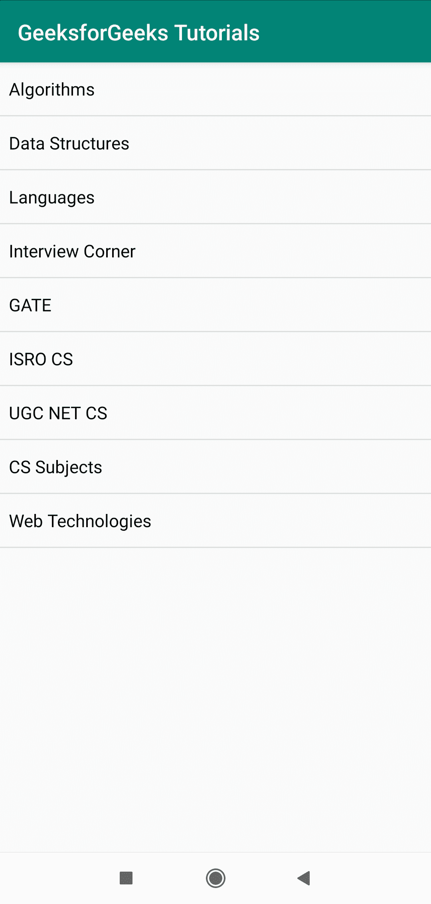

# Java 中的安卓 Listview，示例

> 原文:[https://www . geesforgeks . org/Android-listview-in-Java-with-example/](https://www.geeksforgeeks.org/android-listview-in-java-with-example/)

列表视图是一种类型的[适配器视图](https://developer.android.com/reference/android/widget/AdapterView)，它显示一个可滚动视图的垂直列表，并且每个视图一个在另一个下面。使用适配器，项目从数组或数据库插入到列表中。为了显示列表中的项目，使用了`**setAdaptor()**`方法。`**setAdaptor()**`方法将适配器与列表结合在一起。

安卓列表视图是一个视图组，用于在多行中显示项目列表，并包含一个自动将项目插入列表的适配器。

适配器的主要目的是从数组或数据库中获取数据，并将放入列表中的每一项插入到所需的结果中。因此，它是从 strings.xml 文件中提取数据的主要来源，该文件包含 Java 或 xml 文件中所需的所有字符串。

### 列表视图的可扩展标记语言属性

| 属性 | 描述 |
| --- | --- |
| 安卓:分割线 | 用于分隔列表项的颜色或绘图。 |
| 安卓:分裂的莱茵河 | 分割器的高度。 |
| 安卓:条目 | 对将填充列表视图的数组资源的引用。 |
| 安卓:footerDividersEnabled | 当设置为 false 时，列表视图不会在每个页脚视图之前绘制分隔线。 |
| 安卓:headerDividersEnabled | 当设置为 false 时，列表视图不会在每个标题视图之前绘制分隔线。 |

### 如何在安卓应用中添加列表视图

现在让我们通过一个例子来理解如何在安卓应用程序中使用 listview。在这个例子中，让我们创建一个 android 应用程序，它将显示 GeeksforGeeks 门户中可用的教程列表。

**第一步:创建新项目**

1.  单击文件，然后单击新建= >新建项目。
2.  为项目模板选择“空活动”。
3.  选择语言作为 Java。
4.  根据您的需要选择最小的软件开发工具包。

**第二步:修改 activity_main.xml 文件**
在`activity_main.xml`文件中添加一个 ListView。

## activity_main.xml

```
<?xml version="1.0" encoding="utf-8"?>
<LinearLayout 
    xmlns:android="http://schemas.android.com/apk/res/android"
    xmlns:app="http://schemas.android.com/apk/res-auto"
    xmlns:tools="http://schemas.android.com/tools"
    android:layout_width="match_parent"
    android:layout_height="match_parent"
    tools:context=".MainActivity">

    <ListView
        android:id="@+id/list"
        android:layout_width="match_parent"
        android:layout_height="match_parent"/>
</LinearLayout>
```

**第三步:修改 MainActivity.java 文件**
在这一部分，我们来设计一下应用的后端。转到`MainActivity.java`。现在在 java 文件中创建一个字符串数组，并存储您想要在列表中显示的值。另外，创建一个 ListView 类的对象。在`**onCreate()**`方法中，使用`**findViewById()**`方法通过 id 找到列表视图。使用一个新的关键字后跟一个构造函数调用来创建一个 ArrayAdapter 的对象。ArrayAdaptor 公共构造函数描述如下:

> 公共数组适配器(上下文上下文，内部资源，T[ ]对象)

| 参数 | 

描述

 |
| --- | --- |
| 语境 | 当前上下文 |
| 资源 | 布局文件的资源标识 |
| 目标 | 要在列表视图中显示的对象 |

根据这一点，在 ArrayAdapter 构造函数中传递参数并创建一个对象。最后，使用`**setAdapter()**`方法将适配器与列表连接起来。

## MainActivity.java

```
import androidx.appcompat.app.AppCompatActivity;
import android.os.Bundle;
import android.widget.AdapterView;
import android.widget.ArrayAdapter;
import android.widget.ListView;

public class MainActivity extends AppCompatActivity {

    ListView l;
    String tutorials[]
        = { "Algorithms", "Data Structures",
            "Languages", "Interview Corner",
            "GATE", "ISRO CS",
            "UGC NET CS", "CS Subjects",
            "Web Technologies" };

    @Override
    protected void onCreate(Bundle savedInstanceState)
    {
        super.onCreate(savedInstanceState);
        setContentView(R.layout.activity_main);
        l = findViewById(R.id.list);
        ArrayAdapter<String> arr;
        arr
            = new ArrayAdapter<String>(
                this,
                R.layout.support_simple_spinner_dropdown_item,
                tutorials);
        l.setAdapter(arr);
    }
}
```

**输出**
