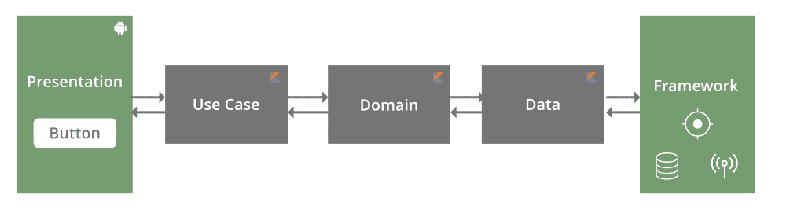

# 带交互器和存储库的安卓 MVP 架构扩展

> 原文:[https://www . geesforgeks . org/Android-MVP-architecture-extension-with-interacters-and-repository/](https://www.geeksforgeeks.org/android-mvp-architecture-extension-with-interactors-and-repositories/)

自然的真理是进化，新的发展是由自然选择引导的。因此，有许多不同的物种有许多相似之处，它们都最适合自己的环境。一个人优于另一个人的概念只适用于有限的情况下，当一个人更适合生存。当环境改变时，概念也随之改变。这同样适用于任何软件设计。就其本身而言，一个答案优于另一个。如前所述，为了更好地响应某些条件，发现了一些增强功能。所有这些场景都出现在拥有大量代码库的安卓应用程序中，几个开发人员同时在项目中工作。

**在这种情况下发现了两个限制:**

*   **数据管理器集中化**:在 MVP 架构中，数据管理器意味着将所有职责外包给 ApiHelper、DbHelper 和 PreferenceHelper。这是一个适用于大多数使用情况的优秀架构，因为它允许您拦截 Helper 调用并进行一些预处理。然而，对于大型项目来说，这个类可能会变得相当庞大。
*   **数据库助手集中化**:创建数据库助手是为了使用 DAO 类从数据库中获取数据。对于数据库查询较少的大多数项目来说，这也是非常好的，但是对于大型项目来说，这可能会变得非常巨大。

集中式数据管理器的问题也许可以通过向演示者公开助手实例来解决。这将消除数据管理器委托调用，将代码库减少到几个需要交叉助手调用或一系列助手调用的函数。这种方法非常适合现有的 MVP 设计。一旦我们达到目标，挖掘未开发的潜力就需要采取两个步骤。我们现在建议对现有的 MVP 设计进行一些重大改进，以便使它适合于非常大的项目，同时有许多开发人员在进行这项工作。让我们首先确定与这些举措相关的障碍。

### 大型项目？别担心

大型项目包含许多特性，为了管理这些特性，需要模块化的代码库。即使在一个模块内部，理想的策略也是将程序分开，这样所有的特性都被封装起来，这意味着该特性的所有依赖关系最多只能在它的包中解决。为了允许许多开发人员在同一个项目上协作，同时避免代码与每个请求合并，我们必须提供特性封装。

**要了解** [**安卓 MVP，只需访问这里**](https://www.geeksforgeeks.org/mvc-model-view-controller-architecture-pattern-in-android-with-example/) **。**

**数据管理** r 去中心化产生一个交互器结构，而数据库助手去中心化产生存储库。

1.  交互器:每个演示者接收自己的交互器实例，而不是单一的数据管理器。交互器的职责与数据管理器相同，但它只关心数据访问和处理它所提供的功能所需的调用。
2.  数据库助手被组织成存储库。例如，用户表的所有数据库查询都是通过用户存储库而不是数据库助手来执行的。像数据库助手一样，用户存储库通过用户道路由它的所有查询。



图像#1。MVP 架构解释了。

> **GeekTip:** 与单例 DbHelper 不同，存储库是按需实例化的，每个 Interactor 都会收到一个新的存储库实例。

与最初的 MVP 架构蓝图相比，我们可以看到数据管理器和数据库助手已经被交互器和存储库所取代，每个演示者都可以单独使用它们。

### MVP 架构经历了重大的变化

**gfgMVPInterctor:** 它是一个接口，列出了所有应用程序组件共享的数据访问 API，以及 sampleAPIHelper 和 PreferencesHelper 单例的访问方法。

## Java 语言(一种计算机语言，尤用于创建网站)

```java
public interface gfgMVPInteractor {
    sampleAPIHelper getSampleAPIHelper();
    PreferencesHelper gfgPrefrences();
    void setUserAsLoggedOut();
      // Logging out the user
    void setAccessToken(String accessToken);
      // Setting the user access token
      // Further Code goers here
}
```

**gfgMVPInterctor** 由 BaseInteractor 实现。该基接口由所有后续接口扩展。BaseInteractor 接收单例 ApiHelper 和单例 PreferenceHelper。

## Java 语言(一种计算机语言，尤用于创建网站)

```java
public class BaseInteractor implements GFGMVPINTERCTOR {
    private final PreferencesHelper GFGPREFERENCESHELPER;
    private final ApiHelper mApiHelper;
    @Inject
    public BaseInteractor(PreferencesHelper preferencesHelper, ApiHelper SAMPLEAPIHELPER) {
        GFGPREFERENCESHELPER = preferencesHelper;
        mApiHelper = SAMPLEAPIHELPER;
    }

    @Override
    public ApiHelper GETSAMPLEAPIHELPER() {
        return mApiHelper;
    }

    @Override
    public PreferencesHelper getPreferencesHelper() {
        return GFGPREFERENCESHELPER;
    }

    @Override
    public void setAccessToken(String GFGACCESSTOKEN) {
        getPreferencesHelper().setAccessToken(GFGACCESSTOKEN);
        GETSAMPLEAPIHELPER().getApiHeader()
                .getProtectedApiHeader()
                .setAccessToken(GFGACCESSTOKEN);
    }
```