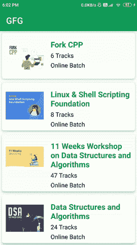

# 安卓回收查看滚动加载更多示例

> 原文:[https://www . geeksforgeeks . org/Android-recycle view-load-more-on-scroll-with-example/](https://www.geeksforgeeks.org/android-recyclerview-load-more-on-scroll-with-example/)

许多应用程序以列表的形式显示大量数据。这些数据太多，一次无法加载。如果我们一次加载这些数据，那么加载时间可能会很长，并且会降低回收视图的性能。因此，为了解决这个问题，我们通常以块的形式加载数据，并一次显示它。在本文中，我们将通过显示一个 ProgressBar 来加载这些数据，并在无限列表中加载数据。

### 我们将在本文中构建什么？

我们将构建一个简单的应用程序，其中我们将显示无限列表，我们将在下面的 [ProgressBar](https://www.geeksforgeeks.org/progressbar-in-kotlin/) 的帮助下加载数据。我们将调用相同的方法向数组列表中添加数据。下面给出了一个示例 GIF，以了解我们将在本文中做什么。请注意，我们将使用 **Java** 语言来实现这个项目。



### **分步实施**

**第一步:创建新项目**

要在安卓工作室创建新项目，请参考[如何在安卓工作室创建/启动新项目](https://www.geeksforgeeks.org/android-how-to-create-start-a-new-project-in-android-studio/)。注意选择 **Java** 作为编程语言。

**第 2 步:在你的 build.gradle 文件中添加下面的依赖项，并在清单文件**中允许互联网权限

下面是凌空的依赖，我们将使用它从应用编程接口获取数据。要添加此依赖项，请导航至**应用程序>渐变脚本> build.gradle(应用程序)**，并在依赖项部分添加以下依赖项。我们已经使用了毕加索从网址图像加载依赖。

```
// below line is used for volley library
implementation ‘com.android.volley:volley:1.1.1’

// below line is used for image loading library
implementation ‘com.squareup.picasso:picasso:2.71828’
```

在清单文件中添加 internet 权限。

```
<uses-permission android:name="android.permission.INTERNET"/>
```

**步骤 3:使用 activity_main.xml 文件**

导航到**应用程序> res >布局> activity_main.xml** 并将下面的代码添加到该文件中。下面是 **activity_main.xml** 文件的代码。

## 可扩展标记语言

```
<?xml version="1.0" encoding="utf-8"?>
<androidx.core.widget.NestedScrollView
    xmlns:android="http://schemas.android.com/apk/res/android"
    xmlns:tools="http://schemas.android.com/tools"
    android:id="@+id/idNestedSV"
    android:layout_width="match_parent"
    android:layout_height="match_parent"
    tools:context=".MainActivity">

    <!--linear layout for displaying
        our recycler view-->
    <LinearLayout
        android:layout_width="match_parent"
        android:layout_height="match_parent"
        android:orientation="vertical">

        <!--recycler view for displaying our list of data
            and we are making nested scroll for our
            recycler view as false-->
        <androidx.recyclerview.widget.RecyclerView
            android:id="@+id/idRVCourses"
            android:layout_width="match_parent"
            android:layout_height="0dp"
            android:layout_weight="1"
            android:nestedScrollingEnabled="false" />

        <!--we are adding progress bar
            for the purpose of loading-->
        <ProgressBar
            android:id="@+id/idPBLoading"
            android:layout_width="match_parent"
            android:layout_height="wrap_content" />
    </LinearLayout>

</androidx.core.widget.NestedScrollView>
```

**步骤 4:使用模态类**

导航到**应用> java >你的应用的包名>右键点击它>新建> Java 类**并将其命名为 **CourseModal** 并添加下面的代码。

## Java 语言(一种计算机语言，尤用于创建网站)

```
public class CourseModal {

    // variables for our course name,
    // description and duration.
    private String courseName;
    private String courseModes;
    private String courseTracks;
    private String courseImg;

    // constructor class.
    public CourseModal(String courseName, String courseModes, String courseTracks, String courseImg) {
        this.courseName = courseName;
        this.courseModes = courseModes;
        this.courseTracks = courseTracks;
        this.courseImg = courseImg;
    }

    // getter and setter methods.
    public String getCourseImg() {
        return courseImg;
    }

    public void setCourseImg(String courseImg) {
        this.courseImg = courseImg;
    }

    public String getCourseName() {
        return courseName;
    }

    public void setCourseName(String courseName) {
        this.courseName = courseName;
    }

    public String getcourseModes() {
        return courseModes;
    }

    public void setcourseModes(String courseModes) {
        this.courseModes = courseModes;
    }

    public String getcourseTracks() {
        return courseTracks;
    }

    public void setcourseTracks(String courseTracks) {
        this.courseTracks = courseTracks;
    }
}
```

**第五步:为我们的回收视图**创建布局文件

导航至 **app > res >布局>右键点击>新建>布局资源文件**并将其命名为 **course_rv_item** 并添加以下代码。

## 可扩展标记语言

```
<?xml version="1.0" encoding="utf-8"?>
<androidx.cardview.widget.CardView 
    xmlns:android="http://schemas.android.com/apk/res/android"
    xmlns:app="http://schemas.android.com/apk/res-auto"
    android:id="@+id/idCVCOurseItem"
    android:layout_width="match_parent"
    android:layout_height="wrap_content"
    android:layout_margin="5dp"
    app:cardCornerRadius="6dp"
    app:cardElevation="4dp">

    <RelativeLayout
        android:layout_width="match_parent"
        android:layout_height="wrap_content">

        <!--image view for displaying course image-->
        <ImageView
            android:id="@+id/idIVCourse"
            android:layout_width="100dp"
            android:layout_height="100dp"
            android:layout_margin="10dp" />

        <LinearLayout
            android:layout_width="match_parent"
            android:layout_height="wrap_content"
            android:layout_marginStart="2dp"
            android:layout_marginTop="10dp"
            android:layout_marginEnd="2dp"
            android:layout_toEndOf="@id/idIVCourse"
            android:gravity="center"
            android:orientation="vertical"
            android:padding="4dp">

            <!--Textview for displaying our Course Name-->
            <TextView
                android:id="@+id/idTVCourseName"
                android:layout_width="match_parent"
                android:layout_height="wrap_content"
                android:padding="2dp"
                android:text="CourseName"
                android:textColor="@color/purple_500"
                android:textSize="18sp"
                android:textStyle="bold" />

            <!--Textview for displaying our Course Duration-->
            <TextView
                android:id="@+id/idTVCourseDuration"
                android:layout_width="match_parent"
                android:layout_height="wrap_content"
                android:padding="2dp"
                android:text="Duration"
                android:textColor="@color/black" />

            <!--Textview for displaying our Course Description-->
            <TextView
                android:id="@+id/idTVCourseDescription"
                android:layout_width="match_parent"
                android:layout_height="wrap_content"
                android:padding="2dp"
                android:text="Description"
                android:textColor="@color/black" />
        </LinearLayout>

    </RelativeLayout>

</androidx.cardview.widget.CardView>
```

**第 6 步:创建一个适配器类来设置我们的数据**

同样，创建另一个 Java 类并将其命名为 **CourseRVAdapter** ，并向其中添加下面的代码。代码中添加了注释，以便更详细地了解。

## Java 语言(一种计算机语言，尤用于创建网站)

```
import android.content.Context;
import android.view.LayoutInflater;
import android.view.View;
import android.view.ViewGroup;
import android.widget.ImageView;
import android.widget.TextView;

import androidx.annotation.NonNull;
import androidx.recyclerview.widget.RecyclerView;

import com.squareup.picasso.Picasso;

import java.util.ArrayList;

public class CourseRVAdapter extends RecyclerView.Adapter<CourseRVAdapter.ViewHolder> {

    private Context context;
    private ArrayList<CourseModal> courseModalArrayList;

    // creating a constructor class.
    public CourseRVAdapter(Context context, ArrayList<CourseModal> courseModalArrayList) {
        this.context = context;
        this.courseModalArrayList = courseModalArrayList;
    }

    @NonNull
    @Override
    public CourseRVAdapter.ViewHolder onCreateViewHolder(@NonNull ViewGroup parent, int viewType) {
        // passing our layout file for displaying our card item
        return new ViewHolder(LayoutInflater.from(context).inflate(R.layout.course_rv_item, parent, false));

    }

    @Override
    public void onBindViewHolder(@NonNull CourseRVAdapter.ViewHolder holder, int position) {
        // setting data to our text views from our modal class.
        CourseModal courses = courseModalArrayList.get(position);
        holder.courseNameTV.setText(courses.getCourseName());
        holder.courseTracksTV.setText(courses.getcourseTracks());
        holder.courseModesTV.setText(courses.getcourseModes());
        Picasso.get().load(courses.getCourseImg()).into(holder.courseIV);
    }

    @Override
    public int getItemCount() {
        return courseModalArrayList.size();
    }

    public class ViewHolder extends RecyclerView.ViewHolder {
        // creating variables for our text views.
        private final TextView courseNameTV;
        private final TextView courseTracksTV;
        private final TextView courseModesTV;
        private final ImageView courseIV;

        public ViewHolder(@NonNull View itemView) {
            super(itemView);
            // initializing our text views.
            courseIV = itemView.findViewById(R.id.idIVCourse);
            courseNameTV = itemView.findViewById(R.id.idTVCourseName);
            courseTracksTV = itemView.findViewById(R.id.idTVCourseDuration);
            courseModesTV = itemView.findViewById(R.id.idTVCourseDescription);
        }
    }
}
```

**第 7 步:使用****MainActivity.java 文件**

转到**MainActivity.java**文件，参考以下代码。以下是**MainActivity.java**文件的代码。代码中添加了注释，以更详细地理解代码。

## Java 语言(一种计算机语言，尤用于创建网站)

```
import android.os.Bundle;
import android.view.View;
import android.widget.ProgressBar;
import android.widget.Toast;

import androidx.appcompat.app.AppCompatActivity;
import androidx.core.widget.NestedScrollView;
import androidx.recyclerview.widget.LinearLayoutManager;
import androidx.recyclerview.widget.RecyclerView;

import com.android.volley.Request;
import com.android.volley.RequestQueue;
import com.android.volley.Response;
import com.android.volley.VolleyError;
import com.android.volley.toolbox.JsonArrayRequest;
import com.android.volley.toolbox.Volley;

import org.json.JSONArray;
import org.json.JSONException;
import org.json.JSONObject;

import java.util.ArrayList;

public class MainActivity extends AppCompatActivity {

    // creating variables for our UI components.
    int count = 0;
    String url = "https://jsonkeeper.com/b/WO6S";
    private ArrayList<CourseModal> courseArrayList;
    private RecyclerView courseRV;
    private CourseRVAdapter courseRVAdapter;
    private ProgressBar loadingPB;
    private NestedScrollView nestedSV;

    @Override
    protected void onCreate(Bundle savedInstanceState) {
        super.onCreate(savedInstanceState);
        setContentView(R.layout.activity_main);

        // initializing our variables.
        courseRV = findViewById(R.id.idRVCourses);
        loadingPB = findViewById(R.id.idPBLoading);
        nestedSV = findViewById(R.id.idNestedSV);

        // initializing our array list.
        courseArrayList = new ArrayList<>();

        // calling a method to add data to our array list.
        getData();

        // on below line we are setting layout manger to our recycler view.
        LinearLayoutManager manager = new LinearLayoutManager(this);
        courseRV.setLayoutManager(manager);
        // adding on scroll change listener method for our nested scroll view.
        nestedSV.setOnScrollChangeListener(new NestedScrollView.OnScrollChangeListener() {
            @Override
            public void onScrollChange(NestedScrollView v, int scrollX, int scrollY, int oldScrollX, int oldScrollY) {
                // on scroll change we are checking when users scroll as bottom.
                if (scrollY == v.getChildAt(0).getMeasuredHeight() - v.getMeasuredHeight()) {
                    // in this method we are incrementing page number,
                    // making progress bar visible and calling get data method.
                    count++;
                    // on below line we are making our progress bar visible.
                    loadingPB.setVisibility(View.VISIBLE);
                    if (count < 20) {
                        // on below line we are again calling
                        // a method to load data in our array list.
                        getData();
                    }
                }
            }
        });
    }

    private void getData() {
        // creating a new variable for our request queue
        RequestQueue queue = Volley.newRequestQueue(MainActivity.this);
        // in this case the data we are getting is in the form
        // of array so we are making a json array request.
        // below is the line where we are making an json array
        // request and then extracting data from each json object.
        JsonArrayRequest jsonArrayRequest = new JsonArrayRequest(Request.Method.GET, url, null, new Response.Listener<JSONArray>() {
            @Override
            public void onResponse(JSONArray response) {

                courseRV.setVisibility(View.VISIBLE);
                for (int i = 0; i < response.length(); i++) {
                    // creating a new json object and
                    // getting each object from our json array.
                    try {
                        // we are getting each json object.
                        JSONObject responseObj = response.getJSONObject(i);

                        // now we get our response from API in json object format.
                        // in below line we are extracting a string with
                        // its key value from our json object.
                        // similarly we are extracting all the strings from our json object.
                        String courseName = responseObj.getString("courseName");
                        String courseTracks = responseObj.getString("courseTracks");
                        String courseMode = responseObj.getString("courseMode");
                        String courseImageURL = responseObj.getString("courseimg");
                        courseArrayList.add(new CourseModal(courseName, courseMode, courseTracks, courseImageURL));

                        // on below line we are adding our array list to our adapter class.
                        courseRVAdapter = new CourseRVAdapter(MainActivity.this, courseArrayList);

                        // on below line we are setting 
                        // adapter to our recycler view.
                        courseRV.setAdapter(courseRVAdapter);
                    } catch (JSONException e) {
                        e.printStackTrace();
                    }
                }
            }
        }, new Response.ErrorListener() {
            @Override
            public void onErrorResponse(VolleyError error) {
                Toast.makeText(MainActivity.this, "Fail to get the data..", Toast.LENGTH_SHORT).show();
            }
        });
        queue.add(jsonArrayRequest);
    }
}
```

现在运行您的应用程序，并查看应用程序的输出。

**输出:**

<video class="wp-video-shortcode" id="video-594741-1" width="640" height="360" preload="metadata" controls=""><source type="video/mp4" src="https://media.geeksforgeeks.org/wp-content/uploads/20210426180818/Screenrecorder-2021-04-26-18-02-20-788.mp4?_=1">[https://media.geeksforgeeks.org/wp-content/uploads/20210426180818/Screenrecorder-2021-04-26-18-02-20-788.mp4](https://media.geeksforgeeks.org/wp-content/uploads/20210426180818/Screenrecorder-2021-04-26-18-02-20-788.mp4)</video>