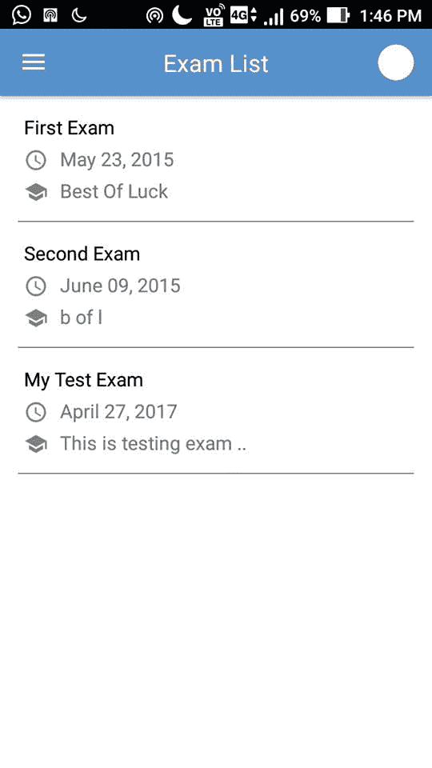

# 安卓中的回收视图，示例

> 哎哎哎:# t0]https://www . geeksforgeeks . org/Android-recycle service/

RecyclerView 是作为 GridView 和 ListView 的继承者添加到 android studio 中的一个视图组。这是对两者的改进，可以在最新的 v-7 支持包中找到。它的创建是为了使任何具有 **XML** 布局的列表的构建成为可能，这些布局可以被极大地定制，同时*提高了列表视图和网格视图*的效率。这种改进是通过回收用户不可见的视图来实现的。例如，如果用户向下滚动到项目 4 和 5 可见的位置；项目 1、2 和 3 将从内存中清除，以减少内存消耗。

**实现**:要实现一个基本的回收视图，需要构建三个子部分，为用户提供他们选择不同设计所需的控制程度。

1.  **卡片布局:**卡片布局是一个可扩展标记语言布局，将被视为回收视图创建的列表中的一个项目。
2.  **viewpholder:**viewpholder 是一个 java 类，它存储对卡片布局视图的引用，这些视图必须在程序执行过程中通过在线数据库获得的数据列表或以其他方式添加的数据列表进行动态修改。
3.  **数据类:**数据类是一个定制的 java 类，它作为一个结构来保存 RecyclerView 中每个项目的信息。

以下是回收视图的实现:

## 考试卡. xml

```java
<!-- XML Code illustrating card layout usage. -->
<?xml version="1.0" encoding="utf-8"?>
<RelativeLayout
    xmlns:android="http://schemas.android.com/apk/res/android"
    xmlns:app="http://schemas.android.com/apk/res-auto"
    android:layout_width="match_parent"
    android:layout_height="105dp">

    <TextView
        android:layout_width="200dp"
        android:id="@+id/examName"
        android:textSize="16sp"
        android:layout_marginStart="20dp"
        android:text="First Exam"
        android:textColor="@color/black"
        android:layout_marginEnd="20dp"
        android:maxLines="1"
        android:layout_marginTop="15dp"
        android:layout_height="wrap_content"/>

    <ImageView
        android:id="@+id/examPic"
        android:layout_width="20dp"
        android:layout_height="20dp"
        android:layout_below="@+id/examName"
        android:tint="#808080"
        android:layout_marginStart="20dp"
        android:layout_marginTop="7dp"
        app:srcCompat="@drawable/baseline_schedule_black_36dp"/>

    <TextView
        android:id="@+id/examDate"
        android:layout_toEndOf="@+id/examPic"
        android:layout_width="wrap_content"
        android:layout_height="wrap_content"
        android:layout_below="@+id/examName"
        android:layout_marginTop="5dp"
        android:layout_marginEnd="20dp"
        android:layout_marginStart="10dp"
        android:gravity="center"
        android:text="May 23, 2015"
        android:textSize="16sp"/>

    <ImageView
        android:id="@+id/examPic2"
        android:layout_width="20dp"
        android:layout_height="20dp"
        android:layout_below="@+id/examDate"
        android:tint="#808080"
        android:layout_marginStart="20dp"
        android:layout_marginTop="7dp"
        app:srcCompat="@drawable/baseline_school_black_36dp"/>

    <TextView
        android:id="@+id/examMessage"
        android:layout_toEndOf="@+id/examPic2"
        android:layout_width="wrap_content"
        android:layout_height="wrap_content"
        android:layout_below="@+id/examDate"
        android:layout_marginEnd="20dp"
        android:layout_marginTop="5dp"
        android:layout_marginStart="10dp"
        android:gravity="center"
        android:text="Best Of Luck"
        android:textSize="16sp"/>

    <TextView
        android:id="@+id/border2"
        android:layout_width="match_parent"
        android:layout_height="1dp"
        android:layout_marginStart="15dp"
        android:layout_marginEnd="15dp"
        android:layout_alignParentBottom="true"
        android:background="#808080"/>

</RelativeLayout>
```

## examViewHolder.java

```java
// ViewHolder code for RecyclerView
package com.example.admin.example;

import android.support.v7.widget.RecyclerView;
import android.view.View;
import android.widget.TextView;

public class examViewHolder
    extends RecyclerView.ViewHolder {
    TextView examName;
    TextView examMessage;
    TextView examDate;
    View view;

    examViewHolder(View itemView)
    {
        super(itemView);
        examName
            = (TextView)itemView
                  .findViewById(R.id.examName);
        examDate
            = (TextView)itemView
                  .findViewById(R.id.examDate);
        examMessage
            = (TextView)itemView
                  .findViewById(R.id.examMessage);
        view  = itemView
    }
}
```

## examData.java

```java
package com.prodigieux.admin.prodigieux;

public class examData {
    String name;
    String date;
    String message;

    examData(String name,
             String date,
             String message)
    {
        this.name = name;
        this.date = date;
        this.message = message;
    }
}
```

**点击回收商项目:**

要点击回收视图的项目，请在适配器的构造函数中传递点击接口的实例

```java
public class ClickListiner{

// here index is index
// of item clicked
public click(int index);

}
```

**适配器:**适配器是负责 RecyclerView 的主要代码。它包含了实现 RecylcerView 的所有重要方法。成功实施的基本方法是:

*   *oncreateviewpholder*:处理卡片布局的膨胀，作为回收视图的一个项目。
*   *onBindViewHolder* :处理与 RecyclerView 特定项目点击相关的不同数据和方法的设置。
*   *getItemCount* :返回 RecyclerView 的长度。
*   *on attachedtoryclerview*:将适配器连接到 RecyclerView。

下面的程序举例说明了一个自定义适配器的例子:

*imagegallery adapter 2 . Java*

```java
private class ImageGalleryAdapter2
    extends RecyclerView.Adapter<examViewHolder> {

    List<examData> list
        = Collections.emptyList();

    Context context;
    ClickListiner listiner;

    public ImageGalleryAdapter2(List<examData> list,
                                Context context,ClickListiner listiner)
    {
        this.list = list;
        this.context = context;
        this.listiner = listiner; 
    }

    @Override
    public examViewHolder
    onCreateViewHolder(ViewGroup parent,
                       int viewType)
    {

        Context context
            = parent.getContext();
        LayoutInflater inflater
            = LayoutInflater.from(context);

        // Inflate the layout

        View photoView
            = inflater
                  .inflate(R.layout.card_exam,
                           parent, false);

        examViewHolder viewHolder
            = new examViewHolder(photoView);
        return viewHolder;
    }

    @Override
    public void
    onBindViewHolder(final examViewHolder viewHolder,
                     final int position)
    {
        final index = viewHolder.getAdapterPosition();
        viewHolder.examName
            .setText(list.get(position).name);
        viewHolder.examDate
            .setText(list.get(position).date);
        viewHolder.examMessage
            .setText(list.get(position).message);
        viewHolder.view.setOnClickListener(new View.OnClickListener() { 
            @Override
            public void onClick(View view) 
            { 
                listiner.click(index); 
            } 
        }); 
    }

    @Override
    public int getItemCount()
    {
        return list.size();
    }

    @Override
    public void onAttachedToRecyclerView(
        RecyclerView recyclerView)
    {
        super.onAttachedToRecyclerView(recyclerView);
    }

}
```

**回收活动中的新实施:**

## exam.java

```java
package com.example.admin.example;

import android.content.Context;
import android.content.Intent;
import android.support.v7.app.ActionBarDrawerToggle;
import android.support.v7.app.AppCompatActivity;
import android.support.v7.widget.LinearLayoutManager;
import android.support.v7.widget.RecyclerView;
import android.support.v7.widget.Toolbar;
import android.view.LayoutInflater;
import android.view.MenuItem;
import android.view.View;
import android.view.ViewGroup;
import android.widget.ImageView;

import com.prolificinteractive
    .materialcalendarview
    .MaterialCalendarView;

import java.util.ArrayList;
import java.util.Collections;
import java.util.List;

public class exam extends AppCompatActivity
    implements NavigationView
                   .OnNavigationItemSelectedListener {

    ImageGalleryAdapter2 adapter;
    RecyclerView recyclerView;
    ClickListiner listiner;

    @Override
    protected void onCreate(Bundle savedInstanceState)
    {
        super.onCreate(savedInstanceState);
        setContentView(R.layout.activity_exam);
        Toolbar toolbar
            = (Toolbar)findViewById(R.id.toolbar);
        toolbar.setTitle("");
        setSupportActionBar(toolbar);

        List<examData> list = new ArrayList<>();
        list = getData();

        recyclerView
            = (RecyclerView)findViewById(
                R.id.recyclerView);
       listiner = new ClickListiner() {
            @Override
            public void click(int index){
         Toast.makeTexT(this,"clicked item index is "+index,Toast.LENGTH_LONG).show();
         }
      };
        adapter
            = new ImageGalleryAdapter2(
                list, getApplication(),listiner);
        recyclerView.setAdapter(adapter);
        recyclerView.setLayoutManager(
            new LinearLayoutManager(exam.this));
    }

    @Override
    public void onBackPressed()
    {
        super.onBackPressed();
    }

    // Sample data for RecyclerView
    private List<examData> getData()
    {
        List<examData> list = new ArrayList<>();
        list.add(new examData("First Exam",
                              "May 23, 2015",
                              "Best Of Luck"));
        list.add(new examData("Second Exam",
                              "June 09, 2015",
                              "b of l"));
        list.add(new examData("My Test Exam",
                              "April 27, 2017",
                              "This is testing exam .."));

        return list;
    }
}
```

## activity_exam.xml

```java
<?xml version="1.0" encoding="utf-8"?>
<ScrollView 
    xmlns:android="http://schemas.android.com/apk/res/android" 
    xmlns:app="http://schemas.android.com/apk/res-auto" 
    xmlns:tools="http://schemas.android.com/tools" 
    android:layout_width="match_parent" 
    android:layout_height="match_parent" 
    android:layout_marginTop="56dp" 
    android:background="#FFFFFF" 
    tools:context=".exam" > 

    <LinearLayout 
        android:layout_width="match_parent" 
        android:layout_height="wrap_content" 
        android:orientation="vertical" > 

        <android.support.v7.widget.RecyclerView 
            android:nestedScrollingEnabled="false" 
            android:id="@+id/recyclerView" 
            android:layout_width="match_parent" 
            android:overScrollMode="never" 
            android:layout_height="wrap_content"/> 

    </LinearLayout> 
</ScrollView>
```

**Output:**
[](https://media.geeksforgeeks.org/wp-content/uploads/gfg1-1.jpg)

请记住，XML 布局中提到的可绘制文件必须添加到安卓工作室项目 res 下的可绘制文件夹中，并且支持包 v7 应该作为实现添加到项目的 Gradle 文件中，以便代码运行。上面的代码使用 ScrollView 作为 recycle view 的父视图，并禁用 recycle view 的滚动，从而使整个页面滚动，而不仅仅是 recycle view 的内容。