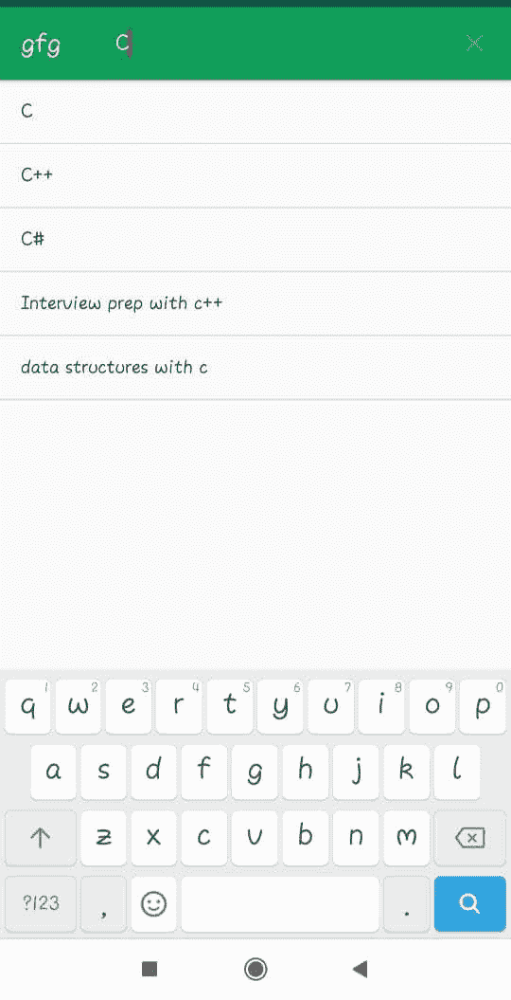

# 安卓搜索视图示例

> 原文:[https://www . geeksforgeeks . org/Android-search view-with-example/](https://www.geeksforgeeks.org/android-searchview-with-example/)

**搜索视图**小部件用于向用户提供搜索界面，以便用户输入自己的搜索查询并向搜索提供商提交请求，获得查询建议或结果列表。

**类语法:**

```
public class SearchView
extends LinearLayout
implements CollapsibleActionView

```

**等级等级:**

```
java.lang.Object
  ↳  android.view.View
    ↳  android.view.ViewGroup
      ↳  android.widget.LinearLayout
        ↳  android.widget.SearchView

```

**演示 SearchView 的示例:**
在本文中，您将创建一个带有搜索视图和列表视图的基本搜索应用程序。用户将在操作栏中显示的搜索视图中键入搜索查询。以下是解释的步骤:

*   **Step 1: activity_main.xml**

    它由相对布局和列表视图组成，从中可以搜索数据。下面是 activity_main.xml 的完整代码:

    ## activity_main.xml

    ```
    <?xml version="1.0" encoding="utf-8"?>
    <!--Relative Layout-->

    <RelativeLayout 
        xmlns:android="http://schemas.android.com/apk/res/android"
        xmlns:tools="http://schemas.android.com/tools"
        android:layout_width="match_parent"
        android:layout_height="match_parent"
        android:id="@+id/relativelayout">

        <!--List View from which data is to be searched-->
        <ListView
            android:id="@+id/listView"
            android:layout_width="match_parent"
            android:layout_height="fill_parent"
            />

    </RelativeLayout>
    ```

*   **Step 2: menu.xml**

    创建 menu.xml 并将**搜索视图**作为菜单项添加到动作栏，标题为“搜索”该文件。下面是 menu.xml 文件的完整代码。

    ## menu.xml

    ```
    <?xml version="1.0" encoding="utf-8"?>  

    <menu 
        xmlns:app="http://schemas.android.com/apk/res-auto"  
        xmlns:android="http://schemas.android.com/apk/res/android">   

        <!--Search view widget as item in menu-->
        <item  
            android:id="@+id/search_bar"  
            android:title="Search" 
            app:actionViewClass="android.widget.SearchView" 
            app:showAsAction="ifRoom|withText"  
        />  
    </menu>  
    ```

*   **第三步:MainActivity.java**
    下一步是设置主活动的代码。在这个 java 文件中，项目被手动添加到列表视图中，并且**设置文本监听器**被附加到搜索视图中。 **onQueryTextSubmit()** 方法被覆盖，其中[列表视图](https://www.geeksforgeeks.org/android-listview-in-kotlin/)根据用户输入的搜索查询进行过滤。下面是 MainActivity.java 的完整代码:

    ## MainActivity.java

    ```
    package com.geeksforgeeks.searchviewwidget;

    import android.support.v7.app.AppCompatActivity;
    import android.view.Menu;
    import android.view.MenuInflater;
    import android.view.MenuItem;
    import android.os.Bundle;
    import android.widget.ListView;
    import android.widget.ArrayAdapter;
    import android.widget.SearchView;
    import java.util.ArrayList;

    public class MainActivity extends AppCompatActivity {

        // List View object
        ListView listView;

        // Define array adapter for ListView
        ArrayAdapter<String> adapter;

        // Define array List for List View data
        ArrayList<String> mylist;

        @Override
        protected void onCreate(Bundle savedInstanceState)
        {
            super.onCreate(savedInstanceState);
            setContentView(R.layout.activity_main);

            // initialise ListView with id
            listView = findViewById(R.id.listView);

            // Add items to Array List
            mylist = new ArrayList<>();
            mylist.add("C");
            mylist.add("C++");
            mylist.add("C#");
            mylist.add("Java");
            mylist.add("Advanced java");
            mylist.add("Interview prep with c++");
            mylist.add("Interview prep with java");
            mylist.add("data structures with c");
            mylist.add("data structures with java");

            // Set adapter to ListView
            adapter
                = new ArrayAdapter<String>(
                    this,
                    android.R.layout.simple_list_item_1,
                    mylist);
            listView.setAdapter(adapter);
        }

        @Override
        public boolean onCreateOptionsMenu(Menu menu)
        {
            // Inflate menu with items using MenuInflator
            MenuInflater inflater = getMenuInflater();
            inflater.inflate(R.menu.menu, menu);

            // Initialise menu item search bar
            // with id and take its object
            MenuItem searchViewItem
                = menu.findItem(R.id.search_bar);
            SearchView searchView
                = MenuItemCompat
                      .getActionView(searchViewItem);

            // attach setOnQueryTextListener
            // to search view defined above
            searchView.setOnQueryTextListener(
                new SearchView.OnQueryTextListener() {

                    // Override onQueryTextSubmit method
                    // which is call
                    // when submitquery is searched

                    @Override
                    public boolean onQueryTextSubmit(String query)
                    {
                        // If the list contains the search query
                        // than filter the adapter
                        // using the filter method
                        // with the query as its argument
                        if (list.contains(query)) {
                            adapter.getFilter().filter(query);
                        }
                        else {
                            // Search query not found in List View
                            Toast
                                .makeText(MainActivity.this,
                                          "Not found",
                                          Toast.LENGTH_LONG)
                                .show();
                        }
                        return false;
                    }

                    // This method is overridden to filter
                    // the adapter according to a search query
                    // when the user is typing search
                    @Override
                    public boolean onQueryTextChange(String newText)
                    {
                        adapter.getFilter().filter(newText);
                        return false;
                    }
                });

            return super.onCreateOptionsMenu(menu);
        }
    }
    ```

**输出:**

*   **主活动带搜索栏和列表**
    [](https://media.geeksforgeeks.org/wp-content/uploads/20191214191026/s1.jpeg)
*   **搜索结果根据搜索查询**
    [](https://media.geeksforgeeks.org/wp-content/uploads/20191214191242/s2.jpeg)

*   **搜索结果**
    [](https://media.geeksforgeeks.org/wp-content/uploads/20191214191349/s3.jpeg)