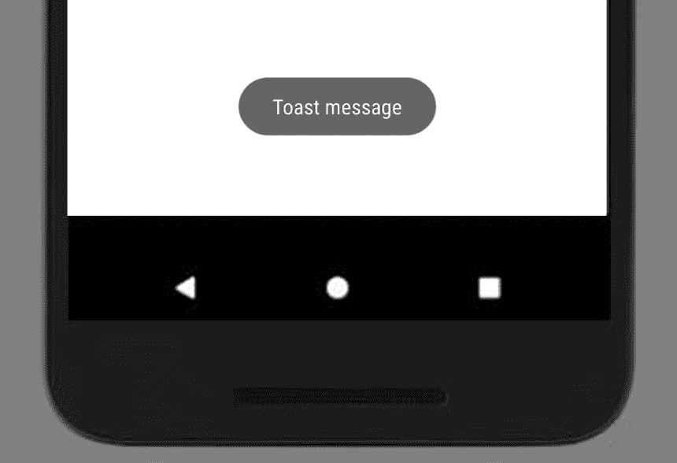
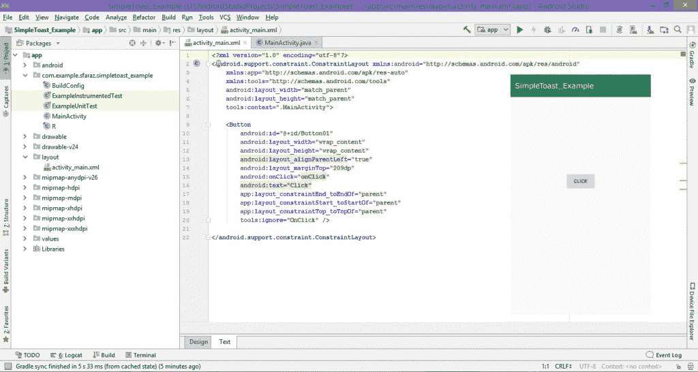
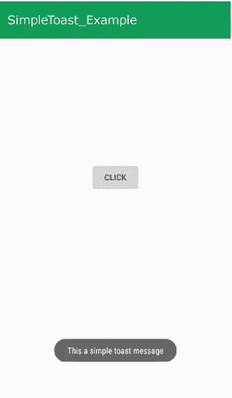
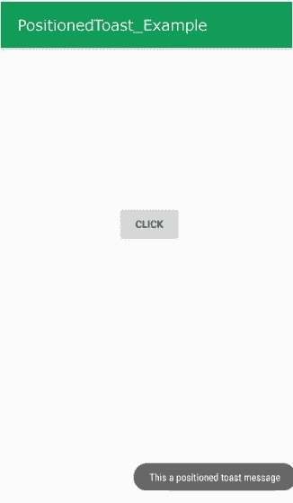

# 安卓|什么是吐司以及如何使用举例

> 原文:[https://www . geeksforgeeks . org/Android-什么是吐司和如何使用-示例/](https://www.geeksforgeeks.org/android-what-is-toast-and-how-to-use-it-with-examples/)

**先决条件:**

*   [新手安卓应用开发基础](https://www.geeksforgeeks.org/android-app-development-fundamentals-for-beginners/)
*   [安卓工作室安装设置指南](https://www.geeksforgeeks.org/guide-to-install-and-set-up-android-studio/)
*   [安卓|从第一个 app/安卓项目开始](https://www.geeksforgeeks.org/android-starting-with-first-app-android-project/)
*   [安卓|运行你的第一个安卓应用](https://www.geeksforgeeks.org/android-running-your-first-android-app/)

本文旨在讲述什么是吐司以及如何在安卓应用中使用它来显示消息。

### <u>**安卓里什么是吐司？**T3】</u>

一 **[吐司](https://www.geeksforgeeks.org/toasts-android-studio/)** 是反馈信息。当整个活动是交互式的并且对用户可见时，它占用很少的显示空间。几秒钟后就消失了。它会自动消失。如果用户想要永久可见的消息，可以使用 **[【通知】](https://www.geeksforgeeks.org/notifications-in-android-oreo-8/)** 。

另一种吐司是**自定义吐司**，可以用图片代替简单的信息。

**例:**
[](https://media.geeksforgeeks.org/wp-content/uploads/Toast.jpg)

**吐司类**:吐司类提供了一个简单的弹出消息，显示在当前活动 UI 屏幕上(如主活动)。

**吐司类的常数**

| 常数 | 描述 |
| --- | --- |
| **公共静态最终 int LENGTH_LONG** | **长时间显示** |
| **公共静态最终 int LENGTH_SHORT** | **短时间显示** |

 **吐司类方法** 

| 方法 | 描述 |
| --- | --- |
| **公共静态 Toast makeText(上下文上下文上下文，字符序列文本，int duration)** | **使吐司信息由文本和持续时间组成** |
| **公开作废显示()** | **显示祝酒信息** |
| **公共无效设置边距(浮动水平边距，浮动垂直边距)** | **改变水平和垂直差异** |

### <u>**如何创建安卓应用程序来显示吐司信息(示例)**</u>

在本例中，“这是一条简单的敬酒信息”是一条**敬酒信息**，通过点击“点击”按钮显示。每次单击时，您的祝酒信息都会出现。

[](https://media.geeksforgeeks.org/wp-content/uploads/20190429174544/Android-Sample-Toast-Example.jpg)

**创建带有吐司信息的安卓应用程序的步骤:**

*   **步骤 1:** 创建一个 XML 文件和一个 Java 文件。请参考先决条件以了解有关此步骤的更多信息。
    T3】
*   **Step 2:** Open “activity_main.xml” file and add a **Button** to show Toast message in a [Constraint Layout](https://www.geeksforgeeks.org/layouts-android-ui-design/).

    另外，为按钮组件分配**标识**，如下图和代码所示。按钮的**指定标识**有助于识别和在 Java 文件中使用。

    ```
    android:id="@+id/id_name"
    ```

    这里给定的 ID 是**按钮 01**

    这将使应用程序的用户界面。
    

*   **Step 3:** Now, after the UI, this step will create the Backend of the App. For this, Open “MainActivity.java” file and instantiate the component (Button) created in the XML file using findViewById() method. This method binds the created object to the UI Components with the help of the assigned ID.
    **General Syntax:**

    > **组件类型对象=(组件类型)findviewbyid(r . id . idfthek 组件)；**

    **已用组件的语法(点击按钮):**

    > **Button btn = （Button）findViewById（R.id.Button01）;**

*   **步骤 4:** 该步骤包括设置显示祝酒信息的操作。这些操作如下:
    1.  在按钮上添加监听器，该按钮将显示祝酒信息。

        > **BTN。setancicklistener(新观点 OnClickListener(){ }:**

    2.  Now, Create a toast message. The **Toast.makeText()** method is a pre-defined method which creates a Toast object.

        **语法:**

        ```
        public static Toast makeText (Context context, 
                        CharSequence text, 
                        int duration)

        ```

        **参数:**该方法接受三个参数:

        *   **上下文:**第一个参数是一个上下文对象，通过调用 getApplicationContext()获得。

            ```
             Context context = getApplicationContext(); 
            ```

        *   **文字:**第二个参数是你要显示的短信。

            ```
            CharSequence text=”Your text message here”
            ```

        *   **持续时间:**最后一个参数是消息的持续时间。

            ```
            int duration=Toast.LENGTH_LONG;
            ```

        因此，发送祝酒信息的代码是:

        ```
        Toast.makeText(getApplicationContext(),
                       "This a toast message",
                       Toast.LENGTH_LONG); 
        ```

    3.  Display the created Toast Message using the **show()** method of the Toast class.

        **语法:**

        ```
        public void show ()
        ```

        **显示吐司信息的代码:**

        ```
        Toast.makeText(getApplicationContext(),
                       "This a toast message",
                       Toast.LENGTH_LONG)
             .show(); 
        ```

*   **第 5 步:**现在运行应用程序，操作如下:
    *   当应用程序打开时，它会显示一个“点击”按钮。
    *   单击单击按钮。
    *   然后“这是祝酒词”将作为祝酒词显示在屏幕上。

**完成代码以显示简单的祝酒信息:**

## activity_main.xml

```
<?xml version="1.0" encoding="utf-8"?>
<android.support.constraint.ConstraintLayout 
xmlns:android="http://schemas.android.com/apk/res/android"
    xmlns:app="http://schemas.android.com/apk/res-auto"
    xmlns:tools="http://schemas.android.com/tools"
    android:layout_width="match_parent"
    android:layout_height="match_parent"
    tools:context=".MainActivity">

 <!-- add button for generating Toast message -->
    <Button
        android:id="@+id/Button01"
        android:layout_width="wrap_content"
        android:layout_height="wrap_content"
        android:layout_alignParentLeft="true"
        android:layout_marginTop="209dp"
        android:onClick="onClick"
        android:text="Click"
        app:layout_constraintEnd_toEndOf="parent"
        app:layout_constraintStart_toStartOf="parent"
        app:layout_constraintTop_toTopOf="parent"
        tools:ignore="OnClick" />

</android.support.constraint.ConstraintLayout>
```

## MainActivity.java

```
package org.geeksforgeeks.simpleToast_Example;

import android.support.v7.app.AppCompatActivity;
import android.os.Bundle;
import android.view.View;
import android.widget.Button;
import android.widget.Toast;

public class MainActivity extends AppCompatActivity {

    // Defining the object for button
    Button btn;

    @Override
    protected void onCreate(Bundle savedInstanceState)
    {
        super.onCreate(savedInstanceState);
        setContentView(R.layout.activity_main);

        // Bind the components to their respective objects
        // by assigning their IDs
        // with the help of findViewById() method
        Button btn = (Button)findViewById(R.id.Button01);

        btn.setOnClickListener(new View.OnClickListener() {
            @Override
            public void onClick(View v)
            {
                // Displaying simple Toast message
                Toast.makeText(getApplicationContext(),
                               "This a toast message",
                               Toast.LENGTH_LONG)
                    .show();
            }
        });
    }
}
```

**输出:**
[](https://media.geeksforgeeks.org/wp-content/uploads/20190429183146/Android-Sample-Toast-Example1.jpg)

### <u>**如何更改吐司信息的位置(示例)**</u>

如果需要设置吐司信息的位置，可以使用**设置重力()**方法。

```
public void setGravity (int gravity, 
                int xOffset, 
                int yOffset)

```

**参数:**该方法接受三个参数:

*   **gravity:** This sets the position of the Toast message. Following constants can be used to specify the position of a Toast:

    ```
    1.TOP
    2.BOTTOM
    3.LEFT
    4.RIGHT
    5.CENTER
    6.CENTER_HORIZONTAL
    7.CENTER_VERTICAL

    ```

    每个常量指定 X 轴和 Y 轴的位置，除了 **CENTER** 常量设置水平和垂直方向的居中位置。

*   **xOffset:** 这是一个偏移量值，它告诉我们在 x 轴上水平移动 Toast 消息的量。
*   **yOffset:** 这是偏移值，告诉在 y 轴上垂直移动 Toast 消息多少。

**例如:**

> 1.要在中间显示吐司:
> 
> **吐司。重力(重力。CENTER，0，0)；**
> 
> 2.要在顶部水平居中显示吐司:
> 
> **吐司。重力(重力。顶部|重力。CENTER _ 水平，0，0)；**
> 
> 3.要在顶部显示吐司，水平居中，但从顶部向下 30 像素:
> 
> **吐司。重力(重力。顶部|重力。CENTER _ 水平，0，30)；**
> 
> 4.要在底部水平最右侧显示吐司:
> 
> **吐司。重力(重力。底部|重力。右，0，0)；**

**示例:**在下面的示例中，吐司显示在右下角的位置。

**语法:**

```
Toast t = Toast.makeText(getApplicationContext(),
                         "This a positioned toast message",
                         Toast.LENGTH_LONG);
t.setGravity(Gravity.BOTTOM | Gravity.RIGHT, 0, 0);
t.show();

```

**完整代码:**

## activity_main.xml

```
<?xml version="1.0" encoding="utf-8"?>
<android.support.constraint.ConstraintLayout
xmlns:android="http://schemas.android.com/apk/res/android"
    xmlns:app="http://schemas.android.com/apk/res-auto"
    xmlns:tools="http://schemas.android.com/tools"
    android:layout_width="match_parent"
    android:layout_height="match_parent"
    tools:context=".MainActivity">

 <!-- add a button to display positioned toast message -->
    <Button
        android:id="@+id/Button01"
        android:layout_width="wrap_content"
        android:layout_height="wrap_content"
        android:layout_alignParentLeft="true"
        android:layout_marginTop="209dp"
        android:onClick="onClick"
        android:text="Click"
        app:layout_constraintEnd_toEndOf="parent"
        app:layout_constraintStart_toStartOf="parent"
        app:layout_constraintTop_toTopOf="parent"
        tools:ignore="OnClick" />

</android.support.constraint.ConstraintLayout>
```

## MainActivity.java

```
package org.geeksforgeeks.positionedToast_Example;

import android.support.v7.app.AppCompatActivity;
import android.os.Bundle;
import android.view.Gravity;
import android.view.View;
import android.widget.Button;
import android.widget.Toast;

public class MainActivity extends AppCompatActivity {

    // Defining the object for button
    Button btn;

    @Override
    protected void onCreate(Bundle savedInstanceState)
    {
        super.onCreate(savedInstanceState);
        setContentView(R.layout.activity_main);

        // Binding the components to their respective objects
        // by assigning their IDs
        // with the help of findViewById() method
        Button btn = (Button)findViewById(R.id.Button01);

        btn.setOnClickListener(new View.OnClickListener() {
            @Override
            public void onClick(View v)
            {

                // Displaying posotioned Toast message
                Toast t = Toast.makeText(getApplicationContext(),
                                         "This a positioned toast message",
                                         Toast.LENGTH_LONG);
                t.setGravity(Gravity.BOTTOM | Gravity.RIGHT, 0, 0);
                t.show();
            }
        });
    }
}
```

**Output:**
[](https://media.geeksforgeeks.org/wp-content/uploads/20190429183144/Android-Sample-Positioned-Toast-Example.jpg)