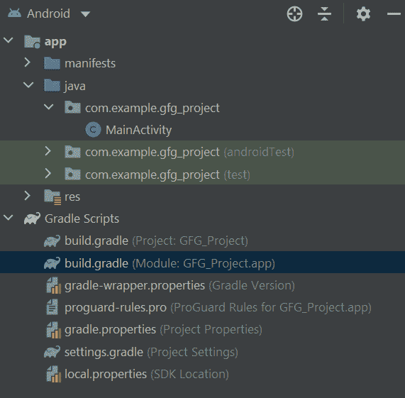
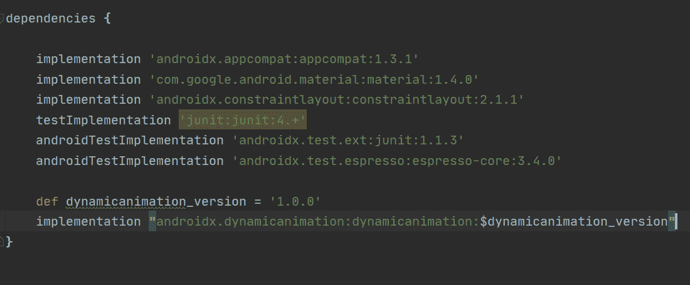
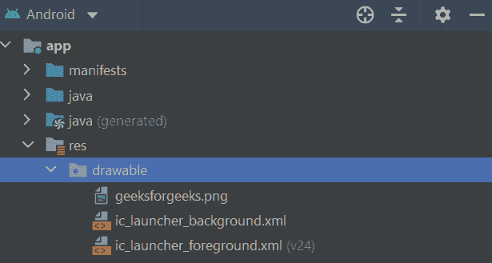

# 在安卓系统中使用 SpringAnimation 制作视图运动的动画

> 原文:[https://www . geesforgeks . org/animate-movements-of-view-using-spring animation-in-Android/](https://www.geeksforgeeks.org/animate-movements-of-view-using-springanimation-in-android/)

在安卓系统中，我们可以给物体的运动添加动画。我们可以为这些动作添加一些很酷的动画，而不仅仅是更新一个物体从一点到另一点的位置。安卓提供了很多方法，可以通过[动画](https://www.geeksforgeeks.org/animation-in-android-with-example/)改变视图对象在屏幕上的位置。但是，这里我们要看一下**春天动画**。春季动画是基于安卓物理的动画应用编程接口的一部分。安卓弹簧动画允许你像弹簧一样动画视图的运动。动画是基于潮湿，僵硬，弹性等属性。一旦弹簧动画开始，在每一帧上，弹簧力将更新动画的值和速度。动画将继续运行，直到弹簧力达到平衡。

### **简单跳跃动画**

下面给出了一个示例视频，以了解我们将在本文中做什么。注意，我们将使用 **Java** 语言来实现这个项目。

<figure class="media">

创建一个简单的春季动画真的很容易。以下是步骤:

1.  **添加** **支持库**
2.  **创建弹簧动画**的 **实例**
3.  **设置运动** **行为参数**
4.  **开始**T2 动画

### **创建弹簧动画**

我们可以使用 **SpringAnimation** 类为一个对象创建一个弹簧动画。首先，我们想要创建一个 SpringAnimation 类的实例，并提供一个对象(动画的目标对象)，一个我们想要制作动画的对象属性，以及动画的最终位置。

```java
View object = findViewById(R.id.image);
final SpringAnimation animation = new SpringAnimation(object, DynamicAnimation. TRANSLATION_Y, 0f);  
```

### 翻译 _X，翻译 _Y 和翻译 _Z

这些属性控制视图相对于其左侧坐标、顶部坐标和高程的增量位置，这些坐标和高程由其布局容器设置。

*   平移 _ X–左坐标
*   平移 _ Y–顶部坐标
*   平移 Z–视图相对于其高程的深度。

**阻尼比:**

它描述了弹簧振动的逐渐减少。系统中有四个阻尼比常数可用:

*   阻尼比高弹力
*   阻尼比中弹力
*   阻尼比低弹力
*   阻尼比无弹力

**刚度:**

它描述了弹簧的强度。系统中有四个阻尼比常数可用:

*   刚度 _ 高
*   刚度 _ 中等
*   刚度 _ 低
*   刚度 _ 非常低

高阻尼和低刚度会产生更多的振荡/反弹。要增加弹簧的刚度和阻尼比，请执行以下步骤

1.  调用 **getString()** 方法检索 spring 来添加属性。
2.  调用**setdampcantio()**/**setStiffness()**方法，传递要添加到弹簧中的值。

为了开始动画，我们或者调用 **start()** 或者**animateofinal position(浮动最终位置)**。此外，updateListener 和 removeListener 是各自的侦听器，用于在不再需要时侦听更新和删除侦听器。

**animatofileposition()**方法执行两个任务:

*   设置弹簧的最终位置。
*   启动动画，如果它还没有开始。

在开始动画之前，必须定义最终位置。

### **分步实施**

让我们看一个简单的例子，将 SpringAnimation 添加到 [ImageView](https://www.geeksforgeeks.org/imageview-in-android-with-example/) 中。我们将使用 **Java** 编程语言来实现这个项目。

**第一步:创建新项目**

首先，我们想创建一个新项目。在安卓工作室创建新项目请参考[如何在安卓工作室创建/启动新项目](https://www.geeksforgeeks.org/android-how-to-create-start-a-new-project-in-android-studio/)。

**第二步:添加支持库**

为了使用基于物理的支持库，我们希望将支持库添加到我们的项目中。

**2.1。为我们的应用模块打开 **build.gradle** 文件。**



build.gradle 文件(应用程序模块)

**2.2。**将支持库添加到**依赖项**

```java
dependencies {
    def dynamicanimation_version = '1.0.0'
    implementation "androidx.dynamicanimation:dynamicanimation:$dynamicanimation_version"
}
```



**第三步:将图像添加到可绘制文件夹**

要向可绘制文件夹添加图像，请参考 [](https://www.geeksforgeeks.org/how-to-add-image-to-drawable-folder-in-android-studio/) 至[如何在安卓工作室](https://www.geeksforgeeks.org/how-to-add-image-to-drawable-folder-in-android-studio/)向可绘制文件夹添加图像。只需将图像复制并粘贴到可绘制文件夹中，即可将图像添加到可绘制文件夹中

**导航:app > res >可绘制**



。

**第 4 步:使用 activity_main.xml 文件**

导航到 **app > res >布局> activity_main.xml** 并将下面的代码添加到该文件中。下面是**activity _ main . XML**文件的代码。

## 可扩展标记语言

```java
<?xml version="1.0" encoding="utf-8"?>
<androidx.constraintlayout.widget.ConstraintLayout
    xmlns:android="http://schemas.android.com/apk/res/android"
    xmlns:app="http://schemas.android.com/apk/res-auto"
    xmlns:tools="http://schemas.android.com/tools"
    android:layout_width="match_parent"
    android:layout_height="match_parent"
    android:background="#FFFFFF"
    tools:context=".MainActivity">

      <!-- Adding an ImageView for the animation -->
    <ImageView
        android:id="@+id/imageView"
        android:layout_width="343dp"
        android:layout_height="241dp"
        app:layout_constraintBottom_toBottomOf="parent"
        app:layout_constraintEnd_toEndOf="parent"
        app:layout_constraintStart_toStartOf="parent"
        app:layout_constraintTop_toTopOf="parent"
        app:layout_constraintVertical_bias="0.0"
        app:srcCompat="@drawable/ic_launcher_foreground" />

</androidx.constraintlayout.widget.ConstraintLayout>
```

**第五步:使用****MainActivity.java 文件**

转到**MainActivity.java**文件，参考以下代码。以下是**MainActivity.java**文件的代码。代码中添加了注释，以更详细地理解代码。向 ImageView 添加动画，并在单击图像时启动动画。

## Java 语言(一种计算机语言，尤用于创建网站)

```java
import androidx.appcompat.app.AppCompatActivity;
import androidx.dynamicanimation.animation.DynamicAnimation;
import androidx.dynamicanimation.animation.SpringAnimation;
import androidx.dynamicanimation.animation.SpringForce;

import android.os.Bundle;
import android.view.View;

public class MainActivity extends AppCompatActivity {

    @Override
    protected void onCreate(Bundle savedInstanceState) {
        super.onCreate(savedInstanceState);
        setContentView(R.layout.activity_main);

        // Creating a view for the imageView
        final View view =findViewById(R.id.imageView);

        // Setting up a spring animation to animate the view
        final SpringAnimation animation = new SpringAnimation(view, DynamicAnimation.TRANSLATION_Y,0f);

        // Setting the damping ratio to create a high bouncing effect
        animation.getSpring().setDampingRatio(SpringForce.DAMPING_RATIO_HIGH_BOUNCY);

        // Setting the spring with a very low stiffness 
        animation.getSpring().setStiffness(SpringForce.STIFFNESS_VERY_LOW);

        // Registering the AnimationEnd listener
        // This will indicate the End of the animation
        animation.addEndListener(new DynamicAnimation.OnAnimationEndListener() {
            @Override
            public void onAnimationEnd(DynamicAnimation animation1, boolean canceled, float value, float velocity) {
                  // set the image to the beginning of the Y axis   
                  view.setY(50f);              

                  // Again starting the animation
                animation.animateToFinalPosition(500f);     
            }
        });

        // setting a OnClickListener to the view
        // Starts the animation when the image is clicked
        view.setOnClickListener(new View.OnClickListener() {
            @Override
            public void onClick(View v) {
                // starts the animation
                animation.animateToFinalPosition(500f);     
            }
        });

    }
}
```

**输出:**

这是我们项目的产出。

</figure>