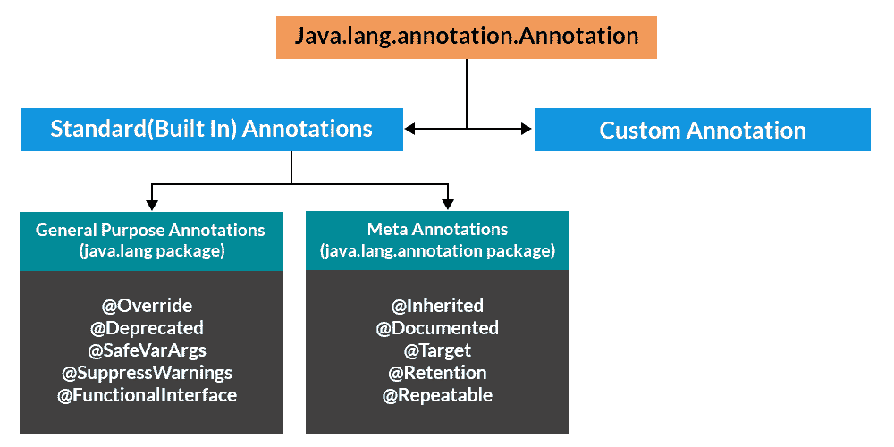

# Java 中的注释

> 原文:[https://www.geeksforgeeks.org/annotations-in-java/](https://www.geeksforgeeks.org/annotations-in-java/)

注释用于提供关于程序的补充信息。

*   注释以“ **@** ”开头。
*   注释不会改变编译程序的动作。
*   注释有助于将*元数据*(信息)与程序元素相关联，即实例变量、构造函数、方法、类等。
*   注释不是纯粹的注释，因为它们可以改变编译器处理程序的方式。参见下面的代码示例。

## Java 中注释的层次

****

****实施:****

> ****注意:**这个程序抛出编译器错误是因为我们提到了 override，但是没有 override，我们重载了 display。**

****示例:****

## **Java 语言(一种计算机语言，尤用于创建网站)**

```
// Java Program to Demonstrate that Annotations
// are Not Barely Comments

// Class 1
class Base {

    // Method
    public void display()
    {
        System.out.println("Base display()");
    }
}

// Class 2
// Main class
class Derived extends Base {

    // Overriding method as already up in above class
    @Override public void display(int x)
    {
        // Print statement when this method is called
        System.out.println("Derived display(int )");
    }

    // Method 2
    // Main driver method
    public static void main(String args[])
    {
        // Creating object of this class inside main()
        Derived obj = new Derived();

        // Calling display() method inside main()
        obj.display();
    }
}
```

****输出:****

```
10: error: method does not override or implement
    a method from a supertype
```

**如果我们移除参数(int x)或移除@override，程序编译正常。**

## **注释的类别**

**大致有 5 类注释，如下所示:**

1.  **标记注释**
2.  **单值注释**
3.  **完整注释**
4.  **键入注释**
5.  **重复注释**

**让我们讨论一下，如果需要，我们将在需要的地方添加代码。**

### ****类别 1:** 标记注释**

**唯一的目的是标记一个声明。这些注释不包含成员，也不包含任何数据。因此，它作为注释就足够了。由于标记接口不包含成员，因此简单地确定它是否存在就足够了。 **@Override** 是标记标注的一个例子。**

****例****

```
@TestAnnotation()
```

### ****类别 2:** 单值标注**

**这些注释只包含一个成员，并允许以简写形式指定成员的值。我们只需要在应用注释时指定该成员的值，而不需要指定成员的名称。但是，为了使用这种简写方式，成员的名称必须是一个值。**

****例****

```
@TestAnnotation(“testing”);
```

### ****类别 3:** 完整注释**

**这些注释由多个数据成员、名称、值、对组成。**

****例****

```
@TestAnnotation(owner=”Rahul”, value=”Class Geeks”)
```

### ****类别 4:** 类型标注**

**这些注释可以应用于任何使用类型的地方。例如，我们可以注释方法的返回类型。这些用*@ T1】@ Target 注释*声明注释。**

****例****

## **Java 语言(一种计算机语言，尤用于创建网站)**

```
// Java Program to Demonstrate Type Annotation

// Importing required classes
import java.lang.annotation.ElementType;
import java.lang.annotation.Target;

// Using target annotation to annotate a type
@Target(ElementType.TYPE_USE)

// Declaring a simple type annotation
@interface TypeAnnoDemo{}

// Main class
public class GFG {

    // Main driver method
    public static void main(String[] args) {

        // Annotating the type of a string
        @TypeAnnoDemo String string = "I am annotated with a type annotation";
        System.out.println(string);
        abc();
    }

    // Annotating return type of a function
    static @TypeAnnoDemo int abc() {

        System.out.println("This function's  return type is annotated");

        return 0;
    }
}
```

****Output:** 

```
I am annotated with a type annotation
This function's  return type is annotated
```** 

### ****类别 5:** 重复注释**

**这些是可以多次应用于单个项目的注释。要使注释可重复，必须使用**@可重复的**注释进行注释，该注释在 **java.lang.annotation** 包中定义。其值字段为可重复注释指定**容器类型**。**容器被指定为注释，其值字段是可重复注释类型的数组。**因此，要创建可重复的注释，首先创建容器注释，然后将注释类型指定为@Repeatable 注释的参数。**

****示例:****

## **Java 语言(一种计算机语言，尤用于创建网站)**

```
// Java Program to Demonstrate a Repeatable Annotation

// Importing required classes
import java.lang.annotation.Annotation;
import java.lang.annotation.Repeatable;
import java.lang.annotation.Retention;
import java.lang.annotation.RetentionPolicy;
import java.lang.reflect.Method;

// Make Words annotation repeatable
@Retention(RetentionPolicy.RUNTIME)
@Repeatable(MyRepeatedAnnos.class)
@interface Words
{
    String word() default "Hello";
    int value() default 0;
}

// Create container annotation
@Retention(RetentionPolicy.RUNTIME)
@interface MyRepeatedAnnos
{
    Words[] value();
}
public class Main {

    // Repeat Words on newMethod
    @Words(word = "First", value = 1)
    @Words(word = "Second", value = 2)
    public static void newMethod()
    {
        Main obj = new Main();

        try {
            Class<?> c = obj.getClass();

            // Obtain the annotation for newMethod
            Method m = c.getMethod("newMethod");

            // Display the repeated annotation
            Annotation anno
                = m.getAnnotation(MyRepeatedAnnos.class);
            System.out.println(anno);
        }
        catch (NoSuchMethodException e) {
            System.out.println(e);
        }
    }
    public static void main(String[] args) { newMethod(); }
}
```

****Output:** 

```
@MyRepeatedAnnos(value={@Words(value=1, word="First"), @Words(value=2, word="Second")})
```** 

## ****预定义/标准注释****

**正如我们在层次结构图中看到的，Java 通常定义七个内置注释。**

*   **四个是从 java.lang.annotation 导入的: **@Retention** 、**@ documentated**、 **@Target** 、**@ inherated**。**
*   **java.lang 中包含三个:**@弃用，@覆盖**和**@抑制警告****

### ****注释 1:**@已弃用**

*   **这是一个标记注释。它表示声明已过时，并已被更新的形式替换。**
*   **当一个元素被弃用时，应该使用 Javadoc[@弃用标记](http://docs.oracle.com/javase/1.5.0/docs/guide/javadoc/deprecation/deprecation.html#javadoc_tag)。**
*   **@弃用标记用于文档，@弃用注释用于运行时反射。**
*   **当两者一起使用时，@弃用标记比@弃用注释具有更高的优先级。**

****示例:****

## **Java 语言(一种计算机语言，尤用于创建网站)**

```
public class DeprecatedTest
{
    @Deprecated
    public void Display()
    {
        System.out.println("Deprecatedtest display()");
    }

    public static void main(String args[])
    {
        DeprecatedTest d1 = new DeprecatedTest();
        d1.Display();
    }
}
```

****Output**

```
Deprecatedtest display()
```** 

### **注释 2:@覆盖**

**这是一个只能在方法上使用的标记注释。用 **@Override** 注释的方法必须覆盖超类中的方法。如果没有，将导致编译时错误(例如参见[这个](https://ide.geeksforgeeks.org/ElmP5S))。它用于确保超类方法被实际覆盖，而不是简单地重载。**

****例****

## **Java 语言(一种计算机语言，尤用于创建网站)**

```
// Java Program to Illustrate Override Annotation

// Class 1
class Base
{
     public void Display()
     {
         System.out.println("Base display()");
     }

     public static void main(String args[])
     {
         Base t1 = new Derived();
         t1.Display();
     }    
}

// Class 2
// Extending above class
class Derived extends Base
{
     @Override
     public void Display()
     {
         System.out.println("Derived display()");
     }
}
```

****Output**

```
Derived display()
```** 

### **注释 3: @SuppressWarnings**

**它用于通知编译器抑制指定的编译器警告。要隐藏的警告以字符串形式按名称指定。这种类型的注释可以应用于任何类型的声明。**

**Java 将警告分为两类。它们是**弃用**和**未选中**。当遗留代码与使用泛型的代码交互时，会生成任何未检查的警告。**

****示例:****

## **Java 语言(一种计算机语言，尤用于创建网站)**

```
// Java Program to illustrate SuppressWarnings Annotation

// Class 1
class DeprecatedTest
{
    @Deprecated
    public void Display()
    {
        System.out.println("Deprecatedtest display()");
    }
}

// Class 2
public class SuppressWarningTest
{
    // If we comment below annotation, program generates
    // warning
    @SuppressWarnings({"checked", "deprecation"})
    public static void main(String args[])
    {
        DeprecatedTest d1 = new DeprecatedTest();
        d1.Display();
    }
}
```

****Output**

```
Deprecatedtest display()
```** 

### **注释 4:@已记录**

**它是一个标记接口，告诉工具要记录注释。注释不包含在“Javadoc”注释中。在代码中使用@ Documented 注释使像 Javadoc 这样的工具能够处理它，并在生成的文档中包含注释类型信息。**

### **注释 5:@目标**

**它被设计为仅用作另一个注释的注释。 **@Target** 取一个参数，这个参数必须是 **ElementType** 枚举中的常量。此参数指定注释可以应用的声明类型。常量及其对应的声明类型如下所示。**

<figure class="table">**T22】ANNOTATION _ TYPET34】FIELDT38

| **Target constant** | **Comments can be applied to** by and |
| --- | --- |
| Another note |
| Constructor | Constructor |
| 领域 |** </figure>

**我们可以在 **@Target** 注释中指定这些值中的一个或多个。要指定多个值，我们必须在大括号分隔的列表中指定它们。例如，要指定注释仅适用于字段和局部变量，可以使用@Target 注释:@Target({ElementType。字段，元素类型。LOCAL _ VARIABLE })**@保留注释**它决定注释保留在哪里以及保留多长时间。@Retention 注释可以有 3 个值:**

*   ****SOURCE:** 注释将保留在源代码级别，并被编译器忽略。**
*   ****CLASS:** 注释将在编译时保留，并被 JVM 忽略。**
*   ****RUNTIME:** 这些将在运行时保留。**

### ****注释 6:**@继承**

**@Inherited 是一个标记注释，只能在注释声明中使用。它只影响将在类声明中使用的注释。**@继承的**导致超类的注释被子类继承。因此，当向子类请求特定注释时，如果该注释不在子类中，则检查其超类。如果该注释出现在超类中，并且用 **@Inherited，**进行了注释，那么该注释将被返回。**

### ****注释 7:** 用户自定义(自定义)**

**用户定义的注释可用于注释程序元素，即变量、构造函数、方法等。这些注释可以在元素(构造函数、方法、类等)声明之前应用。**

****语法:**声明**

```
[Access Specifier] @interface<AnnotationName>
{         
   DataType <Method Name>() [default value];
}
```

**在实现用户定义的注释之前，一定要将这些特定的点作为自定义注释的规则。**

1.  ****注释名称**是一个标识符。**
2.  **该参数不应与方法声明相关联，**抛出的**子句不应与方法声明一起使用。**
3.  **参数不会有空值，但可以有默认值。**
4.  *****默认值*** 为可选。**
5.  **方法的返回类型应该是基元、枚举、字符串、类名或基元、枚举、字符串或类名类型的数组。**

****示例:****

## **Java 语言(一种计算机语言，尤用于创建网站)**

```
// Java Program to Demonstrate User-defined Annotations

package source;

import java.lang.annotation.Documented;
import java.lang.annotation.Retention;
import java.lang.annotation.RetentionPolicy;

// User-defined annotation
@Documented
@Retention(RetentionPolicy.RUNTIME)
@ interface TestAnnotation
{
    String Developer() default "Rahul";
    String Expirydate();
} // will be retained at runtime

// Driver class that uses @TestAnnotation
public class Test
{
    @TestAnnotation(Developer="Rahul", Expirydate="01-10-2020")
    void fun1()
    {
        System.out.println("Test method 1");
    }

    @TestAnnotation(Developer="Anil", Expirydate="01-10-2021")
    void fun2()
    {
        System.out.println("Test method 2");
    }

    public static void main(String args[])
    {
        System.out.println("Hello");
    }
}
```

****输出:****

```
Hello
```

**本文由拉胡尔·阿格拉瓦尔供稿。如果你喜欢 GeeksforGeeks 并想投稿，你也可以写一篇文章，把你的文章邮寄到 review-team@geeksforgeeks.org。看到你的文章出现在极客博客主页上，帮助其他极客。如果你发现任何不正确的地方，或者你想分享更多关于上面讨论的话题的信息，请写评论。**