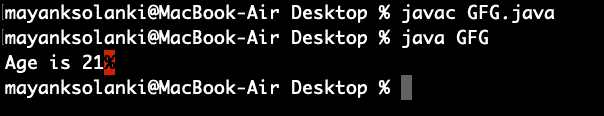

# Java 中的匿名内部类

> 原文:[https://www.geeksforgeeks.org/anonymous-inner-class-java/](https://www.geeksforgeeks.org/anonymous-inner-class-java/)

[Java 中的嵌套类](https://www.geeksforgeeks.org/nested-classes-java/)是坚持向前理解匿名内部类的先决条件。它是一个没有名称的内部类，并且只为其创建了一个对象。匿名内部类在创建具有某些“额外功能”的对象实例时非常有用，例如重写类或接口的方法，而不必实际子类化类。

> **提示:**匿名内部类在为图形编程中的监听器接口编写实现类时非常有用。

匿名类表达式的语法类似于构造函数的调用，只是代码块中包含了类定义。

**语法:**

```java
// Test can be interface,abstract/concrete class
Test t = new Test() 
{
   // data members and methods
   public void test_method() 
   {
      ........
      ........
    }   
};
```

现在让我们讨论一下常规类(普通类)和匿名内部类之间的区别

*   普通类可以实现任意数量的接口，但是匿名内部类一次只能实现一个接口。
*   一个常规类可以扩展一个类并同时实现任意数量的接口。但是匿名的内部类可以扩展一个类或者实现一个接口，但是不能同时实现两者。
*   对于常规/普通类，我们可以编写任意数量的构造函数，但是不能为匿名内部类编写任何构造函数，因为匿名类没有任何名称，并且在定义构造函数时，类名和构造函数名必须相同。

**访问封闭范围的局部变量，声明和访问匿名类的成员**

像局部类一样，匿名类可以捕获变量；它们对封闭范围的局部变量具有相同的访问权限:

*   匿名类可以访问其封闭类的成员。
*   匿名类不能访问其封闭范围内未声明为 final 或实际上为 final 的局部变量。
*   像嵌套类一样，匿名类中的类型声明(如变量)隐藏了封闭范围中具有相同名称的任何其他声明。

匿名类在成员方面也与本地类有相同的限制:

*   我们不能在匿名类中声明静态初始值设定项或成员接口。
*   匿名类可以有静态成员，只要它们是常量变量。

> **注意:**我们可以在匿名类中声明如下:
> 
> *   菲尔茨
> *   额外的方法(即使它们没有实现任何超类型的方法)
> *   实例初始化器
> *   本地类

**方式:**

匿名内部类是通过下面列出的两种方式通用创建的:

1.  类(可以是抽象的或具体的)
2.  连接

现在让我们举一个例子来理解匿名内部类，让我们举一个简单的程序

**例**

## Java 语言(一种计算机语言，尤用于创建网站)

```java
// Java program to demonstrate Need for
// Anonymous Inner class

// Interface
interface Age {

    // Defining variables and methods
    int x = 21;
    void getAge();
}

// Class 1
// Helper class implementing methods of Age Interface
class MyClass implements Age {

    // Overriding getAge() method
    @Override public void getAge()
    {
        // Print statement
        System.out.print("Age is " + x);
    }
}

// Class 2
// Main class
// AnonymousDemo
class GFG {
    // Main driver method
    public static void main(String[] args)
    {
        // Class 1 is implementation class of Age interface
        MyClass obj = new MyClass();

        // calling getage() method implemented at Class1
        // inside main() method
        obj.getAge();
    }
}
```

**输出:**



**输出解释:**

在上面的程序中，接口 Age 是用 getAge()方法创建的，x=21。Myclass 是作为 Age 接口的实现类编写的。正如在程序中所做的，没有必要编写一个单独的类 Myclass。相反，直接将 Myclass 的代码复制到这个参数中，如下所示:

```java
Age oj1 = new Age() 
{
    @Override
    public void getAge() 
    {
        System.out.print("Age is " + x);
    }
};
```

> 这里，没有创建一个对象到年龄，但是在整个类代码中创建并复制了一个我的类的对象，如上所示。只有匿名内部类才能做到这一点。这样的类叫做‘匿名内部类’，所以这里我们把‘my class’叫做匿名内部类。

**示例:**

## Java 语言(一种计算机语言，尤用于创建网站)

```java
// Java Program to Demonstrate Anonymous inner class

// Interface
interface Age {
    int x = 21;
    void getAge();
}

// Main class
class AnonymousDemo {

    // Main driver method
    public static void main(String[] args)
    {

        // Myclass is hidden inner class of Age interface
        // whose name is not written but an object to it
        // is created.
        Age oj1 = new Age() {

            @Override public void getAge()
            {
                // printing  age
                System.out.print("Age is " + x);
            }
        };

        oj1.getAge();
    }
}
```

**Output**

```java
Age is 21
```

### 匿名内部类的类型

基于声明和行为，有 3 种类型的匿名内部类:

1.  扩展类的匿名内部类
2.  实现接口的匿名内部类
3.  定义内部方法/构造函数参数的匿名内部类

**类型 1:** 扩展类的匿名内部类

我们可以有一个匿名的内部类来扩展一个类。例如，我们知道可以通过扩展 thread 类来创建一个线程。假设我们需要一个即时线程，但是我们不想创建一个一直扩展[线程类](https://www.geeksforgeeks.org/java-lang-thread-class-java/)的类。借助这种匿名内部类，我们可以定义一个就绪线程。

**例**

## Java 语言(一种计算机语言，尤用于创建网站)

```java
// Java program to illustrate creating an immediate thread
// Using Anonymous Inner class that extends a Class

// Main class
class MyThread {

    // Main driver method
    public static void main(String[] args)
    {
        // Using Anonymous Inner class that extends a class
        // Here a Thread class
        Thread t = new Thread() {

            // run() method for the thread
            public void run()
            {
                // Print statement for child thread
                // execution
                System.out.println("Child Thread");
            }
        };

        // Starting the thread
        t.start();

        // Displaying main thread only for readability
        System.out.println("Main Thread");
    }
}
```

**Output**

```java
Main Thread
Child Thread
```

**类型 2:** 实现接口的匿名内部类

我们还可以有一个实现接口的匿名内部类。例如，我们还知道，通过实现 Runnable 接口，我们可以创建一个线程。这里我们使用一个匿名的内部类来实现一个接口。

**例**

## Java 语言(一种计算机语言，尤用于创建网站)

```java
// Java program to illustrate defining a thread
// Using Anonymous Inner class that implements an interface

// Main class
class MyThread {

    // Main driver method
    public static void main(String[] args)
    {
        // Here we are using Anonymous Inner class
        // that implements a interface i.e. Here Runnable
        // interface
        Runnable r = new Runnable() {

            // run() method for the thread
            public void run()
            {
                // Print statement when run() is invoked
                System.out.println("Child Thread");
            }
        };

        // Creating thread in main() using Thread class
        Thread t = new Thread(r);

        // Starting the thread using start() method
        // which invokes run() method automatically
        t.start();

        // Print statement only
        System.out.println("Main Thread");
    }
}
```

**Output**

```java
Main Thread
Child Thread
```

**类型 3:** 匿名内部类，定义内部方法/构造函数参数

方法/构造函数参数中的匿名内部类通常用于图形用户界面应用程序。为了让您熟悉语法，让我们看一下下面的程序，它使用这种类型的匿名内部类创建一个线程

**例**

## Java 语言(一种计算机语言，尤用于创建网站)

```java
// Java program to illustrate defining a thread
// Using Anonymous Inner class that define inside argument

// Main class
class MyThread {
    // Main driver method
    public static void main(String[] args)
    {
        // Using Anonymous Inner class that define inside
        // argument
        // Here constructor argument
        Thread t = new Thread(new Runnable() {

            public void run()
            {
                System.out.println("Child Thread");
            }
        });

        t.start();

        System.out.println("Main Thread");
    }
}
```

**Output**

```java
Main Thread
Child Thread
```

但是，构造函数不能在匿名类中声明。
本文由 [**【尼尚·夏尔马】**](https://www.facebook.com/ChippingEye2766)[**比沙尔·库马尔·杜贝**](https://auth.geeksforgeeks.org/profile.php?user=Bishal Dubey) 供稿。如果你喜欢 GeeksforGeeks 并想投稿，也可以用[write.geeksforgeeks.org](http://www.write.geeksforgeeks.org)写一篇文章。看到你的文章出现在极客博客主页上，帮助其他极客。如果你发现任何不正确的地方，或者你想分享更多关于上面讨论的话题的信息，请写评论。