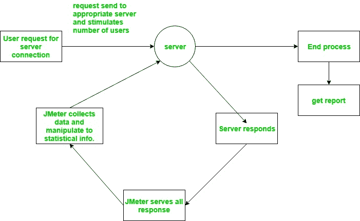

# 阿帕奇 JMeter–简介

> 原文:[https://www . geesforgeks . org/Apache-jmeter-an-introduction/](https://www.geeksforgeeks.org/apache-jmeter-an-introduction/)

JMeter 是一个开源测试软件。它是用于负载和性能测试的 100%纯 java 应用程序。JMeter 旨在分析和测量 web 应用程序和各种服务的性能和负载功能行为。

JMeter 主要用于测试 Web 应用或 FTP 应用，但目前适用于功能测试、JDBC 数据库连接、Web 服务、通用 TCP 连接和 OS 原生进程。jMeter 被设计为覆盖测试的类别，如负载、功能、性能、回归等。，而且它要求 JDK 5 或更高。

**Apache 软件基金会的 Stefano Mazzocchi** 是 JMeter 的最初开发者。他编写它主要是为了测试 Apache JServ(现在称为 Apache Tomcat 项目)的性能。Apache 后来重新设计了 JMeter，以增强图形用户界面并增加功能测试功能。

JMeter 是一个 Java 桌面应用程序，具有使用 Swing 图形 API 的图形界面。因此，它可以在任何接受 Java 虚拟机的环境/工作站上运行，例如——Windows、Linux、Mac 等。

以下是 JMeter 支持的**协议列表**:

1.  web–HTTP，HTTPS 网站的 web 1.0 web 2.0(Ajax、flex 和 flex-ws-amf)。
2.  网络服务-SOAP/XML-RPC
3.  通过 JDBC 驱动程序的数据库
4.  目录–LDAP
5.  通过 JMS 的面向消息的服务
6.  服务–pop 3、IMAP、SMTP
7.  FTP Service

    **JMeter 功能**

    以下是 JMeter 的一些重要特性:

    1.  **开源应用:** JMeter 是一款开源软件。因此是免费提供的。
    2.  **用户友好的 GUI:** 它有一个简单且交互的 GUI。
    3.  **支持多种服务器类型:** JMeter 可以对多种不同的服务器类型进行负载和性能测试——Web–HTTP、HTTPS、SOAP、通过 JDBC 的数据库、LDAP、JMS、Mail–pop 3 等。
    4.  **平台无关:**它是一个平台无关的工具，因为它是使用 Java 编写和开发的。
    5.  **框架:**它是一个多线程框架，允许多个线程并发采样，不同的功能由单独的线程组同时采样。
    6.  **具有高度可扩展性。**

    **JMeter 的工作:**

    JMeter 模拟一组用户，并向目标服务器发送请求。因此，返回显示目标服务器功能/性能的统计数据。

    下图显示了 JMeter 的工作原理:

    