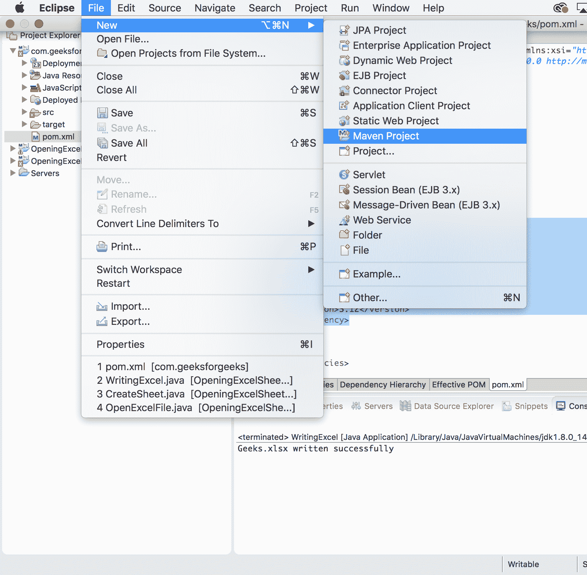
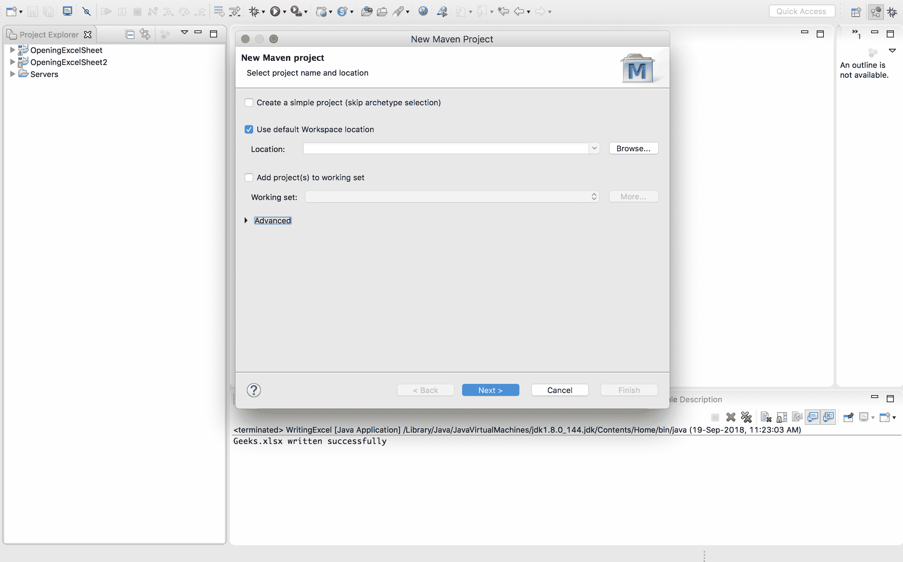
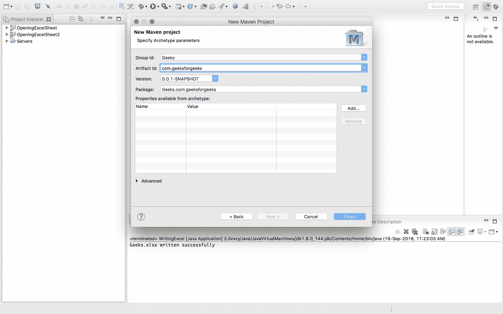
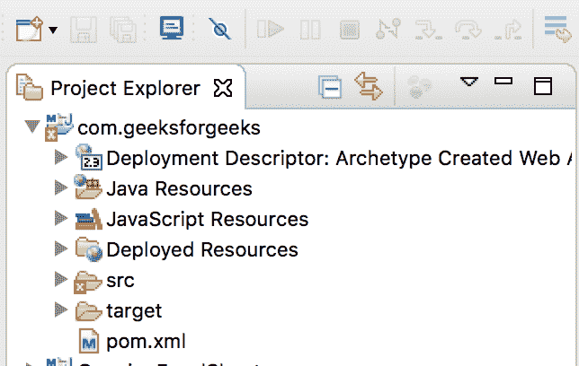
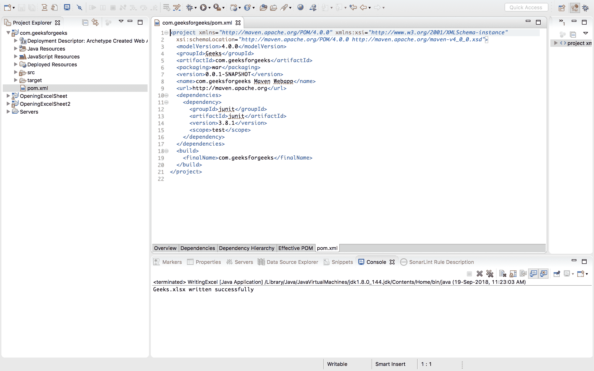
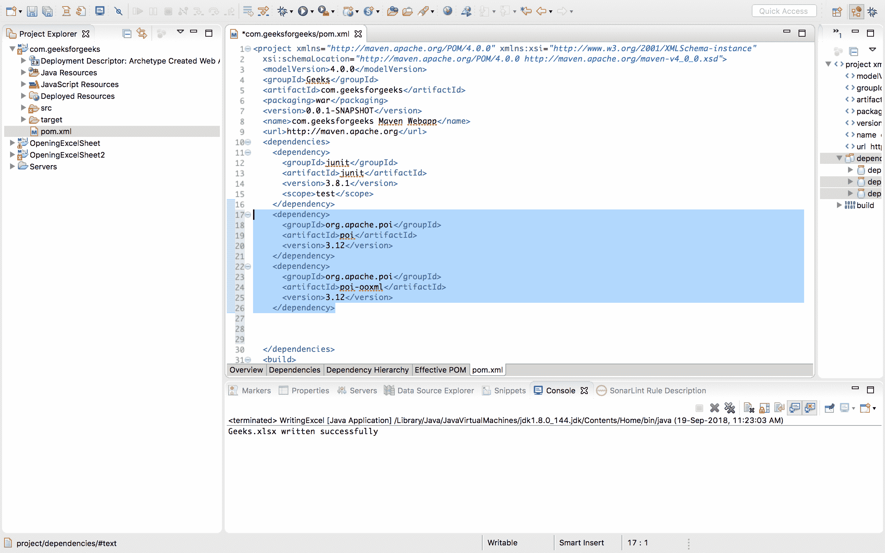
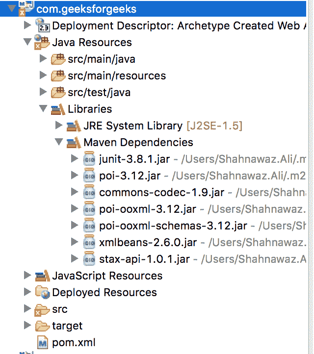

# 阿帕奇 POI |入门

> 原文:[https://www.geeksforgeeks.org/apache-poi-getting-started/](https://www.geeksforgeeks.org/apache-poi-getting-started/)

**POI** 代表**“混淆实现不佳”**。Apache POI 是由 **Apache 基金会**提供的一个 API，它是不同 java 库的集合。这些库提供了读取、写入和操作不同微软文件的功能，如 excel 工作表、power-point 和 word 文件。它的第一个版本于 2001 年 12 月 30 日发布。

## 阿帕奇兴趣点架构

Apache POI 有不同的类和方法来处理不同的微软办公文档。

*   **POIFS**
    它代表“糟糕的混淆实现文件系统”。该组件是所有其他兴趣点元素的基本因素。它用于显式读取不同的文件。
*   **HSSF**
    代表“可怕的电子表格格式”。用于读写 MS-Excel 文件的 xls 格式。
*   **XSF**
    它代表“XML 电子表格格式”。用于 MS-Excel 的 xlsx 文件格式。
*   **HPSF**
    代表“恐怖属性集格式”。它用于提取微软办公文件的属性集。
*   **HWPF**
    代表“可怕的文字处理器格式”。用于 MS-Word 文档扩展文件的读写。
*   **XWPF**
    它代表“XML 文字处理器格式”。用于读写 MS-Word 的 docx 扩展文件。
*   **HSLF**
    代表“恐怖的幻灯片版式”。它用于阅读、创建和编辑 PowerPoint 演示文稿。
*   **HDGF**
    代表“恐怖图表格式”。它包含用于 MS-Visio 二进制文件的类和方法。
*   **HPBF**
    代表“可怕的出版商格式”。用于读写微软发布者文件。

## 装置

根据项目的类型，有两种安装 apache jar 文件的方法:

1.  **Maven Project**

    如果项目是 MAVEN，那么在项目的 pom.xml 文件中添加依赖项。
    要添加的依赖关系如下所示:

    ```
    <!-- https://mvnrepository.com/artifact/org.apache.poi/poi -->
    <dependency>
          <groupId>org.apache.poi</groupId>
          <artifactId>poi</artifactId>
          <version>3.12</version>
        </dependency>
        <dependency>
          <groupId>org.apache.poi</groupId>
          <artifactId>poi-ooxml</artifactId>
          <version>3.12</version>
        </dependency>
    ```

    **在 eclipse 中创建 maven 项目并添加依赖关系的步骤**

    *   点击文件->新建->maven 项目
        
    *   出现一个新窗口，点击下一步
        
    *   选择 maven-原型-webapp
        
    *   给出项目名称
        
    *   工作区中形成一个项目，并自动出现一个 pom.xml 文件
        
    *   在现有结构的 pom.xml 文件
        中打开该文件
    *   在 pom.xml 文件
        中复制 apache poi 依赖关系
    *   Maven 依赖项是在复制 maven 依赖项后保存 pom.xml 文件时添加的。
        
2.  **Simple Java Project**

    如果不使用 maven，那么可以从 [POI 下载](http://poi.apache.org/download.html)下载 maven jar 文件。运行示例代码至少要包含以下 jar 文件:

    > then-3.10-final . jar
    > then-ooxml-3.10-final . jar
    > common codec-1.5 . jar
    > then-ooxml schema-3.10-final . jar
    > XML APIs-1.0 . B2 . jar
    > StAX-API-1 . 0 . 1 . jar
    > xmlbeans-XML bean

    跟着这个[链接](https://stackoverflow.com/questions/3280353/how-to-import-a-jar-in-eclipse)看看如何在 eclipse 中添加外部罐子。

## 类和方法

**工作簿**
是所有创建或维护 Excel 工作簿的类的超级界面。下面是实现此接口的两个类

1.  **HSSFWorkbook**
    实现了 Workbook 接口，用于中的 Excel 文件。xls 格式。下面列出了这个类下的一些方法和构造函数。
    *   **Methods and Constructors**

        > hssfworkbook()
        > hssfworkbook(directory directory directory directory，boolean preserve nodes)
        > hssfworkbook(directory directory directory，pofsilesystem fs，boolean preserve nodes)
        > hssfworkbook(Java . io . input stream s)
        > hssfworkbook(Java . io . input stream s，boolean preserve nodes)
        > hssfworkbook(pofsilesystem fs)】

        其中:
        **目录**-这是要处理的兴趣点文件系统目录。
        **fs**-包含工作簿流的是兴趣点文件系统。
        **保留节点**–这是一个可选参数，决定是否像宏一样保留其他节点。它会消耗大量内存，因为它会将所有文件系统存储在内存中(如果设置的话)。

2.  **XSSFWorkbook**
    它是一个用来表示高、低级 Excel 文件格式的类。它属于 org.apache.xssf.usemodel 包，实现了 Workbook 接口。下面列出了这个类下的方法和构造函数。
    *   **类**

        > XSSFWorkbook()
        > XSSFWorkbook(Java . io . file 文件)
        > XSSFWorkbook(Java . io . inputstream is)
        > XSSFWorkbook(Java . lang . string 路径)

    *   **方法**

        > 创建工作表()
        > 创建工作表(爪哇。朗。【字符串工作表名称】
        > 创建字体()
        > 创建单元格样式()
        > 创建字体()
        > 设置打印区域(int 工作表索引、int startColumn、int endColumn、int startRow、int endrow)

## 优势

1.  它适用于大文件，并且使用较少的内存
2.  apache poi 的主要优势是它同时支持 HSSFWorkbook 和 XSSFWorkbook。
3.  它包含 excel 文件格式的 HSSF 实现