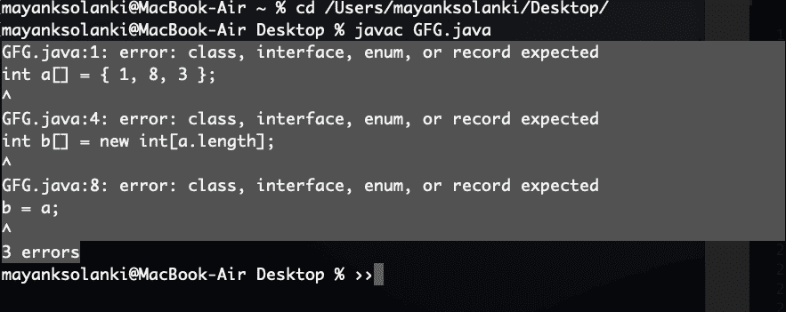

# Java 中的数组复制

> 原文:[https://www.geeksforgeeks.org/array-copy-in-java/](https://www.geeksforgeeks.org/array-copy-in-java/)

给定一个数组，我们需要将它的元素复制到一个不同的数组中，一个天真的用户会想到下面的方法，然而这是不正确的，如下所示:

```java
// Java Program to Illustrate Wrong Way Of Copying an Array

// Input array
int a[] = { 1, 8, 3 };

// Creating an array b[] of same size as a[]
int b[] = new int[a.length];

// Doesn't copy elements of a[] to b[], only makes
// b refer to same location
b = a;
```

**输出:**



**输出解释:**当我们做“b = a”时，实际上是在给数组赋值引用。因此，如果我们对一个数组进行任何更改，它也会反映在其他数组中，因为 a 和 b 都指向同一个位置。我们也可以用如下所示的代码进行验证:

**示例:**

## Java 语言(一种计算机语言，尤用于创建网站)

```java
// A Java program to demonstrate that simply
// assigning one array reference is incorrect
public class Test {
    public static void main(String[] args)
    {
        int a[] = { 1, 8, 3 };

        // Create an array b[] of same size as a[]
        int b[] = new int[a.length];

        // Doesn't copy elements of a[] to b[],
        // only makes b refer to same location
        b = a;

        // Change to b[] will also reflect in a[]
        // as 'a' and 'b' refer to same location.
        b[0]++;

        System.out.println("Contents of a[] ");
        for (int i = 0; i < a.length; i++)
            System.out.print(a[i] + " ");

        System.out.println("\n\nContents of b[] ");
        for (int i = 0; i < b.length; i++)
            System.out.print(b[i] + " ");
    }
}
```

**Output**

```java
Contents of a[] 
2 8 3 

Contents of b[] 
2 8 3 
```

**方法:**

我们已经看到了在复制元素时的内部工作，以及在通过上面生成的错误后要考虑的边缘情况，因此现在我们可以提出复制数组的正确方法，如下所示:

1.  迭代给定原始数组的每个元素，一次复制一个元素
2.  使用克隆()方法
3.  使用 arraycopy()方法
4.  使用数组类的 copyOf()方法
5.  使用数组类的 copyOfRange()方法

**方法 1:** 迭代给定原始数组的每个元素，一次复制一个元素。使用此方法，可以保证对 b 的任何修改都不会改变原始数组 a，如下例所示:

**示例:**

## Java 语言(一种计算机语言，尤用于创建网站)

```java
// Java program to demonstrate copying by
// one by one assigning elements between arrays

// Main class
public class GFG {

    // Main driver method
    public static void main(String[] args)
    {
        // Input array a[]
        int a[] = { 1, 8, 3 };

        // Create an array b[] of same size as a[]
        int b[] = new int[a.length];

        // Copying elements of a[] to b[]
        for (int i = 0; i < a.length; i++)
            b[i] = a[i];

        // Changing b[] to verify that
        // b[] is different from a[]
        b[0]++;

        // Display message only
        System.out.println("Contents of a[] ");

        for (int i = 0; i < a.length; i++)
            System.out.print(a[i] + " ");

        // Display message only
        System.out.println("\n\nContents of b[] ");

        for (int i = 0; i < b.length; i++)
            System.out.print(b[i] + " ");
    }
}
```

**Output**

```java
Contents of a[] 
1 8 3 

Contents of b[] 
2 8 3 
```

**方法二:**使用克隆()方法

在前面的方法中，我们必须迭代整个数组来制作副本，我们能做得更好吗？是的，我们可以使用 Java 中的[克隆方法](http://geeksquiz.com/cloning-in-java/)。

**示例:**

## Java 语言(一种计算机语言，尤用于创建网站)

```java
// Java program to demonstrate Copying of Array
// using clone() method

// Main class
public class GFG {

    // Main driver method
    public static void main(String[] args)
    {
        // Input array a[]
        int a[] = { 1, 8, 3 };

        // Copying elements of a[] to b[]
        int b[] = a.clone();

        // Changing b[] to verify that
        // b[] is different from a[]
        b[0]++;

        // Display message for better readability
        System.out.println("Contents of a[] ");

        for (int i = 0; i < a.length; i++)
            System.out.print(a[i] + " ");

        // Display message for better readability
        System.out.println("\n\nContents of b[] ");

        for (int i = 0; i < b.length; i++)
            System.out.print(b[i] + " ");
    }
}
```

**Output**

```java
Contents of a[] 
1 8 3 

Contents of b[] 
2 8 3 
```

**方法 3:** 使用 arraycopy()方法

我们也可以使用 **System.arraycopy()** 方法。该系统以 java.lang 包的形式出现。其签名如下:

```java
public static void arraycopy(Object src, int srcPos, Object dest, 
                             int destPos, int length)
```

**参数:**

*   **src** 表示源阵列。
*   **srcPos** 是复制开始的索引。
*   **dest** 表示目的阵列
*   **destPos** 是将复制的元素放入目标数组的索引。
*   **长度**是要复制的子阵列的长度。

**示例:**

## Java 语言(一种计算机语言，尤用于创建网站)

```java
// Java program to demonstrate array
// copy using System.arraycopy()

// Main class
public class GFG {

    // Main driver method
    public static void main(String[] args)
    {
        // Custom input array
        int a[] = { 1, 8, 3 };

        // Creating an array b[] of same size as a[]
        int b[] = new int[a.length];

        // Copying elements of a[] to b[]
        System.arraycopy(a, 0, b, 0, 3);

        // Changing b[] to verify that
        // b[] is different from a[]
        b[0]++;

        // Display message only
        System.out.println("Contents of a[] ");

        for (int i = 0; i < a.length; i++)
            System.out.print(a[i] + " ");

        // Display message only
        System.out.println("\n\nContents of b[] ");

        for (int i = 0; i < b.length; i++)
            System.out.print(b[i] + " ");
    }
}
```

**Output**

```java
Contents of a[] 
1 8 3 

Contents of b[] 
2 8 3 
```

**方法 4:** 使用数组类**的 copyOf()方法**

如果我们想要复制数组的前几个元素或者数组的完整副本，可以使用这个方法。

**语法:**

```java
public static int[] copyOf​(int[] original, int newLength)
```

**参数:**

*   原始数组
*   要复制的数组长度。

**示例:**

## Java 语言(一种计算机语言，尤用于创建网站)

```java
// Java program to demonstrate array
// copy using Arrays.copyOf()

// Importing Arrays class from utility class
import java.util.Arrays;

// Main class
class GFG {

    // Main driver method
    public static void main(String[] args)
    {
        // Custom input array
        int a[] = { 1, 8, 3 };

        // Create an array b[] of same size as a[]
        // Copy elements of a[] to b[]
        int b[] = Arrays.copyOf(a, 3);

        // Change b[] to verify that
        // b[] is different from a[]
        b[0]++;

        System.out.println("Contents of a[] ");

        // Iterating over array. a[]
        for (int i = 0; i < a.length; i++)
            System.out.print(a[i] + " ");

        System.out.println("\n\nContents of b[] ");

        // Iterating over array b[]
        for (int i = 0; i < b.length; i++)
            System.out.print(b[i] + " ");
    }
}
```

**Output**

```java
Contents of a[] 
1 8 3 

Contents of b[] 
2 8 3 
```

**方法 5:** 使用 Arrays 类的 copyOfRange()方法

此方法将指定数组的指定范围复制到新数组中。

```java
public static int[] copyOfRange​(int[] original, int from, int to)
```

**参数:**

*   要从中复制范围的原始数组
*   要复制的范围的初始索引
*   要复制的范围的最终索引，不包括

**示例:**

## Java 语言(一种计算机语言，尤用于创建网站)

```java
// Java program to demonstrate array
// copy using Arrays.copyOfRange()

// Importing Arrays class from utility package
import java.util.Arrays;

// Main class
class GFG {

    // Main driver method
    public static void main(String[] args)
    {
        // Custom input array
        int a[] = { 1, 8, 3, 5, 9, 10 };

        // Creating an array b[] and
        // copying elements of a[] to b[]
        int b[] = Arrays.copyOfRange(a, 2, 6);

        // Changing b[] to verify that
        // b[] is different from a[]

        // Iterating over array a[]
        System.out.println("Contents of a[] ");
        for (int i = 0; i < a.length; i++)
            System.out.print(a[i] + " ");

        // Iterating over array b[]
        System.out.println("\n\nContents of b[] ");
        for (int i = 0; i < b.length; i++)
            System.out.print(b[i] + " ");
    }
}
```

**Output**

```java
Contents of a[] 
1 8 3 5 9 10 

Contents of b[] 
3 5 9 10 
```

**最后，让我们讨论一下** **对上述方法的概述:**

*   简单地分配引用是错误的
*   可以通过迭代数组并逐个分配元素来复制数组。
*   我们可以使用 clone()或 System.arraycopy() 避免在元素*上迭代*
*   clone()创建一个相同大小的新数组，但 *System.arraycopy()* 可用于从源范围复制到目标范围。
*   System.arraycopy()比 clone()更快，因为它使用了 Java 本机接口
*   如果要复制数组的前几个元素或数组的完整副本，可以使用 Arrays.copyOf()方法。
*   Arrays.copyOfRange()用于复制数组的指定范围。如果起始索引不是 0，则可以使用此方法复制部分数组。

本文由**阿舒托什·库马尔**供稿。如果你发现任何不正确的地方，或者你想分享更多关于上面讨论的话题的信息，请写评论。