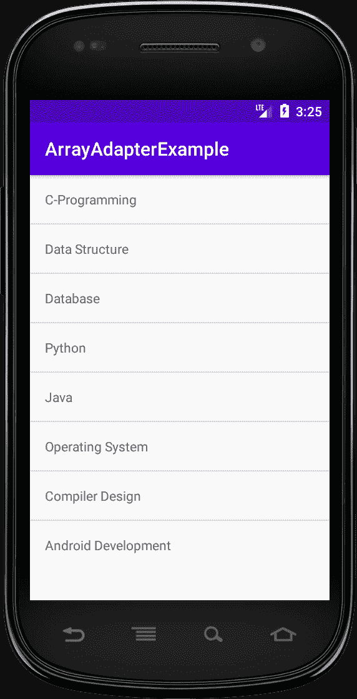

# 安卓中的 ArrayAdapter 示例

> 原文:[https://www . geeksforgeeks . org/arrayadapter-in-Android-with-example/](https://www.geeksforgeeks.org/arrayadapter-in-android-with-example/)

适配器充当用户界面组件和数据源之间的桥梁。它将数据源中的数据转换成可以显示在用户界面组件中的视图项。数据源可以是数组、哈希映射、数据库等。而 UI 组件可以是 [ListView](https://www.geeksforgeeks.org/android-listview-in-java-with-example/) 、GridView、 [Spinner](https://www.geeksforgeeks.org/spinner-in-android-using-java-with-example/) 等。 **ArrayAdapter** 是安卓系统中最常用的适配器。当您有存储在数组中的单一类型项的列表时，您可以使用 ArrayAdapter。同样，如果你有一个电话号码、姓名或城市的列表。ArrayAdapter 的布局只有一个[文本视图](https://www.geeksforgeeks.org/textview-widget-in-android-using-java-with-examples/)。如果你想有一个更复杂的布局而不是数组适配器，使用**习惯的数组适配器**。 **ArrayAdapter 的基本语法如下:**

> 公共数组适配器(上下文上下文，内部资源，内部文本视图资源标识，T[]对象)

### **参数**

<figure class="table">

| 

因素

 | 

描述

 |
| --- | --- |
| **上下文** | 当前上下文。该值不能为空。 |
| **资源** | 包含实例化视图时要使用的布局的布局文件的资源标识。 |
| 文字检视资源 Id | 布局资源中要填充的文本视图的 id。 |
| **物体** | 要在列表视图中表示的对象。该值不能为空。 |

</figure>

**上下文:** 用于传递当前类的引用。这里' this '关键字用于传递当前的类引用。除了“这个”之外，我们还可以使用 [getApplicationContext()](https://www.geeksforgeeks.org/what-is-context-in-android/) 方法(用于活动)和 **getApplication()** 方法(用于片段)。

> 公共 ArrayAdapter(这个，int resource，int textViewResourceId，T[]对象)

**资源:**用于设置布局文件(。xml 文件)。

> 公共 ArrayAdapter(这个，R.layout.itemListView，int textViewResourceId，T[]对象)

**textViewResourceId:** 用于设置要显示文本数据的 TextView。

> 公共 ArrayAdapter(这个，R.layout.itemListView，R.id.itemTextView，T[]对象)

**对象:**这些是用于将数组元素设置到文本视图中的数组对象。

> string courseList[]= {“C-Programming”、“数据结构”、“数据库”、“Python”，
> 
> “Java”、“操作系统”、“编译器设计”、“安卓开发”}；
> 
> ArrayAdapter arrayAdapter = new ArrayAdapter（this， R.layout.itemListView， R.id.itemTextView， courseList[]）;

### 例子

在本例中，使用简单的阵列适配器显示课程列表。注意，我们将使用 **Java** 语言来实现这个项目。

**第一步:创建新项目**

要在安卓工作室创建新项目，请参考[如何在安卓工作室创建/启动新项目](https://www.geeksforgeeks.org/android-how-to-create-start-a-new-project-in-android-studio/)。注意选择 **Java** 作为编程语言。

**步骤 2:使用 activity_main.xml 文件**

转到布局文件夹，在 **activity_main.xml** 文件中，将[约束布局](https://www.geeksforgeeks.org/android-ui-layouts/)更改为[相对布局](https://www.geeksforgeeks.org/android-relativelayout-in-kotlin/)，并插入一个 id 为 simpleListView 的[列表视图](https://www.geeksforgeeks.org/android-listview-in-java-with-example/)。下面是**activity _ main . XML**文件的代码。

## 可扩展标记语言

```java
<?xml version="1.0" encoding="utf-8"?>
<RelativeLayout 
    xmlns:android="http://schemas.android.com/apk/res/android"
    xmlns:tools="http://schemas.android.com/tools"
    android:layout_width="match_parent"
    android:layout_height="match_parent"
    tools:context=".MainActivity">

    <ListView
        android:id="@+id/simpleListView"
        android:layout_width="match_parent"
        android:layout_height="wrap_content" />

</RelativeLayout>
```

**第三步:新建布局文件**

转到 **app > res >布局>右键单击>新建>布局资源文件**，创建一个新的布局文件，并将该文件命名为 **item_view.xml** ，并将根元素设为[线形布局](https://www.geeksforgeeks.org/linearlayout-and-its-important-attributes-with-examples-in-android/)。这将包含一个[文本视图](https://www.geeksforgeeks.org/textview-widget-in-android-using-java-with-examples/)，用于显示数组对象作为输出。

## 可扩展标记语言

```java
<?xml version="1.0" encoding="utf-8"?>
<LinearLayout 
    xmlns:android="http://schemas.android.com/apk/res/android"
    android:layout_width="match_parent"
    android:layout_height="match_parent"
    android:orientation="vertical">

    <TextView
        android:id="@+id/itemTextView"
        android:layout_width="match_parent"
        android:layout_height="wrap_content"
        android:layout_gravity="center" />

</LinearLayout>
```

**步骤 4:使用 MainActivity.java 文件**

现在转到 java 文件夹，在**MainActivity.java**中，向 ArrayAdapter 提供实现。下面是**MainActivity.java**文件的代码。

## Java 语言(一种计算机语言，尤用于创建网站)

```java
import android.os.Bundle;
import android.widget.ArrayAdapter;
import android.widget.ListView;
import androidx.appcompat.app.AppCompatActivity;

public class MainActivity extends AppCompatActivity {

    ListView simpleListView;

    // array objects
    String courseList[] = {"C-Programming", "Data Structure", "Database", "Python",
                            "Java", "Operating System", "Compiler Design", "Android Development"};

    @Override
    protected void onCreate(Bundle savedInstanceState) {
        super.onCreate(savedInstanceState);
        setContentView(R.layout.activity_main);

        simpleListView = (ListView) findViewById(R.id.simpleListView);

        ArrayAdapter<String> arrayAdapter = new ArrayAdapter<String>(this,
                R.layout.item_view, R.id.itemTextView, courseList);
        simpleListView.setAdapter(arrayAdapter);
    }
}
```

### **输出:在仿真器上运行**

