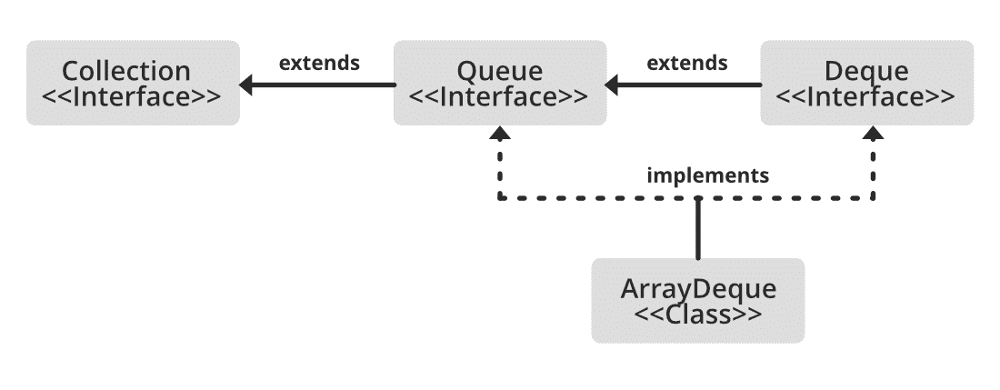

# Java 中的 array deque

> 原文:[https://www.geeksforgeeks.org/arraydeque-in-java/](https://www.geeksforgeeks.org/arraydeque-in-java/)

Java 中的[ArrayDeque](https://www.geeksforgeeks.org/arraydeque-in-java/)除了实现 Deque 接口之外，还提供了一种应用可调整大小的数组的方法。又称 ***阵双端队列*** 或 ***阵甲板*** 。这是一种特殊的数组，它不断增长，允许用户在队列的两端添加或删除元素。

ArrayDeque 的几个**重要特征如下:**

*   **阵列数据区没有容量限制，可以根据需要增长以支持使用。**
*   **它们不是线程安全的，这意味着在没有外部同步的情况下，ArrayDeque 不支持多线程并发访问。**
*   **数组中禁止空元素。**
*   **ArrayDeque 类用作堆栈时可能比 Stack 更快。**
*   **当用作队列时，ArrayDeque 类可能比 LinkedList 更快。**

****ArrayDeque 实现的接口:****

**ArrayDeque 类实现了这两个接口:**

*   **[](https://www.geeksforgeeks.org/queue-interface-java/)****接口:**这是一个接口，它是一个先进先出的数据结构，元素从后面添加。****
*   ****[**【德客】**](https://www.geeksforgeeks.org/deque-interface-java-example/) **界面:**是一个双端队列，可以从两边插入元素。这是一个实现队列的接口。****

****ArrayDeque 同时实现了 Queue 和 Deque。它可以从两侧动态调整大小。层次结构中 ArrayDeque 的所有实现接口为**可序列化**、**可克隆**、**可迭代<E>T5】、**集合<E>T7】、[德格<E>T9】、](https://www.geeksforgeeks.org/deque-interface-java-example/)[队列<E>T11】](https://www.geeksforgeeks.org/queue-interface-java/)********

****

****语法:**声明**

> **公开课 ArrayDeque**
> 
> ****延伸**抽象集合< E >**
> 
> ****实现**德清< E >，可克隆，可序列化**

> **这里 **E** 指的是可以引用任意类的元素，比如 Integer 或者 String 类。**

**现在我们已经完成了语法，现在让我们在实现之前为它定义构造函数，以便更好地理解它和感知输出。** 

*   ****ArrayDeque():** 此构造函数用于创建一个空的 ArrayDeque，默认情况下，它的初始容量可以容纳 16 个元素。**

```
ArrayDeque<E> dq = new ArrayDeque<E>();
```

*   ****ArrayDeque(收藏<？扩展 E>c:**这个构造函数用于创建一个 ArrayDeque，其中包含与指定集合相同的所有元素。**

```
ArrayDeque<E> dq = new ArrayDeque<E>(Collection col);
```

*   ****ArrayDeque(int numofElements):**此构造函数用于创建一个空的 ArrayDeque，并保存包含指定数量元素的容量。**

```
ArrayDeque<E> dq = new ArrayDeque<E>(int numofElements);
```

**ArrayDeque 中的方法如下:**

> ****注:**此处， ***元素*** 为 ArrayDeque 存储的元素类型。**

<figure class="table">

| 

方法

 | 

描述

 |
| --- | --- |
| [添加(元素 e)](https://www.geeksforgeeks.org/arraydeque-add-method-in-java/) | 该方法在 deque 的末尾插入一个特定的元素。 |
| [addAll(收藏<？延伸 E > c)](https://www.geeksforgeeks.org/arraydeque-addall-method-in-java/) | 将指定集合中的所有元素添加到这个 deque 的末尾，就像通过对每个元素调用 addLast(E)一样，按照集合的迭代器返回它们的顺序。 |
| [添加第一个(元素 e)](https://www.geeksforgeeks.org/arraydeque-addfirst-method-in-java/) | 该方法在 deque 的开头插入特定元素。 |
| [addLast(元素 e)](https://www.geeksforgeeks.org/arraydeque-addlast-method-in-java/) | 该方法在 deque 的末尾插入一个特定的元素。它类似于 add()方法 |
| [晴()](https://www.geeksforgeeks.org/arraydeque-clear-method-in-java/) | 该方法移除所有 deque 元素。 |
| [克隆()](https://www.geeksforgeeks.org/arraydeque-clone-method-in-java/) | 该方法复制了。 |
| [包含(Obj)](https://www.geeksforgeeks.org/arraydeque-contains-method-in-java/) | 该方法检查一个 deque 是否包含该元素 |
| [元素()](https://www.geeksforgeeks.org/arraydeque-element-method-in-java/) | 该方法返回位于 deque 头部的元素 |
| [forEach(消费者<？超 E >动作)](https://www.geeksforgeeks.org/arraydeque-foreach-method-in-java/#:~:text=Method%20traverses%20each%20element%20of,are%20passed%20to%20the%20caller.) | 对 Iterable 的每个元素执行给定的操作，直到所有元素都被处理完或者该操作引发异常。 |
| [getFirst()](https://www.geeksforgeeks.org/arraydeque-getfirst-method-in-java/) | 方法返回数据的第一个元素 |
| [getLast（）](https://www.geeksforgeeks.org/arraydeque-getlast-method-in-java/) | 方法返回数据的最后一个元素 |
| [【isempty()](https://www.geeksforgeeks.org/arraydeque-isempty-method-in-java/) | 该方法检查 deque 是否为空。 |
| [迭代器()](https://www.geeksforgeeks.org/arraydeque-iterator-method-in-java/#:~:text=util.&text=iterator()%20method%20is%20used,Iterator%20iterate_value%20%3D%20Array_Deque.) | 返回此对象中元素的迭代器。 |
| [报价(要素 e)](https://www.geeksforgeeks.org/arraydeque-offer-method-in-java/) | 该方法在 deque 的末尾插入元素。 |
| [提供第一个(元素 e)](https://www.geeksforgeeks.org/arraydeque-offerfirst-method-in-java/) | 该方法在 deque 的前面插入元素。 |
| [提供最后一个(元素 e)](https://www.geeksforgeeks.org/arraydeque-offerlast-method-in-java/) | 该方法在 deque 的末尾插入元素。 |
| [peek()](https://www.geeksforgeeks.org/arraydeque-peek-method-in-java/) | 方法返回 head 元素，但不移除它。 |
| [投票()](https://www.geeksforgeeks.org/arraydeque-poll-method-in-java/) | 方法返回 head 元素并移除它 |
| [pop()](https://www.geeksforgeeks.org/arraydeque-pop-method-in-java/) | 该方法弹出一个元素用于由 deque 表示的堆栈 |
| [推动(元素 e)](https://www.geeksforgeeks.org/arraydeque-push-method-in-java/) | 该方法将一个元素推送到由 deque 表示的堆栈上 |
| [移除()](https://www.geeksforgeeks.org/arraydeque-remove-method-in-java/) | 方法返回 head 元素并移除它 |
| [移除(物体 o)](https://www.geeksforgeeks.org/arraydeque-remove-method-in-java/#:~:text=remove()%20method%20is%20used,the%20head%20of%20the%20Deque.&text=Parameters%3A%20The%20method%20does%20not,the%20head%20of%20the%20Deque.) | 从此对象中移除指定元素的单个实例。 |
| [移除所有(集合<？> c)](https://www.geeksforgeeks.org/arraydeque-removeall-method-in-java/) | 移除此集合中也包含在指定集合中的所有元素(可选操作)。 |
| [移除第一（）](https://www.geeksforgeeks.org/arraydeque-removefirst-method-in-java/) | 方法返回第一个元素并移除它 |
| [移除第一次出现(对象 o)](https://www.geeksforgeeks.org/arraydeque-removefirstoccurrence-method-in-java/) | 移除指定元素在此 decue 中的第一个匹配项(从头到尾遍历 decue 时)。 |
| [removeIf(谓语<？超级元素>滤镜)](https://www.geeksforgeeks.org/java-8-arraydeque-removeif-method-in-java-with-examples/) | 移除此集合中满足给定谓词的所有元素。 |
| [移除 Last()](https://www.geeksforgeeks.org/arraydeque-removelast-method-in-java/) | 方法返回最后一个元素并移除它 |
| [移除最后一次出现(对象 o)](https://www.geeksforgeeks.org/arraydeque-removelastoccurrence-method-in-java/#:~:text=util.,specific%20element%20from%20this%20deque.&text=Return%20Value%3A%20This%20method%20returns,Deque%20else%20it%20returns%20false.) | 移除指定元素在此 decue 中的最后一次出现(从头到尾遍历 decue 时)。 |
| 零售(集合> c) | 仅保留此集合中包含在指定集合中的元素(可选操作)。 |
| [尺寸()](https://www.geeksforgeeks.org/arraydeque-size-method-in-java/#:~:text=ArrayDeque.,elements%20present%20in%20the%20Deque.&text=Parameters%3A%20The%20method%20does%20not,elements%20present%20in%20the%20Deque.) | 返回此列表中的元素数量。 |
| [分流器()](https://www.geeksforgeeks.org/arraydeque-spliterator-method-in-java/) | 在此对象中的元素上创建后期绑定和故障快速拆分器。 |
| [toaarray()](https://www.geeksforgeeks.org/arraydeque-toarray-method-in-java/#:~:text=toArray()%20method%20is%20used,deque%20to%20a%20new%20array.&text=Parameters%3A%20The%20method%20does%20not%20take%20any%20parameters.) | 返回一个数组，该数组包含此 deque 中所有元素的正确顺序(从第一个元素到最后一个元素)。 |
| toaarray(t[]a) | 返回一个数组，该数组包含此 deque 中所有元素的正确顺序(从第一个元素到最后一个元素)；返回数组的运行时类型是指定数组的运行时类型。 |

</figure>

****从类 java.util.AbstractCollection 继承的方法****

<figure class="table"> **| 

方法

 | 

已执行的动作

 |
| --- | --- |
| [包含所有(集合 c)](https://www.geeksforgeeks.org/abstractcollection-containsall-method-in-java-with-examples/) | Returns true if this collection contains all the elements in the specified collection. |
| [toString()](https://www.geeksforgeeks.org/abstractcollection-tostring-method-in-java-with-examples/?ref=rp) | Returns the string representation of this collection. |** </figure>

****方法继承自接口 Java . util . Collection****

<figure class="table">

| 

方法

 | 

动作已执行

 |
| --- | --- |
| [包含所有(集合 c)](https://www.geeksforgeeks.org/list-containsall-method-in-java-with-examples/#:~:text=The%20containsAll()%20method%20of,elements%20in%20the%20specified%20Collection.&text=Return%20Value%3A%20The%20method%20returns,List%20otherwise%20it%20returns%20False.) | Returns true if this collection contains all the elements in the specified collection. |
| 等于() | Compares the specified object with this collection equally. |
| hashcode() | Returns the hash value of this collection. |
| [parallels Stream()】](https://www.geeksforgeeks.org/what-is-java-parallel-streams/) | Returns a possibly parallel Stream with this collection as its source. |
| 流() | Returns the sequential Stream from this collection. |
| 到数组(IntFunction <t>生成器)</t> | Returns an array containing all elements in this collection, and uses the provided generator function to allocate the returned array. |

</figure>

****在接口 Java . util . deque 中声明的方法****

<figure class="table"> **| 

方法

 | 

执行的动作

 |
| --- | --- |
| [dependent indicator()](https://www.geeksforgeeks.org/deque-descendingiterator-method-in-java/) | Returns iterators of elements in this dequee in reverse order. |
| [peek first()](https://www.geeksforgeeks.org/what-is-java-parallel-streams/) | However, the retrieval does not remove the first element of this deque, and returns null if this deque is empty. |
| 查看最后一个() | However, retrieval does not remove the last element of this deque, or null if this deque is empty. |
| [民调第一()】](https://www.geeksforgeeks.org/navigableset-pollfirst-method-in-java/) | Retrieve and remove the first element of this deque, or return null if this deque is empty. |
| [投票最后()】](https://www.geeksforgeeks.org/navigableset-polllast-method-in-java/) | Retrieve and remove the last element of this deque, or return null if this deque is empty. |** </figure>

****例****

## **Java 语言(一种计算机语言，尤用于创建网站)**

```
// Java program to Implement ArrayDeque in Java
//

// Importing utility classes
import java.util.*;

// ArrayDequeDemo
public class GGFG {
    public static void main(String[] args)
    {
        // Creating and initializing deque
        // Declaring object of integer type
        Deque<Integer> de_que = new ArrayDeque<Integer>(10);

        // Operations 1
        // add() method

        // Adding custom elements
        // using add() method to insert
        de_que.add(10);
        de_que.add(20);
        de_que.add(30);
        de_que.add(40);
        de_que.add(50);

        // Iterating using for each loop
        for (Integer element : de_que) {
            // Print the corresponding element
            System.out.println("Element : " + element);
        }

        // Operation 2
        // clear() method
        System.out.println("Using clear() ");

        // Clearing all elements using clear() method
        de_que.clear();

        // Operations 3
        // addFirst() method

        // Inserting at the start
        de_que.addFirst(564);
        de_que.addFirst(291);

        // Operation 4
        // addLast() method
        // Inserting at end
        de_que.addLast(24);
        de_que.addLast(14);

        // Display message
        System.out.println(
            "Above elements are removed now");

        // Iterators

        // Display message
        System.out.println(
            "Elements of deque using Iterator :");

        for (Iterator itr = de_que.iterator();
             itr.hasNext();) {
            System.out.println(itr.next());
        }

        // descendingIterator()
        // To reverse the deque order
        System.out.println(
            "Elements of deque in reverse order :");

        for (Iterator dItr = de_que.descendingIterator();
             dItr.hasNext();) {
            System.out.println(dItr.next());
        }

        // Operation 5
        // element() method : to get Head element
        System.out.println(
            "\nHead Element using element(): "
            + de_que.element());

        // Operation 6
        // getFirst() method : to get Head element
        System.out.println("Head Element using getFirst(): "
                           + de_que.getFirst());

        // Operation 7
        // getLast() method : to get last element
        System.out.println("Last Element using getLast(): "
                           + de_que.getLast());

        // Operation 8
        // toArray() method :
        Object[] arr = de_que.toArray();
        System.out.println("\nArray Size : " + arr.length);

        System.out.print("Array elements : ");

        for (int i = 0; i < arr.length; i++)
            System.out.print(" " + arr[i]);

        // Operation 9
        // peek() method : to get head
        System.out.println("\nHead element : "
                           + de_que.peek());

        // Operation 10
        // poll() method : to get head
        System.out.println("Head element poll : "
                           + de_que.poll());

        // Operation 11
        // push() method
        de_que.push(265);
        de_que.push(984);
        de_que.push(2365);

        // Operation 12
        // remove() method : to get head
        System.out.println("Head element remove : "
                           + de_que.remove());

        System.out.println("The final array is: " + de_que);
    }
}
```

****Output**

```
Element : 10
Element : 20
Element : 30
Element : 40
Element : 50
Using clear() 
Above elements are removed now
Elements of deque using Iterator :
291
564
24
14
Elements of deque in reverse order :
14
24
564
291

Head Element using element(): 291
Head Element using getFirst(): 291
Last Element using getLast(): 14

Array Size : 4
Array elements :  291 564 24 14
Head element : 291
Head element poll : 291
Head element remove : 2365
The final array is: [984, 265, 564, 24, 14]
```** 

**如果这个例子在清晰度上有一些滞后，如果是这样的话，那么我们建议在 ArrayDeque 类上执行各种操作，让我们看看如何在 ArrayDeque 上执行一些常用的操作，以便更好地理解我们上面用来说明 Array Deque 整体的操作。**

*   **添加操作**
*   **存取操作**
*   **移除操作**
*   **遍历德格**

**让我们通过提供干净的 java 程序来实现每个操作，如下所示:**

****操作 1:** 添加元素**

**为了给 ArrayDeque 添加一个元素，我们可以使用方法 add()、addFirst()、addLast()、offer()、offerFirst()、offerLast()方法。**

*   **[添加()](https://www.geeksforgeeks.org/arraydeque-add-method-in-java/)**
*   **add first()**
*   **add last()**
*   **[报价()](https://www.geeksforgeeks.org/arraydeque-offer-method-in-java/)**
*   **竞价()**
*   **[竞价()](https://www.geeksforgeeks.org/arraydeque-offerlast-method-in-java/)**

****例****

## **Java 语言(一种计算机语言，尤用于创建网站)**

```
// Java program to Illustrate Addition of elements
// in ArrayDeque

// Importing required classes
import java.io.*;
import java.util.*;

// Main class
// AddingElementsToArrayDeque
public class GFG {

    // Main driver method
    public static void main(String[] args)
    {
        // Initializing a deque
        // since deque is an interface
        // it is assigned the
        // ArrayDeque class
        Deque<String> dq = new ArrayDeque<String>();

        // add() method to insert
        dq.add("The");
        dq.addFirst("To");
        dq.addLast("Geeks");

        // offer() method to insert
        dq.offer("For");
        dq.offerFirst("Welcome");
        dq.offerLast("Geeks");

        // Printing Elements of ArrayDeque to the console
        System.out.println("ArrayDeque : " + dq);
    }
}
```

****Output:**

```
ArrayDeque : [Welcome, To, The, Geeks, For, Geeks]
```** 

****操作 2:** 访问元素**

**在添加元素之后，如果我们希望访问这些元素，我们可以使用内置的方法，比如 getFirst()，getLast()，等等。**

*   **[getFirst()](https://www.geeksforgeeks.org/arraydeque-getfirst-method-in-java/)**
*   **[getLast（）](https://www.geeksforgeeks.org/arraydeque-getlast-method-in-java/)**
*   **[peek()](https://www.geeksforgeeks.org/arraydeque-peek-method-in-java/)**
*   **[peekFirst()](https://www.geeksforgeeks.org/arraydeque-peekfirst-method-in-java/)**
*   **[速览最后（）](https://www.geeksforgeeks.org/arraydeque-polllast-method-in-java/)**

****例****

## **Java 语言(一种计算机语言，尤用于创建网站)**

```
// Java program to Access Elements of ArrayDeque

// Importing required classes
import java.io.*;
import java.util.*;

// Main class
// AccessingElementsOfArrayDeque
public class GFG {

    // Main driver method
    public static void main(String args[])
    {
        // Creating an empty ArrayDeque
        ArrayDeque<String> de_que
            = new ArrayDeque<String>();

        // Using add() method to add elements into the Deque
        // Custom input elements
        de_que.add("Welcome");
        de_que.add("To");
        de_que.add("Geeks");
        de_que.add("4");
        de_que.add("Geeks");

        // Displaying the ArrayDeque
        System.out.println("ArrayDeque: " + de_que);

        // Displaying the First element
        System.out.println("The first element is: "
                           + de_que.getFirst());

        // Displaying the Last element
        System.out.println("The last element is: "
                           + de_que.getLast());
    }
}
```

****Output:**

```
ArrayDeque: [Welcome, To, Geeks, 4, Geeks]
The first element is: Welcome
The last element is: Geeks
```** 

****操作**T2【3】。去除元素**

**为了从 deque 中移除元素，有多种方法可用。因为我们也可以从两端移除，所以德客界面为我们提供了 [removeFirst()](https://www.geeksforgeeks.org/arraydeque-removefirst-method-in-java/) 、 [removeLast()](https://www.geeksforgeeks.org/arraydeque-removelast-method-in-java/) 方法。除此之外，这个界面还为我们提供了 [poll()](https://www.geeksforgeeks.org/arraydeque-poll-method-in-java/) 、 [pop()](https://www.geeksforgeeks.org/arraydeque-pop-method-in-java/) 、 [pollFirst()](https://www.geeksforgeeks.org/arraydeque-pollfirst-method-in-java/) 、 [pollLast()](https://www.geeksforgeeks.org/arraydeque-polllast-method-in-java/) 的方法，其中 pop()用于去除和返回德清的头部。但是，使用 poll()是因为它提供了与 pop()相同的功能，并且在 deque 为空时不会返回异常。这些操作如下所示:**

*   **[移除()](https://www.geeksforgeeks.org/arraydeque-remove-method-in-java/)**
*   **[移除第一（）](https://www.geeksforgeeks.org/arraydeque-removefirst-method-in-java/)**
*   **[移除 Last()](https://www.geeksforgeeks.org/arraydeque-removelast-method-in-java/)**
*   **[投票()](https://www.geeksforgeeks.org/arraydeque-poll-method-in-java/)**
*   **[pollFirst()](https://www.geeksforgeeks.org/arraydeque-peekfirst-method-in-java/)**
*   **[pollLast()](https://www.geeksforgeeks.org/arraydeque-polllast-method-in-java/)**
*   **[pop()](https://www.geeksforgeeks.org/arraydeque-pop-method-in-java/)**

****例****

## **Java 语言(一种计算机语言，尤用于创建网站)**

```
// Java program to Illustrate Removal Elements in Deque

// Importing all utility classes
import java.util.*;

// RemoveElementsOfArrayDeque
public class GFG {

    // Main driver method
    public static void main(String[] args)
    {
        // Initializing a deque
        Deque<String> dq = new ArrayDeque<String>();

        // add() method to insert
        dq.add("One");

        // addFirst inserts at the front
        dq.addFirst("Two");

        // addLast inserts at the back
        dq.addLast("Three");

        // print elements to the console
        System.out.println("ArrayDeque : " + dq);

        // remove element as a stack from top/front
        System.out.println(dq.pop());

        // remove element as a queue from front
        System.out.println(dq.poll());

        // remove element from front
        System.out.println(dq.pollFirst());

        // remove element from back
        System.out.println(dq.pollLast());
    }
}
```

****Output**

```
ArrayDeque : [Two, One, Three]
Two
One
Three
null
```** 

****操作** **4:** 迭代通过德格**

**因为 deque 可以从两个方向迭代，所以 deque 接口的迭代器方法为我们提供了两种迭代方式。一个在前面，另一个在后面。这些操作如下所示:**

*   **[移除()](https://www.geeksforgeeks.org/arraydeque-remove-method-in-java/)**
*   **[迭代器()](https://www.geeksforgeeks.org/arraydeque-iterator-method-in-java/)**
*   **[下降畸胎()](https://www.geeksforgeeks.org/arraydeque-descendingiterator-method-in-java/)**

****例****

## **Java 语言(一种计算机语言，尤用于创建网站)**

```
// Java program to Illustrate Iteration of Elements
// in Deque

// Importing all utility classes
import java.util.*;

// Main class
// IterateArrayDeque
public class GFG {

    // Main driver method
    public static void main(String[] args)
    {
        // Declaring and initializing an deque
        Deque<String> dq = new ArrayDeque<String>();

        // Addign elements at the back
        // using add() method
        dq.add("For");

        // Adding element at the front
        // using addFirst() method
        dq.addFirst("Geeks");

        // add element at the last
        // using addLast() method
        dq.addLast("Geeks");
        dq.add("is so good");

        // Iterate using Iterator interface
        // from the front of the queue
        for (Iterator itr = dq.iterator(); itr.hasNext();) {

            // Print the elements
            System.out.print(itr.next() + " ");
        }

        // New line
        System.out.println();

        // Iterate in reverse sequence in a queue
        for (Iterator itr = dq.descendingIterator();
             itr.hasNext();) {

            System.out.print(itr.next() + " ");
        }
    }
}
```

****Output:**

```
Geeks For Geeks is so good 
is so good Geeks For Geeks
```** 

****相关文章**:**

*   **[Java 中的 Java.util.ArrayDeque 类|集合 1](https://www.geeksforgeeks.org/java-util-arraydeque-class-java/)**
*   **[Java 中的 Java.util.ArrayDeque 类|第 2 集](https://www.geeksforgeeks.org/java-util-arraydeque-class-java-set-2/)**
*   **Java 中的数组列表与链接列表**