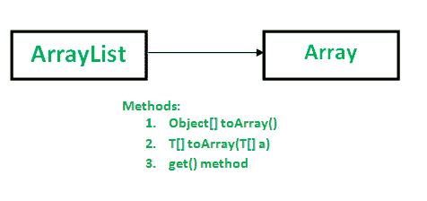

# Java 中数组列表到数组的转换:to Array()方法

> 原文:[https://www . geesforgeks . org/ArrayList-array-conversion-Java-to array-methods/](https://www.geeksforgeeks.org/arraylist-array-conversion-java-toarray-methods/)

将数组列表转换为数组可以使用以下方法:



**方法 1:使用对象[]来排列()方法**

**语法:**

```
 public Object[] toArray() 

```

*   它由接口集合和接口列表中的 toArray 指定
*   它覆盖类抽象集合中的数组
*   它返回一个数组，该数组以正确的顺序包含列表中的所有元素。

## Java 语言(一种计算机语言，尤用于创建网站)

```
// Java program to demonstrate working of
// Objectp[] toArray()
import java.io.*;
import java.util.List;
import java.util.ArrayList;

class GFG {
    public static void main(String[] args)
    {
        List<Integer> al = new ArrayList<Integer>();
        al.add(10);
        al.add(20);
        al.add(30);
        al.add(40);

        Object[] objects = al.toArray();

        // Printing array of objects
        for (Object obj : objects)
            System.out.print(obj + " ");
    }
}
```

**Output**

```
10 20 30 40 
```

注意:toArray()方法返回一个 Object 类型的数组(Object[])。在用作整数对象之前，我们需要将其类型转换为整数。如果不进行类型转换，就会出现编译错误。考虑以下示例:

## Java 语言(一种计算机语言，尤用于创建网站)

```
// A Java program to demonstrate that assigning Objects[]
// to Integer[] causes error.
import java.io.*;
import java.util.List;
import java.util.ArrayList;

class GFG {
    public static void main(String[] args)
    {
        List<Integer> al = new ArrayList<Integer>();
        al.add(10);
        al.add(20);
        al.add(30);
        al.add(40);

        // Error: incompatible types: Object[]
        // cannot be converted to Integer[]
        Integer[] objects = al.toArray();

        for (Integer obj : objects)
            System.out.println(obj);
    }
}
```

输出:

```
19: error: incompatible types: Object[] cannot be converted to Integer[]
        Integer[] objects = al.toArray(); 
                                      ^
1 error

```

因此，建议创建一个数组，列表的元素需要存储到这个数组中，如果数组足够大，可以在 toArray()方法中将它作为参数传递来存储元素。否则，将为此目的分配一个相同类型的新数组。

**方法二:用 T[]排列(T[] a)**

```
// Converts a list into an array arr[] and returns same. 
// If arr[] is not big enough, then a new array of same
// type is allocated for this purpose.
// T represents generic.
public  T[] toArray(T[] arr)

```

请注意，有一个数组参数和数组返回值。传递数组的主要目的是告诉数组的类型。返回的数组与传递的数组属于同一类型。

*   如果传递的数组有足够的空间，那么元素就存储在这个数组中。
*   如果传递的数组没有足够的空间，则会创建一个与给定列表类型和大小相同的新数组。
*   如果传递的数组有更多的空间，则首先用列表元素填充数组，然后填充空值。

如果的运行时类型不是此列表中每个元素的运行时类型的超类型，它将引发 ArrayStoreException。

## Java 语言(一种计算机语言，尤用于创建网站)

```
// A Java program to convert an ArrayList to arr[]
import java.io.*;
import java.util.List;
import java.util.ArrayList;

class GFG {
    public static void main(String[] args)
    {
        List<Integer> al = new ArrayList<Integer>();
        al.add(10);
        al.add(20);
        al.add(30);
        al.add(40);

        Integer[] arr = new Integer[al.size()];
        arr = al.toArray(arr);

        for (Integer x : arr)
            System.out.print(x + " ");
    }
}
```

**Output**

```
10 20 30 40 
```

注意:如果指定的数组为空，那么它将抛出空指针异常。详见[本](https://ide.geeksforgeeks.org/jHrQBh)举例。

**方法 3:使用 get()方法手动转换数组列表的方法**

如果我们不想使用 java 内置的 toArray()方法，我们可以使用这个方法。这是将所有数组列表元素复制到字符串数组[]的手动方法。

```
// Returns the element at the specified index in the list.
public E get(int index)

```

## Java 语言(一种计算机语言，尤用于创建网站)

```
// Java program to convert a ArrayList to an array
// using get() in a loop.
import java.io.*;
import java.util.List;
import java.util.ArrayList;

class GFG {
    public static void main(String[] args)
    {
        List<Integer> al = new ArrayList<Integer>();
        al.add(10);
        al.add(20);
        al.add(30);
        al.add(40);

        Integer[] arr = new Integer[al.size()];

        // ArrayList to Array Conversion
        for (int i = 0; i < al.size(); i++)
            arr[i] = al.get(i);

        for (Integer x : arr)
            System.out.print(x + " ");
    }
}
```

**Output**

```
10 20 30 40 
```

**方法 4:利用 java 8 中集合的 streams API 转换成基元 int 类型的数组**

我们可以使用 list 和 mapToInt()的 streams()方法将 ArrayList <integer>转换为 Int 类型的原始数据数组</integer>

```
int[] arr = list.stream().mapToInt(i -> i).toArray();

```

## Java 语言(一种计算机语言，尤用于创建网站)

```
// Java program to convert a ArrayList to an array

// using streams()

import java.io.*;
import java.util.List;
import java.util.ArrayList;

class GFG {
    public static void main(String[] args)
    {
        List<Integer> al = new ArrayList<Integer>();
        al.add(10);
        al.add(20);
        al.add(30);
        al.add(40);

        // ArrayList to Array Conversion
        int[] arr = al.stream().mapToInt(i -> i).toArray();

        for (int x : arr)
            System.out.print(x + " ");
    }
}
```

**Output**

```
10 20 30 40 
```

**参考:**
[http://docs . Oracle . com/javase/1 . 5 . 0/docs/API/Java/util/ArrayList . html # to array()](http://docs.oracle.com/javase/1.5.0/docs/api/java/util/ArrayList.html#toArray())
本文由 **Nitsdheerendra** 供稿。如果你喜欢 GeeksforGeeks 并想投稿，你也可以用[contribute.geeksforgeeks.org](http://www.contribute.geeksforgeeks.org)写一篇文章或者把你的文章邮寄到 contribute@geeksforgeeks.org。看到你的文章出现在极客博客主页上，帮助其他极客。
如果发现有不正确的地方，或者想分享更多关于上述话题的信息，请写评论。