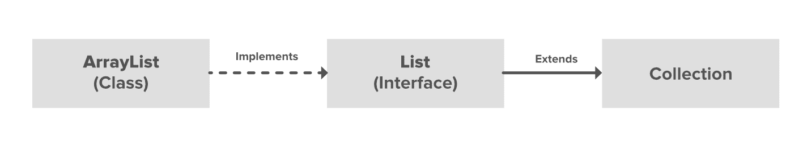

# Java 中的数组列表

> 原文:[https://www.geeksforgeeks.org/arraylist-in-java/](https://www.geeksforgeeks.org/arraylist-in-java/)

ArrayList 是 [**集合框架**](https://www.geeksforgeeks.org/collections-in-java-2/) 的一部分，存在于 java.util 包中。它为我们提供了 Java 中的动态数组。尽管它可能比标准数组慢，但在需要对数组进行大量操作的程序中会很有帮助。这个类可以在[T5【Java . util】T6](https://www.geeksforgeeks.org/java-util-package-java/)包中找到。



插图:


**示例:**下面的实现演示了如何创建和使用数组列表。

## Java 语言(一种计算机语言，尤用于创建网站)

```java
// Java program to demonstrate the
// working of ArrayList in Java

import java.io.*;
import java.util.*;

class ArrayListExample {
    public static void main(String[] args)
    {
        // Size of the
        // ArrayList
        int n = 5;

        // Declaring the ArrayList with
        // initial size n
        ArrayList<Integer> arrli
            = new ArrayList<Integer>(n);

        // Appending new elements at
        // the end of the list
        for (int i = 1; i <= n; i++)
            arrli.add(i);

        // Printing elements
        System.out.println(arrli);

        // Remove element at index 3
        arrli.remove(3);

        // Displaying the ArrayList
        // after deletion
        System.out.println(arrli);

        // Printing elements one by one
        for (int i = 0; i < arrli.size(); i++)
            System.out.print(arrli.get(i) + " ");
    }
}
```

**Output**

```java
[1, 2, 3, 4, 5]
[1, 2, 3, 5]
1 2 3 5 
```

由于 ArrayList 是一个动态数组，我们在创建它时不必指定大小，所以当我们动态添加和删除项目时，数组的大小会自动增加。虽然实际的库实现可能更复杂，但下面是一个非常基本的想法，它解释了当数组变满并且我们试图添加一个项目时数组的工作方式:

*   在堆内存上创建更大的内存(例如两倍大小的内存)。
*   将当前内存元素复制到新内存中。
*   现在添加了新项目，因为现在有更大的可用内存。
*   删除旧记忆。

**重要特征:**

*   ArrayList 继承[抽象列表](https://www.geeksforgeeks.org/abstractlist-in-java-with-examples/)类，实现[列表接口](https://www.geeksforgeeks.org/list-interface-java-examples/)。
*   数组列表由大小初始化。但是，如果从集合中移除了[对象](https://www.geeksforgeeks.org/classes-objects-java/)，则当集合增大或缩小时，大小会自动增大。
*   Java ArrayList 允许我们随机访问列表。
*   ArrayList 不能用于[原语类型](https://www.geeksforgeeks.org/data-types-in-java/)，如 int、char 等。对于这种情况，我们需要一个[包装类](https://www.geeksforgeeks.org/wrapper-classes-java/)。
*   Java 中的 ArrayList 可以看作 C++中的[向量](https://www.geeksforgeeks.org/vector-in-cpp-stl/)。
*   数组列表未同步。它在 Java 中的等价同步类是 [Vector](https://www.geeksforgeeks.org/java-util-vector-class-java/) 。

让我们深入了解一下***Java ArrayList***。请看下图:


在上图中，[抽象列表](https://www.geeksforgeeks.org/abstractlist-in-java-with-examples/)、[复制写数组列表](https://www.geeksforgeeks.org/copyonwritearraylist-in-java/)和[抽象顺序列表](https://www.geeksforgeeks.org/abstractsequentiallist-in-java-with-examples/)是实现列表接口的类。在每个提到的类中都实现了一个单独的功能。它们是:

1.  **抽象列表:**这个类用来实现一个不可修改的列表，对于这个列表只需要扩展这个抽象列表类，只需要实现 *get()* 和 *size()* 方法。
2.  **copy onwriterarraylist:**这个类实现了列表接口。这是[数组列表](https://www.geeksforgeeks.org/arraylist-in-java/)的增强版本，其中所有的修改(添加、设置、删除等。)是通过制作列表的新副本来实现的。
3.  **抽象顺序列表:**这个类实现了[集合接口](https://www.geeksforgeeks.org/collections-in-java-2/)和抽象集合类。这个类用来实现一个不可修改的列表，为此只需要扩展这个抽象列表类，只需要实现 *get()* 和 *size()* 方法。

### 数组列表中的构造函数

为了创建一个数组列表，我们需要创建一个数组列表类的对象。数组列表类由各种[构造函数](https://www.geeksforgeeks.org/constructors-in-java/)组成，允许创建数组列表。以下是该类中可用的构造函数:

**1。ArrayList():** 此构造函数用于构建空数组列表。如果我们希望创建一个名为 **arr** 的空数组列表，那么它可以创建为:

> ArrayList arr = new ArrayList()；

**2。ArrayList(集合 c):** 此构造函数用于构建一个数组列表，该列表用集合 c 中的元素初始化。假设我们希望创建一个 ArrayList arr，其中包含集合 c 中存在的元素，那么它可以创建为:

> ArrayList arr =新的 ArrayList(c)；

**3。ArrayList(int capacity):** 此构造函数用于构建指定初始容量的数组列表。假设我们希望创建一个初始大小为 N 的数组列表，那么它可以创建为:

> ArrayList arr =新 array list(n)；

### Java 数组列表中的方法

<figure class="table">

| 方法 | 描述 |
| --- | --- |
| [添加(int 索引，Object 元素)](https://www.geeksforgeeks.org/java-util-arraylist-add-method-java/) | 此方法用于在列表中的特定位置索引处插入特定元素。 |
| [添加(对象 o)](https://www.geeksforgeeks.org/java-util-arraylist-add-method-java/) | 此方法用于将特定元素追加到列表的末尾。 |
| [addAll(集合 C)](https://www.geeksforgeeks.org/java-util-arraylist-addall-method-java/) | 此方法用于将特定集合中的所有元素追加到所述列表的末尾，其顺序是由指定集合的迭代器返回值。 |
| [addAll(int index，Collection C)](https://www.geeksforgeeks.org/java-util-arraylist-addall-method-java/) | 用于将特定集合中从指定位置开始的所有元素插入到上述列表中。 |
| [晴()](https://www.geeksforgeeks.org/arraylist-clear-java-examples/) | 此方法用于从任何列表中移除所有元素。 |
| [克隆()](https://www.geeksforgeeks.org/clone-method-in-java-2/) | 此方法用于返回数组列表的浅层副本。 |
| [包含？(对象 o)](https://www.geeksforgeeks.org/arraylist-contains-java/) | 如果此列表包含指定的元素，则返回 true。 |
| [保证产能？(int minCapacity)](https://www.geeksforgeeks.org/arraylist-ensurecapacity-method-in-java-with-examples/) | 如有必要，增加此数组列表实例的容量，以确保它至少可以容纳最小容量参数指定的元素数量。 |
| [forEach？(消费者<？超 E >动作)](https://www.geeksforgeeks.org/arraylist-foreach-method-in-java/) | 对 Iterable 的每个元素执行给定的操作，直到所有元素都被处理完或者该操作引发异常。 |
| [拿到了吗？(int index)](https://www.geeksforgeeks.org/arraylist-get-method-java-examples/) | 返回列表中指定位置的元素。 |
| [索引（对象 O）](https://www.geeksforgeeks.org/java-util-arraylist-indexof-java/) | 返回特定元素第一次出现的索引，如果该元素不在列表中，则返回-1。 |
| [伊势利眼？()t1]](https://www.geeksforgeeks.org/arraylist-isempty-java-example/) | 如果此列表不包含任何元素，则返回 true。 |
| [最后索引（对象 O）](https://www.geeksforgeeks.org/arraylist-lastindexof-java-example/) | 如果特定元素不在列表中，则返回该元素最后一次出现的索引，或者返回-1。 |
| [列表迭代器？()](https://www.geeksforgeeks.org/arraylist-listiterator-method-in-java-with-examples/) | 返回列表中元素的列表迭代器(按正确的顺序)。 |
| [列表迭代器？(int index)](https://www.geeksforgeeks.org/arraylist-listiterator-method-in-java-with-examples/) | 从列表中的指定位置开始，返回列表中元素的列表迭代器(按正确的顺序)。 |
| [去掉？(int index)](https://www.geeksforgeeks.org/arraylist-linkedlist-remove-methods-java-examples/) | 移除列表中指定位置的元素。 |
| [去掉？(对象 o)](https://www.geeksforgeeks.org/arraylist-linkedlist-remove-methods-java-examples/) | 从列表中删除指定元素的第一个匹配项(如果存在)。 |
| [全部移除？(收藏 c)](https://www.geeksforgeeks.org/arraylist-removeall-method-in-java-with-examples/) | 从此列表中移除指定集合中包含的所有元素。 |
| [移除 If？(谓词过滤器)](https://www.geeksforgeeks.org/arraylist-removeif-method-in-java/) | 移除此集合中满足给定谓词的所有元素。 |
| [删除范围？(int fromIndex，int toIndex)](https://www.geeksforgeeks.org/arraylist-removerange-java-examples/) | 从该列表中删除索引介于 fromIndex(包含)和 toIndex(不包含)之间的所有元素。 |
| [零售？(收藏<？> c)](https://www.geeksforgeeks.org/arraylist-retainall-method-in-java/) | 仅保留此列表中包含在指定集合中的元素。 |
| [集？(int 索引，E 元素)](https://www.geeksforgeeks.org/arraylist-set-method-in-java-with-examples/) | 用指定的元素替换列表中指定位置的元素。 |
| [大小？()](https://www.geeksforgeeks.org/arraylist-size-method-in-java-with-examples/) | 返回此列表中的元素数量。 |
| [分割器？()](https://www.geeksforgeeks.org/arraylist-spliterator-method-in-java/) | 在此列表中的元素上创建后期绑定和故障快速拆分器。 |
| [子列表？（int fromIndex， int toIndex）](https://www.geeksforgeeks.org/arraylist-sublist-method-in-java-with-examples/) | 返回此列表中指定的 fromIndex(包含)和 toIndex(不包含)之间的部分的视图。 |
| [toaarray()](https://www.geeksforgeeks.org/arraylist-array-conversion-java-toarray-methods/) | 此方法用于返回一个数组，该数组包含列表中所有元素的正确顺序。 |
| [toaarray(对象[] O)](https://www.geeksforgeeks.org/arraylist-array-conversion-java-toarray-methods/) | 它还用于返回一个数组，该数组包含此列表中的所有元素，其顺序与前面的方法相同。 |
| [trimToSize()](https://www.geeksforgeeks.org/arraylist-trimtosize-java-example/) | 此方法用于将数组列表实例的容量调整到列表的当前大小。 |

</figure>

> **注意:**还可以创建通用数组列表:
> 
> ```java
> // Creating generic integer ArrayList
> ArrayList<Integer> arrli = new ArrayList<Integer>();
> ```

***让我们看看如何对所列的数组列表执行一些基本操作，我们将在实现每个操作的同时进一步讨论这些操作。**T3】*

*   向列表添加元素
*   改变元素
*   移除元素
*   迭代元素

**操作 1:** 添加元素

为了给数组列表添加一个元素，我们可以使用 [add()方法](https://www.geeksforgeeks.org/java-util-arraylist-add-method-java/?ref=rp)。此方法被重载以基于不同的参数执行多个操作。它们如下:

*   add(Object):这个方法用于在数组列表的末尾添加一个元素。
*   add(int index，Object):该方法用于在数组列表中的特定索引处添加元素。

**示例:**

## Java 语言(一种计算机语言，尤用于创建网站)

```java
// Java Program to Add elements to An ArrayList

// Importing all utility classes
import java.util.*;

// Main class
class GFG {

    // Main driver method
    public static void main(String args[])
    {
        // Creating an Array of string type
        ArrayList<String> al = new ArrayList<>();

        // Adding elements to ArrayList
        // Cutom inpus
        al.add("Geeks");
        al.add("Geeks");

        // Here we are mentioning the index
        // at which it is to be added
        al.add(1, "For");

        // Printing all the elements in an ArrayList
        System.out.println(al);
    }
}
```

**Output:** 

```java
[Geeks, For, Geeks]
```

**操作 2:** 改变元素

添加元素后，如果我们想更改元素，可以使用 [set()](https://www.geeksforgeeks.org/arraylist-set-method-in-java-with-examples/) 方法来完成。因为数组列表是有索引的，所以我们想要改变的元素是由元素的索引来引用的。因此，此方法采用一个索引和需要插入该索引的更新元素。

**例**

## Java 语言(一种计算机语言，尤用于创建网站)

```java
// Java Program to Change elements in ArrayList

// Importing all utility classes
import java.util.*;

// main class
class GFG {

    // Main driver method
    public static void main(String args[])
    {
        // Creating an Arratlist object of string type
        ArrayList<String> al = new ArrayList<>();

        // Adding elements to Arraylist
        // Custom input elements
        al.add("Geeks");
        al.add("Geeks");

        // Adding specifying the index to be added
        al.add(1, "Geeks");

        // Printing the Arraylist elements
        System.out.println("Initial ArrayList " + al);

        // Setting element at 1st index
        al.set(1, "For");

        //  Printing the updated Arraylist
        System.out.println("Updated ArrayList " + al);
    }
}
```

**Output:** 

```java
Initial ArrayList [Geeks, Geeks, Geeks]
Updated ArrayList [Geeks, For, Geeks]
```

**操作 3:** 去除元素

为了从数组列表中移除一个元素，我们可以使用 [remove()方法](https://www.geeksforgeeks.org/arraylist-linkedlist-remove-methods-java-examples/)。此方法被重载以基于不同的参数执行多个操作。它们如下:

*   **移除(对象):**此方法用于简单地从数组列表中移除一个对象。如果有多个这样的对象，则删除第一个出现的对象。
*   **remove(int index):** 由于数组列表是索引的，因此该方法采用一个整数值，该整数值只是删除数组列表中特定索引处的元素。移除元素后，所有元素都被移动到左边以填充空间，并且对象的索引被更新。

**例**

## Java 语言(一种计算机语言，尤用于创建网站)

```java
// Java program to Remove Elements in ArrayList

// Importing all utility classes
import java.util.*;

// Main class
class GFG {

    // Main driver method
    public static void main(String args[])
    {
        // Creating an object of arraylist class
        ArrayList<String> al = new ArrayList<>();

        // Adding elements to ArrayList
        // Custom addition
        al.add("Geeks");
        al.add("Geeks");
        // Adding element at specific index
        al.add(1, "For");

        // Printing all elements of ArrayList
        System.out.println("Initial ArrayList " + al);

        // Removing element from above ArrayList
        al.remove(1);

        // Printing the updated Arraylist elements
        System.out.println("After the Index Removal " + al);

        // Removing this word element in ArrayList
        al.remove("Geeks");

        // Now printing updated ArrayList
        System.out.println("After the Object Removal "
                           + al);
    }
}
```

**Output:** 

```java
Initial ArrayList [Geeks, For, Geeks]
After the Index Removal [Geeks, Geeks]
After the Object Removal [Geeks]
```

**操作 4:** 迭代数组列表

有多种方法可以迭代数组列表。最著名的方法是将基本的 [for loop](https://www.geeksforgeeks.org/loop-java-important-points/) 与 [get()方法](https://www.geeksforgeeks.org/arraylist-get-method-java-examples/)结合使用，以获取特定索引处的元素，而 [advanced for loop](https://www.geeksforgeeks.org/for-each-loop-in-java/) 。

**例**

## Java 语言(一种计算机语言，尤用于创建网站)

```java
// Java program to Iterate the elements
// in an ArrayList

// Importing all utility classes
import java.util.*;

// Main class
class GFG {

    // Main driver method
    public static void main(String args[])
    {
        // Creating an Arraylist of string type
        ArrayList<String> al = new ArrayList<>();

        // Adding elements to ArrayList
        //  using standard add() method
        al.add("Geeks");
        al.add("Geeks");
        al.add(1, "For");

        // Using the Get method and the
        // for loop
        for (int i = 0; i < al.size(); i++) {

            System.out.print(al.get(i) + " ");
        }

        System.out.println();

        // Using the for each loop
        for (String str : al)
            System.out.print(str + " ");
    }
}
```

**Output:** 

```java
Geeks For Geeks 
Geeks For Geeks
```

**必读:**[Java 中的数组 vs 数组列表](https://www.geeksforgeeks.org/array-vs-arraylist-in-java/)