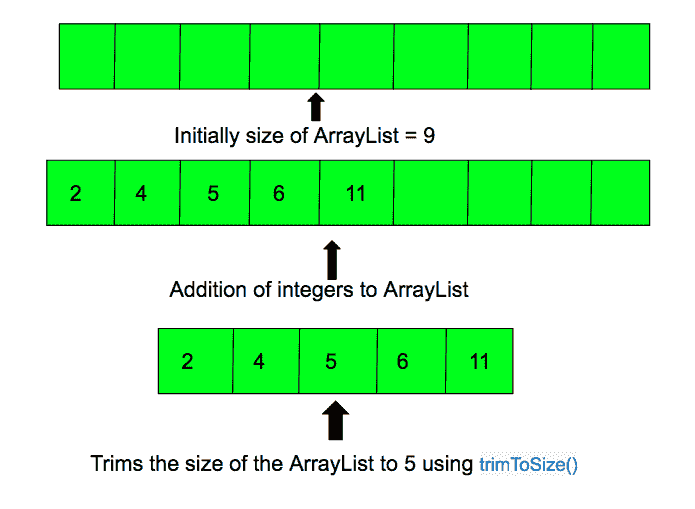

# Java 中的 ArrayList trimToSize()，示例

> 原文:[https://www . geesforgeks . org/ArrayList-trimtosize-Java-example/](https://www.geeksforgeeks.org/arraylist-trimtosize-java-example/)

Java 中 [**数组列表**](https://www.geeksforgeeks.org/arraylist-in-java/) 的 **trimToSize()** 方法将数组列表实例的容量修剪为列表的当前大小。此方法用于将数组列表实例修剪到它包含的元素数量。

**语法:**

```java
trimToSize()
```

**参数:**不接受任何参数。

**返回值:**不返回值。它将数组列表实例的容量修剪为它包含的元素的数量。

**错误和异常:**没有任何错误和异常。



下面的程序说明了 trimTosize()方法:

```java
// Java code to demonstrate the working of
// trimTosize() method in ArrayList

// for ArrayList functions
import java.util.ArrayList;

public class GFG {
    public static void main(String[] args)
    {

        // creating an Empty Integer ArrayList
        ArrayList<Integer> arr = new ArrayList<Integer>(9);

        // using add(), add 5 values
        arr.add(2);
        arr.add(4);
        arr.add(5);
        arr.add(6);
        arr.add(11);

        // trims the size to the number of elements
        arr.trimToSize();

        System.out.println("The List elements are:");

        // prints all the elements
        for (Integer number : arr) {
            System.out.println("Number = " + number);
        }
    }
}
```

输出:

```java
The List elements are:
Number = 2
Number = 4
Number = 5
Number = 6
Number = 11

```